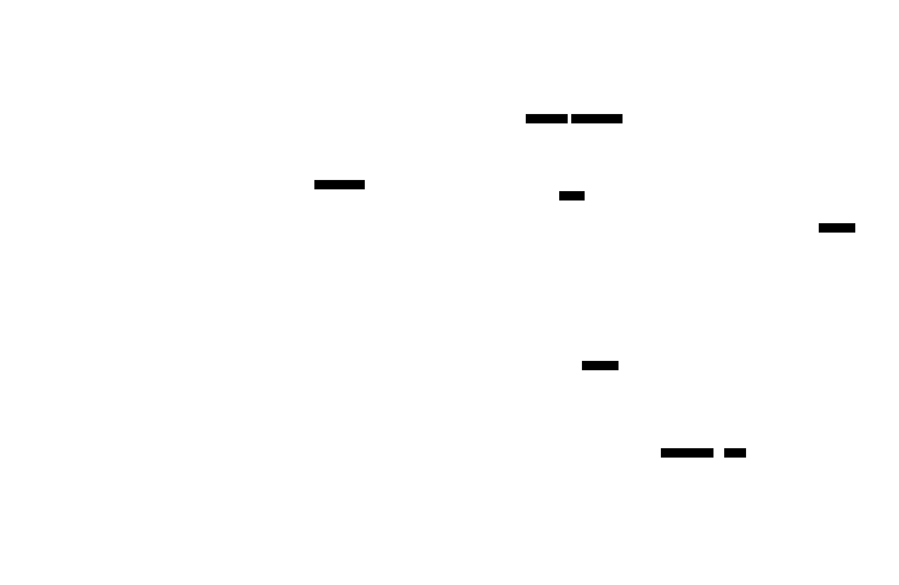

# Coding Agents

**Aliases:** software-engineering agents, code-editing agents, agentic IDEs, autonomous developers
**Category:** Agentic Patterns
**Sources:**
[Anthropic — Claude Code best practices (Apr 2025)](https://www.anthropic.com/engineering/claude-code-best-practices) ·
[Anthropic — Effective context engineering (Sept 2025)](https://www.anthropic.com/engineering/effective-context-engineering-for-ai-agents) ·
[OpenAI — Introducing Codex (May 2025)](https://openai.com/index/introducing-codex/) ·
[Cognition — Devin engineering blog](https://www.cognition.ai/blog) ·
[SWE-bench leaderboard](https://www.swebench.com/)

---

## Problem

> [!TIP]
> **ELI5.** Software development is the killer app for agentic AI in 2026 — and the place where the patterns work best. Why? Because code has incredibly clean feedback loops: the test suite tells you if you broke something, the linter tells you if you wrote it wrong, the compiler tells you if it's invalid. An agent that can write code AND read the test output AND fix the bug can iterate to success. That feedback loop doesn't exist in most domains. So coding agents got good first — and they pulled the entire agentic stack with them.

By 2026, **coding** is the most-developed and most-deployed specialty of agentic AI. Three reasons:

1. **The feedback signal is precise.** Tests pass or fail. Code compiles or doesn't. Lint passes or doesn't. The agent gets unambiguous, *machine-checkable* feedback on every iteration.
2. **The user base is the AI-tooling early-adopter base.** Developers built the tools; developers tried the tools first; developers paid for the tools first.
3. **The economic value per task is high.** A 4-hour refactor done autonomously is worth real money. A 30-second chatbot answer is worth pennies. Coding has the value-per-token ratio to justify expensive agentic loops.

The result: most of the *practitioner-grade* knowledge about agent design — context engineering, sub-agents, evals, security — was discovered first in coding agents and only then generalized to other domains. Almost every pattern in this `agt/` section was either invented in or first proved out in a coding agent.

Coding agents earn their own page because (a) the architecture has converged on a recognizable shape, and (b) the design discoveries here (CLAUDE.md, the Task tool, JIT filesystem tools, sandbox containment) are now best practices across the broader agentic field.

## How it works

> [!TIP]
> **ELI5.** A coding agent is a single agent with five things wired up well: (1) **good filesystem tools** for reading/writing/searching code, (2) **shell access** to run tests/linters/builds, (3) **git** to track changes and roll back if needed, (4) **a project convention file** like CLAUDE.md or AGENTS.md that tells it the codebase's style and gotchas, and (5) **a sandbox** so it can't accidentally rm -rf your laptop. The agent loops: read code → decide change → write code → run tests → repeat until tests pass.

The architecture is fundamentally **a [single agent](single-agent-with-tools.md) with a carefully chosen tool surface**. Five subsystems do the work:

**The agent itself** — typically a frontier model running a [ReAct loop](agent-loop.md). Claude Sonnet 4.5 / Opus 4 for high-value work; GPT-5 / Codex models; sometimes specialized fine-tunes. Reasoning models (extended thinking) are now standard for any non-trivial coding task.

**Context layer** — durable state that survives between runs and across [compaction](../ctx/compaction.md):
- **`CLAUDE.md` / `AGENTS.md` / `.cursorrules`** — project-specific conventions, dependency notes, build commands, "things to know" for this codebase. Always loaded into the agent's context. The [AGENTS.md open standard](https://agentsmd.org/) (2025) is the converging file format.
- **TODO list** — current task's checklist, reinforced into context after each tool call (the "reinforcement" pattern from [context plumbing & reinforcement](../ctx/context-plumbing-reinforcement.md)).
- **Working notes** — structured note-taking files the agent writes itself (see [structured note-taking](../ctx/structured-note-taking.md)).

**Tool surface** — designed for [just-in-time](../ctx/just-in-time-context.md) access:
- **Filesystem** — `glob`, `grep`, `read_file`, `write_file`, `edit_file`. The JIT primitives. The agent navigates the codebase like a developer with a search tool.
- **Shell** — run `npm test`, `cargo build`, `pytest`, `ruff check`. The feedback loop.
- **Git** — `diff`, `status`, `log`, `commit`, `checkout`. State management; the agent can examine its own changes and roll back.
- **MCP servers** — domain-specific tools (GitHub for PRs/issues, Linear for tickets, docs for library references, browser for verification).
- **Task tool** — spawn [sub-agents](sub-agent-architectures.md) for bounded exploration.

**Sandbox / containment** — every tool call is wrapped in a permission and isolation layer (see [`../sec/`](#)). The agent doesn't get raw root on your machine. Typical layers: a container or VM, a filesystem boundary, an egress allowlist for network access, an interactive permission prompt for "dangerous" actions (`rm`, `sudo`, push-to-main).

**The codebase** — files, deps, infra. The thing the agent is actually working on.

### The five practitioner discoveries

The coding-agent field has converged on five specific design discoveries that almost every production tool now ships:

**1. The convention file (`CLAUDE.md` / `AGENTS.md`).** A small markdown file checked into the repo that pre-loads project-specific context: "This is a Rust project. Tests are in `tests/`. Run with `just test`. Don't edit generated files in `gen/`." Anthropic's [Claude Code post](https://www.anthropic.com/engineering/claude-code-best-practices) calls this *"the single highest-leverage thing you can do to make agents work well on your codebase."* The file is the level-1 [progressive disclosure](../ctx/progressive-disclosure.md) for the entire repo.

**2. JIT filesystem tools, not pre-loaded RAG.** Early coding agents (2023) tried to embed and pre-load codebases into vector DBs. By 2025 the dominant pattern is `glob`/`grep`/`read` — let the agent navigate the actual filesystem, which is always up-to-date and provides natural structure cues (directory names, file sizes). See [just-in-time context](../ctx/just-in-time-context.md).

**3. The TODO-list pattern.** When you give a coding agent a multi-step task, the first thing it does is write a TODO list. The list re-appears in context after each tool call. This implicit-reinforcement pattern (popularized by Claude Code) is now widespread. See [context plumbing & reinforcement](../ctx/context-plumbing-reinforcement.md).

**4. Sub-agent spawning for exploration.** A research task ("understand how authentication works in this codebase") gets delegated to a [sub-agent](sub-agent-architectures.md) with a fresh context. The lead agent sees only the summary. Claude Code's `Task` tool is the reference.

**5. Containment / blast radius management.** All meaningful coding agents now ship with permission systems, sandboxes, or auto-mode toggles. The 2024 "let the agent do anything" approach lost too many laptops; the 2026 norm is graduated trust. See [`../sec/`](#).

### The maturity ladder

The field's evolution is best understood as a ladder. Each step keeps the previous capabilities and adds autonomy:

- **L0: Autocomplete** — GitHub Copilot circa 2021. Single-line completions. No agency.
- **L1: Chat with code context** — Copilot Chat, Cursor in 2023. Q&A about your code; suggestions you copy-paste.
- **L2: Edit assistant** — Cursor Edit, Aider in 2023. The agent proposes diffs; you apply them.
- **L3: Agent in IDE** — Cursor agent mode, Cody, Cline in 2024. Multi-file edits, reads test output, iterates.
- **L4: CLI / headless agent** — Claude Code, OpenAI Codex CLI in 2025. Runs in the terminal, no IDE required. Can be scripted, run in CI.
- **L5: Long-horizon autonomous** — Devin, Replit Agent, GitHub Copilot Workspace in 2025-2026. Multi-hour tasks. Can complete a feature end-to-end with minimal human input.
- **L6: Self-directed / fleet** — emergent in late 2026. Multiple coding agents working on the same codebase concurrently, coordinating via shared notes or PRs. See [self-directed swarms](self-directed-swarms.md).

Most production deployments today live in L3-L5. L6 is research / early-adopter territory.

### Benchmarks — what's actually measurable

The field is heavily benchmarked (sometimes over-benchmarked). The most-cited:

- **SWE-bench / SWE-bench-verified** — real GitHub issues from open-source projects; agent must produce a patch that passes the project's tests. SWE-bench-verified is the curated subset most agents now report on. Top scores in 2026 are 75-85% on verified.
- **LiveCodeBench** — competitive-programming-style problems; tests pure code-generation capability without tool use.
- **Aider's polyglot benchmark** — multi-language editing.
- **Cognition's internal benchmarks** — long-horizon multi-hour tasks; not public but referenced.

Benchmarks have improved roughly 10× in 2 years (mid-2023 to mid-2025 SWE-bench scores went from ~10% to ~70%). The field is rapidly approaching benchmark saturation — see [`../qua/`](#) for the eval-saturation pattern.

### When the architecture breaks

Coding agents fail predictably:

- **Large legacy codebases with weak tests** — the feedback loop is broken; the agent makes changes that "look right" but break things tests don't cover.
- **Cross-service refactors** — when the change requires modifying systems outside the visible codebase (DB schemas, infra, other repos).
- **Subtle architecture decisions** — agents are good at local refactors, mediocre at "this should be a new module" decisions.
- **Bespoke build systems / undocumented tooling** — the agent can't iterate if it can't run the project.
- **Codebases without `CLAUDE.md`/`AGENTS.md`** — the agent burns 30% of its budget rediscovering project conventions every run.

## Variants & related patterns

- [**Agent loop**](agent-loop.md) — the underlying mechanism.
- [**Single agent with tools**](single-agent-with-tools.md) — coding agents are the canonical instance.
- [**Sub-agent architectures**](sub-agent-architectures.md) — Claude Code's `Task` tool is the reference implementation.
- [**Context engineering**](../ctx/context-engineering-overview.md) — all the techniques apply heavily here.
- [**Computer use**](computer-use.md) — coding agents that also drive the IDE GUI (rare; usually CLI suffices).
- [**Self-directed swarms**](self-directed-swarms.md) — the L6 frontier.
- [**Agent Skills**](#) — packaged coding capabilities for specific stacks.
- **Pair programming with AI** — the human-in-the-loop variant; most production coding-agent use today.

## When NOT to use

- **Tiny one-off scripts** — autocomplete is faster.
- **Codebases without working test suites** — no feedback loop; the agent flies blind.
- **Hard real-time / latency-sensitive systems** where you can't afford the agent's iteration time.
- **Highly regulated codebases** (medical, financial) where every change needs human sign-off — workflow with explicit review is safer.
- **As a substitute for understanding the codebase yourself** — coding agents amplify whoever's driving; a confused human + an agent produces confused changes faster.

## Implementations

| Tool | Level | Notes |
|---|---|---|
| **Claude Code** (Anthropic) | L4 | CLI/headless. Sub-agent Task tool, CLAUDE.md, native MCP. Reference impl. |
| **OpenAI Codex CLI / Codex** | L4 | CLI; tightly integrated with GPT-5 / Codex models. |
| **Cursor** (Anysphere) | L3-L4 | IDE-based; agent mode for autonomous edits. |
| **Aider** | L3 | CLI, git-native, polyglot. |
| **Cline** (formerly Claude Dev) | L3 | VS Code extension, open source. |
| **Continue** | L3 | Open-source IDE extension. |
| **GitHub Copilot Workspace** | L4 | Multi-file PR-style agent. |
| **Replit Agent** | L4-L5 | Browser-based, full-stack, deploy included. |
| **Devin** (Cognition) | L5 | Long-horizon autonomous; SaaS only. |
| **OpenCode** | L4 | Open-source CLI alternative; multi-provider. |
| **goose** (Block) | L4 | Open-source CLI agent, MCP-first. |
| **Amp** (Sourcegraph) | L4 | Cody's agent mode + CLI. |
| **Roo Code** | L3 | VS Code agent, fork of Cline. |
| **Crush** (Charm) | L4 | Beautiful terminal coding agent. |

## Companies running coding agents in production

- **Anthropic** ✅ — Claude Code is heavily used internally and externally ([Claude Code best practices, Apr 2025](https://www.anthropic.com/engineering/claude-code-best-practices)).
- **OpenAI** ✅ — Codex CLI and Codex web product ([Codex announcement, May 2025](https://openai.com/index/introducing-codex/)).
- **Cognition (Devin)** ✅ — autonomous coding SaaS.
- **GitHub** ✅ — Copilot Workspace, Copilot agent.
- **Replit** ✅ — Replit Agent for full-stack development.
- **Sourcegraph** ✅ — Cody Agent + Amp.
- **Cursor (Anysphere)** ✅ — IDE-native agent mode.
- **Block (Square)** ✅ — `goose` open-source agent for internal use.
- **Google** ✅ — Gemini Code Assist with agentic features; Jules CLI agent.
- **JetBrains** ✅ — AI Assistant with agent capabilities.
- **Vercel, Linear, Notion** ⚠ — known to use coding agents internally; specifics vary.

## Further reading

- [Claude Code best practices for agentic coding](https://www.anthropic.com/engineering/claude-code-best-practices) — Apr 2025 (the canonical practitioner essay)
- [Effective context engineering for AI agents](https://www.anthropic.com/engineering/effective-context-engineering-for-ai-agents) — Sept 2025
- [Introducing Codex](https://openai.com/index/introducing-codex/) — OpenAI May 2025
- [SWE-bench](https://www.swebench.com/) — benchmark + leaderboard
- [AGENTS.md open standard](https://agentsmd.org/) — convention-file format
- [Cognition engineering blog](https://www.cognition.ai/blog) — Devin design notes

---

*Diagram source: [`../diagrams/src/coding-agent-architecture.d2`](../diagrams/src/coding-agent-architecture.d2), [`../diagrams/src/coding-agent-ladder.d2`](../diagrams/src/coding-agent-ladder.d2)*
