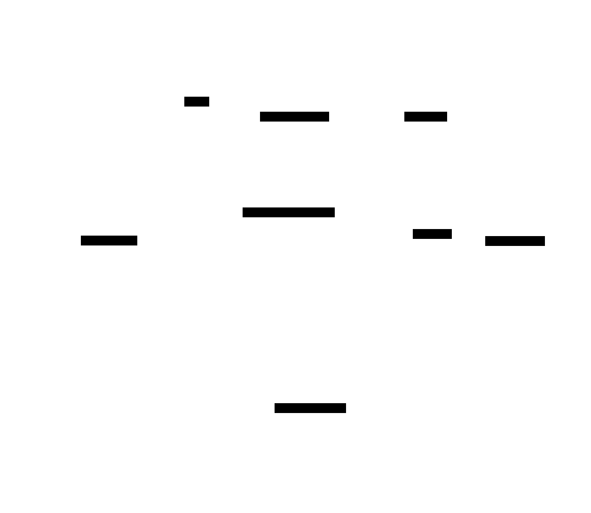

# Generative Agents

**Aliases:** simulacra, character agents, NPC agents, social agents, memory-stream agents
**Category:** Agentic Patterns
**Sources:**
[Park et al. — Generative Agents: Interactive Simulacra of Human Behavior (Apr 2023)](https://arxiv.org/abs/2304.03442) ·
[Stanford / Google paper site](https://reverie.herokuapp.com/arXiv_Demo/) ·
Follow-ups: [AgentSim, SocietyOfMind, Concordia (DeepMind 2024)](https://github.com/google-deepmind/concordia)

---

## Problem

> [!TIP]
> **ELI5.** What if you wanted an LLM to play a *character* for a long time — remember relationships, form opinions, plan their day, react to other characters? A naive prompt won't do it: the LLM forgets everything between turns. You need an architecture that gives the character a *memory* (everything they've seen and done), a *personality* (consistent across days), and a *planning loop* (what should I do today? this hour? right now?). That architecture is the "generative agent," and even though it was first built for simulated NPCs, it's the conceptual ancestor of every memory-equipped agent today.

The April 2023 Park et al. paper "Generative Agents" introduced 25 LLM-powered characters living together in a *Sims*-like town called Smallville. Each character had a backstory, a job, a daily routine, relationships with other characters, and full agency over their actions. Researchers gave one character the idea of "throw a Valentine's Day party," and over the course of two simulated days, the characters independently spread word of the party, formed plans to attend, formed crushes, invited each other, and showed up at the party — with no one having scripted any of that behavior.

The paper became the most-cited research-agent architecture of 2023-2024. What made it interesting wasn't the game (it was a tech demo) but the **architecture for long-term memory and coherent behavior over time** — concepts that have since been adapted into every serious agent framework: persistent memory, retrieval scoring, reflection, hierarchical planning.

Most production "agents" today are not literally generative agents — they don't run continuous simulations or play characters. But the *components* the paper formalized (memory stream, retrieval scoring, reflection, plan revision) became the canonical vocabulary of agentic memory. [MemGPT](https://arxiv.org/abs/2310.08560) (Letta), [Voyager](https://arxiv.org/abs/2305.16291), [Cognitive Architectures for Language Agents (CoALA)](https://arxiv.org/abs/2309.02427), and ChatGPT's memory feature all descend conceptually from generative agents.

## How it works

> [!TIP]
> **ELI5.** Each character has a *memory stream* — a giant append-only log of everything they've observed and done. When they need to decide what to do, the system pulls the most *relevant + recent + important* memories and feeds them to the LLM along with the character's identity and current context. Periodically the character "reflects" — the LLM looks at recent memories and writes higher-level conclusions ("I've been spending a lot of time with Klaus; I think we're becoming close friends") and stores those as new memories. They also plan — generate a rough day, then refine into hours, then into minutes.

The architecture has four key components, all of which now appear in modified form across modern agentic frameworks:

### 1. Memory stream

An append-only log of every observation the character makes. Each entry has:
- **Content** — the natural-language description (`"Klaus is at the bar."`).
- **Timestamp** — when it happened.
- **Importance score** — generated by an LLM call at write time (1-10). Mundane events get 1-2; significant ones (a fight, a breakup, a promotion) get 7-10.

The stream grows unbounded. New entries are appended; nothing is deleted. The challenge is *retrieving* the right entries — which leads to the next component.

### 2. Retrieval scoring (recency × importance × relevance)

When the character is about to decide what to do, the system retrieves the top-K most useful memories. The scoring formula combines three factors:

- **Recency** — exponential decay; more recent memories are more retrievable.
- **Importance** — the LLM-assigned importance score from write time.
- **Relevance** — cosine similarity between the query embedding and each memory's embedding.

These three are combined (typically with equal weight) and the top results are passed to the next LLM call as relevant context. This **triple scoring** was one of the paper's key contributions — pure embedding-similarity retrieval (the default in 2023 RAG) tended to fetch irrelevant-but-similar memories; the recency+importance components made character behavior much more coherent.

This formula is now part of the standard memory-retrieval toolkit. [Letta](https://docs.letta.com/), [LangChain memory](https://python.langchain.com/docs/), [LlamaIndex agent memory](https://docs.llamaindex.ai/) all implement variations on it.

### 3. Reflection — turning observations into insights

Every N events (or after a threshold of accumulated "importance"), the character runs a **reflection step**. The system asks the LLM: *"Given these recent memories, what high-level questions can you ask, and what conclusions can you draw?"*

The LLM generates higher-level insights ("I'm spending a lot of time with Klaus; I think we're becoming close friends") which get written back to the memory stream as new entries with elevated importance scores. Future retrieval can surface these insights instead of individual low-level observations.

Reflection is hierarchical — reflections can themselves be reflected upon, producing meta-conclusions ("I value friendship more than career advancement"). This creates a **memory pyramid**: raw observations at the base, mid-level patterns above, high-level personality conclusions at the top. The character becomes more coherent over time because their own reflections feed back into who they are.

Modern versions of this idea show up as "fact extraction" in Letta, "consolidation" in OpenAI's Memory feature, and "lessons learned" in Reflexion.

### 4. Planning — top-down decomposition

Each character starts the day by generating a rough plan (5-10 high-level activities). They then refine it into hours, then into minutes — top-down decomposition. As reality intervenes (other characters appear, events happen), they revise.

The planning module reads from the memory stream (relevant past plans, social commitments, personality traits) and writes back the new plan. The agent's actual *actions* are driven by the most-specific plan that's currently active.

This pattern — **hierarchical planning with revision** — was novel for LLM agents in 2023 and is now the conceptual default for any long-horizon agent (Devin's task decomposition, Claude Code's TODO list, the "plan + replan" pattern in LangGraph).

### What the paper actually demonstrated

The 25-character Smallville simulation produced emergent behaviors that hadn't been individually scripted:
- A character given the seed idea "throw a Valentine's Day party" spread word; other characters independently passed the news on; some formed romantic plans; the party happened with multiple attendees on the planned date.
- Characters formed routines, friendships, and grudges that persisted over simulated days.
- A character with a "starting a new job at the bookstore" backstory naturally introduced herself to other shoppers and behaved consistently with her role.

The researchers' headline finding: the **memory + reflection + planning architecture** outperformed ablations (no reflection, no planning, no memory) on a "believability" metric assessed by human raters. The architecture, not just the LLM, was the source of the believable behavior.

### Why this still matters in 2026

Modern production agents don't usually run continuous character simulations — but they all need *some form of memory*, and the generative-agent vocabulary is how that memory is discussed. When you see "memory consolidation" in a 2026 agent paper, "reflection" in a Letta blog post, or "importance-weighted retrieval" in a vendor docs, you're reading direct descendants of this architecture.

The 2025-2026 evolution: where generative agents kept *all* memory in a single LLM-mediated store, modern agents externalize memory more aggressively — files, databases, vector stores, knowledge graphs — using [structured note-taking](../ctx/structured-note-taking.md). The retrieval scoring and reflection ideas survived; the "single memory stream in the LLM" implementation got swapped out for engineered storage.

## Variants & related patterns

- [**Structured note-taking**](../ctx/structured-note-taking.md) — the modern descendant; same idea, externalized to files.
- [**Just-in-time context**](../ctx/just-in-time-context.md) — what generative-agent retrieval becomes when scaled to engineered systems.
- [**Compaction**](../ctx/compaction.md) — equivalent to reflection in modern coding agents.
- [**Agent loop**](agent-loop.md) — the underlying mechanism.
- **MemGPT / Letta** — direct architectural descendant; OS-style memory hierarchy.
- **Voyager (Minecraft agent)** — adds skill library; same memory primitives.
- **CoALA (Cognitive Architectures for Language Agents)** — formalization of the broader pattern.
- **Concordia (Google DeepMind)** — open-source framework for multi-character simulations.
- **AgentSims, BabyAGI, AutoGPT** — early 2023-2024 implementations that drew on generative-agent ideas.

## When NOT to use

- **For production task agents.** Generative agents are designed for simulation, not for completing user tasks. Use modern coding/research agent patterns instead.
- **For short-horizon work.** All the memory + reflection machinery is overhead for an agent that runs for 5 minutes.
- **When you need verifiability.** Reflection and memory-shaped behavior is hard to audit; production agents prefer structured note-taking with explicit logs.
- **As a literal architecture.** Most of the architecture has been superseded by externalized memory + JIT retrieval. The *concepts* still matter; the original implementation is now mainly a research artifact.

## Where the ideas still actively apply

- **Game NPCs** — generative agents are increasingly used for non-player characters in games. The original paper's *Sims*-style demo is now an active product space (Inworld, Convai, Replica).
- **Social simulations / agent-based modeling** — economists, sociologists, policy researchers use generative-agent simulations to model behaviors.
- **Tutoring systems** — agents that maintain a persistent model of a learner over many sessions.
- **AI companions / friend bots** — Character.ai, Replika and similar products use memory-stream-like architectures.

## Implementations

| Framework / product | How it uses generative-agent ideas |
|---|---|
| **Concordia (Google DeepMind)** | Open-source framework explicitly for generative-agent simulations |
| **Letta (formerly MemGPT)** | Memory blocks + reflection + recall — productionized for assistant use |
| **LangChain memory modules** | Recency/importance scoring; reflection summarization |
| **LlamaIndex agent memory** | Multiple memory types including those inspired by the paper |
| **Inworld AI, Convai** | Generative NPCs for games |
| **Character.ai, Replika** | Persistent character agents with memory |
| **Voyager** (research) | Skill-library + memory for Minecraft agents |
| **AgentSims, AutoGPT, BabyAGI** | Early OSS implementations of related ideas |

## Companies / projects using generative-agent architectures

- **Stanford + Google** ✅ — original paper, Smallville demo ([source](https://arxiv.org/abs/2304.03442)).
- **Google DeepMind** ✅ — Concordia framework for agent-based social simulation.
- **Inworld AI** ✅ — generative NPCs for video games (publicly documented).
- **Convai** ✅ — character agents for games.
- **Character.ai** ⚠ — persistent character agents; memory architecture not fully public.
- **Letta** ✅ — productionized successor; architecture explicitly cites the lineage.
- **OpenAI ChatGPT (Memory feature)** ⚠ — user-memory persistence; conceptually related though architecture not public.
- **Multiple academic groups** ✅ — generative agents are a standard tool for computational social science.

## Further reading

- [Generative Agents: Interactive Simulacra of Human Behavior](https://arxiv.org/abs/2304.03442) — Park, O'Brien, Cai, Morris, Liang, Bernstein 2023 (the paper)
- [Smallville demo](https://reverie.herokuapp.com/arXiv_Demo/) — the original interactive demo
- [MemGPT: Towards LLMs as Operating Systems](https://arxiv.org/abs/2310.08560) — Packer et al. 2023 (direct descendant)
- [Voyager: An Open-Ended Embodied Agent with Large Language Models](https://arxiv.org/abs/2305.16291) — Wang et al. 2023 (Minecraft generative agent)
- [Cognitive Architectures for Language Agents](https://arxiv.org/abs/2309.02427) — Sumers et al. 2023 (theoretical framing)
- [Concordia](https://github.com/google-deepmind/concordia) — DeepMind framework for simulations
- [Letta documentation](https://docs.letta.com/) — production successor

---

*Diagram source: [`../diagrams/src/generative-agents.d2`](../diagrams/src/generative-agents.d2)*
