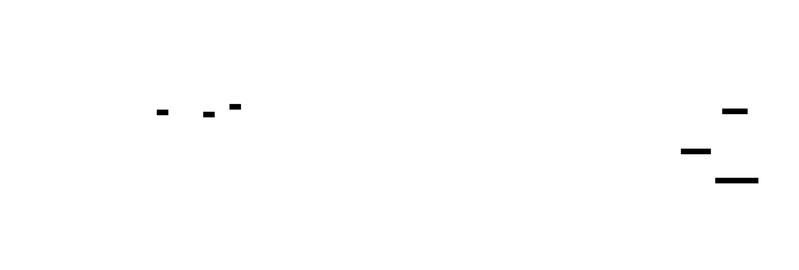

# Multi-Agent Orchestration

**Aliases:** agent crews, agent teams, agent swarms, multi-agent systems (MAS), agent collaboration
**Category:** Agentic Patterns
**Sources:**
[Microsoft — AI agent orchestration patterns (2025)](https://learn.microsoft.com/en-us/azure/architecture/ai-ml/guide/ai-agent-design-patterns) ·
[Anthropic — How we built our multi-agent research system (Jun 2025)](https://www.anthropic.com/engineering/built-multi-agent-research-system) ·
[Anthropic — Building effective agents (Dec 2024)](https://www.anthropic.com/research/building-effective-agents) ·
[OpenAI Swarm / AgentKit](https://github.com/openai/swarm) ·
[CrewAI](https://www.crewai.com/) · [AutoGen](https://microsoft.github.io/autogen/)

---

## Problem

> [!TIP]
> **ELI5.** One agent is the right starting point — but sometimes the work genuinely splits into separate roles. Researcher + writer + editor. Triage + specialist. Planner + parallel workers + integrator. The question is *how do they collaborate*: in a pipeline, in parallel, by handoff, by group chat, or under a lead? Each pattern fits a different shape of work, and picking the wrong one wastes tokens or produces worse output than a single agent would have.

When you've decided a [single agent](single-agent-with-tools.md) genuinely isn't enough — usually because the work has *embarrassingly parallel* subtasks, or because different sub-problems need *different contexts*, or because you specifically want *adversarial separation* between roles — you reach for multi-agent orchestration. The question becomes: **what topology of communication and control**?

Microsoft's [AI agent orchestration patterns](https://learn.microsoft.com/en-us/azure/architecture/ai-ml/guide/ai-agent-design-patterns) page (2025) catalogues five canonical patterns. These are now the lingua franca of multi-agent design — most frameworks (AutoGen, CrewAI, OpenAI Swarm, LangGraph, Pydantic Graph) implement variations on all five. Anthropic's [multi-agent research system post](https://www.anthropic.com/engineering/built-multi-agent-research-system) (June 2025) is the most-cited production case study, with concrete numbers on what works and what doesn't.

## How it works

> [!TIP]
> **ELI5.** Pick a topology. **Sequential** = assembly line. **Concurrent** = panel of reviewers. **Handoff** = ER triage. **Orchestrator-workers** = manager + team. **Group chat** = round-table meeting. Each fits different work. Anthropic's verdict from running one of these in production: it works extraordinarily well (90%+ improvement on some benchmarks) but costs 15× more tokens — so only use it when the value is high enough.

### Pattern 1: Sequential

A pipeline of specialist agents. Output of one feeds the next. The classic "researcher → writer → editor" trio. Each agent has a focused prompt and tool set. Handoff is via a structured summary or artifact.

**When it works**: when the task decomposes cleanly into ordered stages, each producing a well-defined intermediate artifact. *Examples*: content production (research → draft → revise → publish), data pipelines (ingest → enrich → analyze → report), legal review (research case law → draft argument → check citations).

**Failure mode**: information loss between stages. Once the writer hands off to the editor, the editor doesn't see the research notes — only the draft. If the editor finds a problem requiring more research, you have to escalate back up.

### Pattern 2: Concurrent

Multiple specialists work on the same input in parallel; their outputs are aggregated. The classic *code review* pattern: one agent checks security, one checks performance, one checks style, an aggregator merges the findings.

**When it works**: when you need *multiple perspectives on the same artifact* and the perspectives are largely independent. Also when the subtasks are *embarrassingly parallel* — Anthropic's research system uses concurrent sub-agents to research different facets of a question simultaneously, then synthesizes.

**Failure mode**: aggregation is hard. When three agents disagree about a finding, how do you reconcile? Naive concatenation produces bloat; LLM-based aggregation can lose nuance. The aggregator becomes its own bottleneck.

### Pattern 3: Handoff

One agent decides another should take over. A triage agent classifies an incoming customer message and routes it to the refund agent, technical agent, or billing agent. Specialists can hand off to peers when they discover the case isn't theirs.

**When it works**: when inputs have heterogeneous shape and a small number of specialists can cover the space. *Examples*: customer service, sales-development pipelines, document classification with downstream processing.

**Failure mode**: handoff loops. Agent A hands to B who hands back to A. Mitigation: explicit "no further handoff" flag, max-hops counter, or a coordinator that arbitrates.

### Pattern 4: Orchestrator-Workers

A lead agent dynamically plans subtasks and dispatches them to worker agents. Workers report results back; the lead synthesizes. The workers don't talk to each other — only to the lead.

**When it works**: when the *plan itself* is open-ended and depends on early findings. Anthropic's research system is this pattern: Claude Opus 4 is the lead, decides what to research, spawns Claude Sonnet 4 workers (often in parallel) for each sub-question, and integrates the findings.

**Failure mode**: the lead is a single point of failure. If the lead misunderstands the task, all workers do too. The lead's context fills fast as worker summaries come back. Most production implementations of this pattern lean heavily on [sub-agent architectures](sub-agent-architectures.md) for context isolation and [compaction](../ctx/compaction.md) for the lead.

### Pattern 5: Group Chat

N agents converse via a shared channel. Each can see all messages. Conversation continues until a terminator agent declares the task done. AutoGen popularized this pattern.

**When it works**: in research demos, simulations, and brainstorming. *Examples*: simulated stakeholder discussion, multi-perspective debate, generative simulations (see [generative agents](generative-agents.md)).

**Failure mode**: explosion of conversation. With no central plan, agents talk past each other or repeat. Without an explicit terminator strategy, runs go on forever. Group chat is rare in production today — but common in research papers.

### What Anthropic actually learned in production

The June 2025 [Anthropic post](https://www.anthropic.com/engineering/built-multi-agent-research-system) on their multi-agent research system is the most-cited real-world case study. Key findings:

- **Multi-agent (Opus 4 lead + Sonnet 4 sub-agents) outperformed single-agent (Opus 4) by 90.2%** on their internal research benchmark.
- **It uses ~15× more tokens than chat.** That's roughly an order of magnitude cost.
- **The configuration matters.** Token usage explains 80% of the performance variance in their experiments. Beyond a certain point, more agents doesn't help — it hurts.
- **Sub-agents need explicit "context" instructions.** Without them, sub-agents wander into adjacent territory. Anthropic added a `context` parameter to its spawn-sub-agent tool: a few sentences describing *what slice of the parent task* the sub-agent is responsible for.
- **Tightly coupled subtasks don't parallelize.** If subtask B's correct answer depends on subtask A's *internal reasoning* (not just A's output), separating them into agents loses information. Keep coupled work in one agent.

The blunt advice that emerged: **only use multi-agent when the value of the task clearly exceeds the cost**. For ad-hoc research, complex synthesis, and large-scale information-gathering, the trade is worth it. For chat-style interaction, customer service, and short tasks, it usually isn't.

### Common failure modes across all five patterns

- **Communication is lossy.** Every agent-to-agent message is a summary; summaries lose detail.
- **Coordination cost compounds.** N agents means N system prompts, N tool registries, N evaluation loops.
- **Debugging is multidimensional.** Bugs can hide in any agent's prompt, the orchestrator, the handoff protocol, or the aggregation logic.
- **Cost is super-linear** in the number of agents, not just from extra LLM calls but from the *replicated* context each one carries.
- **The "more agents = better" intuition is wrong.** Often a single, well-tooled agent matches or beats a poorly-coordinated team.

### Practical guidance

1. **Always start single-agent.** Measure. If it's working, stop.
2. **If you need multi-agent, prefer orchestrator-workers** for open-ended tasks. It's the most-battle-tested pattern in 2025-2026.
3. **For pipelines, prefer sequential.** Don't reinvent it as agents talking — just chain them.
4. **For parallel subtasks, prefer concurrent.** Make the aggregation step boring (well-specified output schema, simple merge).
5. **Use handoff only when you have heterogeneous inputs requiring real specialization.**
6. **Avoid group chat in production.** Use it for prototypes and simulations.
7. **Budget for 5-15× token cost** vs single-agent. If that doesn't make sense for your workload, you're in the wrong pattern.

## Variants & related patterns

- [**Single agent with tools**](single-agent-with-tools.md) — the right starting point.
- [**Sub-agent architectures**](sub-agent-architectures.md) — orchestrator-workers' implementation detail; the most-used multi-agent pattern.
- [**Self-directed swarms**](self-directed-swarms.md) — emergent multi-agent without an explicit orchestrator (Kimi K2-style).
- [**Maker-checker**](maker-checker.md) — a specific 2-agent pattern for adversarial verification.
- [**Workflow patterns**](#) — parallelization, prompt chaining, etc., are workflow-shaped versions of the same topologies.
- [**Compaction**](../ctx/compaction.md) — essential for orchestrator's growing context.
- **A2A (Agent2Agent protocol)** — emerging 2025 standard for inter-agent communication.

## When NOT to use

- **When a single agent does it.** Always test single-agent first.
- **For cost-sensitive deployments** — 15× tokens is real money at scale.
- **For tightly coupled work** — if subtask outputs require each other's reasoning, keep in one agent.
- **For low-latency / interactive use** — multi-agent inflates wall time.
- **As a default for "complex" tasks** without specific justification. Many "complex" tasks are workflows in disguise.

## Implementations

| Framework | Default patterns supported |
|---|---|
| **Microsoft AutoGen** | Group chat, orchestrator-workers, sequential, concurrent, handoff |
| **CrewAI** | Sequential and hierarchical (orchestrator-workers); role-based |
| **OpenAI Swarm / AgentKit** | Handoff (primary), orchestrator-workers |
| **LangGraph** | All five — explicit state-machine of nodes |
| **Pydantic Graph** | All five via typed nodes |
| **Anthropic Agent SDK** | Sub-agent spawning (orchestrator-workers); other patterns via composition |
| **LlamaIndex AgentWorkflow** | Sequential + concurrent + handoff |
| **DSPy** | Compilable multi-stage programs |
| **MetaGPT** | Role-based multi-agent (researcher, architect, engineer, QA) |
| **ChatDev** | Group chat for software-engineering simulations |
| **smol-agents** | Multi-agent via tool-calling sub-agents |

## Companies running multi-agent in production

- **Anthropic** ✅ — Claude.ai's research feature uses orchestrator-workers ([source](https://www.anthropic.com/engineering/built-multi-agent-research-system)).
- **Microsoft** ✅ — AutoGen + AI Orchestration patterns are productized as Azure Agent Service.
- **OpenAI** ⚠ — Operator and Deep Research use single-agent-with-sub-agents; full multi-agent topologies less public.
- **Google DeepMind** ⚠ — Gemini's deep research feature uses multi-agent orchestration.
- **Perplexity (Spaces / Comet)** ⚠ — likely orchestrator-workers; not publicly documented.
- **Replit, Cognition** ⚠ — orchestrator-workers for long-horizon coding.
- **Sierra, Decagon** ⚠ — handoff pattern is dominant in customer-service agents.
- **MetaGPT, ChatDev** ✅ — open-source multi-agent demos at GitHub scale.

## Further reading

- [AI agent orchestration patterns](https://learn.microsoft.com/en-us/azure/architecture/ai-ml/guide/ai-agent-design-patterns) — Microsoft 2025 (the canonical 5-pattern catalogue)
- [How we built our multi-agent research system](https://www.anthropic.com/engineering/built-multi-agent-research-system) — Anthropic Jun 2025 (the most-cited production case study)
- [Building effective agents](https://www.anthropic.com/research/building-effective-agents) — Anthropic Dec 2024 (when to reach for multi-agent)
- [AutoGen documentation](https://microsoft.github.io/autogen/) — group-chat reference framework
- [CrewAI docs](https://docs.crewai.com/) — role-based crews
- [LangGraph multi-agent guide](https://langchain-ai.github.io/langgraph/) — state-machine framing

---

*Diagram source: [`../diagrams/src/multi-agent-patterns.d2`](../diagrams/src/multi-agent-patterns.d2), [`../diagrams/src/anthropic-multi-agent-findings.d2`](../diagrams/src/anthropic-multi-agent-findings.d2)*
