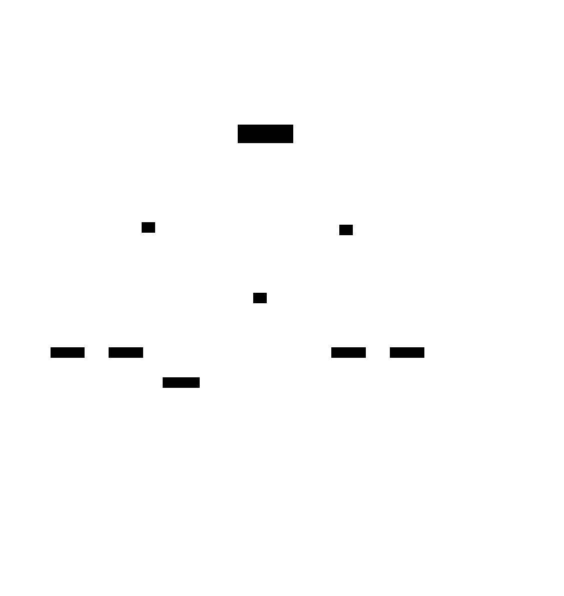

# Self-Directed Swarms

**Aliases:** emergent multi-agent, agent fleets, agent meshes, auto-spawning agents, recursive sub-agents, AutoGPT-style swarms
**Category:** Agentic Patterns
**Sources:**
[Anthropic — Code execution with MCP (Nov 2025)](https://www.anthropic.com/engineering/code-execution-with-mcp) ·
[Kimi K2 / Moonshot AI — agentic capabilities (2025)](https://moonshot.ai/) ·
[Simon Willison — ai-agents tag archive](https://simonwillison.net/tags/ai-agents/) ·
Various 2026 production reports (Cognition, Cursor, Replit) ·
Conceptual ancestors: AutoGPT (2023), BabyAGI (2023), AgentSims

---

## Problem

> [!TIP]
> **ELI5.** [Sub-agent architectures](sub-agent-architectures.md) work great when the parent decides explicitly *"now I'll spawn a sub-agent for this"*. But what if you don't know in advance how the work decomposes? You give one agent a big open-ended goal and let it figure out: "I'll need 3 sub-agents for research, but actually each of those will probably need its own sub-agents, and..." Suddenly you have a tree (or fleet) of agents that grew itself. Powerful and dangerous in equal measure: the work can parallelize beautifully, or your token bill can explode in 10 minutes.

The [sub-agent architecture](sub-agent-architectures.md) page covered the *deliberate*, parent-controlled version: a lead agent explicitly calls a spawn tool with a defined task and context. The **self-directed swarm** pattern is the unbounded version: agents decide *on their own* whether and when to spawn children, with no central plan and no top-down decomposition.

This is the architecture pattern of AutoGPT (March 2023), BabyAGI (April 2023), and the more recent generation of "agent fleet" systems that emerged in 2025-2026 with the maturation of reasoning models and reliable MCP tool ecosystems. It's also the implicit architecture of long-running Devin tasks and parallel-coding-agent workflows where multiple Claude Code or Cursor instances run on the same codebase simultaneously.

The pattern is real, it works when constrained, and it produces some of the most impressive — and most expensive — agent demos. It's also the easiest pattern to misuse: without strict guardrails, it produces runaway loops that cost thousands of dollars in minutes.

## How it works

> [!TIP]
> **ELI5.** Start with one agent and a big goal. Give it a `spawn_agent(task)` tool. The agent decides when to use it. Each spawned child gets the same tool and can spawn its own children. They share a notes file so they can see each other's findings. Throw in budget/depth/rate limits — without them, the tree grows forever. With them, you get parallelism that emerges from the work itself, not from a human's pre-decomposition.

The mechanics are simple:

1. **A seed agent** receives a top-level goal.
2. **Every agent has the spawn tool** — `spawn_agent(task, context)` — and can call it whenever it decides a sub-task warrants delegation.
3. **A shared note store** (files, blackboard, database) lets agents discover each other's findings without direct communication.
4. **Guardrails enforce limits** — total token budget, max depth, max active agents, max spawn rate, idempotent halt conditions.

The key contrast with [orchestrator-workers / sub-agent architecture](sub-agent-architectures.md) is **who makes the spawn decision**:

| Pattern | Spawn decision | Plan structure |
|---|---|---|
| Orchestrator-workers | Lead pre-plans, then spawns | Top-down, declarative |
| Sub-agent (deliberate) | Each agent spawns when explicitly needed | Tactical, parent-controlled |
| **Self-directed swarm** | **Each agent spawns autonomously** | **Emergent, no central plan** |

In a swarm, you don't know how many agents you'll spawn, how deep the tree will go, or what intermediate sub-tasks will be invented along the way. That's the *feature* (work parallelizes naturally to match the actual problem) and the *risk* (no upper bound without guardrails).

### Why the pattern crashed in 2023 and is working in 2026

**AutoGPT and BabyAGI in early 2023** were swarm-style systems. They were viral demos. They didn't work in production. The reasons, in retrospect:

- **Weak base models.** GPT-3.5 / GPT-4-March were not reliable enough at multi-step planning. Spawned agents drifted, looped, or hallucinated tasks.
- **No reasoning models.** Each agent's decisions weren't internally checked. Cascading errors compounded.
- **No structured note-taking.** Agents lost track of what other agents were doing.
- **No mature MCP / tool ecosystem.** Each tool was a custom plugin; spawning agents with the wrong tool sets was common.
- **No cost guardrails.** Many users woke up to $200 bills from runs that looped overnight.

**What changed in 2025-2026:**

- **Reasoning models** (Claude Opus/Sonnet 4, GPT-5, Gemini 2.5 Pro, DeepSeek-R1, Kimi K2.5) make each agent's decisions more reliable.
- **Structured note-taking** ([structured note-taking](../ctx/structured-note-taking.md)) gives swarms a shared blackboard.
- **MCP** standardizes tool definitions so spawned agents inherit working capabilities.
- **Code execution + filesystem as the medium** ([code execution with MCP](#)) — agents communicate by reading/writing files, which scales.
- **Hard guardrails** (token budget, depth caps, kill switches) are now standard.
- **The economic case is clearer** — when reasoning-model-quality work warrants paying for a fleet of agents, the trade is justified.

Production swarms in 2026 are not the AutoGPT pattern with better models. They're a more disciplined architecture that *inherits* swarm dynamics — autonomous spawning, shared state, emergent parallelism — but adds the engineering layers that AutoGPT lacked.

### Production examples of swarm patterns

**Cognition Devin (long-horizon mode).** A Devin run on a multi-hour task spawns many sub-agents that themselves spawn further sub-tasks. The user sees one "Devin" working; underneath, dozens of agents may execute simultaneously. The architecture is publicly described in Cognition's engineering writing; precise mechanics are proprietary.

**Cursor "background agents."** Cursor's 2025 feature where the user kicks off a task and Cursor spawns agents in background workspaces. They report progress; the user can intervene or accept the results. Multiple background agents can be active for the same user concurrently.

**Replit Agent (full-app mode).** When building a complete app, Replit Agent spawns specialist sub-tasks (frontend, backend, deploy, debug) that often spawn their own children for specific components.

**Kimi K2 / K2.5 agent demos (Moonshot AI).** Notable 2025 entrant from China. The Kimi K2.5 system prompt explicitly enables agentic spawning patterns; the model was trained for tool-orchestration at scale. Their public demos show multi-hour autonomous agent work with significant swarm structure.

**Anthropic's multi-agent research system** (covered in [multi-agent orchestration](multi-agent-orchestration.md)) sits between orchestrator-workers and full swarm: the lead Opus 4 agent dynamically decides to spawn sub-agents, but spawning is bounded by an explicit policy.

**OSS swarm frameworks.** [crewAI](https://www.crewai.com/), [swarms](https://github.com/kyegomez/swarms), [smol-agents](https://github.com/huggingface/smolagents) all support patterns ranging from controlled orchestrator-workers up to full self-directed swarms.

### Guardrails — the non-negotiable engineering work

A swarm without guardrails will, with very high probability, cost you money or break something. The non-negotiable layers:

1. **Token budget per swarm** — hard cap on total tokens across all agents in the run. When hit, all agents terminate.
2. **Depth cap** — max levels of agent nesting (commonly 3-5).
3. **Active agent cap** — max number of simultaneously running agents (commonly 10-50).
4. **Spawn rate limit** — max new spawns per minute (prevents fork-bomb dynamics).
5. **Wall-clock timeout** — every agent has a max lifetime; orphans get killed.
6. **Spend kill-switch** — usually wallet-level: if total cost exceeds $X, halt the system.
7. **Observability** — every spawn / tool call / halt logged with parent-child relationships. Without this, debugging is impossible.
8. **External cancellation** — the user can stop the whole swarm at any time.

The pattern Anthropic [referenced in the Code Mode post](https://www.anthropic.com/engineering/code-execution-with-mcp) — where agents communicate by reading/writing files in a shared workspace — naturally creates checkpointable, killable swarms because all state is on disk.

### What the field is still figuring out

- **Convergence vs runaway.** Some tasks decompose into a finite tree; others don't naturally bound. Detecting which is which is hard.
- **Coordination cost vs work value.** When does spawning more agents stop adding marginal value?
- **De-duplication.** Multiple agents independently rediscovering the same fact is a common failure mode.
- **Verification at the leaves.** Who checks that a leaf agent's output is correct? Pure swarms have no auditor.
- **Composition with humans.** When and how should a human be looped in? The "auto-mode" toggle (covered in [`../sec/`](#)) is the current best practice — humans approve dangerous actions, swarms run autonomously on safe ones.

This is the frontier of agentic systems in late 2026. Expect more concrete patterns to emerge in 2027.

## Variants & related patterns

- [**Sub-agent architectures**](sub-agent-architectures.md) — the deliberate, parent-controlled version.
- [**Multi-agent orchestration**](multi-agent-orchestration.md) — the top-down planned versions.
- [**Single agent with tools**](single-agent-with-tools.md) — the safer starting point.
- [**Agent loop**](agent-loop.md) — the underlying mechanism per-agent.
- [**Compaction**](../ctx/compaction.md), [**Structured note-taking**](../ctx/structured-note-taking.md) — load-bearing for swarm stability.
- [**Containment / Blast radius**](#), [**Auto-mode / Permission boundaries**](#) — see `../sec/`; non-negotiable for production swarms.
- **AutoGPT, BabyAGI, SuperAGI, AgentGPT** — early conceptual ancestors (mostly research artifacts now).
- **Hierarchical reinforcement learning** — classical analogue.
- **Actor model (Erlang, Akka)** — the closest distributed-systems analogue; same coordination challenges.

## When NOT to use

- **Production-critical tasks without budget caps.** Single misconfigured swarm = real money.
- **Tasks with verifiable structure.** Use [orchestrator-workers](multi-agent-orchestration.md) if you know the decomposition.
- **User-facing real-time tasks.** Swarms have unbounded latency.
- **Compliance-critical work** where every decision needs an auditable owner. Swarms make audit trails messy.
- **As an "always faster" assumption.** Coordination overhead can make swarms slower than a single capable agent.
- **Without observability infrastructure.** Untraceable swarms are unfixable swarms.

## Implementations

| Framework / product | Swarm support |
|---|---|
| **Anthropic Agent SDK + custom spawn tools** | DIY — give every agent a `spawn_agent` tool and add guardrails |
| **Cognition Devin** | Long-horizon mode behaves as a swarm; proprietary |
| **Cursor background agents** | Multiple parallel agents per user |
| **Replit Agent** | Specialist sub-task spawning |
| **CrewAI hierarchical** | Manager + sub-managers; multi-level spawning |
| **AutoGen society-of-mind** | Nested group-chats |
| **smol-agents** | Multi-agent via tool-calling sub-agents |
| **swarms (kyegomez)** | Explicit swarm framework, OSS |
| **AutoGPT, BabyAGI, SuperAGI, AgentGPT** | Original-generation swarm frameworks (largely superseded) |
| **MetaGPT, ChatDev** | Role-based with optional sub-spawning |
| **LangGraph + parallel branches** | DIY swarm via sub-graphs |

## Companies / projects using swarm patterns

- **Cognition (Devin)** ⚠ — long-horizon swarm-like architecture, publicly described.
- **Anthropic** ✅ — multi-agent research system uses bounded swarming ([source](https://www.anthropic.com/engineering/built-multi-agent-research-system)).
- **Cursor (Anysphere)** ✅ — background agents feature is a swarm pattern.
- **Replit** ✅ — Replit Agent uses spawn-style sub-tasking.
- **Moonshot AI (Kimi K2/K2.5)** ⚠ — model + harness designed for agentic spawning; demos public, architecture less so.
- **OpenAI** ⚠ — Operator and Deep Research likely use bounded swarming.
- **Microsoft AutoGen** ✅ — group-chat + nested societies; OSS.
- **Various hackathon / OSS projects** ✅ — AutoGPT lineage still active.

## Further reading

- [Code execution with MCP](https://www.anthropic.com/engineering/code-execution-with-mcp) — Anthropic Nov 2025 (filesystem-based coordination as swarm enabler)
- [How we built our multi-agent research system](https://www.anthropic.com/engineering/built-multi-agent-research-system) — Anthropic Jun 2025 (bounded swarming case study)
- [AutoGPT GitHub](https://github.com/Significant-Gravitas/AutoGPT) — the original swarm-style framework
- [BabyAGI GitHub](https://github.com/yoheinakajima/babyagi) — contemporaneous minimal swarm
- [Simon Willison — agents tag archive](https://simonwillison.net/tags/ai-agents/) — ongoing 2025-2026 commentary
- [crewAI documentation](https://docs.crewai.com/) — hierarchical multi-agent framework

---

*Diagram source: [`../diagrams/src/self-directed-swarm.d2`](../diagrams/src/self-directed-swarm.d2)*
