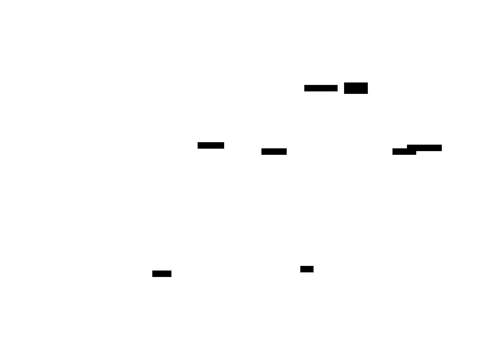

# Single Agent with Tools

**Aliases:** ReAct agent, tool-using agent, single-agent architecture, the default agent
**Category:** Agentic Patterns
**Sources:**
[Anthropic — Building effective agents (Dec 2024)](https://www.anthropic.com/research/building-effective-agents) ·
[Anthropic — Multi-agent research system (Jun 2025)](https://www.anthropic.com/engineering/built-multi-agent-research-system) ·
[OpenAI — A practical guide to building agents (2025)](https://openai.com/) ·
[Yao et al. — ReAct (2022)](https://arxiv.org/abs/2210.03629)

---

## Problem

> [!TIP]
> **ELI5.** You decided you genuinely need an agent (not a workflow). The first instinct of many teams: "let's have a planner agent, and a researcher agent, and a writer agent, and an editor agent, and..." That usually fails. The instinct that works: **start with one agent**. Give it good tools. Make those tools easy to use. Most problems that "need" five agents actually need one capable agent with a well-curated tool belt.

The single-agent-with-tools pattern is the **default architecture** in 2026 production agentic systems — not the simplest possible thing, not the most elaborate, but the one that earns its cost across the broadest range of tasks. Anthropic's repeated guidance: *"Start with a single agent. Add complexity only when measurably needed."* Their own multi-agent research system was justified, but the cost (15× more tokens than chat) is steep and only pays off in specific cases.

A single agent has one LLM running in one loop with one curated set of tools, working on one task to completion. It's what most production "agents" actually are when you read the architecture diagrams — Claude Code, Aider, Cursor's agent mode, a typical Devin sub-task, OpenAI's Operator on a single browser session, a customer-service bot with tools to look up orders.

The design question for single agents isn't *should I have more agents* — it's *do my tools do what the agent needs them to do*. Most of the engineering effort goes into the **tool surface**, not the LLM call itself.

## How it works

> [!TIP]
> **ELI5.** One LLM in a loop. It sees: the goal, the conversation so far, a list of available tools. Each turn it picks a tool, the harness runs it, the result comes back, the LLM picks the next thing. When it decides it's done, it outputs the answer. The whole architecture fits on one page. The hard part is the tool design — see the second diagram.

The architecture has five parts:

**The agent itself** — one LLM, one [loop](agent-loop.md), one accumulated context. Maintains its own state (history, notes, intermediate decisions). Decides what to do next at each turn.

**The tool registry** — a curated set of capabilities exposed to the agent. Not "every API in the company" — a *deliberately small, well-named, well-documented* set. Typical categories:

- **Retrieval tools** — search, RAG, MCP server calls. "Get me information."
- **I/O tools** — read/write files, query database, list directory. "Read or modify state I have access to."
- **Action tools** — send email, create ticket, hit external API, execute code. "Cause an effect in the world."
- **Meta tools** — TODO management, note-taking, "I'm done" signal, "I need help" escalation. "Manage the loop itself."

**The environment** — the actual filesystem, database, APIs, internet that tools reach into. The agent doesn't touch this directly; tools mediate.

**Persistent state** — notes, decisions, TODOs that survive across turns (and across [compaction](../ctx/compaction.md)). Implemented as files or a memory backend. See [structured note-taking](../ctx/structured-note-taking.md).

**The user** — provides the goal, receives the result, optionally interrupts or steers mid-run.

### Why one agent usually beats many

The instinct to multiply agents comes from the human heuristic that "specialists outperform generalists." For LLMs in 2025-2026, this intuition often fails because:

- **Modern frontier models are extraordinary generalists.** Sonnet 4 / GPT-5 / Gemini 2.5 fluidly switch between research, code, analysis, and writing in a single context. A "writer agent" and an "editor agent" are usually the same model with different prompts — and the same model with the *combined* context often does better than two models passing baton.
- **Coordination is expensive and lossy.** Every agent-to-agent handoff serializes context through a summary. Information leaks. Decisions made by agent A become opaque to agent B. Single-agent contexts preserve all the nuance.
- **Debugging cost compounds.** A bug in a 5-agent system can be in any of 5 prompts, 5 tool registries, 5 halt conditions, or in the orchestration layer. Single agents have one place to look.
- **Token cost is super-additive.** Each agent has its own system prompt, tools, history. Passing the same task through 5 agents costs ~5× more than handling it in one.

Anthropic's blunt summary from the [multi-agent research system post](https://www.anthropic.com/engineering/built-multi-agent-research-system): *"Multi-agent systems use about 15× more tokens than chat interactions. For multi-agent systems to be economically viable, the task needs to involve work valuable enough to pay for the increased performance."*

The implication: **only go multi-agent when you can identify a specific cost-justified gain**. Most teams can't, and shouldn't.

### Tool design is the actual work — Agent-Computer Interface (ACI)

A single agent's quality is dominated by its tool surface. Anthropic uses the term **Agent-Computer Interface (ACI)** for this design discipline — analogous to HCI (Human-Computer Interface). The argument: *"Tool design takes as much engineering as user interface design."*

Concrete principles from Anthropic's writing and 2025-2026 practice:

**Names matter as much as code.** `search_orders` beats `find_records`. `cancel_order(order_id)` beats `update(table, id, status="cancelled")`. The LLM reads names as documentation; vague names produce vague tool use.

**Type the arguments.** `status: "pending" | "shipped"` lets the LLM know the valid values from the type alone. Free-form strings invite hallucination.

**Docstrings are training data.** Write the docstring as if explaining to a smart but unfamiliar junior engineer: what the tool does, when to use it, gotchas, example arguments. The model reads this on every call.

**Helpful error messages.** When a tool fails, return an error message that tells the LLM what went wrong *and how to fix it*. `"Unknown column 'order_status' — did you mean 'status'?"` lets the agent self-correct. `"E_INVALID"` makes it loop forever.

**Idempotency where possible.** Agents will retry. Tools that double-charge on retry produce real-world damage.

**Composition over monoliths.** Many small, focused tools (`grep`, `read_file`, `list_dir`) compose better than one big `do_everything(operation, args)` tool. The LLM is excellent at composition; not as good at remembering which option-of-50 to pass.

**The thoughtful-junior-engineer test.** If a careful junior engineer can't use the tool correctly from the docstring alone — by writing example code that calls it — the LLM can't either. Fix the tool, not the prompt.

In production debugging traces, the #1 cause of single-agent failure isn't "the model is dumb" — it's "the tool returned a useless error" or "the tool's name didn't match what the model thought it did." Tool design is where the wins are.

### When you do reach for multiple agents

The single-agent pattern doesn't say "never use multiple agents." It says "earn it." Cases where you legitimately need more than one:

- **Sub-agent spawning** (see [sub-agent architectures](sub-agent-architectures.md)) for context isolation — *not* for capability specialization. The parent stays one agent; subs are tactical context resets.
- **Orchestrator-workers** for embarrassingly parallel subtasks (a research task with 10 independent sub-queries).
- **Maker-checker** patterns where you specifically want adversarial separation between generator and verifier.
- **Cross-trust-boundary** systems where one agent must not see another's data (multi-tenant scenarios, sensitive-data isolation).

All of these are covered in dedicated pages — [multi-agent orchestration](multi-agent-orchestration.md), [sub-agent architectures](sub-agent-architectures.md), [maker-checker](maker-checker.md).

## Variants & related patterns

- [**Agent loop**](agent-loop.md) — the underlying mechanism.
- [**Workflows vs Agents**](workflows-vs-agents.md) — when not to reach for any agent.
- [**Multi-agent orchestration**](multi-agent-orchestration.md) — the next step up when one agent isn't enough.
- [**Sub-agent architectures**](sub-agent-architectures.md) — fresh-context delegation from a single parent.
- [**Coding agents**](coding-agents.md) — the most-developed single-agent specialty.
- [**Computer use**](computer-use.md) — single agent with mouse-and-keyboard tools.
- [**Progressive disclosure**](../ctx/progressive-disclosure.md) — pattern for designing the tool surface so a 1000-tool registry doesn't overwhelm the agent.
- **Agent Skills** (`../skills/`) — bundling domain expertise as composable single-agent capabilities.

## When NOT to use

- **For tasks a workflow can do.** A single LLM call with retrieval beats an agent loop for stateless tasks. See [workflows vs agents](workflows-vs-agents.md).
- **When the task genuinely requires parallel exploration.** Use [orchestrator-workers](multi-agent-orchestration.md) or [sub-agents](sub-agent-architectures.md).
- **When you need adversarial verification.** Use [maker-checker](maker-checker.md) — separate models to break confirmation bias.
- **For very high-throughput / low-latency** workloads. A single agent's loop has unpredictable latency. Use a workflow with parallelism.
- **When the toolset is huge** (>100 tools) and progressive disclosure isn't viable. Consider routing to specialized agents.

## Implementations

| Tool / framework | Single-agent default |
|---|---|
| **Anthropic Agent SDK** | Yes — single-agent is the canonical use case. |
| **OpenAI Assistants API** | Yes — one assistant per task; multi-agent requires explicit handoffs. |
| **Claude Code, OpenAI Codex CLI** | Single agent + filesystem/shell tools. |
| **Aider, Cline, Cursor (agent mode)** | All single-agent. |
| **Pydantic AI** | Single-agent first; multi-agent via composition. |
| **LangGraph** | Both — single-agent is the simplest case (one node loop). |
| **LangChain agent executor** | Classic single-agent pattern. |
| **smol-agents (HuggingFace)** | Single-agent, code-as-action. |
| **DSPy ReAct** | Single-agent loop, compilable. |
| **Letta** | Single-agent + persistent memory. |

## Companies using single-agent architectures in production

- **Anthropic** ✅ — Claude Code is single-agent ([reference](https://www.anthropic.com/engineering/claude-code-best-practices)).
- **Cursor, Aider, Cline, OpenCode, Continue** ✅ — every major coding agent is single-agent (sometimes with sub-agent spawning, but one lead).
- **OpenAI** ✅ — Codex CLI, Operator (the browsing agent), Deep Research are single-agent.
- **Cognition (Devin)** ✅ — single lead agent that spawns sub-agents tactically.
- **Sourcegraph (Cody Agent)** ⚠ — single-agent design referenced in engineering posts.
- **Sierra, Decagon, Lindy** ⚠ — customer-service agents; single-agent per ticket is the dominant pattern; not all publicly verified.
- **GitHub Copilot Workspace** ⚠ — single agent per workspace session.

## Further reading

- [Building effective agents](https://www.anthropic.com/research/building-effective-agents) — Anthropic Dec 2024 ("start simple, add complexity only when measurably needed")
- [How we built our multi-agent research system](https://www.anthropic.com/engineering/built-multi-agent-research-system) — Anthropic Jun 2025 (the 15× cost ratio and when single-agent isn't enough)
- [A practical guide to building agents](https://cdn.openai.com/business-guides-and-resources/a-practical-guide-to-building-agents.pdf) — OpenAI 2025
- [Claude Code best practices](https://www.anthropic.com/engineering/claude-code-best-practices) — Apr 2025
- [ReAct: Synergizing Reasoning and Acting](https://arxiv.org/abs/2210.03629) — Yao et al. 2022 (original single-agent-with-tools paper)

---

*Diagram source: [`../diagrams/src/single-agent-with-tools.d2`](../diagrams/src/single-agent-with-tools.d2), [`../diagrams/src/aci-design.d2`](../diagrams/src/aci-design.d2)*
