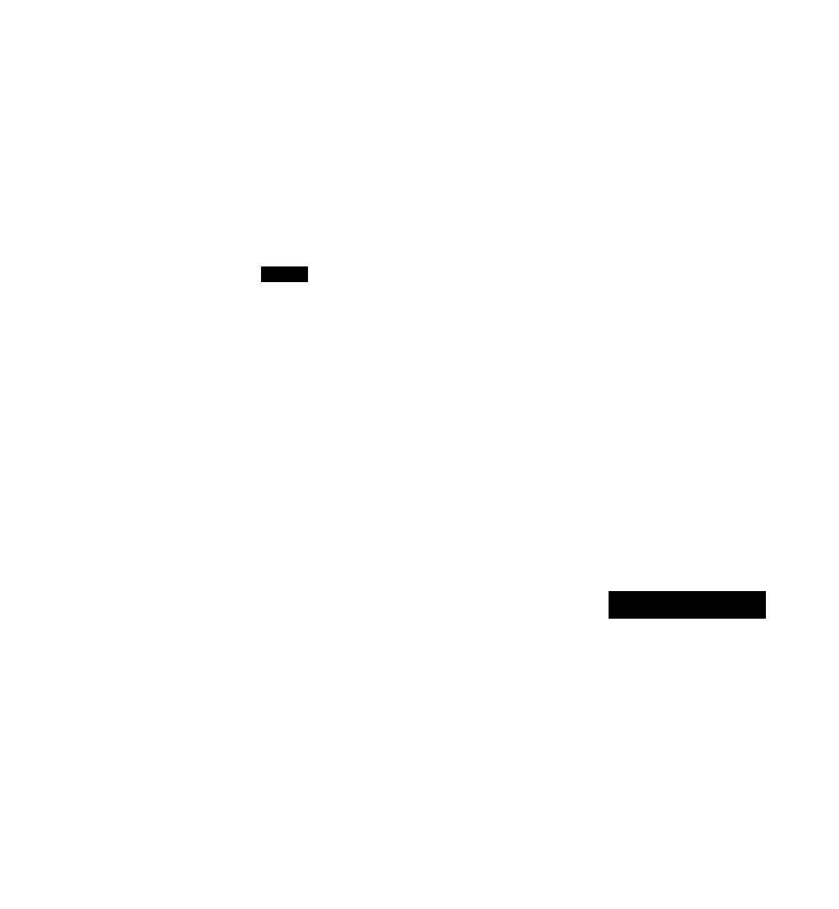

# Sub-Agent Architectures

**Aliases:** spawn-and-summarize, fresh-context delegation, agent forking, orchestrator-workers (the implementation), context-isolation pattern
**Category:** Agentic Patterns
**Sources:**
[Anthropic — How we built our multi-agent research system (Jun 2025)](https://www.anthropic.com/engineering/built-multi-agent-research-system) ·
[Anthropic — Effective context engineering for AI agents (Sept 2025)](https://www.anthropic.com/engineering/effective-context-engineering-for-ai-agents) ·
[Claude Code Task/sub-agent tool](https://docs.claude.com/en/docs/build-with-claude/claude-code) ·
Cognition (Devin) — sub-agent architecture

---

## Problem

> [!TIP]
> **ELI5.** Your agent has been working for a while. Its notebook is getting full. The next thing on the list is "go research three competitors and summarize." If the agent does that in its own notebook, the notebook fills up with raw research, search results, and intermediate notes — and 50 turns from now it'll be too cluttered to think clearly. Instead, spin up a *fresh* assistant for each competitor — give each a clean notebook, a focused brief, and a deadline. When they're done, each hands back a one-page summary. The parent agent only sees those summaries. Its notebook stays clean.

A long-running single agent eventually hits context-window pressure: too much history, too many tool results, the lead model's attention spreads thin (see [context rot](../ctx/context-rot.md)). [Compaction](../ctx/compaction.md) helps but is lossy. [Just-in-time context](../ctx/just-in-time-context.md) helps but doesn't solve the case where the agent itself needs to do a *substantial chunk of focused work* that would balloon its own context.

The pattern that emerged across Anthropic, Cognition (Devin), Cursor agent mode, and almost every production long-horizon agent in 2025-2026: **spawn fresh-context sub-agents for bounded subtasks**. The parent stays small and oriented; the subs do the actual heavy lifting; the parent only sees their distilled outputs.

This is the production implementation of the [orchestrator-workers](multi-agent-orchestration.md) pattern — but it's worth its own page because (a) it's by far the most common multi-agent shape in 2026 production, (b) the design subtleties (when to spawn, what context to pass, what to demand back) deserve their own treatment, and (c) it's the answer to *"how do I scale a single agent to hours of work"*.

## How it works

> [!TIP]
> **ELI5.** The parent agent has a special tool — `spawn_sub_agent(task, context_for_sub)`. When the parent calls it, the harness boots up a *new* LLM session with: (a) a clean context, (b) a focused task description, (c) just the *relevant* context from the parent. The sub-agent works in its own world — its own tools, its own loop, its own halting. When it's done it returns a *summary* (1-2K tokens). The parent gets the summary, not the full work. The parent's context grows by ~2K, not by 30K.



The mechanics are simple enough that the *whole pattern fits in one Python function*:

```python
def spawn_sub_agent(task: str, context: str, return_format: dict) -> str:
    """Parent agent's tool. Boots a fresh sub-agent with isolated context."""
    sub_messages = [
        {"role": "system", "content": SUB_AGENT_SYSTEM_PROMPT},
        {"role": "user",   "content": f"Task: {task}\n\nContext: {context}\n\n"
                                       f"Return format: {return_format}"}
    ]
    summary = run_agent(sub_messages, tools=SUB_TOOLS, max_iter=30)
    return summary    # ← parent's context grows by len(summary), not by sub's full work
```

What makes this pattern *work in production* rather than just in demos is a small set of design discoveries:

### 1. The sub-agent gets a fresh context, not the parent's

This is the whole point. If the sub-agent could see the parent's entire 150K-token context, you'd have no context isolation and the same context-rot problems. The sub gets:
- A standard system prompt (often different from the parent's).
- A *curated* context blurb passed by the parent (a few hundred to a few thousand tokens — explicitly *what matters for this subtask*).
- A focused task description.
- Its own set of tools (possibly different from the parent's).

Anthropic's [research-system post](https://www.anthropic.com/engineering/built-multi-agent-research-system) calls out that without an explicit `context` parameter in the spawn tool, sub-agents wander into adjacent territory the parent didn't intend. Adding the parameter — and prompting the parent to fill it deliberately — was one of their biggest reliability wins.

### 2. The sub-agent returns a summary, not raw work

The sub-agent might do 20 tool calls and accumulate 30K tokens of intermediate state. The parent doesn't want any of that. The sub-agent's *final output* is a structured summary — often shaped by a `return_format` instruction from the parent: "Return a bullet-point list of the top 3 risks, with sources."

If the parent later needs to look deeper into something the sub investigated, it spawns another sub (which can re-fetch). The sub-agent's full state is *not* persisted by default; it's ephemeral. Anything that should outlive the sub goes either (a) into the returned summary, or (b) into [structured notes](../ctx/structured-note-taking.md) the sub writes to disk on its way out.

### 3. The parent's tool definition matters as much as the sub's prompt

The single biggest lever for sub-agent quality, per Anthropic's writing, is **how the parent's `spawn_sub_agent` tool is described**. A vague description ("`spawn a helper agent to do a task`") produces vague sub-tasks. A rich description with examples, expected use cases, and a strict return format produces well-scoped, focused subs.

Typical good practice for a sub-agent spawn tool:

```python
spawn_research_agent(
    research_question: str,    # "What are X Corp's main 2025 product launches?"
    context: str,              # "Parent is building a competitive analysis report.
                               #  Focus on enterprise products, ignore consumer SKUs."
    sources_to_prefer: list[str],   # ["techcrunch.com", "investor.xcorp.com"]
    max_findings: int = 5,
    return_format: str = "JSON list of {finding, source_url, confidence}"
)
```

Compare to a generic `spawn(task)`. The structured signature *forces* the parent LLM to think about what to delegate and how to constrain it.

### 4. Sub-agents can spawn their own sub-agents — carefully

Recursive spawning works (the Anthropic research system uses it) but each level of nesting adds coordination cost and increases the chance of drift. Most production systems cap nesting at 2-3 levels. Deeper hierarchies tend to produce sub-agents that have lost track of the original goal.

Mitigation: each sub-agent's prompt re-states the *original* high-level goal alongside its specific task. Reinforcement (see [context plumbing & reinforcement](../ctx/context-plumbing-reinforcement.md)) is what keeps deep sub-trees coherent.

### 5. Failures and timeouts are isolated

A big practical win: if a sub-agent fails (hits an error, loops, exceeds budget), the parent gets a structured error response instead of a polluted context. The parent can retry, ask a different sub, or escalate. In a single-agent flat architecture, a failed multi-turn research excursion *poisons* the rest of the run.

This is one of the under-appreciated reasons sub-agents pay off even when you don't need parallelism: **failure containment**. The parent stays clean even when sub-tasks go wrong.

### Concrete examples in 2026 production

**Claude Code's `Task` tool.** Anthropic's coding agent ships with a built-in sub-agent spawner called the Task tool. When the model decides a research/exploration task is too big to do in-context, it calls `Task(...)` with a description; a fresh sub-agent runs the search and returns a summary. The pattern is so important that Anthropic's own dev guidance explicitly tells users when to prompt the model to use it.

**Anthropic's multi-agent research system.** Claude Opus 4 is the lead, decides what to research, spawns Claude Sonnet 4 sub-agents (often in parallel) for each sub-question. The lead sees only the sub-agent summaries, then synthesizes the final answer. The cost: ~15× more tokens. The benefit: 90.2% improvement on their internal research benchmark.

**Cognition (Devin).** Long-horizon coding work is decomposed into sub-tasks; each is delegated to a fresh sub-agent. The lead maintains the long-term plan; subs handle bounded chunks (one feature, one bug, one refactor). This is widely reported in their engineering materials; precise architecture details are proprietary.

**Cursor agent mode and OpenCode.** When the user asks for a large refactor, the agent often spawns specialist sub-tasks (rename across files, update tests, generate migration) as separate, fresh-context jobs.

## Variants & related patterns

- [**Multi-agent orchestration**](multi-agent-orchestration.md) — sub-agents are the implementation of the orchestrator-workers pattern.
- [**Single agent with tools**](single-agent-with-tools.md) — the base case; sub-agents extend it without abandoning it.
- [**Agent loop**](agent-loop.md) — each sub-agent runs its own loop.
- [**Compaction**](../ctx/compaction.md) — sub-agents reduce the *need* for compaction in the parent.
- [**Structured note-taking**](../ctx/structured-note-taking.md) — the persistent medium sub-agents and parents share state through.
- [**Just-in-time context**](../ctx/just-in-time-context.md) — sub-agents are JIT context for the parent.
- [**Self-directed swarms**](self-directed-swarms.md) — the unbounded variant where sub-agents spawn freely.
- [**Maker-checker**](maker-checker.md) — adversarial 2-agent pattern; specialized case.
- **Anthropic Skills** — composable capability bundles often invoked from sub-agents.

## When NOT to use

- **Short tasks.** A sub-agent spawn adds 1-3 LLM calls of overhead (parent decides to spawn, sub runs, parent reads summary). For sub-second-latency or trivial tasks, just stay in the parent.
- **Tightly coupled work** where the sub-task's reasoning needs to flow back into the parent's reasoning. Information gets lost in the summary handoff.
- **Cost-sensitive deployments at scale.** Each sub-agent is its own LLM context; total token cost rises faster than the work product would suggest.
- **When the sub-task can't be cleanly bounded.** If you can't write a short task description that the sub can finish without re-asking the parent, the work isn't a sub-task — it's tangled with the parent.
- **When tool definitions can't be safely passed to a fresh context.** If a tool depends on parent-only state (auth tokens, cached results), the sub can't use it; consider exposing the tool through the parent as a callback.
- **For real-time interactive use.** Sub-agent spawns add seconds to wall time.

## Implementations

| Tool / framework | Sub-agent support |
|---|---|
| **Claude Code** | Built-in `Task` tool for spawning sub-agents. The reference implementation. |
| **Anthropic Agent SDK** | Sub-agent spawning is a documented pattern; provide a `spawn_sub_agent` tool. |
| **OpenAI Assistants API** | DIY — spawn another assistant run, pass curated input, collect output. |
| **LangGraph** | Sub-graphs as nodes; native support for nested state machines. |
| **CrewAI** | Hierarchical crews; manager agent spawns workers. |
| **AutoGen** | `Society of Mind` pattern; nested group-chats. |
| **MetaGPT** | Role-based; each role can sub-delegate. |
| **OpenAI Swarm / AgentKit** | Handoff is a degenerate form; explicit sub-agent spawn via tools. |
| **Pydantic Graph** | Sub-graphs as typed nodes. |
| **Cognition Devin (internal)** | Native sub-agent architecture; not publicly available framework. |

## Companies using sub-agent architectures in production

- **Anthropic** ✅ — Claude Code's Task tool, multi-agent research system ([source](https://www.anthropic.com/engineering/built-multi-agent-research-system)).
- **Cognition (Devin)** ⚠ — sub-agent architecture publicly described in engineering materials; specific implementation proprietary.
- **OpenAI** ⚠ — Operator and Deep Research use sub-agent-like delegation; architecture not fully documented.
- **Cursor (agent mode)** ⚠ — observable in agent behavior on large tasks.
- **Replit Agent** ⚠ — multi-stage coding tasks use sub-agents.
- **Google DeepMind (Gemini Deep Research)** ⚠ — multi-agent research delegation is implied by behavior.
- **Perplexity (Spaces)** ⚠ — likely uses sub-agent research delegation.
- **Sourcegraph (Cody Agent)** ⚠ — sub-task delegation in long-horizon code work.

## Further reading

- [How we built our multi-agent research system](https://www.anthropic.com/engineering/built-multi-agent-research-system) — Anthropic Jun 2025 (the canonical sub-agent case study)
- [Effective context engineering for AI agents](https://www.anthropic.com/engineering/effective-context-engineering-for-ai-agents) — Anthropic Sept 2025 (sub-agents as a context-engineering tool)
- [Building effective agents](https://www.anthropic.com/research/building-effective-agents) — Anthropic Dec 2024 (orchestrator-workers pattern)
- [Claude Code best practices](https://www.anthropic.com/engineering/claude-code-best-practices) — Apr 2025 (the Task tool, in context)
- [Society of Mind — AutoGen](https://microsoft.github.io/autogen/) — research framing for nested agents

---

*Diagram source: [`../diagrams/src/sub-agent-architecture.d2`](../diagrams/src/sub-agent-architecture.d2)*
