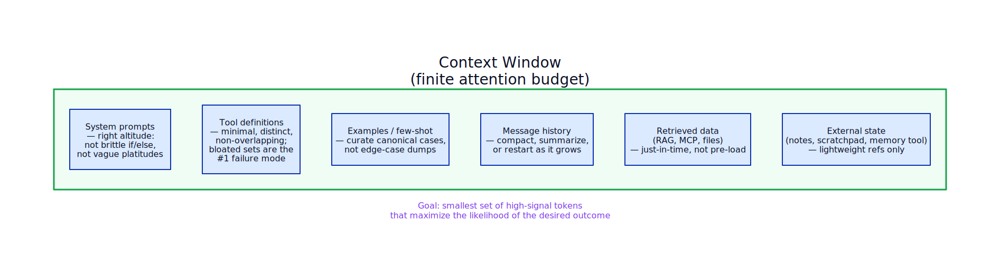

# Context Engineering — overview

**Aliases:** context curation, context plumbing (Matt Webb's framing), 12-Factor Agents Factor 3
**Category:** Context Engineering
**Sources:**
[Anthropic Applied AI team — Effective context engineering for AI agents (Sept 29, 2025)](https://www.anthropic.com/engineering/effective-context-engineering-for-ai-agents) ·
[Dexter Horthy — 12-Factor Agents Factor 3](https://github.com/humanlayer/12-factor-agents/blob/main/content/factor-03-own-your-context-window.md) ·
[Matt Webb — Context plumbing](https://interconnected.org/home/2025/11/29) ·
[Armin Ronacher — Agent design is still hard](https://lucumr.pocoo.org/2025/11/22/agent-design/)

---

## Problem

> [!TIP]
> **ELI5.** You have a brilliant assistant with a notebook that fits exactly 200,000 words. Every time they answer something, they read the *entire notebook* first. The more you scribble in there — old emails, half-read PDFs, error messages, "just-in-case" reference material — the harder it gets for them to find the part that actually matters. The job of context engineering is deciding *what gets written on the next page* of that notebook.

Through 2024 the engineering work in LLM applications went under the name **prompt engineering**: craft the right system prompt and the model will behave. That worked when most use cases were single-turn classification or text generation. The output was deterministic enough that "what words go in the prompt" was the primary lever.

Three things broke that frame in 2025:

1. **Agents went multi-turn.** A single LLM call became a loop of tens or hundreds of calls. The system prompt is now a tiny fraction of what enters each call.
2. **MCP and tool ecosystems exploded.** Tool definitions, schemas, server descriptions, retrieved documents, prior tool results, scratchpads, and memory entries all compete for context space.
3. **Attention budgets turned out to be finite.** Even with 200K+ token windows, models showed **context rot** — degraded recall as token count grew (see [`context-rot.md`](context-rot.md)).

The result: the limiting factor for production agents is no longer "did you write the right prompt?" but "**did you put the right things in the context window — and *only* the right things — for every single call?**" That's an ongoing curation discipline, not a one-shot authoring task. Anthropic gave it a name in September 2025, and the discipline now goes by **context engineering**.

## How it works

> [!TIP]
> **ELI5.** Treat the context window like a tiny, expensive shelf. Every item costs rent. Before each LLM call, you decide what goes on the shelf and what stays in the warehouse. Items in the warehouse can be fetched on demand (just-in-time), but only if you've left an address pointing to them. The shelf gets re-curated every single turn.

Context engineering is the explicit practice of curating, for every LLM call in an agent loop, the **smallest set of high-signal tokens** that maximize the likelihood of the desired outcome. "Smallest" doesn't mean *short* — it means *no token you can't justify*.

The cycle starts with the **universe of possibly-relevant information**: system prompts, tool definitions, MCP server descriptions, message history, retrieved documents, tool results from earlier in the loop, structured notes the agent wrote to itself, persistent memory, external state changes. The **curate** step decides which subset of that universe gets into the **context window** for the next LLM call. The model produces output (text, a tool call, a thought), and that output — possibly plus the result of executing a tool — gets fed back into the universe. Then the curate step runs again. *Every turn.*

The curation principle: in Anthropic's words, find "the smallest possible set of high-signal tokens that maximize the likelihood of some desired outcome." Each token costs attention budget; each token also competes with every other token for the model's focus (`n²` pairwise relationships under the transformer attention mechanism). Bloating the window with "just-in-case" context is the most common failure mode.

### The components of context

What actually sits in the window during a typical agent call:

Each block follows its own discipline.

**System prompts** should be at the *right altitude* — Anthropic's "Goldilocks zone." Too low and you get brittle if-else logic hardcoded in English, which falls over on edge cases. Too high and you get vague platitudes that fail to give the model concrete signals. The right altitude: specific enough to guide behavior, flexible enough to be heuristic. Organize into clear sections (`<background>`, `<instructions>`, `## Tool guidance`) using XML or Markdown headers.

**Tool definitions** are the most common source of context bloat. Every tool description costs tokens *every call*, whether the agent uses the tool or not. Bloated tool sets — too many tools, overlapping responsibilities, ambiguous decision points — are Anthropic's named #1 failure mode. Rule of thumb: if a human engineer can't definitively say which tool should be used in a given situation, an LLM agent can't either. Curate aggressively. See also: [`../skills/code-mode-mcp.md`](#) for the 2025 escape hatch — exposing tools as filesystem-discoverable code instead of upfront definitions.

**Examples (few-shot)** remain a best practice — examples are "pictures worth a thousand words" for an LLM. But don't dump a laundry list of edge cases. Curate a small set of *canonical* examples that effectively portray the expected behavior.

**Message history** grows linearly with conversation length and is the primary thing that gets compacted (see [`compaction.md`](compaction.md)) or pruned. Tool results are usually the largest part of message history and the safest to clear once consumed (see "Tool Result Clearing" in `../eng/`).

**Retrieved data** historically meant RAG: embed query, fetch top-K chunks, stuff them in. The 2025-2026 shift is toward [**just-in-time context**](just-in-time-context.md) — pass *identifiers* (file paths, URLs, query strings) and let the agent fetch on demand with tools.

**External state** lives in files, databases, or a dedicated memory tool (Anthropic released one with Sonnet 4.5 in 2025). The agent reads/writes it via tools; only lightweight references stay in context. This is the [**structured note-taking**](structured-note-taking.md) pattern.

### Why this works

Context engineering exploits two facts about how transformers work:

1. **Attention is finite.** The `n²` cost of pairwise attention means that as `n` grows, the model's ability to capture cross-token relationships gets stretched thin. Models develop attention patterns from training data, where shorter sequences dominate — so models have *less experience and fewer specialized parameters* for context-wide dependencies in very long windows.

2. **Position encoding extrapolation degrades token-position understanding.** Techniques like position encoding interpolation let models handle longer sequences than they were trained on, but accuracy drops gracefully — not a hard cliff, but a real gradient.

The combined effect is **context rot**: degraded retrieval-from-context and long-range reasoning as windows grow. The mitigation isn't bigger windows (which keep getting bigger but rot keeps happening); it's better curation.

## Variants & related patterns

- [**Compaction**](compaction.md) — the primary lever for long-horizon tasks: summarize and restart.
- [**Structured Note-Taking**](structured-note-taking.md) — externalize state to files.
- [**Just-in-Time Context**](just-in-time-context.md) — fetch on demand rather than pre-load.
- [**Progressive Disclosure**](progressive-disclosure.md) — layered loading: metadata → summary → full content.
- [**Context Rot**](context-rot.md) — the underlying phenomenon being mitigated.
- [**Context Plumbing & Reinforcement**](context-plumbing-reinforcement.md) — Matt Webb + Armin Ronacher's complementary framings.
- **Sub-agent architectures** (see [`../agt/`](#)) — context-isolation via spawning fresh sub-agents.
- **12-Factor Agents Factor 3** — "Own your context window" is the production-engineering rule.

## When NOT to use

Context engineering as a *discipline* applies to every production LLM app. But you can over-engineer the specific techniques:

- **One-shot calls don't need a context-engineering loop.** If you're calling a model once with a prompt and getting a result, focus on prompt engineering. The full curation cycle pays off in multi-turn agents.
- **Short, simple agents don't need compaction or note-taking.** If the entire agent loop comfortably fits in 20% of the context window, leave it alone. Adding compaction infrastructure has its own complexity cost.
- **Don't engineer context for a benchmark.** Anthropic explicitly warns: models can be eval-aware (see `../qua/`); over-curating context to match an eval's distribution is a form of Goodhart's law.
- **Don't curate so aggressively you lose useful signal.** Compaction that drops critical state-changing actions, or pruning that removes the only mention of a constraint, will silently break the agent. Always test compaction prompts on real failure traces.

## Implementations

| Tool / framework | What it gives you |
|---|---|
| **Claude Developer Platform — memory + context management cookbook** | Reference recipes; tool result clearing as a managed feature |
| **Anthropic memory tool** (Sonnet 4.5+) | File-based persistent memory primitive |
| **Claude Code internal harness** | Reference implementation: CLAUDE.md pre-load + glob/grep for just-in-time |
| **LangGraph state management** | Explicit state objects you read from/write to per node |
| **LlamaIndex memory modules** | Long-term + short-term memory abstractions |
| **OpenAI Agents SDK** | Per-run context object |
| **Pydantic AI** | Typed dependency injection for context |
| **Roll your own** | Most production teams: a curated `messages = build_context(state)` function called every turn |

Armin Ronacher's [Agent design is still hard](https://lucumr.pocoo.org/2025/11/22/agent-design/) (Nov 2025) makes the case that current agent SDKs don't yet give you the right abstraction for context engineering, and most production teams roll their own.

## Companies using context engineering

- **Anthropic** ✅ — Claude Code is the reference implementation. ([Effective context engineering, Sept 2025](https://www.anthropic.com/engineering/effective-context-engineering-for-ai-agents))
- **HumanLayer** ✅ — Factor 3 of [12-Factor Agents](https://github.com/humanlayer/12-factor-agents) names the practice.
- **Cognition (Devin)** ⚠ — widely reported but not directly verified in this fetch.
- **Cursor** ⚠ — `.cursorrules`, CLAUDE.md-style files, and rules systems demonstrate the practice.
- **Sourcegraph (Cody)** ⚠ — context fetching and chunking discussed in their engineering posts.
- **Bolt, Descript** ✅ — both used by Anthropic as named customer examples in the Jan 2026 evals post (they iterate context to hit eval targets).

## Further reading

- [Effective context engineering for AI agents](https://www.anthropic.com/engineering/effective-context-engineering-for-ai-agents) — Anthropic Applied AI, Sept 2025 (the canonical source)
- [12-Factor Agents — Factor 3: Own your context window](https://github.com/humanlayer/12-factor-agents/blob/main/content/factor-03-own-your-context-window.md) — Horthy
- [Agent design is still hard](https://lucumr.pocoo.org/2025/11/22/agent-design/) — Armin Ronacher, Nov 2025
- [Context plumbing](https://interconnected.org/home/2025/11/29) — Matt Webb, Nov 2025
- [Memory and context management cookbook](https://docs.claude.com/en/docs/build-with-claude/memory-tool) — Anthropic

---

*Diagram source: [`../diagrams/src/context-engineering-loop.d2`](../diagrams/src/context-engineering-loop.d2), [`../diagrams/src/context-anatomy.d2`](../diagrams/src/context-anatomy.d2)*
