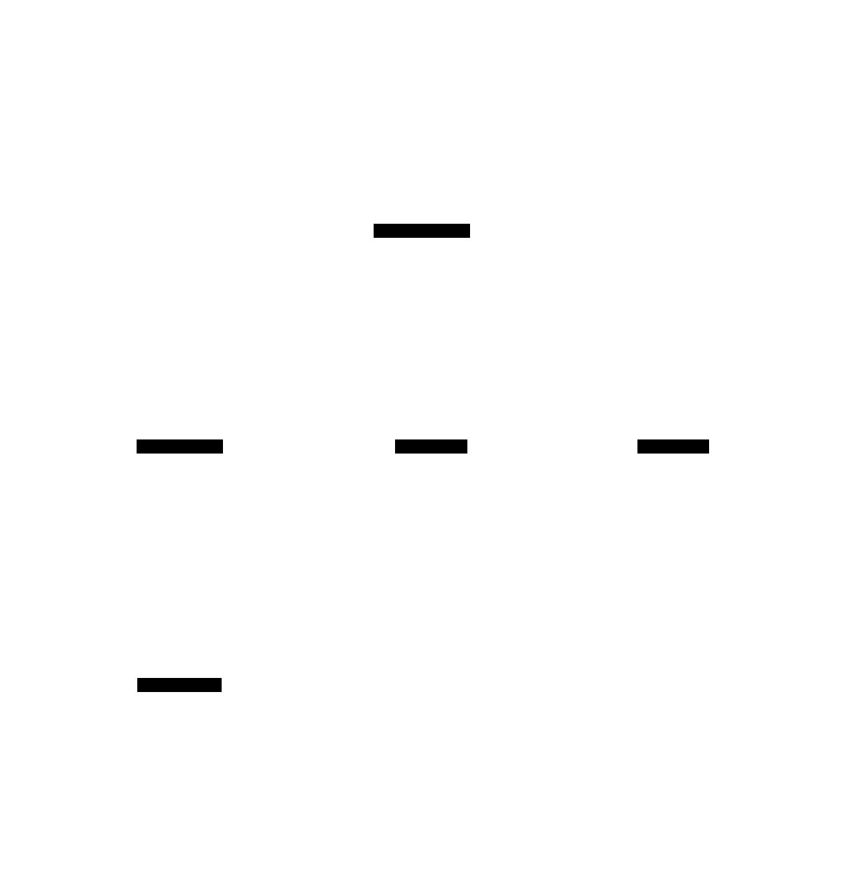

# Reasoning Prompts (CoT, ToT, Self-Consistency, Reflection)

**Aliases:** chain-of-thought prompting, structured reasoning, tree search prompting, multi-sample voting, self-critique
**Category:** Foundations
**Sources:**
[Wei et al. — Chain-of-Thought Prompting Elicits Reasoning (2022)](https://arxiv.org/abs/2201.11903) ·
[Wang et al. — Self-Consistency Improves Chain-of-Thought (2022)](https://arxiv.org/abs/2203.11171) ·
[Yao et al. — Tree of Thoughts (2023)](https://arxiv.org/abs/2305.10601) ·
[Shinn et al. — Reflexion (2023)](https://arxiv.org/abs/2303.11366) ·
[OpenAI — Learning to reason with LLMs (o1 announcement, Sept 2024)](https://openai.com/index/learning-to-reason-with-llms/) ·
[Anthropic — Extended thinking docs (2024-2026)](https://docs.anthropic.com/)

---

## Problem

> [!TIP]
> **ELI5.** Bare LLMs answer in one shot, which works for easy questions and fails on hard ones. The whole "reasoning prompting" family is about *making the model do work before committing to an answer*. **Chain-of-Thought** is the foundational trick — "think step by step" before answering. **Self-Consistency** samples many CoT trajectories and votes on the answer. **Tree-of-Thought** branches and searches multiple reasoning paths. **Reflection** has the model critique its own answer and revise. By 2024-2026, all of these have been increasingly *internalized* into reasoning models (o1, Claude extended thinking) — but understanding the family tree still matters because the prompt patterns still apply when you can't afford a reasoning model or want to combine them.

The history of reasoning-elicitation in LLMs is one of the most concentrated bursts of useful research in the modern era. In ~24 months (2022-2023), the community discovered that:

1. **Just asking the model to "show its work"** makes it dramatically better at multi-step problems (CoT, Wei et al. Jan 2022).
2. **Sampling multiple reasoning paths and voting** is even better (Self-Consistency, Wang et al. Mar 2022).
3. **Letting the model branch and backtrack** unlocks harder problems (Tree-of-Thought, Yao et al. May 2023).
4. **Letting the model critique itself** improves accuracy further (Reflexion / self-critique, Shinn et al. Mar 2023).

By 2024-2026, these prompt-level techniques have been substantially *absorbed into model training itself* — reasoning models like OpenAI's o1/o3, Claude's extended-thinking modes, Gemini 2.5 with thinking, DeepSeek R1, and Qwen QwQ produce internal reasoning automatically. But the **family of techniques** still matters because:

- Reasoning models cost more (much more) per call than non-reasoning models.
- The same techniques still apply *on top* of reasoning models for the hardest tasks.
- Understanding the lineage helps you pick the right tool for the right problem.
- Open-weight non-reasoning models (Llama, smaller Qwen, etc.) still benefit from these prompt patterns.

This page is the foundation that the rest of agentic-pattern literature assumes you know.

## How it works

> [!TIP]
> **ELI5.** Start with plain answer. Add "think step by step" → **Chain-of-Thought** (CoT). Sample CoT many times and majority-vote → **Self-Consistency**. Branch out into a tree of reasoning paths and search → **Tree-of-Thought** (ToT). Have model critique its answer and try again → **Reflection**. By 2024-2026, all four ideas have been baked into the training of reasoning models — they think internally by default.

### The four canonical techniques

**Chain-of-Thought (CoT).** Wei et al., January 2022. The original observation: if you prompt an LLM with a problem and ask it to "think step by step" (or show a few examples of step-by-step reasoning in the prompt), the model's accuracy on multi-step problems (math word problems, logic puzzles, commonsense reasoning) goes up dramatically.

The mechanism: the model is autoregressive — each token it generates becomes input to predicting the next token. By writing out intermediate reasoning, the model effectively gives itself more "compute" per output token. Without CoT, the model has to commit to an answer in one shot; with CoT, it can take many small steps.

Two flavors:
- **Few-shot CoT.** Provide examples in the prompt showing problem → reasoning → answer.
- **Zero-shot CoT.** Just append "Let's think step by step." (Kojima et al., 2022). Works surprisingly well on most modern models.

Cost: more output tokens per call (the reasoning). Latency: higher (more tokens to generate). Accuracy: dramatically better on tasks where step-by-step matters.

**Self-Consistency.** Wang et al., March 2022. Take CoT, sample it K times at moderate temperature, and majority-vote the final answers. The reasoning paths differ (random sampling), but the right answer is more likely to be reached via multiple paths than any specific wrong answer.

Mechanism: variance is reduced through sampling. If 7 of 10 CoT paths arrive at "42" and 3 arrive at random wrong answers, the majority vote picks "42" — the right answer.

Cost: K× the compute and tokens of single CoT. Use when accuracy matters more than cost.

**Tree-of-Thought (ToT).** Yao et al., May 2023. Generalize from linear reasoning paths to a *tree*. At each step, generate multiple possible next steps, evaluate them (via the model itself or a heuristic), expand promising branches, prune unpromising ones. Effectively combines search with reasoning.

Mechanism: hard problems may require considering multiple paths, recognizing dead ends, backtracking. Linear CoT can't do this; ToT can.

Cost: substantially higher than CoT — many model calls per problem. Use for problems where capability matters more than cost (research, complex planning).

**Reflection / Reflexion / Self-Critique.** Multiple 2023 papers; Shinn et al. "Reflexion" (March 2023) is the canonical reference. After the model produces an answer, prompt it: "Now critique this answer. What might be wrong? How could it be improved?" Then prompt it to produce a revised answer informed by the critique. Iterate if needed.

Mechanism: the critique is more constrained than the original answer (the answer exists for the model to evaluate), and models are often better at *evaluating* than *producing*. The revised answer benefits from this second pass.

Cost: 2-3× single CoT cost (original + critique + revision). Diminishing returns after one or two iterations.

### The 2024-2026 development: reasoning models

In September 2024, OpenAI announced o1 — a model trained with reinforcement learning to internally produce long chains of reasoning before committing to a visible answer. Anthropic followed with extended-thinking modes on Claude 3.7+ (Feb 2025). Google released Gemini 2.5 with thinking. DeepSeek R1, Qwen QwQ, and others followed.

These models *internalize* the four techniques above:
- They produce CoT-like reasoning automatically, without prompting.
- They sample multiple reasoning paths internally (a form of self-consistency).
- They consider alternatives and backtrack (a form of tree search).
- They self-critique within their reasoning (a form of reflection).

When you call a reasoning model, you get the *result* of all this — typically a much longer/more expensive call that produces dramatically better answers on hard problems. For many tasks (advanced math, deep coding, research synthesis), a reasoning model + simple prompt now outperforms a non-reasoning model + sophisticated prompt engineering.

But: reasoning models are 5-30× more expensive per task, and not always needed. The prompt-level techniques remain relevant for:
- **Cost-sensitive deployments** that can't afford reasoning-model calls everywhere.
- **Latency-sensitive paths** where reasoning models are too slow.
- **Open-weight deployments** with non-reasoning models.
- **Composing on top of reasoning models** for the hardest tasks (the techniques still help).

### Practical decision: which to use

The 2026 recommendation (rough hierarchy):

1. **For easy / single-step tasks** → no special reasoning. Direct answer.
2. **For multi-step / chain-of-arithmetic / logic** on a budget → zero-shot CoT ("Let's think step by step").
3. **For accuracy-critical tasks** where you can afford 5-10× cost → Self-Consistency (sample CoT, vote).
4. **For tasks needing search / planning** → ToT, or just use a reasoning model.
5. **For tasks where draft-then-revise helps** → Reflection / self-critique.
6. **For frontier hard tasks** → reasoning model (o3, Claude extended thinking, Gemini 2.5 thinking), which internalizes everything above.

A key 2026 insight: **the cheap-tier "best practice" has shifted from CoT-prompt to reasoning-mini**. OpenAI's o1-mini / o3-mini, Claude Haiku with brief thinking, Gemini Flash with thinking — these models cost 2-3× a non-reasoning equivalent but give you most of the reasoning benefit "for free" (no prompt engineering needed).

### Reasoning prompts with tools

Reasoning prompts compose with tool use (`[ReAct]`(react.md)). The standard pattern: the model interleaves *thoughts* (reasoning prompts) with *actions* (tool calls), reading observations and continuing to reason. This is the foundation of agentic loops — see [single-agent-with-tools](../agt/single-agent-with-tools.md).

Reasoning models with tools (o3 with web search, Claude with extended thinking + tools) push this further: the model can do extended internal reasoning *between* tool calls, evaluating what to do next.

### Common failure modes

- **CoT helps less on weak models.** Wei's original paper showed CoT helps mainly when the model is ≥60B params. Tiny models reason badly; CoT can even hurt.
- **CoT can hallucinate confidently.** Long-form reasoning gives more room for plausible-sounding wrongness. Mitigation: external verification (tools, retrieval).
- **Self-Consistency on open-ended tasks.** Voting works for tasks with a single right answer (math, classification). For open-ended generation (writing, code), voting is harder — what does "majority answer" mean?
- **ToT is expensive and finicky.** Often a reasoning model is simpler and better.
- **Reflection plateaus.** Two iterations usually capture most of the gain; more iterations stop helping or degrade.
- **Reasoning models hallucinate within their thinking.** Even o3 and Claude extended thinking produce plausible-but-wrong internal reasoning sometimes. Trust the result, not the process.

### What's *not* in this family

Some closely-related techniques have separate pages:
- **ReAct** — interleaving reasoning with tool actions. See [react.md](react.md).
- **Plan-and-execute / Plan-and-solve** — generate a plan, then execute. Variant of CoT applied to multi-step.
- **Test-time compute as RL** — training reasoning into models. Page in `model/`.

## Variants & related patterns

- [**ReAct**](react.md) — reasoning combined with tool actions.
- [**Augmented LLM**](augmented-llm.md) — reasoning prompts apply to the LLM core within the augmented LLM.
- [**Structured outputs**](structured-outputs.md) — sometimes reasoning *and* structured-output are wanted together (the model must reason internally but emit structured final answer).
- [**Single-agent with tools**](../agt/single-agent-with-tools.md) — uses reasoning prompts as part of the agent loop.
- [**Evaluator-optimizer**](../agt/workflows-vs-agents.md) — workflow built on reflection.
- **Test-time compute** — the training-time response to these prompt patterns (covered in `model/`).
- **CodeAct / Program-aided reasoning** — variant where the "reasoning" is generated code.
- **Self-Consistency variants**: maj@k, weighted voting, verifier-guided sampling.

## When NOT to use

- **Trivial single-step tasks.** CoT adds latency for no gain. Direct prompting is fine.
- **Latency-critical paths** where seconds matter — CoT roughly doubles latency, self-consistency K× it.
- **Already using a reasoning model** for the task — adding CoT prompting on top often doesn't help (the model already does it).
- **Tasks where the model lacks the underlying capability.** Reasoning prompts amplify capability; they don't create it from nothing.

## Implementations

| Library / pattern | What it enables |
|---|---|
| **Plain prompt: "Let's think step by step"** | Zero-shot CoT |
| **Few-shot examples in prompt** | Few-shot CoT |
| **LangChain `SelfConsistencyChain`** | Self-Consistency built-in |
| **LangGraph multi-sample + reducer** | Self-Consistency in DAG form |
| **DSPy** | Programmatic optimization of reasoning prompts |
| **OpenAI o1 / o3 / o5** | Reasoning model — internalizes the family |
| **Anthropic Claude extended thinking** | Reasoning model with configurable thinking budget |
| **Gemini 2.5 with thinking** | Reasoning model |
| **DeepSeek R1, Qwen QwQ** | Open-weight reasoning models |
| **Outlines, Guidance** | Structured constrained reasoning |

## Companies / products built on or popularizing these

- **OpenAI** ✅ — original "show your work" prompting; later o1/o3 reasoning models.
- **Google Research** ✅ — Wei et al., Wang et al. (Self-Consistency) papers.
- **Princeton / DeepMind** ✅ — Yao et al. Tree-of-Thought.
- **Northeastern et al.** ✅ — Shinn et al. Reflexion paper.
- **Anthropic** ✅ — Claude with extended thinking modes.
- **DeepSeek, Alibaba (Qwen), Mistral** ✅ — open-weight reasoning models.
- **Cognition (Devin), Cursor, Replit Agent, Claude Code** ⚠ — all use a mix of these techniques internally.
- **Perplexity, ChatGPT browse, Bing Chat** ⚠ — apply CoT+tools as their default pattern.

## Further reading

- [Chain-of-Thought Prompting Elicits Reasoning](https://arxiv.org/abs/2201.11903) — Wei et al. 2022 (founding paper)
- [Self-Consistency Improves Chain of Thought Reasoning](https://arxiv.org/abs/2203.11171) — Wang et al. 2022
- [Tree of Thoughts: Deliberate Problem Solving with Large Language Models](https://arxiv.org/abs/2305.10601) — Yao et al. 2023
- [Reflexion: Language Agents with Verbal Reinforcement Learning](https://arxiv.org/abs/2303.11366) — Shinn et al. 2023
- [Large Language Models are Zero-Shot Reasoners](https://arxiv.org/abs/2205.11916) — Kojima et al. 2022 (zero-shot CoT)
- [Learning to reason with LLMs](https://openai.com/index/learning-to-reason-with-llms/) — OpenAI o1 announcement, Sept 2024
- [Anthropic extended thinking documentation](https://docs.anthropic.com/)
- [Prompt Engineering Guide — reasoning](https://www.promptingguide.ai/techniques) — community survey

---

*Diagram source: [`../diagrams/src/reasoning-prompts.d2`](../diagrams/src/reasoning-prompts.d2)*
