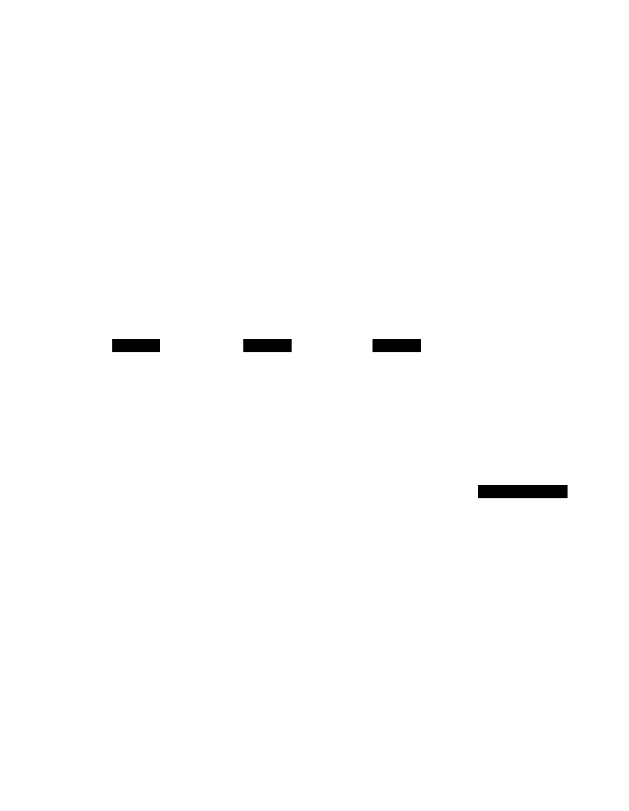

# Orchestrator-Workers

**Aliases:** dynamic decomposition, planner-executor, central orchestrator with worker LLMs, master-of-puppets pattern
**Category:** Workflows
**Sources:**
[Anthropic — Building effective agents (Dec 2024)](https://www.anthropic.com/research/building-effective-agents) ·
[Anthropic — How we built our multi-agent research system (Jun 2025)](https://www.anthropic.com/engineering/built-multi-agent-research-system) ·
[OpenAI — Agents SDK with handoffs (2025)](https://platform.openai.com/docs/) ·
production practice: research agents, large refactoring agents, multi-step planning systems

---

## Problem

> [!TIP]
> **ELI5.** [Prompt chaining](prompt-chaining.md) is a *fixed* sequence — same N steps every time. But what if the right number and shape of steps depends on the input? **Orchestrator-workers** is the dynamic version: one **orchestrator** LLM looks at the task and *decides* how to decompose it. It dispatches sub-tasks to **worker** LLMs (or sub-agents). It collects their outputs and may iterate. The orchestrator owns the *plan*; the workers own the *execution*. This is the canonical pattern for tasks where you can't pre-write the sequence — large refactors, research, complex multi-file work, anything where "what to do next" depends on what you've found so far.

Of Anthropic's [five canonical workflow patterns](https://www.anthropic.com/research/building-effective-agents), orchestrator-workers is the most *agentic* — it sits right at the boundary between fixed workflows and full agents. The orchestrator has real planning autonomy (number of workers, what each does), but the overall topology is still structured: one orchestrator, multiple workers, finite iterations.

Why this matters: many real tasks are too variable for a fixed chain but don't need full agentic autonomy. "Refactor this codebase to remove deprecated auth" has different shapes depending on the codebase — but the *structure* is consistent: a planner identifies sub-tasks, workers do the actual edits. Orchestrator-workers is the pattern that fits this shape.

By 2026, this pattern is dominant in the most-capable coding agents (Devin, Cursor agent mode, Claude Code in agent mode), research agents, and large-document processing systems. Anthropic's multi-agent research system (June 2025) is the most-documented public example.

## How it works

> [!TIP]
> **ELI5.** Orchestrator LLM gets the task and *plans*: "I'll need to do X, Y, Z." It calls worker LLMs (or sub-agents) to do each one, in parallel where possible. Workers come back with results. Orchestrator looks at the results and decides: done? more work needed? different decomposition? Loops until done. Unlike fixed chaining, the *plan emerges from the input* — nothing's hard-coded.



### The mechanics

1. **Orchestrator receives the task.** Top-level user request, fed into the orchestrator LLM with a planning-oriented system prompt.
2. **Orchestrator emits a plan.** Structured output: a list of sub-tasks with descriptions, dependencies, expected outputs.
3. **Workers execute sub-tasks.** Each worker is its own LLM call (or sub-agent). Workers run in parallel where dependencies allow.
4. **Orchestrator synthesizes.** Worker results return to the orchestrator. Orchestrator decides:
   - Compose worker outputs into final answer (done).
   - Spawn more workers (re-plan, more decomposition).
   - Retry a failed worker (with feedback).
   - Escalate or report inability.
5. **Loop or terminate.** The orchestrator's plan can iterate; cap iterations to prevent runaway.

### What makes the orchestrator different from a router

[Routing](routing.md) and orchestrator-workers both involve an LLM deciding what happens next. The differences:

| Aspect | Routing | Orchestrator-workers |
|---|---|---|
| **Number of branches** | Fixed (small enum) | Variable (decided per task) |
| **Worker count** | One per request | Many per request, dynamically |
| **Iteration** | None | Yes — orchestrator may re-plan |
| **Worker autonomy** | Branch handles end-to-end | Each worker does narrow sub-task |
| **Complexity of input** | Categorizable | Decomposable |
| **Use case** | "Which specialist handles this?" | "Break this big thing into pieces" |

A router *categorizes*; an orchestrator *plans*. Different jobs.

### Worker types

The "workers" can be a spectrum from cheap to expensive:

- **Worker = single LLM call.** Cheapest. Use for narrow tasks like "summarize this file" or "extract entities."
- **Worker = small chain.** A few LLM calls in sequence. Used when the sub-task itself has structure.
- **Worker = full sub-agent.** A tool-using agent with its own context and capabilities. Used for sub-tasks that need exploration.
- **Worker = a specialist agent type.** "Code-writer worker," "test-writer worker," "doc-writer worker" — each with specialized tools.
- **Worker = another orchestrator** (nested). For very large tasks; rare but used in deep research agents.

The choice depends on the orchestrator's plan and the sub-task. A good orchestrator picks the *cheapest* worker type that gets the job done.

### Concrete example: code refactor

User task: "Migrate this codebase from `requests` to `httpx`."

**Orchestrator step 1 (planning):**
```
Plan:
1. Find all .py files using `requests`           → worker: file_search agent
2. For each file, identify usages                → worker per file: simple LLM call
3. Group files by usage pattern                  → orchestrator-side aggregation
4. Per group, generate refactor                  → worker per group: code-writer sub-agent
5. Verify tests pass for each refactored file    → worker per file: shell-tool agent
6. Synthesize change summary                     → orchestrator-side
```

**Orchestrator step 2 (execution):**
- Dispatches steps 1, 2 to workers; collects results.
- After step 2, *may re-plan*: "Found 73 files but they cluster into 3 patterns; I only need 3 group-level workers, not 73 file-level ones."
- Dispatches workers for steps 4-5.
- Some workers fail (tests broken). Orchestrator re-spawns those workers with the failure as feedback.
- Eventually, all workers succeed; orchestrator synthesizes the final result.

This is *not* a fixed chain — the number of workers, the worker types, and the order all emerge from the task's specifics. But it's *not* a free-running agent either — the orchestrator has a structured role and bounded autonomy.

### The Anthropic multi-agent research system case study

Anthropic's [June 2025 post](https://www.anthropic.com/engineering/built-multi-agent-research-system) describes building Claude's deep-research feature using orchestrator-workers:

- One **lead agent (orchestrator)** receives the user query and plans the research.
- Multiple **research sub-agents (workers)** independently search the web for different aspects.
- The lead agent **synthesizes** their findings into a final answer.
- Workers operate with **independent context windows** — solving the [context rot](../ctx/context-rot.md) problem of long single-context research.

Headline findings from the post:
- Multi-agent (orchestrator-workers) used **~15× more tokens** than chat baseline.
- Worth it for tasks where parallel exploration genuinely helped.
- Not worth it for simple queries — they wrote a router that decides whether to engage the multi-agent system.

This is the canonical 2025-2026 reference for the pattern in production.

### Cost considerations

Orchestrator-workers is *expensive*:

- **Orchestrator LLM cost.** Strong model (Claude Opus, GPT-5, Gemini Ultra), often reasoning-mode. Each planning step costs serious tokens.
- **Worker LLM cost.** N workers × per-worker cost.
- **Re-planning cost.** Orchestrator may re-plan multiple times.
- **Synthesis cost.** Final aggregation step.

Token usage can easily be 10-20× a single-prompt approach. Use orchestrator-workers when:
- The task genuinely needs decomposition that you can't write in code.
- Quality matters more than cost.
- The result is expensive to get wrong (long-horizon tasks where redoing is painful).

For routine tasks, [prompt chaining](prompt-chaining.md) or [routing](routing.md) are dramatically cheaper.

### Engineering details that matter

- **Cap iteration depth.** Orchestrators can re-plan endlessly. Cap at N iterations.
- **Cap worker count.** Per-iteration limit on workers spawned.
- **Worker timeouts.** Each worker has a wall-clock cap.
- **Token budget.** Total token cap across orchestrator + workers prevents runaway cost.
- **Structured plan output.** Orchestrator's plan should be [structured output](../fnd/structured-outputs.md) — list of sub-tasks with metadata. Don't parse free text.
- **Worker independence.** Workers should be truly independent (no shared state) or have explicit dependency graph. Implicit dependencies cause subtle bugs.
- **Per-worker context isolation.** Each worker gets a fresh context for its sub-task. Avoids context rot.
- **Aggregation discipline.** Orchestrator should aggregate via structured input, not free-text dump of all worker outputs.
- **Observability.** Trace the full plan + per-worker execution. Essential for debugging.

### Common failure modes

- **Orchestrator hallucinates a plan.** Plan includes sub-tasks for things that don't exist or can't be done. Mitigation: orchestrator should *check* before planning (read the codebase, sample the data) — but then you're closer to a single agent. Trade-off.
- **Workers don't agree on shared concepts.** Without coordination, worker A names something `auth_v1` and worker B names it `legacy_auth`. Mitigation: shared spec / glossary as input to all workers.
- **Orchestrator re-plans pathologically.** "I need to redo this slightly differently" 8 times. Mitigation: re-plan caps + clearer success criteria.
- **Workers exceed budget.** A worker spawned with too-broad a scope eats all the tokens. Mitigation: per-worker token caps + bounded sub-task descriptions.
- **Aggregation drops detail.** Synthesis step compresses out important worker findings. Mitigation: aggregator should preserve worker outputs verbatim where they matter.

### When to use orchestrator-workers vs alternatives

- **vs fixed chain**: Use orchestrator-workers when the *number and shape* of sub-tasks varies by input. If they don't vary, just write the chain.
- **vs single agent with tools**: Use orchestrator-workers when sub-tasks are *independent* and benefit from parallelism + isolation. Use a single agent when the task is fundamentally sequential and the agent needs continuous awareness.
- **vs multi-agent orchestration**: Orchestrator-workers is *strictly hierarchical* (one boss, many workers). [Multi-agent orchestration](../agt/multi-agent-orchestration.md) is more general — peer-level coordination, complex topologies.
- **vs sectioning**: [Parallelization-sectioning](parallelization.md) has a *fixed* decomposition rule (split by paragraph, by file, etc.). Orchestrator-workers has a *decided-per-task* decomposition.

The boundaries are fuzzy in practice. Many production systems are hybrid.

## Variants & related patterns

- [**Prompt chaining**](prompt-chaining.md) — the fixed alternative.
- [**Routing**](routing.md) — single-shot dispatch vs dynamic planning.
- [**Parallelization**](parallelization.md) — sectioning is the static version of orchestrator-workers.
- [**Evaluator-optimizer**](evaluator-optimizer.md) — often runs alongside orchestrator-workers for quality control.
- [**Sub-agent architectures**](../agt/sub-agent-architectures.md) — what workers often are.
- [**Multi-agent orchestration**](../agt/multi-agent-orchestration.md) — the more-general peer pattern.
- [**Workflows vs agents**](../agt/workflows-vs-agents.md) — orchestrator-workers sits at the boundary.
- [**Coding agents**](../agt/coding-agents.md) — most use orchestrator-workers internally.
- **Saga pattern** (system design) — analogous orchestration pattern at the distributed-systems level.

## When NOT to use

- **Simple, sequential tasks.** Use prompt chaining.
- **High-volume, latency-critical paths.** Orchestrator-workers adds round-trips and cost.
- **Tasks where a single agent's continuous context is essential.** Single-agent with tools.
- **When you can write the decomposition in code.** Don't pay for an LLM orchestrator to do what a `for` loop would do.

## Implementations

| Framework | Orchestrator-workers support |
|---|---|
| **LangGraph** | First-class: orchestrator node + dynamic worker spawning |
| **OpenAI Agents SDK (2025)** | Handoffs + sub-agents support this shape |
| **Anthropic SDK** | Build with structured outputs + parallel tool execution |
| **Vercel AI SDK** | Custom; `generateObject` for plan + parallel calls for workers |
| **Mastra** | Workflow primitives include orchestrator patterns |
| **AutoGen** | Native multi-agent with manager + workers |
| **CrewAI** | "Crew" with manager and worker agents |
| **Claude Code (in agent mode)** | Implicitly uses this for complex tasks |
| **Custom** | Often the right answer — orchestrator-workers is straightforward to build |

## Companies / products built on orchestrator-workers

- **Anthropic** ✅ — multi-agent research system ([source](https://www.anthropic.com/engineering/built-multi-agent-research-system)).
- **OpenAI ChatGPT (Deep Research, Operator)** ⚠ — uses orchestrator-workers internally.
- **Google Gemini Deep Research** ⚠ — same pattern.
- **Perplexity Pro Search** ⚠ — multi-source orchestrated search.
- **Cognition (Devin)** ⚠ — orchestrator over file-level workers.
- **Cursor agent mode, Claude Code (agent mode), Replit Agent** ⚠ — multi-file work uses orchestrator-workers.
- **GitHub Copilot Workspace** ⚠ — plan-then-execute is essentially this pattern.

## Further reading

- [Building effective agents](https://www.anthropic.com/research/building-effective-agents) — Anthropic Dec 2024 (canonical pattern definition)
- [How we built our multi-agent research system](https://www.anthropic.com/engineering/built-multi-agent-research-system) — Anthropic Jun 2025 (case study + 15× token cost finding)
- [LangGraph subgraph and orchestrator docs](https://langchain-ai.github.io/langgraph/)
- [AutoGen multi-agent docs](https://microsoft.github.io/autogen/)
- [CrewAI docs](https://docs.crewai.com/)
- [The future of AI is agentic](https://huyenchip.com/2025/01/07/agents.html) — Chip Huyen

---

*Diagram source: [`../diagrams/src/orchestrator-workers.d2`](../diagrams/src/orchestrator-workers.d2)*
