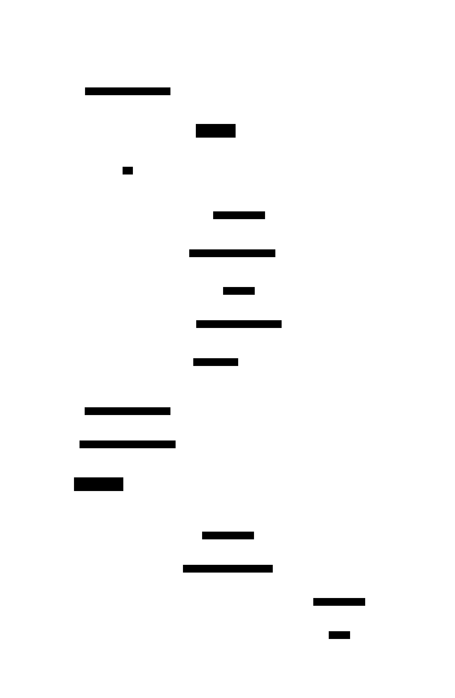

# Generation Clock

**Aliases:** Term Number (Raft), Epoch Number (Kafka), View Number (Viewstamped Replication), Ballot Number (Paxos), Fencing Token
**Category:** Building block
**Sources:**
[Joshi — Patterns of Distributed Systems](https://martinfowler.com/articles/patterns-of-distributed-systems/) ·
Kleppmann *DDIA*, Ch 8 (fencing tokens) + Ch 9 ·
[Martin Kleppmann, *How to do distributed locking* (2016)](https://martin.kleppmann.com/2016/02/08/how-to-do-distributed-locking.html)

---

## Problem

> [!TIP]
> **ELI5.** Imagine a CEO who steps out for coffee and the network briefly drops. The board, thinking she's gone, elects a new CEO. The original CEO comes back unaware, walks into the boardroom, and tries to sign a contract. How does everyone in the room know to ignore her signature? They need a sequential ID on every CEO ("you're CEO #5 — the current one is CEO #6, so your signature is invalid").

In any distributed system with **leader election**, the danger is **split-brain** or **stale-leader writes**. A leader may be temporarily unable to talk to the rest of the cluster — because of a network partition, a long GC pause, a VM migration, or just heavy load — long enough that the rest of the cluster decides it's dead and elects a new leader. When the old leader returns, it doesn't immediately know it's been deposed; it may try to keep writing as if it's still in charge.

Without a defense, this causes data corruption: the new leader and the old leader may both write conflicting values, both think they have authority, and the system has no principled way to decide which write is "correct." The cluster's safety guarantees disintegrate.

You need a way to give every leader a **provably-monotonic sequence number** — so that any operation tagged with an old number can be rejected on sight, no matter what the old leader thinks.

## How it works

> [!TIP]
> **ELI5.** Every time a new leader is elected, increment a global counter. Every message and every write the leader makes carries that counter value. Followers and storage layers track the highest counter they've seen, and reject anything with a smaller one. The old, deposed leader's writes are rejected immediately — its number is now too low.

A generation clock is a **monotonically increasing integer** that advances every time leadership changes. It goes by many names: **term** in Raft, **epoch** in Kafka, **view** in Viewstamped Replication, **ballot** in Paxos. The mechanism is the same:

1. Every node persists the highest generation number it has ever seen (`currentTerm` in Raft).
2. To become a candidate / propose, a node **increments the generation** and requests votes / proposals at that number.
3. Every RPC and every log entry carries the generation number of the issuing leader.
4. When a node receives a message at generation `g`, it compares to its own `currentTerm`:
   - If `g > currentTerm` — the sender knows of a newer term; update `currentTerm = g`, and if I was Leader/Candidate, step down to Follower.
   - If `g < currentTerm` — the sender is stale; **reject** the message.
   - If `g == currentTerm` — accept normally.

The simplicity of "reject anything older" is exactly the point — it requires no other coordination, no timeouts, no recovery dance. The stale leader is immediately and unambiguously demoted as soon as it talks to anyone who has heard about the newer term.

A worked example:

In the trace, Leader A is operating happily at **term 1**, appending entries. A crashes (or partitions). Followers detect via heartbeat timeout and hold an election; B wins and becomes Leader at **term 2** — the term has incremented. Later, A's network heals and A returns, still thinking it's the leader of term 1. A tries to send `AppendEntries(term=1, ...)`. Followers — now at term 2 — reject immediately and tell A "I'm at term 2." A sees the higher term, demotes itself to Follower, and learns the new state. Split-brain prevented; no data lost.

The same idea generalizes beyond leader election into the **fencing token** pattern for distributed locks, made famous by [Martin Kleppmann's 2016 essay](https://martin.kleppmann.com/2016/02/08/how-to-do-distributed-locking.html) critiquing Redlock:

When a client acquires a distributed lock, the lock service returns a **monotonic token** with the lease. The client passes that token in every storage write. The storage layer remembers the highest token it has accepted and **rejects writes with smaller tokens**. So even if a client's lease expires while it's in a GC pause, and a new client acquires the lock and gets a higher token, the old client's belated write — carrying its now-stale token — is rejected by storage. The lock service alone can't prevent stale-client writes (because the stale client doesn't know it's stale), but the token-checking storage layer can.

The two ideas — Raft's term and the fencing token — are the same pattern expressed at different layers: a monotonic integer attached to every action by a leader/lease-holder, and rejection by any participant who has seen a higher value.

A practical subtlety: the generation number must be **persisted to stable storage** before being used. If a node increments its term to 5, votes for a candidate at term 5, then crashes and forgets, on recovery it might vote *again* for a different candidate at term 5 — violating election safety. Raft is specific that `currentTerm` and `votedFor` must be on disk before any RPC is sent.

---

## Variants & related patterns

| Variant | Name in each system |
|---|---|
| **Term** | Raft |
| **Epoch** | Apache Kafka (leader epoch), Apache BookKeeper |
| **View** | Viewstamped Replication, PBFT |
| **Ballot Number** | Paxos |
| **Lease + fencing token** | ZooKeeper sessions, Chubby leases, Redis distributed locks (when done right) |
| **Generation Number** | Cassandra (per-node generation), DynamoDB, Bigtable tablet leases |
| **Server ID + Sequence** | DynamoDB's stream sequence numbers, MongoDB's `optime` |

## When NOT to use

- **Pure leaderless systems** — Dynamo-style read/write quorum doesn't have a "leader" to protect against. Conflict resolution is done via vector clocks instead.
- **Within a single trusted node** — a process talking to its own thread doesn't need fencing tokens.
- **For ordering operations that have nothing to do with leadership** — use Lamport / vector clocks for general happens-before, not generation clocks.

But: **almost every other case where a "leader" exists needs a generation clock**. If you're building one and don't have one, you have a split-brain bug waiting to fire.

---

## Real-world implementations

| System | What the generation clock is |
|---|---|
| **Raft (etcd, Consul, TiKV, CockroachDB, all derivatives)** | `currentTerm` |
| **Apache Kafka** | `leaderEpoch` — every partition tracks the epoch of its current leader; followers refuse to truncate based on stale leader's high water mark |
| **Apache ZooKeeper** | Session zxid + epoch; ZAB's epoch number |
| **Google Chubby** | Lease sequence number |
| **HDFS NameNode HA** | Epoch number for active NameNode, persisted in QJM (Quorum Journal Manager) |
| **etcd v3 lease** | Lease ID + revision |
| **MongoDB** | `term` field on operations + `optime` |
| **Distributed locks done correctly (Curator, ZK recipes)** | Sequential ZNode names give monotonic tokens |

## Canonical references / uses

| Where | Citation | Status |
|---|---|---|
| **Raft term** | Ongaro & Ousterhout, *In Search of an Understandable Consensus Algorithm* (2014), §5.1 | ✅ [PDF](https://raft.github.io/raft.pdf) |
| **Kafka leader epoch** | KIP-101, *Alter Replication Protocol to use Leader Epoch rather than High Watermark for Truncation* | ✅ [KIP-101](https://cwiki.apache.org/confluence/display/KAFKA/KIP-101+-+Alter+Replication+Protocol+to+use+Leader+Epoch+rather+than+High+Watermark+for+Truncation) |
| **Fencing token argument for distributed locks** | Kleppmann, *How to do distributed locking* (2016) — the famous critique of Redlock | ✅ [martin.kleppmann.com](https://martin.kleppmann.com/2016/02/08/how-to-do-distributed-locking.html) |
| **Chubby leases** | Burrows, *The Chubby lock service for loosely-coupled distributed systems* (OSDI 2006) | ✅ [Google Research](https://research.google/pubs/pub27897/) |
| **HDFS HA epoch** | HDFS-3077 (Quorum Journal Manager design doc) | ✅ Apache JIRA |

---

## Further reading

- Martin Kleppmann, *How to do distributed locking* (2016) — the most accessible introduction to the fencing-token idea and why most homegrown distributed locks are broken without it.
- Kleppmann, *Designing Data-Intensive Applications*, Ch 8 (fencing tokens) + Ch 9 (terms in consensus).
- Joshi, *Patterns of Distributed Systems*, "Generation Clock" pattern.
- *Raft Refloated: Do We Have Consensus?* (Howard et al., 2015) — a careful re-derivation of Raft showing where the term number is structurally necessary.
- The Kafka KIP-101 design doc — surprisingly readable; explains why HWM-based truncation was unsafe and how leader-epoch fixed it.

---

*Diagram sources: [`../diagrams/src/generation-clock-terms.d2`](../diagrams/src/generation-clock-terms.d2), [`../diagrams/src/generation-clock-fencing.d2`](../diagrams/src/generation-clock-fencing.d2).*
