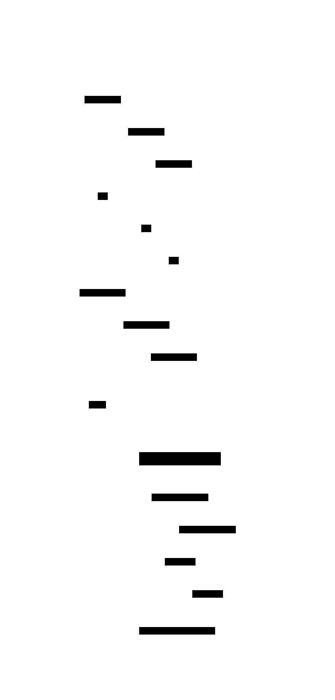
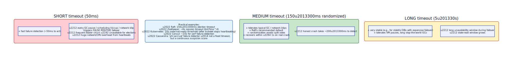

# Heartbeat

**Aliases:** Keep-Alive, Liveness Ping, Health Check (closely related), Phi Accrual Failure Detector (probabilistic variant)
**Category:** Building block
**Sources:**
[Joshi — Patterns of Distributed Systems](https://martinfowler.com/articles/patterns-of-distributed-systems/) ·
Kleppmann *DDIA*, Ch 8 (Unreliable Networks) ·
[Hayashibara et al., *The φ Accrual Failure Detector* (SRDS 2004)](https://www.computer.org/csdl/proceedings-article/srds/2004/22390066/12OmNvT2phv)

---

## Problem

> [!TIP]
> **ELI5.** Three friends are on a phone call. To know everyone's still there, they periodically say "I'm still here." If you stop hearing from one of them, you wait a bit (maybe they had a coughing fit) — and then assume they hung up. The hard question: **how long do you wait** before assuming they're gone? Too short → false alarms. Too long → slow to react.

In a distributed system, you need to know which nodes are alive. The naive approach — wait for a node to fail loudly — doesn't work; failure usually isn't graceful. A node might **crash** (process dies, kernel panics), be **partitioned** (network unreachable), be **stalled** (long GC pause, swapping, paused VM), or be **slow** (overloaded). From the outside, these often look identical: messages stop arriving. And from the node's own perspective, it may not know anything is wrong.

The fundamental observation, due to the FLP impossibility result and the broader theory of asynchronous systems: **you cannot distinguish a slow node from a dead node**, ever, with certainty. All you can do is choose a **timeout** and decide that beyond it, you're going to treat the node as failed and move on — accepting the risk of being wrong.

Heartbeat is the pattern that makes this decision: **continuous low-cost messages confirming "I'm alive," and a timeout that triggers failure handling when they stop**.

## How it works

> [!TIP]
> **ELI5.** Every X milliseconds, the leader sends a tiny "still here" message to each follower. If a follower doesn't hear from the leader for Y milliseconds (where Y > X), it assumes the leader has died and starts an election. Tune X and Y based on how chatty you can afford to be and how patient you can be.

A heartbeat is a small, periodic message sent from one node to another (or in a mesh) to signal liveness. The pattern has three configurable parts:

- **Interval** — how often heartbeats are sent (e.g., every 50ms).
- **Timeout** — how long without a heartbeat before declaring the sender failed (e.g., 150–300ms).
- **Action on timeout** — what to do: elect a new leader, mark the node unhealthy, reassign its work, alert an operator.

In normal operation (top of the diagram), the leader sends heartbeats every 50ms. Followers ack (or in Raft's case, the heartbeat is a one-way `AppendEntries` with no entries — ack-less is also valid). The system hums along.

At `t=100ms` the leader crashes. The followers continue to *expect* heartbeats but don't receive any. Once each follower's **election timeout** (typically 150–300ms randomized) elapses without a heartbeat, the follower becomes a **Candidate**, increments its term ([generation clock](generation-clock.md)), and requests votes from peers. The first candidate to win majority becomes the new leader, and normal operation resumes — typically within ~300ms of the original crash.

The randomization on the timeout is important. If all followers used the same timeout, they'd all become candidates at the same instant, split their votes, and have to retry — causing repeated election failures. Randomizing within a window (Raft uses 150–300ms uniformly) means one node almost always times out first and wins cleanly.

The trickiest part of heartbeating is **choosing the timeout**. This is fundamentally a trade-off:

**Short timeouts** (50ms) detect real crashes fast — but they're also triggered by every garbage-collection pause, scheduling hiccup, or network blip. False positives cause leader churn: the system spends its time re-electing leaders instead of doing work. They also create huge network/CPU overhead from the heartbeats themselves.

**Medium timeouts** (150–300ms randomized, Raft's recommendation) are the sweet spot for most low-latency systems. They tolerate normal GC pauses and brief network blips while still recovering from real failures within about a second.

**Long timeouts** (5–30s) are appropriate for systems where the cost of failover is high (stateful databases, replicated logs with large state), or where pauses are common and benign (JVM stop-the-world GC, VM migration). The cost is a longer unavailability window during real failures.

Production values vary widely by system: ZooKeeper sessions default around 6 seconds (4× tickTime). Kubernetes considers a node not-ready after 10 seconds of missing kubelet heartbeats. Cassandra uses a **phi accrual failure detector** instead of a fixed timeout — a continuous *suspicion score* computed from the statistical distribution of recent heartbeat arrival times, which adapts to local network conditions rather than using a brittle hard threshold.

Heartbeat shows up in many guises in production systems. **Raft leader → followers**: the AppendEntries RPC doubles as heartbeat. **ZooKeeper sessions**: clients send pings to maintain ephemeral nodes. **Kubernetes kubelet → API server**: node status updates serve as heartbeats. **Service discovery (Consul, Eureka)**: services heartbeat to the registry. **Load balancers**: TCP/HTTP health checks are pulled rather than pushed heartbeats but accomplish the same end. **Gossip protocols (SWIM, Serf, Memberlist)**: every node heartbeats to a few peers, who propagate liveness gossip through the cluster — scales to thousands of nodes without O(N²) traffic.

A subtle and important refinement: **rapid failure detection is a separate concern from rapid failover**. A short heartbeat timeout makes you *notice* a failure quickly, but you still have to act on it — elect a new leader, redistribute work, drain connections. Some systems (TigerBeetle, FoundationDB) use very fast heartbeats internally but smooth the failover decision to avoid flapping.

---

## Variants & related patterns

| Variant | Difference |
|---|---|
| **Pull heartbeat / Health Check** | Monitor pulls a status endpoint instead of node pushing. Kubernetes liveness/readiness probes, load-balancer health checks. |
| **Push heartbeat** | Node actively reports its status. Service-discovery registrations, Raft AppendEntries. |
| **Phi Accrual Failure Detector** | Replace fixed timeout with continuous suspicion score; adapts to network conditions. Cassandra, Akka. |
| **Lease + heartbeat** | Heartbeats renew time-bounded leases; lease holder loses lease automatically if heartbeats stop. ZooKeeper sessions, Chubby. |
| **SWIM gossip** | Decentralized — each node pings a few peers; failure suspicion gossiped. Scales to thousands of nodes. |
| **AppendEntries-as-heartbeat (Raft)** | Empty replication RPC doubles as heartbeat — no separate protocol. |

## When NOT to use

- **For single-machine processes** — OS process supervision is sufficient.
- **For very small clusters (≤3 nodes)** — direct, fast-failing TCP connections may be enough; the heartbeat protocol overhead isn't worth it.
- **When you have a better signal** — if every operation is acked or fails fast, you don't need a separate liveness ping.
- **As a substitute for proper [fencing tokens](generation-clock.md)** — heartbeats can be misleading (stalled, not dead); always pair with generation clocks for any write that needs to be safely fenced after suspected failure.

---

## Real-world implementations

| System | Heartbeat mechanism |
|---|---|
| **Raft (etcd, Consul, TiKV)** | Empty AppendEntries every 50–150ms |
| **Apache Kafka** | Replica fetchers continuously fetch; controller heartbeats to brokers |
| **Apache ZooKeeper** | Client → server pings; servers exchange via ZAB |
| **Apache Cassandra** | Gossip protocol with phi accrual failure detector |
| **HashiCorp Consul / Serf** | SWIM-based gossip with periodic probes and indirect probes |
| **Kubernetes** | kubelet → API server node status; liveness/readiness HTTP probes |
| **Akka Cluster** | Phi accrual detector + gossip |
| **AWS ELB / GCP LB / Azure LB** | Pulled HTTP/TCP/gRPC health checks |
| **Redis Sentinel** | Periodic PING; failover after `down-after-milliseconds` |
| **MySQL Group Replication** | Group communication system (XCom) heartbeats |

## Companies / canonical uses

| Where | Use | Status |
|---|---|---|
| **Google** | SRE Book, *Distributed Systems Monitoring*, discusses heartbeat / health-check practice at depth. | ✅ Verified — [SRE Book Ch 6](https://sre.google/sre-book/monitoring-distributed-systems/) |
| **Netflix** | Eureka (service discovery) uses heartbeats; SimianArmy / Chaos Monkey tests heartbeat behavior under failure. | ✅ Verified — [Eureka wiki](https://github.com/Netflix/eureka/wiki) |
| **HashiCorp customers (Consul)** | Serf's SWIM-based gossip protocol underpins Consul deployments at every scale. | ✅ Verified — [Serf docs](https://www.serf.io/docs/internals/gossip.html) |
| **Every Kubernetes cluster** | Node-NotReady detection is heartbeat-driven (kubelet → API server). | ✅ Verified — Kubernetes docs |
| **Cassandra users (Apple, Netflix, Instagram historically)** | Phi accrual heartbeating between every gossip-connected node. | ✅ Verified — [Cassandra architecture docs](https://cassandra.apache.org/doc/latest/architecture/dynamo.html#failure-detection) |

---

## Further reading

- Hayashibara, Défago, Yared, Katayama, *The φ Accrual Failure Detector* (SRDS 2004) — the canonical paper on adaptive failure detection.
- Kleppmann, *Designing Data-Intensive Applications*, Ch 8 (Unreliable Networks) — excellent on the philosophical limits of failure detection.
- Joshi, *Patterns of Distributed Systems*, "HeartBeat" pattern.
- Das, Gupta, Motivala, *SWIM: Scalable Weakly-consistent Infection-style Process Group Membership Protocol* (2002) — the protocol behind Consul, Memberlist, Hashicorp's Serf.
- Google SRE Book, Ch 6 — practical heartbeat / health check setup for production.

---

*Diagram sources: [`../diagrams/src/heartbeat-flow.d2`](../diagrams/src/heartbeat-flow.d2), [`../diagrams/src/heartbeat-timeout-tradeoff.d2`](../diagrams/src/heartbeat-timeout-tradeoff.d2).*
