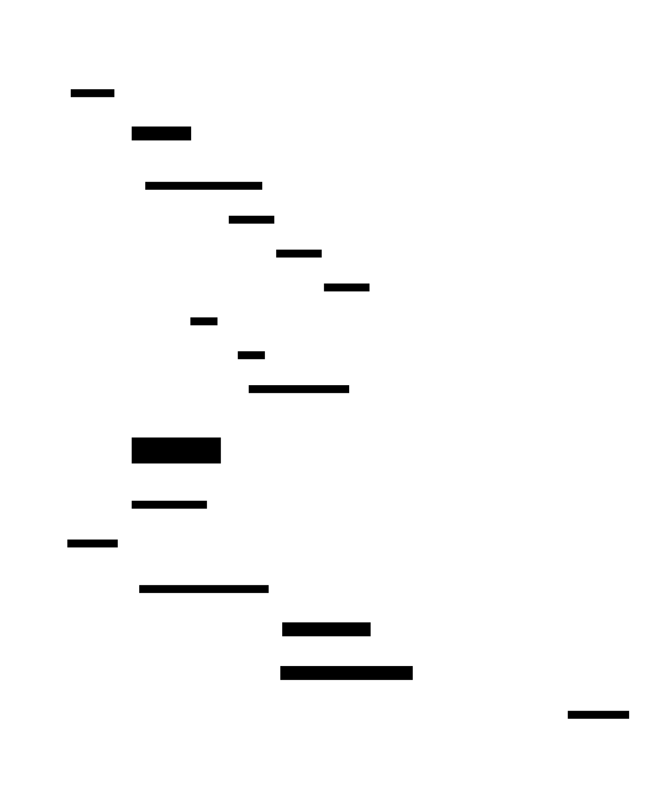

# High-Water Mark & Low-Water Mark

**Aliases:** Commit Index (Raft), Last Applied Offset (Kafka — leader-epoch-aware), Stable Offset, Last Committed Position; Truncation Point, Trim Horizon (Kinesis), Snapshot Index (Raft)
**Category:** Building block (replicated logs)
**Sources:**
[Joshi — Patterns of Distributed Systems](https://martinfowler.com/articles/patterns-of-distributed-systems/) ·
Kleppmann *DDIA*, Ch 5 + Ch 9 ·
Raft paper §5.3, §5.4

---

## Problem

> [!TIP]
> **ELI5.** A team is taking shared meeting notes in real time. Some lines are still being typed and might get edited (don't quote them yet). Older lines have been approved by everyone (safe to share). Very old lines have been backed up and the team archive can be cleared. They need two markers: **"what's safe to share?"** and **"what's safe to delete?"**

A [replicated log](../data/replicated-log.md) grows continuously. Two distinct questions arise that need crisp answers:

1. **How far up the log is it safe to consider entries `committed`** — meaning, durable enough that we can apply them to the state machine and tell the client "your write succeeded"? Entries above this mark are still in flight; a leader change could overwrite them. We must not return them to clients as if they were durable. Without an unambiguous marker, replicas might return uncommitted writes to clients (data appears to commit and then vanishes) or fail to apply committed writes (clients told "rejected" when actually it succeeded).

2. **How far back can we safely delete old log entries** to reclaim disk and bound recovery time? Once entries have been snapshotted into the state machine and the snapshot is durable, the log entries themselves are redundant — keeping them forever wastes disk; truncating them too eagerly breaks lagging followers that haven't caught up yet.

A single index can't answer both. We need two: the **High-Water Mark** (highest position safely committed) and the **Low-Water Mark** (lowest position still required by the log).

## How it works

> [!TIP]
> **ELI5.** Picture the log as a long ribbon. Draw a line at the position above which entries are still wobbly ("not committed yet"). That's the **High-Water Mark** — entries ≤ this line are settled and safe. Draw a second line near the start, below which everything has been snapshotted and the originals can be trashed. That's the **Low-Water Mark**. The active region in between is what every replica must retain in detail.

The diagram shows a leader's view of its log. **Entries below the Low-Water Mark (LWM = 4)** have been captured in a snapshot and can be deleted from every replica — they're redundant on disk. **Entries between LWM and HWM (5, 6, 7)** are committed: they've been replicated to a majority, are durable, have been (or are being) applied to the state machine, and have been ack'd to clients. **Entries above HWM (8, 9)** have been written to the leader's log and replicated to some followers, but a majority hasn't yet confirmed — they're not yet committed and could still be overwritten by a future leader. Clients have *not* been told they succeeded.

### How HWM advances

The **High-Water Mark** advances by majority quorum. The leader tracks, for every follower, the highest log index it has acknowledged (`matchIndex[]`). When a majority of follower match-indexes (counting the leader's own log) reaches some new index N, the leader **advances the HWM to N**, applies entry N to its state machine, and acks the client:

In the trace, the client sends a write. The leader appends at index 11 and replicates to all 4 followers. As soon as 3 followers ack (3 acks + the leader's own write = majority of 5), the leader can compute: sort the `matchIndex` array `[10, 10, 11, 11, 11]`, take the median position — that's the highest index a majority has reached — 11. The leader sets HWM = 11, applies the entry, returns "200 OK" to the client. The next heartbeat carries the updated HWM to all followers, who then apply the entry to their own state machines.

Critically: **the leader must only commit entries from its own term** (Raft §5.4). It would be unsafe to count "a majority has this entry" for an entry left over from a previous leader's term — there's a subtle scenario where a stale entry from term N can be replicated to a majority but then overwritten by a leader of term N+2. Raft's fix: a new leader can only mark older entries committed *transitively* by committing an entry from its own term that comes after them. Production implementations get this wrong all the time; the Raft paper is explicit about it.

### How LWM advances

The **Low-Water Mark** advances by snapshotting. Periodically, the state machine takes a snapshot of its full state — captured at some specific log index, call it `S`. Once the snapshot is durably written, every log entry with index ≤ S is redundant: in a recovery scenario, you load the snapshot and replay only the tail of the log starting at `S+1`. So the system can advance `LWM = S` and **truncate the log below the LWM**, reclaiming disk.

The complication is lagging followers. If a follower is behind — say at index 3, while the leader's LWM is 4 — the follower can no longer catch up by streaming log entries (they've been deleted). The leader must instead ship the **snapshot itself** to the lagging follower (Raft's `InstallSnapshot` RPC, ZAB's snapshot transfer, Kafka's offset-too-small recovery). After receiving and installing the snapshot, the follower resumes log streaming from `LWM + 1`.

In real systems these marks appear under various names. **Raft**: `commitIndex` is the HWM; `lastIncludedIndex` of the latest snapshot is the LWM. **Apache Kafka**: HWM is literally called the "high water mark" and bounds what consumers can read; the analogue of LWM is the **log start offset**, advanced by retention or compaction. **Apache BookKeeper**: the LAC (Last Add Confirmed) is the HWM; LAP (Last Add Pushed) is the leader's local write head. **Apache Cassandra commitlog**: per-replica positions plus a global snapshot horizon serve the same purpose.

### Why two marks, not one

It's tempting to combine them — "the safe-to-commit and safe-to-delete index" — but they advance for different reasons:

- HWM advances on **majority replication** (every committed entry).
- LWM advances on **snapshot completion** (much less often — typically every N minutes or N MB of state).

If you tied them together, you'd either snapshot too often (HWM rate of advancement = once per write — far too expensive to snapshot every write), or you'd delay commits until the next snapshot (catastrophic latency). Keeping them independent lets the system commit fast (per-write) and reclaim disk lazily (per-snapshot).

A subtle production pitfall: HWM-based truncation across leader changes was the source of a famous bug in early Apache Kafka. KIP-101 (the "Leader Epoch" KIP, 2017) replaced naive HWM-based truncation with leader-epoch-aware truncation, because a follower could otherwise lose entries that had been validly committed under a previous leader. The HWM is correct *within a term*; across terms, you need the [generation clock](../block/generation-clock.md) to disambiguate. The two patterns are deeply intertwined.

---

## Variants & related patterns

| Variant | Difference |
|---|---|
| **Commit Index (Raft)** | The standard HWM concept in Raft. |
| **Log Start Offset / Trim Horizon (Kafka, Kinesis)** | LWM equivalent — oldest available offset. |
| **LAC / LAP (BookKeeper)** | Last Add Confirmed = HWM; Last Add Pushed = leader's local write head. |
| **Last Stable Offset (Kafka transactions)** | Variant of HWM for transactional reads — highest offset where all preceding transactions have committed/aborted. |
| **Read Index (Raft optimization)** | Used to serve linearizable reads without writing to log — relies on knowing HWM is up to date. |
| **Snapshot + Log truncation** | The mechanism by which LWM advances. |
| **Leader Epoch (Kafka)** | Generation-clock variant that disambiguates HWM across leader changes (KIP-101). |

## When NOT to use

- **Single-node systems** — no replication, no truncation question, just a WAL position.
- **Append-only logs that are never truncated** — only HWM matters; no LWM needed (some audit-log designs).
- **Leaderless / Dynamo-style systems** — they use vector clocks and read-repair instead of a single committed-prefix concept.

---

## Real-world implementations

| System | HWM | LWM |
|---|---|---|
| **Raft (etcd, Consul, TiKV)** | `commitIndex` | `snapshot.lastIncludedIndex` |
| **Apache Kafka** | High Water Mark (HWM); Last Stable Offset for transactional reads | Log Start Offset (retention/compaction-driven) |
| **Apache BookKeeper / Pulsar** | LAC (Last Add Confirmed) | Ledger trim point |
| **AWS Kinesis** | n/a (no leader) | Trim Horizon |
| **CockroachDB, TiKV** | Raft commitIndex per range | Raft snapshot truncation |
| **MongoDB replica set** | majority-committed `optime` | Oplog truncation horizon |
| **Cassandra commitlog** | per-replica position | Snapshot horizon (sstable flushing) |
| **HDFS QJM (HA NameNode)** | committed edit log txid | finalized edit log segments |

## Companies / canonical uses

| Citation | Status |
|---|---|
| Raft paper §5.3, §5.4 — formal definition of `commitIndex` and snapshot truncation | ✅ [PDF](https://raft.github.io/raft.pdf) |
| Kafka KIP-101, *Leader Epoch* — fixes naive HWM-based truncation | ✅ [KIP-101](https://cwiki.apache.org/confluence/display/KAFKA/KIP-101+-+Alter+Replication+Protocol+to+use+Leader+Epoch+rather+than+High+Watermark+for+Truncation) |
| Jay Kreps, *The Log* (2013) — discusses HWM/LWM-equivalents in Kafka | ✅ [LinkedIn Engineering](https://engineering.linkedin.com/distributed-systems/log-what-every-software-engineer-should-know-about-real-time-datas-unifying) |
| Joshi, *Patterns of Distributed Systems*, "High-Water Mark" + "Low-Water Mark" | ✅ [martinfowler.com](https://martinfowler.com/articles/patterns-of-distributed-systems/) |
| Spanner OSDI 2012 paper — TrueTime-bounded commit + GC horizon for MVCC | ✅ [Google Research](https://research.google/pubs/pub39966/) |

---

## Further reading

- Diego Ongaro & John Ousterhout, *In Search of an Understandable Consensus Algorithm* (2014) — §5.3 (log replication / commit) and §5.4 (election restriction).
- Kafka KIP-101 — the canonical case study of "what goes wrong when HWM truncation is naively done across leader changes."
- Kleppmann, *Designing Data-Intensive Applications*, Ch 9 — log-based replication and the role of the commit-index.
- Joshi, *Patterns of Distributed Systems* — separate pattern entries for "High-Water Mark" and "Low-Water Mark."
- Diego Ongaro's PhD thesis — Ch 5 covers snapshots and log compaction (the LWM machinery).

---

*Diagram sources: [`../diagrams/src/hwm-lwm-overview.d2`](../diagrams/src/hwm-lwm-overview.d2), [`../diagrams/src/hwm-advancement.d2`](../diagrams/src/hwm-advancement.d2).*
