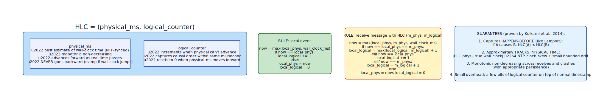
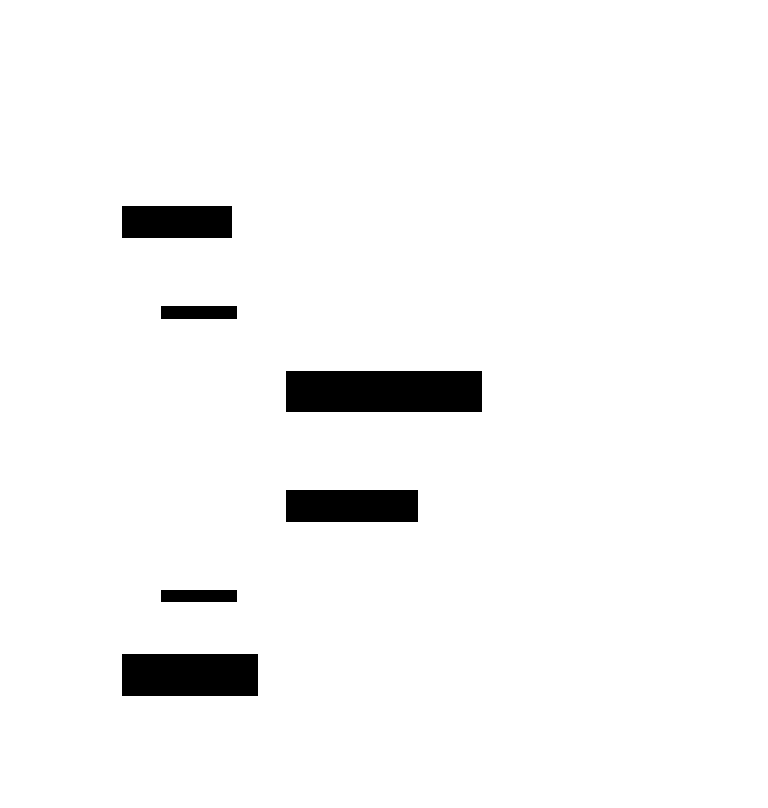

# Hybrid Logical Clock (HLC)

**Aliases:** HLC, Logical-Physical Clock
**Category:** Building block
**Sources:**
[Joshi — Patterns of Distributed Systems](https://martinfowler.com/articles/patterns-of-distributed-systems/) ·
Kleppmann *DDIA*, Ch 8 (clocks) ·
[Kulkarni, Demirbas, Madappa, Avva, Leone, *Logical Physical Clocks and Consistent Snapshots in Globally Distributed Databases* (OPODIS 2014)](https://cse.buffalo.edu/tech-reports/2014-04.pdf)

---

## Problem

> [!TIP]
> **ELI5.** [Lamport clocks](lamport-clock.md) give correct causal ordering but the numbers have no relation to actual time — `T=42` could mean "yesterday" or "last year." Physical (wall-clock) timestamps look meaningful but can lie: NTP can step backward, machines disagree, leap seconds happen. You want **both**: timestamps that match real time *and* preserve causal order — without the cost of Google's TrueTime hardware.

Distributed databases need timestamps for two purposes that pull in opposite directions:

- **Causal ordering**: if write A causes write B (e.g., reads B after committing A), B's timestamp must be greater than A's. This is what [Lamport clocks](lamport-clock.md) and [vector clocks](vector-clock.md) provide — but Lamport timestamps bear no relation to wall time, and vector clocks grow with cluster size.
- **Real-time correspondence**: timestamps should match wall time, so they're meaningful for humans ("show me records from yesterday"), for TTL calculations, for log correlation, and for users' intuition about freshness.

Pure wall-clock time doesn't give the causal-ordering guarantee. Two machines whose clocks differ by 10ms can produce timestamps that contradict causality: machine A commits at 1000ms, sends a message to machine B, B's wall clock reads 990ms (10ms behind), B's "later" event gets timestamp 990ms — *earlier* than the cause. Naive systems that use `NOW()` as a transaction timestamp suffer real production bugs from this.

Google's **Spanner** solved this with **TrueTime** — a custom hardware infrastructure (GPS receivers + atomic clocks in every datacenter) that provides bounded-uncertainty wall time, allowing the system to *wait out* clock uncertainty during commits. It works, but it requires very expensive infrastructure investment.

The **Hybrid Logical Clock** is the practical alternative: get most of the benefits of TrueTime, with no special hardware — just normal NTP synchronization plus a small logical counter.

## How it works

> [!TIP]
> **ELI5.** Store a timestamp as a pair: **(milliseconds, counter)**. The milliseconds track real time (close to wall clock). The counter handles ties (multiple events in the same millisecond) and ensures causal order even when clocks disagree by a few ms. Compare lexicographically. The counter resets when real time advances.

An HLC timestamp is a pair `(phys, logical)`:
- **`phys`** is the best estimate of real time in milliseconds — derived from the wall clock but constrained to be monotonically non-decreasing.
- **`logical`** is a small integer counter that increments to break ties and preserve causal order within the same `phys` millisecond.



The update rules look complex but are mechanical:

**On a local event** (or new write):
```
now = max(local_phys, wall_clock_ms)
if now == local_phys:
    local_logical += 1
else:
    local_phys = now
    local_logical = 0
```

If the wall clock has advanced past our last-seen `phys`, we adopt it and reset the counter. If not (wall clock is the same or behind), we keep `phys` and just bump the counter. This guarantees `phys` is monotonic non-decreasing — it never goes backward, even if the wall clock does.

**On receiving a message** with HLC `(m_phys, m_logical)`:
```
now = max(local_phys, m_phys, wall_clock_ms)
[update logical based on which value moved forward]
```

The receiving HLC takes the max of three things: its own previous `phys`, the sender's `phys`, and current wall clock. This is the Lamport-style "max + increment" generalized to include physical time.

A worked trace:



Node A starts with wall=1000ms and emits HLC=(1000, 1). It sends this to Node B, whose wall clock reads 997ms — *behind* A by 3ms. B receives, computes `max(997, 1000) = 1000`, and uses 1000 as its `phys`, incrementing logical to 2. HLC_B = (1000, 2). Even though B's wall clock is behind, B's HLC correctly orders *after* A's.

When B does a local event a bit later (wall=998), it computes `max(1000, 998) = 1000` — `phys` stays at 1000, logical bumps to 3.

When B sends to A (wall=1002), A's wall has advanced past 1000, so A adopts 1002 as the new `phys`, resetting logical to 0. HLC_A = (1002, 0).

The whole sequence: `(1000,1) < (1000,2) < (1000,3) < (1002,0)`. Causality preserved, timestamps stay within ~2ms of the actual wall clock.

### Why this matters in practice

HLCs give a distributed database three things that pure wall-clock timestamps can't:

1. **Consistent snapshots**: a read at HLC `t` returns the same data across all replicas, even when their wall clocks disagree by milliseconds. CockroachDB and YugabyteDB use this for serializable distributed transactions.
2. **MVCC ordering across nodes**: when [MVCC](../data/mvcc.md) versions are tagged with HLCs, replicas independently agree on which version supersedes which.
3. **Approximately-meaningful timestamps**: `WHERE ts >= NOW() - INTERVAL '1 hour'` works as expected because HLC.phys tracks wall time. Whereas with pure Lamport, you'd have no way to convert "1 hour ago" to a timestamp comparison.

CockroachDB's serializable distributed transactions use HLC as the timestamp domain. MongoDB uses HLCs (Operation Time = oplog timestamp + Lamport-like increment) for replica-set consistency. YugabyteDB uses HLCs for distributed snapshots. The pattern has become standard in NewSQL.

### Trade-offs vs alternatives

**HLC vs Lamport clocks**: HLC adds physical time correspondence — Lamport is purely logical. Cost: a few extra bytes per timestamp.

**HLC vs TrueTime**: HLC doesn't need atomic clocks. But TrueTime gives **bounded uncertainty** that HLC can't — Spanner can wait out the uncertainty window during commits to provide *external consistency* (linearizability across the entire planet). HLC alone provides causal consistency but not externally-observable linearizability without additional machinery.

**HLC vs vector clocks**: Vector clocks can detect concurrency (HLC and Lamport can't). But vector clocks grow with the number of writers; HLC is constant size.

**HLC vs pure wall clock**: HLC handles clock skew gracefully; pure wall clock breaks under it.

### Production gotchas

The big practical concern is **drift between HLC.phys and actual wall time**. If a node's clock jumps backward (NTP correction, VM migration), `phys` doesn't go backward — but it also can't move forward, so the logical counter grows. If left unchecked, you can get into a state where `phys` is, say, 5 minutes ahead of true wall time, and the system effectively "ignores" wall time until reality catches up.

The standard fix: **bound the gap**. If `local_phys − wall_clock > MAX_OFFSET` (e.g., 250ms), throw an error. The system refuses to operate until clocks are healthier. CockroachDB calls this `--max-offset` and treats it as a critical operational parameter.

Also: HLCs must be **persisted** before being committed. If a node crashes and recovers, it must restore its last-issued `phys`/`logical` to avoid issuing duplicate or non-monotonic timestamps. Same principle as Raft's `currentTerm` persistence.

---

## Variants & related patterns

| Variant | Difference |
|---|---|
| **Pure Lamport Clock** | Just a scalar counter; no physical-time correspondence. Smallest. |
| **Vector Clock** | Detects concurrency; grows with cluster size. |
| **TrueTime (Google)** | Hardware-bounded wall time; enables linearizable global transactions without HLC's bounded-staleness limit. |
| **Bounded HLC** | Adds max-offset checks; refuses to operate if clocks too far apart. CockroachDB default. |
| **HLC with version vector tail** | Add a small per-key vector for finer-grained concurrency detection. |
| **Plain wall clock** | What you should *not* use for ordering — see Sandeep Kulkarni's paper for why. |

## When NOT to use

- **No need for causal ordering** — use a plain wall-clock timestamp.
- **Single-leader system without cross-node coordination** — the leader's local counter is enough.
- **Need to detect concurrent (unrelated) updates** — use vector clocks.
- **Need linearizability with strong external-consistency guarantees** — HLC isn't sufficient; you need TrueTime or pessimistic locks across replicas.

---

## Real-world implementations

| System | HLC usage |
|---|---|
| **CockroachDB** | HLC is the universal timestamp domain; combines with optimistic transactions for serializable. |
| **YugabyteDB** | HLC for distributed snapshots and serializable transactions. |
| **MongoDB** | Operation Time (oplog timestamp + increment) — HLC-equivalent for replica set consistency since 3.6. |
| **Apache Cassandra** | Writetime is wall-clock based; HLC-style logic added in some forks (ScyllaDB Lightweight Transactions). |
| **TiKV** | Uses TSO (Timestamp Oracle, a single source) instead — sidesteps the clock problem differently. |
| **FaunaDB** | HLC variant for transactional snapshots. |
| **CockroachDB-derived systems and many newer KV stores** | HLC has become the default for NewSQL where TrueTime hardware isn't available. |

## Companies / canonical uses

| Where | Use | Status |
|---|---|---|
| **Cockroach Labs and customers (Shopify, Bose, DoorDash)** | Production HLC across the entire system. | ✅ Verified — [CockroachDB clock docs](https://www.cockroachlabs.com/docs/stable/architecture/transaction-layer#time-and-hybrid-logical-clocks) |
| **MongoDB Inc. and customers** | All replica sets and sharded clusters use Operation Time (HLC variant). | ✅ Verified — [MongoDB causal consistency docs](https://www.mongodb.com/docs/manual/core/causal-consistency-read-write-concerns/) |
| **Yugabyte and customers** | HLC for distributed YSQL transactions. | ✅ Verified — [YugabyteDB docs](https://docs.yugabyte.com/preview/architecture/transactions/distributed-txns/) |
| **Sandeep Kulkarni's group at SUNY Buffalo** | Originated the HLC paper (2014); continued refinement. | ✅ Verified — author webpage |

---

## Further reading

- Kulkarni, Demirbas, Madappa, Avva, Leone, *Logical Physical Clocks and Consistent Snapshots in Globally Distributed Databases* (OPODIS 2014) — the foundational paper. [PDF](https://cse.buffalo.edu/tech-reports/2014-04.pdf).
- Corbett et al., *Spanner: Google's Globally-Distributed Database* (OSDI 2012) — the TrueTime alternative HLC was designed to approximate.
- Kleppmann, *Designing Data-Intensive Applications*, Ch 8 — clocks, ordering, and the philosophy of distributed time.
- Joshi, *Patterns of Distributed Systems*, "Hybrid Clock" pattern.
- CockroachDB's "transaction layer" architecture page — concrete production explanation of HLC use.
- Murat Demirbas's blog (one of the HLC paper's authors) — many follow-up posts on HLC variants and lessons.

---

*Diagram sources: [`../diagrams/src/hlc-rules.d2`](../diagrams/src/hlc-rules.d2), [`../diagrams/src/hlc-flow.d2`](../diagrams/src/hlc-flow.d2).*
