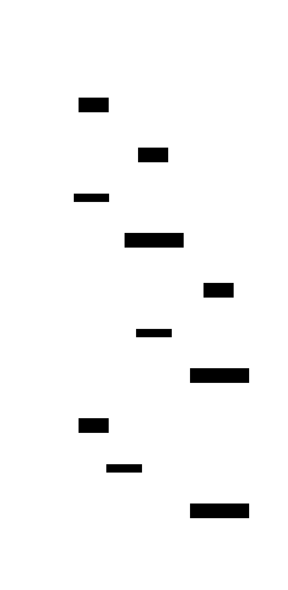

# Lamport Clock

**Aliases:** Logical Clock, Lamport Timestamp
**Category:** Building block (algorithm)
**Sources:**
[Neo Kim](https://systemdesign.one/system-design-interview-cheatsheet/) ·
[Joshi — Patterns of Distributed Systems](https://martinfowler.com/articles/patterns-of-distributed-systems/) ·
Kleppmann *DDIA*, Ch 9 ·
Lamport, [*Time, Clocks, and the Ordering of Events in a Distributed System* (1978)](https://lamport.azurewebsites.net/pubs/time-clocks.pdf)

---

## Problem

> [!TIP]
> **ELI5.** Three friends in three time zones argue about who said what first. Their clocks don't agree (one's wrong, one's offset, one's been daylight-saving for an hour). You can't trust wall-clock time to decide order. But you can still reason about it if you only care about *did this thing happen before that thing*, not about absolute time.

In a distributed system, **physical clocks on different machines drift**. Even with NTP they're rarely better than a few milliseconds apart, and in pathological cases (VM pauses, leap seconds, GC stalls) much worse. Yet many algorithms need to reason about **the order in which events happened**: which write came first, which message arrived before which, what's the order of operations in a replicated log.

Lamport's 1978 paper made a sharp observation: in a distributed system, *physical simultaneity is unobservable and mostly irrelevant*. What you can observe is **causality** — event A *happens-before* event B if A could have caused B. If A is "a process sends message m" and B is "a process receives m," then A definitely happens-before B. If A is "process P logs an event before sending" and B is "process Q receives that message and logs an event after," then A happens-before B by transitivity. Other events may be *concurrent* — neither caused the other.

The question is: can you assign timestamps to events such that **happens-before** is respected — even though no global clock exists?

## How it works

> [!TIP]
> **ELI5.** Every process keeps a counter that starts at 0. Every time something happens locally, the counter goes up by 1. When you send a message, attach your counter value to it. When you receive a message, set your counter to **max(your value, the message's value) + 1**. Now if A caused B, A's counter value will always be less than B's.

A Lamport clock is a **single integer counter** maintained by each process. Three simple rules govern its updates:

**Rule 1 (local event):** before or after performing any locally observable event (running a computation, logging something), increment the counter.

**Rule 2 (send):** before sending a message, increment the counter, then include the new value as the message's timestamp.

**Rule 3 (receive):** when receiving a message with timestamp `T_msg`, set your counter to `max(T_local, T_msg) + 1`. The `max` ensures your counter is at least as large as the sender's, so the receive event ends up timestamped *after* the corresponding send.

These rules produce timestamps that satisfy a key property: **if event A happens-before event B, then timestamp(A) < timestamp(B)**. (Hence "Lamport's clock condition.") The reverse, however, does *not* hold — two events with `T(A) < T(B)` may be concurrent. The single scalar carries enough information to detect causality in one direction, not both.

A concrete trace makes this clearer:

In the trace above:
- All three processes start by performing local events, each setting their counter to 1.
- **A sends message m1 to B** with timestamp `ts=1`. When B receives it, B applies rule 3: `T(B) = max(1, 1) + 1 = 2`. The receive event at B is timestamped 2 — strictly greater than the send event at A (1). Good.
- **B sends m2 to C** with `ts=2`. C, having had a local event at counter 1, receives and sets `T(C) = max(1, 2) + 1 = 3`. Note the chain: C's receive of m2 is timestamped 3, which is greater than B's send (2), which is greater than A's send (1). Causality is preserved transitively.
- **A performs another local event** and bumps to `T(A) = 2`, then sends m3 to C with `ts=2`. C receives and computes `T(C) = max(3, 2) + 1 = 4`.

Notice an important thing: A's second event (`T=2`) and B's receive of m1 (`T=2`) have the same Lamport timestamp, even though they're unrelated — they're concurrent. The Lamport clock doesn't distinguish concurrency from same-time; it only guarantees that *causally ordered* events have strictly increasing timestamps. To get total ordering — for use in things like replicated logs — you typically break ties by appending the process ID: `(timestamp, process_id)`, comparing lexicographically. This gives an arbitrary but consistent global ordering.

The simplicity is the point. A single integer per process, three rules, no clock synchronization, and you have a foundation that supports replicated log ordering, MVCC versioning, distributed snapshots (with extensions), and most other "what came first" questions in distributed systems. Joshi treats it as a pattern; DDIA cites it as the foundation for Total Order Broadcast (which is equivalent to consensus). Modern systems extend it in two directions:

- **Vector Clocks** (see [vector-clock.md](vector-clock.md)) carry one counter per process, so they can distinguish concurrent from causal events.
- **Hybrid Logical Clocks** (see [hybrid-logical-clock.md](hybrid-logical-clock.md)) combine a physical timestamp with a Lamport-style counter, so events have approximately-real timestamps that are still strictly increasing in causal order. CockroachDB, YugabyteDB, and MongoDB use HLCs.

---

## Variants & related patterns

| Variant | Difference |
|---|---|
| **Vector Clock** | One counter per process. Can detect concurrent events; needed for conflict resolution in leaderless replication. |
| **Version Vector** | Same idea as vector clock, applied to data items rather than events; Dynamo, Riak, Voldemort. |
| **Hybrid Logical Clock (HLC)** | Lamport timestamp + physical clock; gives both causality and approximate real time. |
| **TrueTime (Google)** | Bounded-uncertainty physical clock; lets Spanner skip logical clocks for cross-node ordering — at the cost of needing atomic clocks and GPS in every data center. |
| **Generation Clock (Joshi)** | Monotonic per-leader counter for distinguishing different leader epochs in Raft/Kafka. |
| **Logical Clock (Total Order Broadcast)** | Same Lamport timestamps used to give every replica a totally ordered view of events — equivalent to consensus. |

## When NOT to use

- **When you need to detect concurrency.** Lamport cannot — use vector clocks.
- **When you need approximately-real timestamps for debugging or display.** Lamport counters bear no relation to wall time; use HLC or just store a physical timestamp alongside.
- **When events truly are sequential under a single coordinator** — a database with a single leader doesn't need Lamport clocks; the leader's local counter is enough.

---

## Real-world implementations

The Lamport clock is more of a *primitive* than a deployed product. It's a tool used inside many systems:

| System | Use of Lamport-style timestamps |
|---|---|
| **Apache Kafka** | Generation Clock / epoch numbers — Lamport-derived monotonic counters per leader. |
| **etcd / Raft** | Term numbers — same idea. |
| **Apache Cassandra** | Lightweight transactions and conflict resolution use Lamport-style timestamps (with wall-clock fallback for unrelated writes). |
| **Riak** | Vector clocks (Lamport's descendant) for conflict detection. |
| **MongoDB** | Hybrid Logical Clocks (combine Lamport with physical time). |
| **CockroachDB, YugabyteDB** | HLC for cross-node ordering. |
| **Google Spanner** | TrueTime is the *alternative* to Lamport — interesting because it shows what infrastructure investment you need to *avoid* logical clocks. |

## Companies using it (foundational use)

| Company | Use | Status |
|---|---|---|
| **Amazon (Dynamo)** | Vector clocks (descendant of Lamport) for conflict detection across replicas. | ✅ Verified — [DeCandia et al., *Dynamo: Amazon's Highly Available Key-value Store*, SOSP 2007](https://www.allthingsdistributed.com/files/amazon-dynamo-sosp2007.pdf) |
| **Google (Spanner, Bigtable)** | Use Lamport / HLC concepts in many internal systems; though Spanner uses TrueTime as its primary ordering mechanism. | ✅ Verified — Spanner OSDI 2012 paper |
| **MongoDB** | HLC for global oplog ordering across replica sets. | ✅ Verified — [MongoDB blog: *Replication Internals*](https://www.mongodb.com/blog/post/replication-internals) |
| **Datadog, Honeycomb, others** | Use Lamport-derived timestamps internally for distributed tracing and event ordering. | ⚠ Industry-wide use; not re-verified for this document |

Most production use is at the **algorithm-implementor layer** — Cassandra, Kafka, CockroachDB engineers use Lamport-derived primitives so application developers don't have to.

---

## Further reading

- Leslie Lamport, *Time, Clocks, and the Ordering of Events in a Distributed System* (1978) — one of the most-cited CS papers ever. Short and readable. [PDF](https://lamport.azurewebsites.net/pubs/time-clocks.pdf).
- Kleppmann, *Designing Data-Intensive Applications*, Ch 9, "Lamport Timestamps" section.
- Joshi, *Patterns of Distributed Systems*, "Lamport Clock" — pattern-style treatment.
- Kulkarni et al., *Logical Physical Clocks and Consistent Snapshots in Globally Distributed Databases* (2014) — the Hybrid Logical Clock paper.
- *Distributed Systems: Principles and Paradigms*, Tanenbaum & Van Steen — Ch 6 covers logical clocks in depth.

---

*Diagram sources: [`../diagrams/src/lamport-clock-rules.d2`](../diagrams/src/lamport-clock-rules.d2), [`../diagrams/src/lamport-clock-flow.d2`](../diagrams/src/lamport-clock-flow.d2).*
