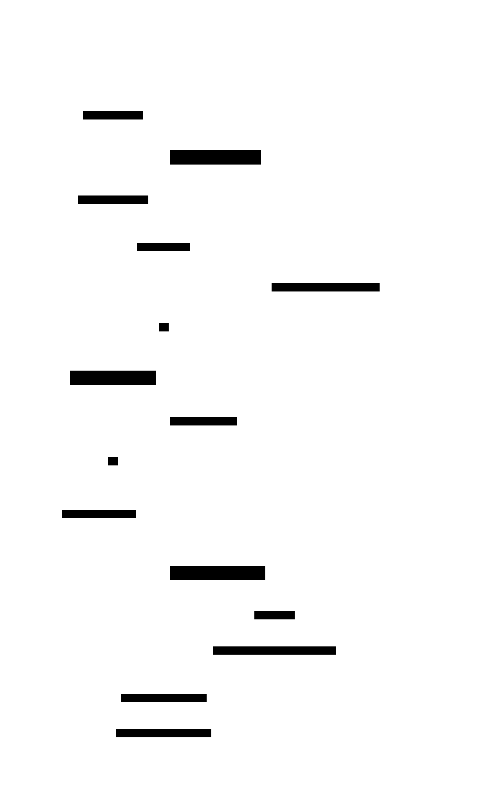
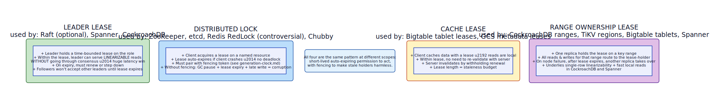

# Lease

**Aliases:** Time-Bounded Grant, Auto-Expiring Permission, Lease-based Lock, Renewable Lock
**Category:** Building block
**Sources:**
[Joshi — Patterns of Distributed Systems](https://martinfowler.com/articles/patterns-of-distributed-systems/) ·
Kleppmann *DDIA*, Ch 8 ·
[Gray & Cheriton, *Leases: An Efficient Fault-Tolerant Mechanism for Distributed File Cache Consistency* (SOSP 1989)](https://web.stanford.edu/class/cs240/readings/89-leases.pdf) ·
[Burrows, *The Chubby lock service* (OSDI 2006)](https://research.google/pubs/pub27897/)

---

## Problem

> [!TIP]
> **ELI5.** Traditional locks have a fatal flaw: if the holder crashes while holding the lock, **the lock is stuck forever** — no one else can ever get it. Distributed systems crash all the time, so this is untenable. Lease: instead of "you hold this lock until you release it," it's "you hold this lock until 10 seconds from now, and you have to keep renewing." If the holder dies, the lock auto-releases.

A distributed lock or grant of authority has a deceptively hard requirement: **what if the holder crashes?**

- **Without auto-expiry**: a crashed holder leaves the lock held indefinitely. The system is permanently stuck on that resource. You need a human to recover. This kills availability.
- **With manual revocation by some other party**: who decides? How do you safely revoke from a holder who may not be dead, just slow? If the supposedly-dead holder later wakes up and tries to use its grant, you have **split-brain**.

The classical failure scenario: client A acquires a lock on resource R. Client A goes into a long GC pause (or VM migration, or network partition). The lock service can't tell whether A is dead or paused. After some timeout, the service revokes the lock and grants it to client B. Client B starts modifying R. Meanwhile A wakes up, doesn't know its lock was revoked, and also modifies R. **Data corruption.**

You need a mechanism that:
- Auto-releases on holder failure (no permanent locks).
- Makes the holder explicitly aware of the time bound.
- Makes stale-holder writes harmless via a fencing mechanism.

## How it works

> [!TIP]
> **ELI5.** When you grant the lock, also set an expiration time. The holder must send a heartbeat before the expiration to extend the lease. If the heartbeat stops coming, the lease expires automatically and someone else can take it. To protect against the "I thought I had the lock" race, every action by the holder carries a **monotonic token** that's checked at the resource.

A lease is a **time-bounded grant** of some authority — to be leader, to hold a lock, to cache data, to own a key range. The lease has:

- A **lease ID** identifying this grant.
- A **TTL** (time-to-live) — when the lease will auto-expire if not renewed.
- A **fencing token** ([generation clock](generation-clock.md)) — a monotonically-increasing number used to detect stale holders.

The lifecycle:

The client **acquires** a lease with some TTL (e.g., 10s). The lease service issues a lease ID and a fencing token. The client is now authorized to act on the resource — but only for the TTL window. The client must send a **renewal heartbeat** well before expiry (typically at ⅓ to ½ of the TTL). Each renewal extends the expiry.

If the client crashes, stalls, or loses network, heartbeats stop arriving. After the current TTL expires, the lease service automatically releases the lease — no human action needed. Another client can now acquire. When the new client acquires, it gets a **new, higher fencing token**.

If the original (crashed/stalled) client eventually wakes up and tries to act on the resource using its old token, the resource checks the token against the highest one it has seen and **rejects** the stale action. This is the fencing pattern described in [generation-clock.md](generation-clock.md), applied here. Without fencing, the lease is unsafe — it merely *probabilistically* avoids split-brain, while fencing makes it provably safe.

### Where leases are used

The same pattern shows up at several layers:

**Leader leases.** In Raft and ZAB, a leader can be given a time-bounded "I'm definitely leader" lease — within the lease, the leader can serve **linearizable reads without going through consensus**, since no other leader can be elected while the lease holds. This is a huge latency optimization used by Spanner, CockroachDB, and TiKV. The lease must be shorter than the time it takes followers to detect leader failure and start a new election, otherwise a stale leader could serve stale reads after a partition.

**Distributed locks.** ZooKeeper sessions, etcd leases, Chubby locks, Redis-based distributed locks (done correctly — see Kleppmann's [critique of Redlock](https://martin.kleppmann.com/2016/02/08/how-to-do-distributed-locking.html)). All use TTL + heartbeats + fencing tokens. The fencing requirement is the most-violated; most homegrown distributed locks fail this test and corrupt data under load.

**Cache leases.** A client caches data with a server-issued lease. Within the lease window, the client can serve reads from cache without re-validating. The server invalidates by withholding renewal (or actively notifying). Bigtable's tablet metadata cache, GCS object metadata, AFS file cache (the 1989 Gray & Cheriton paper's original use case).

**Range ownership leases.** In sharded distributed databases — CockroachDB ranges, TiKV regions, Bigtable tablets, Spanner directories — one replica holds a lease on a key range, and all reads/writes for that range route to the lease holder. The lease lets the holder serve reads locally without quorum, and rebalancing is a matter of moving leases. On node failure, after lease expiry, another replica takes over.

### Tuning the TTL

The TTL is a real trade-off:

- **Short TTL (1–5s)**: fast recovery on failure; aggressive heartbeating, higher overhead; more sensitive to network blips (false expiration).
- **Medium TTL (5–30s)**: typical production sweet spot. Tolerates ordinary GC pauses and brief network issues.
- **Long TTL (5+ min)**: very stable, low overhead; long unavailability window when the holder really dies.

Production examples: ZooKeeper sessions default ~6s. etcd leases are application-configured, often 5–60s. Chubby uses ~12s. Spanner leader leases ~10s. The choice depends on the cost of failover and the tolerated tail latency from the heartbeat cycle.

### Clock-skew danger

A lease's expiry is a *time*. If the lease service's clock and the holder's clock disagree by more than the lease's safety margin, the holder might think it still has the lease while the service has already released it. The classical defense: **the service grants the lease for time T**, but the **holder assumes it expires at T − ε** for some safety margin ε. This way, the holder always thinks the lease ends *before* the service does, eliminating the split-brain window. Spanner takes this further with TrueTime, getting bounded-uncertainty timestamps from atomic clocks.

For the truly paranoid: don't trust wall-clock time at all. **Use a monotonic clock for the local-deadline computation** (avoids issues with NTP step adjustments), and pair every authorized action with a fencing token check at the resource (so timing errors are detected and rejected).

---

## Variants & related patterns

| Variant | Difference |
|---|---|
| **Leader lease** | The leader-election pattern uses a lease for "who's authorized to act as leader." Raft + lease optimization. |
| **Lease + fencing token** | Mandatory for correctness — the lease alone is necessary but not sufficient. |
| **Auto-renewing client library** | Hides heartbeats from the application; library transparently sends them. ZooKeeper / etcd / Redis clients. |
| **Long-running session** | The lease pattern packaged for client-server systems — ZooKeeper sessions, Kafka consumer-group memberships. |
| **Cache lease** | Specifically for read-cache invalidation — Bigtable, Chubby, GFS. |
| **Range/tablet lease** | For sharded databases — Spanner directories, CockroachDB ranges, Bigtable tablets. |
| **Optimistic lease** | Lease check at use time rather than continuous renewal — works for short operations. |

## When NOT to use

- **Operations short enough that crash means abort, not partial completion** — a single SQL transaction with retries doesn't need a lease.
- **Stateless work that can be redone freely** — just use idempotent operations; no exclusivity needed.
- **When the safe operation already requires consensus per action** — Raft writes don't need an additional leader lease for safety, only for read-optimization.
- **As a sole correctness mechanism** — leases are necessary for liveness (auto-release on failure) but insufficient for safety. Always pair with fencing.

---

## Real-world implementations

| System | Lease mechanism |
|---|---|
| **Apache ZooKeeper** | Session = lease; ephemeral znodes auto-deleted on session expiry. |
| **etcd v3** | First-class Lease API (`grant`, `keepalive`, `revoke`); KV entries can be tied to a lease. |
| **HashiCorp Consul** | Sessions with TTL; commonly used for distributed locks via `KV.acquire`. |
| **Google Chubby** | The grandparent — sessions with leases, the model for ZK and etcd. |
| **Redis** | `SET key value NX EX 30` is a primitive lease; Redlock is a multi-Redis variant (controversial). |
| **AWS DynamoDB** | TTL on records is a primitive lease; conditional writes provide fencing-token-style protection. |
| **CockroachDB** | Range leases (one replica is "leaseholder"); leader-lease optimization for fast reads. |
| **Spanner** | Per-Paxos-group lease for leader; TrueTime ensures lease boundaries are safe. |
| **Kubernetes** | Lease API objects underlie controller-manager leader election. |
| **GCS, S3 object versioning** | Token-checked conditional writes mirror the fencing aspect of leases. |

## Companies / canonical uses

| Where | Use | Status |
|---|---|---|
| **Google** | Chubby leases are the foundational service for GFS, Bigtable, MapReduce coordination. | ✅ Verified — [Chubby OSDI 2006](https://research.google/pubs/pub27897/) |
| **Every Kubernetes user** | Controller leader election uses Lease objects (`coordination.k8s.io/Lease`). | ✅ Verified — Kubernetes API docs |
| **HashiCorp customers (Consul, Vault, Nomad)** | Consul sessions provide all distributed locking. | ✅ Verified — HashiCorp docs |
| **Cockroach Labs customers** | Range leases underpin CockroachDB's fast reads and rebalancing. | ✅ Verified — [CockroachDB lease docs](https://www.cockroachlabs.com/docs/stable/architecture/replication-layer#leases) |
| **Stripe, Shopify, Airbnb** | All use etcd / Consul for distributed locks via lease-backed APIs. | ✅ Verified — engineering blogs and codebases |

---

## Further reading

- Cary Gray & David Cheriton, *Leases: An Efficient Fault-Tolerant Mechanism for Distributed File Cache Consistency* (SOSP 1989) — the foundational paper. [PDF](https://web.stanford.edu/class/cs240/readings/89-leases.pdf).
- Mike Burrows, *The Chubby lock service for loosely-coupled distributed systems* (OSDI 2006) — production lease/lock service at Google scale. [PDF](https://research.google/pubs/pub27897/).
- Martin Kleppmann, *How to do distributed locking* (2016) — the must-read on why naive lease-based locks are unsafe without fencing.
- Kleppmann, *Designing Data-Intensive Applications*, Ch 8 — leases, fencing, and the limits of process-time guarantees.
- Joshi, *Patterns of Distributed Systems*, "Lease" + "Fencing Token" patterns.
- *Designing Distributed Systems*, Brendan Burns — Ch 4 covers leader election with leases in Kubernetes idioms.

---

*Diagram sources: [`../diagrams/src/lease-lifecycle.d2`](../diagrams/src/lease-lifecycle.d2), [`../diagrams/src/lease-uses.d2`](../diagrams/src/lease-uses.d2).*
