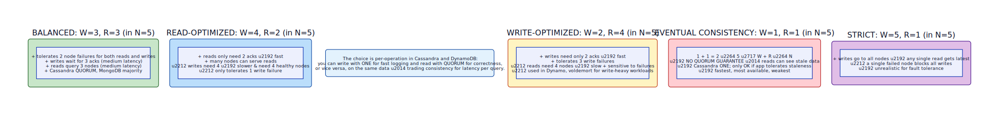

# Quorum

**Aliases:** Majority Quorum, Voting Replication, R/W Quorum, Dynamo-style Quorum
**Category:** Building block
**Sources:**
[Joshi — Patterns of Distributed Systems](https://martinfowler.com/articles/patterns-of-distributed-systems/) ·
Kleppmann *DDIA*, Ch 5 (Replication) + Ch 9 ·
[Gifford, *Weighted Voting for Replicated Data* (SOSP 1979)](https://dl.acm.org/doi/10.1145/800215.806583) — origin of the W+R>N rule ·
[DeCandia et al., *Dynamo: Amazon's Highly Available Key-value Store* (SOSP 2007)](https://www.allthingsdistributed.com/files/amazon-dynamo-sosp2007.pdf)

---

## Problem

> [!TIP]
> **ELI5.** You have 5 copies of a piece of data on 5 servers. To write, do you require all 5 to ack (slow, fragile) or just 1 (fast, can lose data on failure)? Same for reads. There's a magic rule: as long as the writer ack count + the reader query count is more than 5, at least one server in the read set will have the latest value.

In a replicated system, every write must reach replicas to be durable, and every read must consult replicas to get current data. Two extremes are bad:

- **Write/read on a single replica**: minimum latency, no durability — losing that replica loses or stales the data.
- **Write/read on all N replicas**: maximum durability and freshness, but a single slow or failed replica blocks every operation. Unacceptable for production: in any cluster of size > 5, the probability that *at least one* replica is slow or unreachable at any moment is high.

You want **fault tolerance** (some replicas can fail without affecting availability) and **strong consistency** (reads see the latest committed writes) simultaneously. The tension between these is the entire subject of Brewer's CAP theorem.

The **quorum** pattern is the principled way to navigate that tension: define a minimum number of replicas each operation must touch (the quorum), and engineer the system so that quorums for reads and writes *necessarily overlap*.

## How it works

> [!TIP]
> **ELI5.** Pick three numbers: **N** = how many replicas hold each data item, **W** = how many must ack a write, **R** = how many must respond to a read. As long as **W + R > N**, the read set and the write set must share at least one replica. That shared replica has the latest write; the reader sees it.

In a Dynamo-style replicated system:

- **N** = the replication factor (how many copies of each data item exist).
- **W** = the **write quorum** — how many replicas must durably acknowledge a write before the client is told "OK."
- **R** = the **read quorum** — how many replicas a read must query; the client takes the value with the highest timestamp.

The fundamental invariant is **W + R > N**. When this holds, any read set and any write set must intersect in at least one replica — the pigeonhole principle: you cannot pick W items from N and R items from N without overlapping if their sizes sum to more than N. Since the overlapping replica saw the most recent committed write (it was part of the write quorum) and is consulted by the read (it's part of the read quorum), the reader is guaranteed to see that write's value.

In the diagram, N=5, W=3, R=3. A write reaches nodes {1, 2, 3}. A later read queries nodes {3, 4, 5}. The two sets intersect in node 3, which holds the latest value — the reader picks the highest-timestamped version and gets the correct answer. If we instead chose W=2, R=2, the write might go to {1,2} and the read to {4,5} — no overlap, the reader sees stale data.

### The trade-off knob

By varying W and R within the constraint `W + R > N`, you tune the cluster for different workloads:

- **Balanced (W=3, R=3 in N=5)**: standard majority quorum. Tolerates 2 node failures for both reads and writes. Used by Cassandra's `QUORUM` consistency, MongoDB's `majority` write concern, Raft (where W=R=majority is baked in).
- **Read-optimized (W=4, R=2)**: reads are fast and many nodes can serve them. Writes are slow and need 4 of 5 healthy nodes — fragile.
- **Write-optimized (W=2, R=4)**: writes are fast; tolerates 3 write failures. Reads are slow but always see latest.
- **Eventual consistency (W=1, R=1)**: fastest, most available. But `W + R = 2 ≤ N` — no quorum guarantee. Reads may be stale. Used in metrics ingestion, telemetry, cache writes.
- **Strict (W=5, R=1)**: any single read sees latest. But any single failure blocks writes — not fault-tolerant.

In **Cassandra** and **DynamoDB**, the choice is *per-operation*: an app can write logs with `ONE` (fast, no quorum) and read user data with `QUORUM` (strong) on the same table. The flexibility lets you trade consistency for latency per call.

### Consensus's relationship to quorum

In strong-consistency systems like **Raft** and **Paxos**, the quorum concept is hardcoded as the *majority*: every write must be acknowledged by a majority of nodes, and every leader election requires majority votes. The W + R > N rule appears as: writes go to majority (W = ⌈N/2⌉ + 1), and any new leader must collect votes from majority (R = ⌈N/2⌉ + 1). Two majorities of N necessarily intersect — the new leader's votes include at least one node that saw the most recent committed write, so the leader can recover that write into its log. This is exactly Gifford's 1979 insight applied to leader-based replication.

### Sloppy quorum & hinted handoff

Dynamo introduced **sloppy quorum** — if the W "preferred" replicas for a key are unreachable, the write goes to other (substitute) nodes, which hold the data temporarily and forward to the preferred replicas when they recover (**hinted handoff**). This improves write availability at the cost of weakening the consistency guarantee — a read might not see the recent write if it goes to preferred replicas before handoff completes. Cassandra, Riak, and DynamoDB all use variations on this.

### Quorum and CAP

Quorum-based systems sit in a specific spot on the CAP triangle:

- **W + R > N** + synchronous quorum acks → **CP** (consistency over availability during partition): if a network partition disconnects the write quorum, writes fail.
- **Sloppy quorum / W = 1** → **AP** (availability over consistency): writes always succeed somewhere; consistency reconciled later via vector clocks / Merkle trees / anti-entropy.

The choice isn't made once at the cluster level; in Cassandra and Dynamo it's per-request. This per-request flexibility is one of the genuinely novel ideas from the Dynamo paper, and a key reason quorum-based stores have stayed relevant alongside Raft-based ones.

### What quorum doesn't protect against

Quorum gives you **read-your-writes** style guarantees only for clean cases. Several edge cases require more machinery:

- **Concurrent writes** (two clients writing the same key at near-identical times) — quorum doesn't pick a winner. Resolution requires vector clocks ([vector-clock.md](vector-clock.md)) and application-level merge, or last-writer-wins via timestamps.
- **Read repair**: a quorum read that sees different values across replicas should write the latest back to the lagging replicas — Cassandra and Riak do this automatically.
- **Stale replicas after restart**: a replica that was offline needs to catch up via **anti-entropy** (Merkle tree sync) before its data is trustworthy in quorums.
- **Network partitions**: quorum either fails (if W can't be reached) or accepts (if it can) — application must handle the failure semantics.

---

## Variants & related patterns

| Variant | Difference |
|---|---|
| **Strict (majority) quorum** | W and R both ⌈N/2⌉+1; used by Raft, Paxos, MongoDB majority. |
| **Tunable quorum** | W and R per-call; used by Cassandra, Riak, DynamoDB. |
| **Sloppy quorum + hinted handoff** | Substitute nodes accept writes; later forwarded. Dynamo, Cassandra, Riak. |
| **Weighted voting** (Gifford 1979) | Each replica has a weight; quorum is by weight sum. |
| **Flexible Paxos** (Howard 2016) | Phase 1 and Phase 2 can use different quorums (any two quorums that overlap). Inspired Egalitarian and other variants. |
| **Cluster majority** (3-of-5, etc.) | The implicit Raft setup. |
| **Cross-DC quorum** | Quorum across data centers — must reach majority *globally*; expensive but provides geo-redundant durability. Used by Spanner, CockroachDB multi-region. |

## When NOT to use

- **Single-leader replication with async followers** — no quorum on the write path; the leader is the source of truth. Followers are best-effort. Most traditional SQL setups.
- **Stateless services** — no replication, no quorum.
- **Latency-critical use cases that can tolerate eventual consistency** — W=R=1 (no real quorum) is fine for many cache and telemetry workloads.
- **Asymmetric workloads where leadership solves the problem better** — instead of quorum reads/writes, use a leader (Raft) and serve reads from replicas with weaker guarantees.

---

## Real-world implementations

| System | Quorum style |
|---|---|
| **Apache Cassandra** | Tunable per-operation: ONE / QUORUM / ALL / LOCAL_QUORUM / EACH_QUORUM. Sloppy quorum + hinted handoff. |
| **Amazon DynamoDB** | Per-call eventual or strong; sloppy quorum internally. |
| **Riak** | Per-key tunable W/R; vector clocks for conflict resolution. |
| **MongoDB** | `writeConcern: majority` = quorum write; `readConcern: majority` = quorum read; replica sets. |
| **etcd, Consul, ZooKeeper** | Majority quorum (Raft / ZAB). |
| **CockroachDB, Spanner, TiKV, YugabyteDB** | Per-range majority via Raft. |
| **Apache Kafka** | `min.insync.replicas` + `acks=all` = quorum write; consumers read from the partition leader (no read quorum). |
| **Couchbase, ScyllaDB, Voldemort** | Cassandra-style tunable quorum. |

## Companies / canonical uses

| Where | Use | Status |
|---|---|---|
| **Amazon** | Dynamo (internal) and DynamoDB use sloppy quorum + tunable W/R. | ✅ Verified — [Dynamo SOSP 2007](https://www.allthingsdistributed.com/files/amazon-dynamo-sosp2007.pdf) |
| **Apple, Netflix, Instagram, Discord** | Massive Cassandra deployments using QUORUM consistency for user data. | ✅ Verified — published engineering blogs |
| **Google** | Spanner uses Paxos-majority quorums per shard; quorum reasoning is central to its design. | ✅ Verified — [Spanner OSDI 2012](https://research.google/pubs/pub39966/) |
| **MongoDB customers** | `writeConcern: majority` is the production-recommended default. | ✅ Verified — MongoDB docs |
| **Kubernetes** | etcd at the heart of every cluster uses Raft majority quorum. | ✅ Verified — etcd architecture docs |

---

## Further reading

- David K. Gifford, *Weighted Voting for Replicated Data* (SOSP 1979) — the foundational paper introducing W + R > N. [PDF](https://dl.acm.org/doi/10.1145/800215.806583).
- DeCandia et al., *Dynamo: Amazon's Highly Available Key-value Store* (SOSP 2007) — operationalized quorum for production. [PDF](https://www.allthingsdistributed.com/files/amazon-dynamo-sosp2007.pdf).
- Kleppmann, *Designing Data-Intensive Applications*, Ch 5 — clearest modern treatment of quorum consistency and its edge cases.
- Heidi Howard, *Flexible Paxos: Quorum intersection revisited* (2016) — generalizes the W+R>N rule beyond the strict majority case.
- Joshi, *Patterns of Distributed Systems*, "Majority Quorum" pattern.
- Cassandra and DynamoDB documentation — the most practical guides on choosing W and R for specific workloads.

---

*Diagram sources: [`../diagrams/src/quorum-overlap.d2`](../diagrams/src/quorum-overlap.d2), [`../diagrams/src/quorum-tradeoffs.d2`](../diagrams/src/quorum-tradeoffs.d2).*
