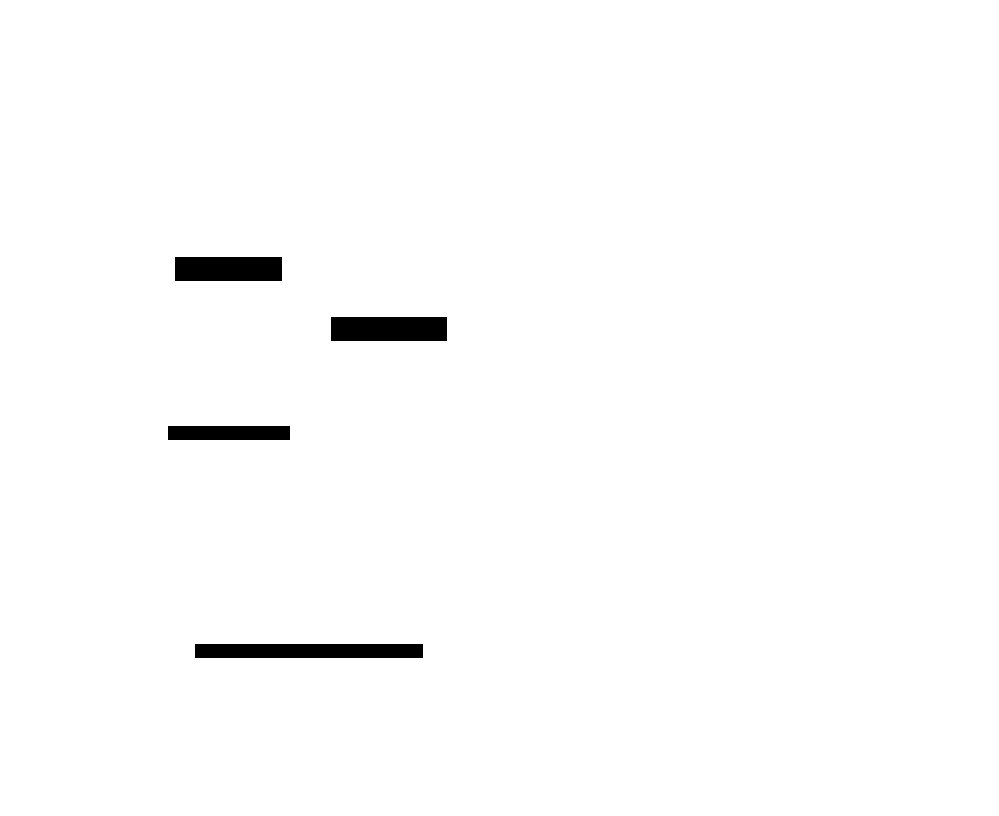
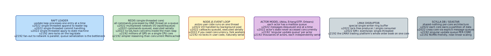

# Singular Update Queue

**Aliases:** Single-Writer Pattern, Serial Updater, Actor Mailbox, Single-Threaded Event Loop, Reactor Pattern (variant)
**Category:** Concurrency
**Sources:**
[Joshi — Patterns of Distributed Systems](https://martinfowler.com/articles/patterns-of-distributed-systems/) ·
Discussed in actor-model literature (Hewitt 1973, Erlang/OTP), the Reactor pattern (Schmidt), Node.js, Redis, and many production systems

---

## Problem

> [!TIP]
> **ELI5.** Locks are hard. Most "concurrent" bugs come from two threads touching the same memory at the same time. The simplest way to avoid that isn't to add more locks — it's to make sure **only one thread ever touches the data**. Other threads queue up requests; the lucky thread processes them one at a time. No races, no deadlocks, no surprises.

When mutable state is shared by many threads, concurrency bugs are pervasive: race conditions, deadlocks, lock-ordering inversions, ABA problems, false sharing. Each requires careful design and testing, and the resulting code is hard to reason about — concurrent reasoning is notoriously difficult.

The traditional solution is **fine-grained locking**: protect each piece of state with a lock, document the lock-acquisition order, avoid holding locks across blocking calls. This works but is fragile: a single misordered acquisition deadlocks the system; a forgotten `unlock()` corrupts state; subtle race windows survive years of testing.

What if you sidestep the entire problem? If **only one thread ever touches the mutable state**, none of these issues can occur. You don't need to think about locks at all — there's literally no concurrency to manage. Other threads communicate with the updater through a thread-safe queue.

This is the **Singular Update Queue** pattern (Joshi's name) — the same idea as the **actor model** (each actor has one mailbox and one execution context), the **reactor pattern**, the **single-threaded event loop** (Node.js, Redis), and the **shared-nothing per-core** architecture (ScyllaDB, Seastar, DPDK).

## How it works

> [!TIP]
> **ELI5.** Set up two things: (1) a thread-safe queue that any thread can submit to, and (2) one dedicated thread that loops forever, takes one command at a time, and applies it to the data. Producers and consumer never touch the data directly — they only communicate through the queue. The data is mutated by exactly one thread, so it never needs a lock.

The pattern has three components:



1. **Many client threads** (or fibers, or coroutines) that want to read or modify the shared state. Could be request handlers, network I/O threads, timer callbacks — anything.
2. **A thread-safe bounded queue** that accepts commands from clients. "Thread-safe" because many producers add concurrently. "Bounded" so producers experience backpressure rather than memory blowup if the consumer falls behind.
3. **A single updater thread** that runs a loop:
   ```
   while running:
       cmd = queue.take()      // block until a command available
       apply(cmd, state)       // mutate state — NO locks needed
       respond(cmd)            // optional: signal completion
   ```

The updater is the *only* thread that touches `state`. Every mutation is single-threaded, so no synchronization primitives are needed for the state itself. The queue handles the producer-consumer synchronization in one place.

### Properties

The pattern provides:

- **No locks on the state** — the only thread accessing it is the updater. Locks are unnecessary.
- **No race conditions** — single-threaded access is inherently race-free.
- **No deadlocks** — only one thread can be holding the queue's monitor; no chain of locks possible.
- **Easy reasoning** — read the updater loop top to bottom; it's a serial program.
- **Obvious ordering** — commands execute in FIFO order from the queue, matching the order they were enqueued (within thread). Useful for many semantics.
- **Natural backpressure** — bounded queue rejects/blocks producers when the consumer falls behind. The system sheds load *before* running out of memory.
- **Easy replication** — the queue's content is essentially a [replicated log](../data/replicated-log.md). Replicate the command stream, and every replica's state machine ends in the same state.

These benefits compound. The pattern doesn't just solve concurrency bugs — it makes the system **easier to test, replicate, profile, and debug**.

### Real-world examples

The pattern is everywhere — here are some canonical cases:



**Redis** processes all commands on a single thread. Network I/O is multiplexed via epoll/kqueue; commands are queued; the main thread loops through them. Result: millions of QPS on a single CPU core, simpler reasoning than concurrent Memcached, no need for users to think about command interleaving.

**Node.js** runs all user code on a single thread (the event loop). I/O is delegated to a background thread pool, but callbacks always execute on the main thread. User code never sees races.

**The actor model** (Erlang/OTP, Akka, Microsoft Orleans, Akka.NET) makes every actor a singular update queue: each actor has a mailbox; messages are processed one at a time by the actor's single execution thread. Many actors run concurrently, but each is internally serial. The 1973 Hewitt paper laid the conceptual foundation; Erlang's commercial success in telecom showed it works at scale.

**Raft and consensus leaders** typically use a singular update queue for the log: client commands enter a queue, the leader thread takes one at a time, appends to the log, and replicates. No locks on the log itself.

**LMAX Disruptor** — the high-frequency trading platform — built a lock-free single-writer ring buffer that processed 6M+ events per second on a single thread. Their entire order book lived in a singular update queue.

**ScyllaDB / Seastar** generalizes to per-core: each CPU core owns a partition of data and has its own update queue. Cross-core communication is explicit message-passing. Result: near-linear scaling to dozens of cores with no shared-memory contention.

### Trade-offs

The pattern has real costs:

- **Throughput ceiling per queue**: a single thread is bounded by single-thread speed. For workloads that need 10M ops/sec on a single state, this is a problem. Solutions: shard the state into many queues (one per shard, per partition, per core).
- **Latency from queueing**: requests wait their turn. If a previous command is slow (long computation, disk I/O), the queue builds up.
- **No parallel reads**: a singular update queue serializes reads too unless you separate the read path. Variant: allow readers concurrent access (using MVCC or copy-on-write) while only writes go through the queue.
- **Blocking I/O is poison**: if `apply(cmd, state)` does a synchronous disk read, the whole queue stalls. Production singular-update-queue systems either delegate I/O to a separate thread pool (Node.js model) or use non-blocking I/O.

### Reading the pattern

When you see any of these signals, you're looking at a singular update queue:

- "Single-threaded event loop"
- "Actor mailbox"
- "Reactor pattern"
- "Single writer thread"
- "Lock-free single-producer single-consumer queue"
- "Per-core shared-nothing"
- "Replicated state machine input queue"
- "Background worker thread + work queue"
- "All mutations go through this serial executor"

They're all the same pattern at different scopes.

---

## Variants & related patterns

| Variant | Difference |
|---|---|
| **Single-threaded event loop** | Node.js / nginx model: one thread, non-blocking I/O, callbacks. |
| **Actor model** | Each actor has its own queue + thread; many actors per process. Akka, Erlang, Orleans. |
| **Per-core shared-nothing** | One queue per CPU core; cross-core via explicit messages. ScyllaDB, Seastar, DPDK. |
| **Disruptor / lock-free ring buffer** | High-performance single-writer queue with lock-free producers. LMAX. |
| **Reactor pattern** | Event demultiplexer + serial handler. The pattern Schmidt formalized for network servers. |
| **Replicated State Machine input queue** | Raft/Paxos leader's command queue — same pattern with replication. |
| **Multi-producer single-consumer (MPSC) queue** | The data structure underlying most singular update queues. |
| **Fork-join with serialization point** | Parallelize the expensive parts; serialize state mutation. |

## When NOT to use

- **Truly embarrassingly parallel workloads on independent data** — no shared state, no need for serialization.
- **Throughput requirements exceeding single-thread capacity on indivisible state** — must shard or use a different model.
- **Workloads with long blocking operations** — singular update queue stalls on each long op. Either delegate to a worker pool or restructure as non-blocking.
- **When you actually need multiple readers concurrent with writers** — pair with MVCC, COW, or a reader/writer split.

---

## Real-world implementations

| System | Singular update queue use |
|---|---|
| **Redis** | Single-threaded core processes all commands. Redis 6+ added I/O threads but kept the core serial. |
| **Node.js** | Single-threaded event loop for all user code; I/O thread pool for OS calls. |
| **Erlang / Elixir / OTP** | Actor-per-process; each process has a mailbox queue and serial execution. |
| **Akka (JVM) / Akka.NET** | Actor model with per-actor mailbox. |
| **Microsoft Orleans** | Virtual actors with mailbox-driven activation. |
| **LMAX Disruptor** | High-throughput single-writer ring buffer. |
| **ScyllaDB / Seastar** | Per-core shared-nothing architecture. |
| **DPDK applications** | Network packet processing per-core. |
| **Raft / Paxos leaders** | Internal log-append queue is singular. |
| **Apache Kafka brokers** | Per-partition append is single-threaded. |
| **Many game engines** | Single-threaded main loop with worker pools for parallelizable subsystems. |
| **Tokio runtime (Rust) single-threaded mode** | Reactor pattern for async tasks. |

## Companies / canonical uses

| Where | Use | Status |
|---|---|---|
| **WhatsApp** | Famously ran on Erlang/OTP — 450M users on 32 engineers, much credit to the actor model. | ✅ Verified — published talks and engineering posts |
| **Ericsson, Klarna, Discord (chat)** | Erlang/Elixir actor model in production. | ✅ Verified — multiple engineering blogs |
| **LMAX** | The Disruptor pattern is from LMAX; published as open source. | ✅ Verified — [LMAX Disruptor open source](https://lmax-exchange.github.io/disruptor/) |
| **Redis Labs / Redis users (essentially everyone)** | Single-threaded Redis core. | ✅ Verified — Redis architecture |
| **Microsoft (Azure)** | Orleans powers parts of Halo, Skype historically. | ✅ Verified — [Orleans open-source](https://github.com/dotnet/orleans) |
| **ScyllaDB Inc / Seastar users** | Per-core shared-nothing in production. | ✅ Verified — ScyllaDB architecture docs |
| **Netflix, Twitter** | Use Akka extensively for actor-based services. | ✅ Verified — published Akka case studies |

---

## Further reading

- Joshi, *Patterns of Distributed Systems*, "Singular Update Queue" pattern.
- Carl Hewitt, *A Universal Modular ACTOR Formalism for Artificial Intelligence* (1973) — the conceptual root.
- *Designing Reactive Systems*, Roland Kuhn — the Reactive Manifesto and actor patterns explained for modern systems.
- Joe Armstrong's PhD thesis (2003), *Making Reliable Distributed Systems in the Presence of Software Errors* — the Erlang/OTP design.
- LMAX Disruptor technical paper — explains the lock-free single-writer ring buffer design. [PDF](https://lmax-exchange.github.io/disruptor/disruptor.html).
- Avi Kivity's ScyllaDB talks — per-core shared-nothing in practice.
- *Concurrent Programming on Windows*, Joe Duffy — Ch on the producer-consumer pattern.

---

*Diagram sources: [`../diagrams/src/singular-update-queue.d2`](../diagrams/src/singular-update-queue.d2), [`../diagrams/src/singular-update-queue-examples.d2`](../diagrams/src/singular-update-queue-examples.d2).*
