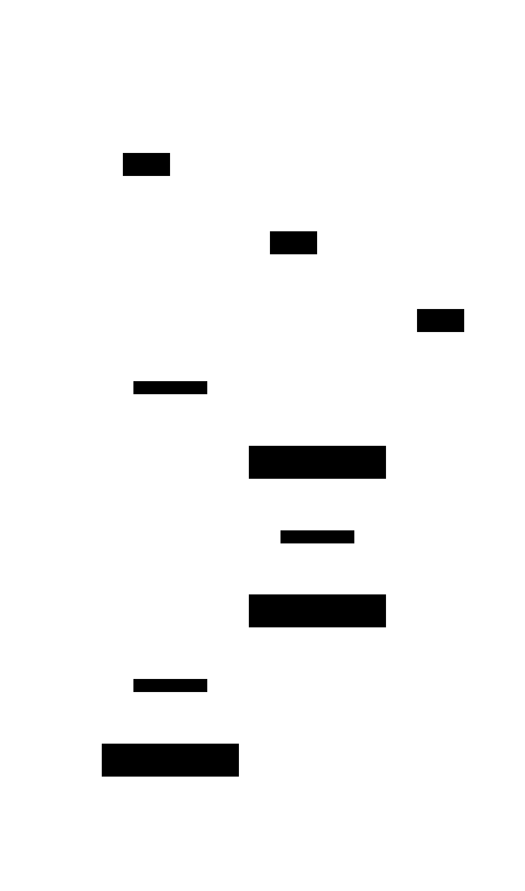
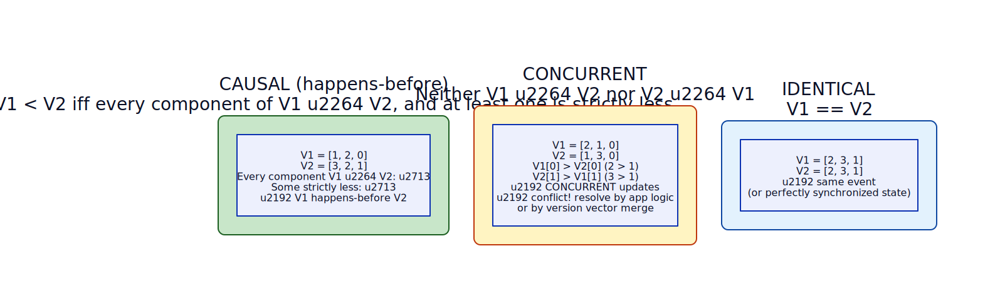

# Vector Clock / Version Vector

**Aliases:** Version Vector (Joshi distinction; see below)
**Category:** Building block (algorithm)
**Sources:**
[Neo Kim](https://systemdesign.one/system-design-interview-cheatsheet/) ·
[Joshi — Patterns of Distributed Systems](https://martinfowler.com/articles/patterns-of-distributed-systems/) ·
Kleppmann *DDIA*, Ch 5 (Replication) ·
Fidge (1988), Mattern (1988) — independent inventions of the vector clock

---

## Problem

> [!TIP]
> **ELI5.** Two people edit the same shared document at the same time, both offline, then sync up. Lamport timestamps can tell you "my edit happened after yours" *or* "yours happened after mine" — but they can't tell you "we both edited at the same time, neither saw the other, we have a real conflict." Vector clocks can.

A [Lamport clock](lamport-clock.md) gives you a clean way to determine that one event happens-before another, but it has a deep limitation: it **cannot tell you when two events are concurrent**. Both `T(A) = 5` and `T(B) = 5` could mean "they happened at the same logical moment" or "they're unrelated and happened to land on the same number." Both `T(A) = 3` and `T(B) = 5` could mean "A caused B" or "they're concurrent and B got a bigger number by accident."

For some uses this doesn't matter — a single replicated log just needs *some* total order, and Lamport ties broken by process ID is fine. But for **conflict detection in leaderless / multi-leader replication** — Dynamo, Cassandra, Riak, CouchDB — you specifically need to know "did these two writes know about each other or not?" Two writes that knew about each other can be safely ordered. Two **concurrent** writes are conflicts that need application-level resolution (merge two shopping carts, ask the user, last-writer-wins).

You need a timestamp scheme that distinguishes **causal** from **concurrent**.

## How it works

> [!TIP]
> **ELI5.** Instead of one counter per process, each process keeps a **list** of counters — one slot per process in the system. When sending or receiving, you don't just update your own slot; you take the maximum across every slot. Now when you compare two timestamps, you can tell: did everything in this one happen at-or-before the other? Or did each one know things the other didn't?

A vector clock is exactly what Lamport's scalar clock would be if you generalized it to one counter per process. Each process `P_i` maintains a vector `V_i[1..N]` where `N` is the number of processes. `V_i[i]` counts P_i's own events; `V_i[j]` records P_i's best knowledge of P_j's counter.

The update rules generalize the Lamport ones:

- **Local event at P_i:** `V_i[i] += 1`.
- **Send from P_i:** increment `V_i[i]`, attach the whole vector to the message.
- **Receive at P_i from P_j with vector V_msg:** `V_i[k] = max(V_i[k], V_msg[k])` for every `k`, then `V_i[i] += 1`.

A worked example:

Three processes A, B, C each have 3-slot vectors. Each starts with their own slot incremented to 1 on their first local event:
- A: `[1, 0, 0]`
- B: `[0, 1, 0]`
- C: `[0, 0, 1]`

When **A sends m1 to B**, B receives the vector `[1, 0, 0]`. B computes `max([0, 1, 0], [1, 0, 0]) = [1, 1, 0]`, then increments its own slot: `V(B) = [1, 2, 0]`. The vector now records "B has done 2 things, and knows A has done 1, and knows nothing about C."

When **C sends m2 to B**, B merges: `max([1, 2, 0], [0, 0, 1]) = [1, 2, 1]`, then increment: `V(B) = [1, 3, 1]`. B's vector now captures **everything that has causally influenced this state** — its own three events, A's one event (via m1), and C's one event (via m2).

When **B sends m3 to A**, A merges and increments to `V(A) = [2, 3, 1]`. A's vector now reflects the full causal history of the events it has seen.

The crucial operation is **comparing two vector clocks**:

**Causal (happens-before).** `V1 < V2` if and only if every component of `V1` is ≤ the corresponding component of `V2`, and at least one is strictly less. In the example, `V1 = [1, 2, 0]` is strictly less than `V2 = [3, 2, 1]` — every slot of V1 is ≤ V2, and several are strictly less. This is mathematical proof that the event with `V1` happens-before the event with `V2`.

**Concurrent.** When neither `V1 ≤ V2` nor `V2 ≤ V1` holds — each vector has at least one slot greater than the other. In the example, `V1 = [2, 1, 0]` has more A-events than `V2 = [1, 3, 0]`, but `V2` has more B-events. Neither could have known about the other. They are **concurrent**, and the two values they describe are a **real conflict** that needs to be resolved.

**Identical.** Same vector on both sides — same logical moment.

This three-way distinction (before / after / concurrent) is the whole reason vector clocks exist. Without it, leaderless replication can't tell whether to silently overwrite or to surface a conflict.

The cost is real: vectors grow with the number of processes (technically O(N) per timestamp), and in practical leaderless systems with many writers, vectors can grow unboundedly until pruned. The standard mitigations are **per-client identification** (the vector indexes by writing client, not server, keeping it small) and **timestamp eviction** (drop the oldest entries when the vector exceeds some size, accepting that very-old causality can no longer be detected). Dynamo, Riak, and CouchDB all do variants of this.

Joshi distinguishes **Version Vector** (counters attached to *values* in a store; used for conflict detection on data) from **Vector Clock** (counters on *events*; used in general distributed-algorithm theory). The mechanism is identical; the application differs. In casual usage the two terms are interchangeable.

---

## Variants & related patterns

| Variant | Difference |
|---|---|
| **Version Vector** (Joshi) | Vector clock attached to a data value rather than an event. Same mathematics. |
| **Dotted Version Vector** | Adds a "dot" identifying the specific event; reduces false-positive conflicts when one client makes multiple writes. Used in Riak 2.0+. |
| **Hybrid Logical Clock (HLC)** | Combines vector-clock-style scalar with physical time; CockroachDB, YugabyteDB. |
| **Interval Tree Clocks** | Algorithm that lets vectors split and merge as the process set changes (useful for dynamic membership). |
| **CRDT (Conflict-free Replicated Data Type)** | Higher-level construct: data types whose concurrent updates always merge deterministically without need for vector clocks. |
| **Lamport Clock** | The scalar precursor; cannot distinguish concurrent from causal. |

## When NOT to use

- **Single-leader replication** — the leader's local counter is enough; no replicas write concurrently.
- **When concurrent updates are impossible by design** — e.g., per-user data partitioned so only one server writes each key. Vector clocks are overhead with no benefit.
- **Massive write-fanout with many clients** — vectors grow O(N) in writer count; need pruning or a different conflict-resolution strategy (CRDTs, application-level merge).
- **For "what time did this happen?" displays** — vector clocks have no relation to wall time.

---

## Real-world implementations

| System | Style | Use |
|---|---|---|
| **Amazon Dynamo / DynamoDB internal** | Vector clocks (per-client) | Conflict detection across leaderless replicas. |
| **Apache Cassandra** | Per-cell timestamps (Lamport-style, not full vector) | Cassandra deliberately *avoids* vector clocks for simplicity, accepting last-writer-wins. |
| **Riak** | Version vectors (later: dotted version vectors) | Conflict detection; surfaces siblings to application. |
| **Voldemort** (LinkedIn) | Vector clocks | Dynamo-style store; one of the earliest open-source vector-clock implementations. |
| **CouchDB** | Revision trees with vector-clock-like semantics | Tracks document history across multi-master replication. |
| **Git** | Per-commit DAG | Effectively a vector-clock-like causality structure on commits. |
| **Bayou (Xerox PARC)** | Vector clocks | Early disconnected-collaboration system that pioneered many of these ideas. |

## Companies using it (notable examples)

| Company | Use | Status |
|---|---|---|
| **Amazon** | Vector clocks for conflict detection in the internal Dynamo system. | ✅ Verified — [DeCandia et al., *Dynamo: Amazon's Highly Available Key-value Store*, SOSP 2007](https://www.allthingsdistributed.com/files/amazon-dynamo-sosp2007.pdf) |
| **LinkedIn** | Voldemort uses vector clocks; ran in production for years. | ✅ Verified — [Voldemort project history](https://www.project-voldemort.com/) |
| **Riak (Basho, now in maintenance)** | The most widely-used pure vector-clock store. | ✅ Verified — Riak docs |
| **WhatsApp, Discord, Slack collaborative state** | Use CRDT-style approaches (which subsume vector clocks) for concurrent state replication. | ⚠ Engineering-blog claims; not re-verified individually |
| **Figma** | Multiplayer editor uses vector-clock + CRDT concepts for concurrent edits. | ✅ Verified — [Figma engineering, *How Figma's multiplayer technology works*](https://www.figma.com/blog/how-figmas-multiplayer-technology-works/) |
| **Notion, Linear, Roam** | Multiplayer editors use CRDT (Yjs, Automerge) which generalize vector-clock concepts. | ⚠ Discussed in talks; engineering details vary |

**⚠ marks claims widely known industry-wide but not re-verified by primary-source fetch.**

---

## Further reading

- Colin Fidge, *Timestamps in Message-Passing Systems That Preserve the Partial Ordering* (1988) — one of the two independent inventions.
- Friedemann Mattern, *Virtual Time and Global States of Distributed Systems* (1988) — the other.
- Carlos Baquero & Nuno Preguiça, *Why Logical Clocks Are Easy* (CACM 2016) — modern accessible overview. [PDF](https://queue.acm.org/detail.cfm?id=2917756).
- Kleppmann, *Designing Data-Intensive Applications*, Ch 5 — vector clocks in the context of leaderless replication.
- Joshi, *Patterns of Distributed Systems*, "Version Vector" — implementation-pattern treatment.
- DeCandia et al., *Dynamo* (SOSP 2007) — the original production-paper use of vector clocks.
- Preguiça, Baquero et al., *Dotted Version Vectors* — the refinement used in Riak.

---

*Diagram sources: [`../diagrams/src/vector-clock-flow.d2`](../diagrams/src/vector-clock-flow.d2), [`../diagrams/src/vector-clock-comparison.d2`](../diagrams/src/vector-clock-comparison.d2).*
