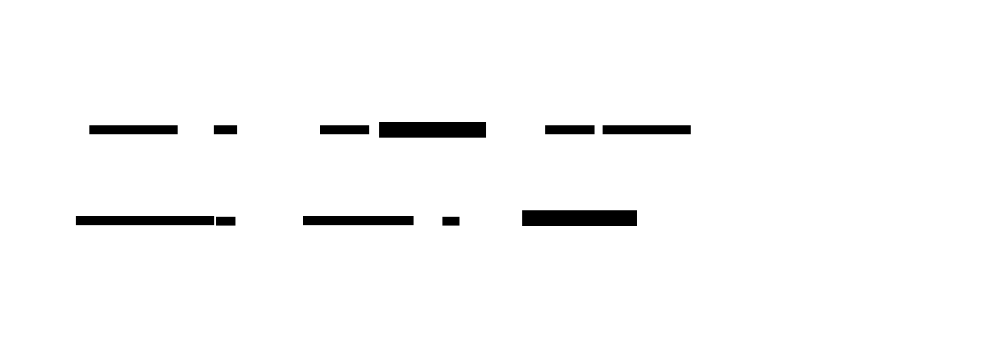

# Cache-Managed Strategies: Read-Through, Write-Through, Write-Behind

**Aliases:** Inline Cache, Cache-as-Service, Write-Behind / Write-Back Cache
**Category:** Caching
**Sources:**
[Microsoft Azure — Cache-Aside pattern (mentions alternatives)](https://learn.microsoft.com/en-us/azure/architecture/patterns/cache-aside) ·
[AWS — Database caching strategies](https://aws.amazon.com/caching/best-practices/) ·
Hazelcast / Ehcache / Caffeine documentation ·
*Operating System Concepts* (Silberschatz et al.) — write-back vs write-through in CPU caches ·
*Designing Data-Intensive Applications* (Kleppmann)

---

## Problem

> [!TIP]
> **ELI5.** [Cache-aside](cache-aside.md) makes the *application* responsible for all the cache logic — every read and every write has to remember to check, populate, and invalidate. That's a lot of boilerplate spread across the codebase, and it's easy to get wrong. The cache-managed strategies move the cache logic *into the cache layer itself*: the application talks only to the cache, and the cache handles loading from the DB (**read-through**), writing to the DB synchronously (**write-through**), or asynchronously (**write-behind**). Three different trade-offs of simplicity vs latency vs consistency vs durability.

The application code in cache-aside is full of repeated logic:

```python
# Every read looks like this, everywhere in the codebase
cached = cache.get(key)
if cached is None:
    cached = db.query(...)
    cache.set(key, cached, ttl=...)
return cached

# Every write looks like this
db.execute(...)
cache.delete(key)
```

This pattern is:
- **Repetitive** — easy to forget in one place; that one place becomes a stale-data bug.
- **Mixed concerns** — business logic and caching concerns interleaved.
- **Hard to change** — switching cache layers, TTL strategies, or invalidation rules requires touching every reader/writer.
- **Hard to monitor centrally** — hit rates, latency, stampede behavior are observed per-call-site.

The **cache-managed strategies** push this logic into the cache layer:

- **Read-Through**: the cache knows how to load from the DB on a MISS. Application calls only `cache.get(key)`.
- **Write-Through**: the cache knows how to write to the DB on a PUT. Application calls only `cache.put(key, value)`. The cache writes to the DB *synchronously* before acknowledging.
- **Write-Behind / Write-Back**: same API as write-through, but the cache acknowledges immediately and writes to the DB *asynchronously* (often batched).

These patterns assume a more sophisticated cache layer (with loaders/writers wired up to the underlying store). They're common in in-process caches like Caffeine, EHCache, Hazelcast; in some CDN configurations; and in CPU and SSD hardware (where write-back is standard).

## How it works

> [!TIP]
> **ELI5.** Same three patterns, three flows: the app always talks to the cache; the cache decides whether and when to talk to the DB. Read-through fetches on miss. Write-through writes immediately. Write-behind writes later.

### The comparison


### Read-Through

The cache layer is configured with a **loader function** — a way to fetch a value from the DB given a key. On every `cache.get(key)`:
1. If the key is in cache, return it.
2. If not, the cache invokes the loader, gets the value from DB, stores it, returns it.

The application never touches the DB on the read path.

```java
// Caffeine example
LoadingCache<UserId, User> cache = Caffeine.newBuilder()
    .maximumSize(10_000)
    .expireAfterWrite(Duration.ofMinutes(5))
    .build(userId -> db.getUserById(userId));   // loader

User u = cache.get(userId);   // cache decides MISS vs HIT internally
```

Benefits:
- Application code is dramatically simpler (one read API).
- Caching policy (TTL, eviction, refresh-ahead, stampede protection) is set once, applies everywhere.
- Many libraries provide built-in stampede protection (single-flight): concurrent MISSes for the same key trigger only one loader call.

Drawbacks:
- Requires a cache library with loader support (not bare Redis).
- The cache is on every read path; if the cache layer crashes, you lose all reads (vs cache-aside where reads can fall back to DB if cache is down).
- Less control: the cache decides when to populate; you can't easily skip cache for specific reads.

Read-through is most common in **in-process caches** (Caffeine, Guava, Ehcache, Hazelcast) where the loader is just a function call. With distributed caches like Redis, you need a proxy layer (or a smart client) to implement it.

### Write-Through

The cache layer is configured with a **writer function** — a way to persist a value to the DB. On every `cache.put(key, value)`:
1. The cache writes the value to the DB *synchronously* (blocking).
2. Only after the DB write succeeds does the cache update its own copy.
3. The cache returns ACK to the application.

```java
// Hazelcast write-through MapStore example
MapStoreConfig msc = new MapStoreConfig()
    .setImplementation(new UserMapStore(db))
    .setWriteDelaySeconds(0);  // 0 = synchronous = write-through
```

Benefits:
- **Cache and DB are always consistent** — they're updated together (atomic from the app's perspective).
- After a write, the cache has the new value; the next read is fast and correct.
- No stale-cache race window like in cache-aside.

Drawbacks:
- **Write latency = DB write latency + cache write latency**. Writes are no faster than direct-to-DB.
- **DB must be available** for writes to succeed. If the DB is down, writes fail (vs write-behind, which can buffer).
- Less benefit if your workload is read-heavy with rare writes — the writes are slow with no real upside.

Write-through is most useful when you want **read-after-write consistency** and the write rate is modest. Hibernate's second-level cache, Hazelcast IMap with `WriteThrough`, and many CDN configurations (for edge cache invalidation) use this.

### Write-Behind (Write-Back)

Same API as write-through, but the cache *defers* the DB write:
1. App calls `cache.put(key, value)`.
2. Cache stores the value in its own memory and enqueues a "write to DB" task.
3. Cache returns ACK *immediately*.
4. Later (after a delay, batch size, or flush trigger), the cache writes to the DB. Multiple writes to the same key may coalesce into one.

```java
MapStoreConfig msc = new MapStoreConfig()
    .setImplementation(new UserMapStore(db))
    .setWriteDelaySeconds(5)        // batch up writes for 5 seconds
    .setWriteBatchSize(1000)        // up to 1000 changes per batch
    .setWriteCoalescing(true);      // multiple writes to same key \u2192 one DB write
```

The flows side-by-side:



Benefits:
- **Very fast writes** — cache speed, not DB speed.
- **Burst smoothing** — DB sees averaged load, not spikes.
- **Write coalescing** — 100 updates to the same counter become one DB write.
- **DB outage tolerance** — writes succeed even if the DB is briefly unavailable.

Drawbacks (the big ones):
- **DATA LOSS RISK**: if the cache crashes between ACK and flush, the data is gone. The app thinks it succeeded; the DB never saw it.
- **Read-from-DB shows stale data** — within the flush window, the DB lags.
- **Complex failure handling** — retries, dead-letter queues for unflushable writes, recovery on crash.
- **Hard to debug** — when did the write actually persist? Was it lost?

Write-behind is the right choice when **occasional write loss is tolerable** or **the cache has its own durability**:

- **Metrics, counters, view counts**: losing a few updates from a 10K/sec stream is acceptable.
- **High-write OLAP staging**: data lands in cache, flushes to a warehouse in batches.
- **CPU caches (L1/L2/L3)**: write-back is the standard; durability comes from the cache itself (SRAM with battery backup or explicit flushing on power-loss).
- **SSD write caches**: same logic — DRAM write buffer flushed to NAND in batches with PLP (power-loss protection).
- **With durable cache** (Redis with AOF, RocksDB-backed cache): the cache itself is the source of truth until flushed; less loss risk.

### How to choose

A rough decision tree:

| Need | Strategy |
|---|---|
| Bare Redis/Memcached; full control; read-heavy | **Cache-Aside** ([its own page](cache-aside.md)) |
| Simple app code; in-process; read-heavy | **Read-Through** (often combined with refresh-ahead) |
| Read-after-write consistency essential | **Write-Through** |
| Very high write QPS; can tolerate small loss | **Write-Behind** |
| Counters, metrics, batched writes | **Write-Behind** with coalescing |
| Mostly stable data with rare changes | Any; choose by code-simplicity preference |

In practice many production systems use a **hybrid**: read-through for the read path + write-through for writes (consistent and simple) is a common pairing. Caffeine + a write-through wrapper is a typical Java microservice setup. Hazelcast IMap natively supports all four modes via configuration.

### Refresh-Ahead: a variant worth mentioning

A common read-through variant: **refresh-ahead**. The cache proactively refreshes entries *before* their TTL expires (e.g., when an entry is read and its remaining TTL is less than 20% of original). This prevents the latency spike of a MISS on a hot key and helps avoid stampedes.

```java
Caffeine.newBuilder()
    .refreshAfterWrite(Duration.ofMinutes(5))     // refresh-ahead
    .expireAfterWrite(Duration.ofMinutes(15))    // hard expiry
    .build(userId -> db.getUserById(userId));
```

The 5-minute refresh window catches most hot reads before they expire; the 15-minute hard TTL bounds staleness.

### Failure modes specific to each

**Read-through failure modes:**
- Loader exception → cache may serve stale value or error; behavior is library-specific.
- Loader latency spike → cache MISS becomes a slow operation; many concurrent MISSes can pile up.
- Cache layer crash → all reads fail (no cache-aside fallback).

**Write-through failure modes:**
- DB write failure → write fails entirely; app must retry.
- Slow DB → writes back up; queue depth grows; eventual write timeouts.
- Cache crash mid-write → ambiguous: did the DB get it? (Idempotency on retries matters.)

**Write-behind failure modes:**
- Cache crash with pending writes → **lost writes**. Critical.
- DB rejects a batched write → which item failed? Need careful batching with rollback or DLQ.
- Long DB outage → write queue grows; eventually OOMs the cache.
- Mixed read paths (some from cache, some from DB) see different values during the flush lag.

The cache-managed strategies are powerful but require thinking about these failure modes upfront.

---

## Variants & related patterns

| Variant | Difference |
|---|---|
| **[Cache-Aside](cache-aside.md)** | Application-managed; this page's main contrast. |
| **Read-Through** | Cache loads from DB on MISS; app sees only cache. |
| **Write-Through** | Cache writes DB synchronously before ACK. |
| **Write-Behind / Write-Back** | Cache acks immediately; flushes DB asynchronously. |
| **Refresh-Ahead** | Cache proactively refreshes near expiry. |
| **Write-Around** | Writes bypass cache (write to DB only); cache populates on next read. |
| **Two-Level Cache** | In-process (L1) + distributed (L2) — common Caffeine + Redis combo. |
| **Sliding-Window TTL** | TTL resets on read (keep-hot pattern). |
| **Eviction policies** | LRU, LFU, TinyLFU — orthogonal but related. |

## When NOT to use

- **Bare Redis without smart client** — you only have cache-aside available unless you build a wrapper.
- **Strict durability required for writes** — write-behind loses data on crashes.
- **Very write-heavy workload with high consistency needs** — write-through pays DB latency on every write.
- **Cross-process consistency required** — in-process caches (Caffeine) can disagree across instances; need invalidation or move to distributed cache.

---

## Real-world implementations

| Tool | Modes supported |
|---|---|
| **Caffeine** (Java) | Read-through (loader); refresh-ahead. |
| **Ehcache** (Java) | All four modes. |
| **Hazelcast IMap + MapStore** | Read-through, write-through, write-behind (config-driven). |
| **Apache Ignite** | All four modes; in-memory data grid. |
| **Oracle Coherence** | All four; classic in-memory data grid. |
| **Guava Cache** | Read-through (loader); refresh-ahead. |
| **NCache (.NET)** | All four. |
| **AWS DAX (for DynamoDB)** | Effectively write-through fronting DynamoDB. |
| **CPU caches (L1/L2/L3)** | Mostly write-back; some are write-through. |
| **SSDs with DRAM buffer** | Write-back with PLP for durability. |

## Companies / canonical uses

| Where | Use | Status |
|---|---|---|
| **LinkedIn** | Hazelcast/Coherence-style in-memory data grids with read-through. | ⚠ Mentioned in talks; specifics vary |
| **Goldman Sachs, banks** | In-memory data grids with all four modes. | ✅ Verified — Hazelcast / GridGain case studies |
| **High-frequency trading firms** | Write-behind for tick storage; durability via different mechanism. | ✅ Verified — multiple HFT engineering talks |
| **Many Java enterprise systems** | Hibernate L2 with read-through + write-through. | ✅ Common pattern; Hibernate docs |
| **Salesforce** | Internal use of in-memory data grids. | ⚠ Public mentions in talks |
| **CPU caches everywhere** | Write-back is the universal CPU cache standard. | ✅ Industry standard |
| **Modern SSDs** | Write-back with power-loss protection (Intel/Samsung/etc.). | ✅ Industry standard |

---

## Further reading

- Microsoft Azure Architecture Center — Cache-Aside pattern (compares alternatives).
- AWS Database Caching Strategies whitepaper — clear breakdown of all four patterns.
- Hazelcast IMap documentation — practical config for all four.
- Caffeine documentation — the modern Java read-through standard.
- Hennessy & Patterson, *Computer Architecture: A Quantitative Approach* — write-back vs write-through in hardware caches.
- *Designing Data-Intensive Applications* (Kleppmann), Ch 1 on caching trade-offs.
- *Operating System Concepts* (Silberschatz) — write-back semantics in storage.
- Apache Ignite documentation — distributed-cache write-behind.

---

*Diagram sources: [`../diagrams/src/cache-strategies-comparison.d2`](../diagrams/src/cache-strategies-comparison.d2), [`../diagrams/src/cache-strategies-flows.d2`](../diagrams/src/cache-strategies-flows.d2).*
