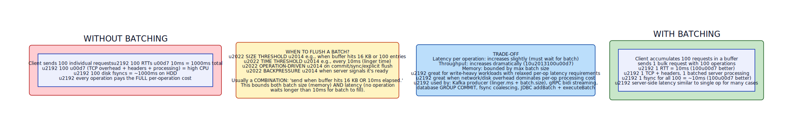
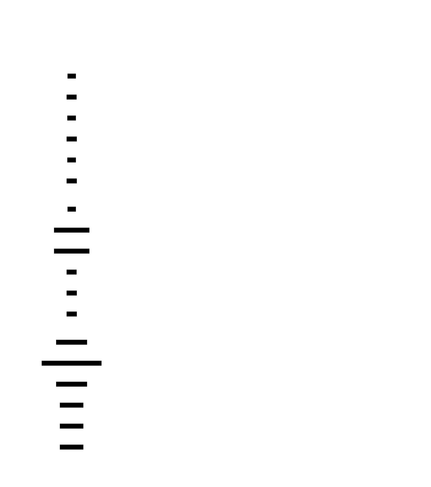

# Request Batching & Pipelining

**Aliases:** Request Batching, Request Pipelining, Group Commit, Network Coalescing, Multiplexing
**Category:** Communication / Performance
**Sources:**
[Joshi — Patterns of Distributed Systems](https://martinfowler.com/articles/patterns-of-distributed-systems/) — separate "Request Batch" and "Request Pipeline" patterns ·
Kleppmann *DDIA*, Ch 11 ·
[Kafka producer documentation](https://kafka.apache.org/documentation/#producerconfigs) ·
[HTTP/2 RFC 9113](https://datatracker.ietf.org/doc/html/rfc9113)

---

## Problem

> [!TIP]
> **ELI5.** Every individual request has fixed overhead — network round-trip, TCP handshake, header parsing, fsync, lock acquisition. If you send 1,000 requests one at a time, you pay this overhead 1,000 times. **Batching** combines many requests into one (1 overhead per 1000 ops). **Pipelining** sends many requests without waiting for replies (1 network round-trip total). Used together, they often turn a 10 ops/sec system into a 10,000 ops/sec system.

A distributed system has two fundamental per-operation costs:

- **Per-operation overhead**: each operation pays for its own TCP/TLS handshake, request parsing, authentication, header processing, response construction, locking, and (often) durability primitives like `fsync`. Even if the actual work per operation is microseconds, the overhead can be milliseconds.
- **Network round-trip time (RTT)**: each request that waits for a response before the next request can be sent serializes on RTT. Same-data-center RTT is ~1ms; cross-region is 50–200ms. A 100-call sequence with 50ms RTT takes 5 seconds.

For low-throughput workloads these overheads are negligible. For high-throughput systems they're catastrophic. Two patterns address them:

- **Batching** addresses **per-operation overhead** by combining many operations into one request.
- **Pipelining** addresses **RTT serialization** by issuing multiple in-flight requests without waiting for each response.

They're complementary, often used together, and together routinely deliver 10–100× throughput improvements on the same hardware.

## How it works

### Batching

> [!TIP]
> **ELI5.** Instead of sending each tiny operation individually, accumulate them in a buffer. When the buffer is full enough — or a timer expires — send the whole buffer as one big request. The server processes 100 operations in one go; you paid one set of network/disk/parsing overheads for 100 operations' worth of work.

A client buffers individual operations locally. When a flush trigger fires, the buffer is sent as a single bulk request. The server processes all operations in the batch and returns a single bulk response.

The flush triggers are usually a combination:

- **Size threshold** — flush when the buffer reaches some byte or count limit (e.g., 16 KB or 100 entries).
- **Time threshold (linger)** — flush after a small wait even if the buffer isn't full (e.g., 10ms maximum delay).
- **Operation-driven** — flush on explicit `commit()`, `sync()`, or `close()`.
- **Backpressure-driven** — flush when the server signals readiness.

The combination "flush when buffer hits 16 KB **or** 10ms has elapsed" bounds **both** the batch size (memory consumption, queueing behavior) **and** the latency (no operation waits longer than 10ms in the buffer).

The trade-off is **latency for throughput**: an individual operation must wait — at most the linger time — before its batch is sent. For write-heavy workloads where the per-op overhead dominates the actual work, this trade is enormously favorable. Kafka producers, by default, will accumulate up to `batch.size` (16 KB) bytes or wait `linger.ms` (default 0, often set to 5–50ms in production) — turning thousands of individual `send()` calls into a few large network requests.

Specific concrete cases:

- **Database group commit**: many concurrent transactions are committed together with a single shared `fsync`. Used by PostgreSQL (`commit_delay`), MySQL (`binlog_group_commit_sync_delay`), and almost every modern engine. Turns 1 fsync/transaction into 1 fsync/group, often 10–100× throughput improvement.
- **JDBC `addBatch` + `executeBatch`**: combines many INSERT/UPDATE statements into one network round-trip.
- **Kafka producer batching**: a single batched send carries thousands of small messages.
- **gRPC stream batching**: server-side batching of incoming requests for processing in groups.
- **Vector/bulk operations in databases**: `INSERT ... VALUES (...), (...), (...)` (multi-row) instead of N single-row inserts.

### Pipelining

> [!TIP]
> **ELI5.** Don't wait for the server to reply before sending the next request. Just keep sending. The server processes them in order and replies in order. You paid 1 RTT for everything you sent in the burst, not 1 RTT per request.

A pipelined client sends a stream of requests without waiting for responses. The server processes and responds; the client matches responses to requests by order (or by request ID) when they arrive.

Without pipelining (sequential), each request must wait for the previous response before being sent — N requests cost N RTTs of latency. With pipelining, the entire burst of requests goes out back-to-back, and the responses come back back-to-back — N requests cost ~1 RTT + (server processing time × N). For high-RTT or many-request workloads, pipelining is essentially free throughput.

Pipelining requires:
- **Ordered or correlated responses**: the client must be able to match each response to the corresponding request. Most protocols handle this by maintaining FIFO order; some (HTTP/2, gRPC) use stream IDs / sequence numbers explicitly.
- **Server-side queue management**: the server must accept queued requests and process them — typically into a [singular update queue](../block/singular-update-queue.md).
- **Pipeline depth control**: too many in-flight requests can overload the server or run into TCP backpressure. Producers limit max-in-flight (Kafka `max.in.flight.requests.per.connection`, default 5).

Specific uses:

- **HTTP/2 multiplexing**: multiple streams over one TCP connection, pipelined. The killer feature of HTTP/2 over HTTP/1.1.
- **Redis pipelining**: a Redis client can send many commands back-to-back; Redis processes them serially and replies serially. 10–100× throughput vs round-trip-per-command.
- **gRPC bidi streaming**: bidirectional streams allow continuous in-flight requests in both directions.
- **Kafka producer in-flight**: by default sends up to 5 in-flight batches per connection without waiting.
- **Kafka follower fetch**: followers continuously have an outstanding fetch request to leaders — the response triggers the next request immediately.
- **TCP itself**: the sliding window protocol is pipelining at the transport layer.

### Combined: batching + pipelining

Most production systems use both:

- The client batches many small operations into 1 large request (reducing per-op overhead).
- The client pipelines multiple batches in-flight (reducing RTT serialization).
- Net effect: 1000 individual ops become, say, 10 batched + pipelined requests, costing roughly the time of 1 RTT + 10× batch processing.

Kafka, gRPC, and HTTP/2 are all designed this way. The combined effect is dramatic — often the difference between "this system is unusably slow" and "this system saturates the network."

### The latency tax (and how to mitigate it)

Batching trades latency for throughput. A single small request that arrives during a batch's accumulation phase must wait for the batch to fill. For write-heavy workloads this is fine; for latency-sensitive workloads (interactive UIs, real-time bidding) it can be unacceptable.

Mitigations:

- **Adaptive batching**: when load is light, send immediately; when load is heavy, batch aggressively. Auto-tune the linger window based on observed throughput.
- **Per-operation priority**: latency-sensitive operations bypass the batch; bulk operations use it.
- **Small linger times**: 5–10ms is often enough to harvest most of the batching benefit while keeping latency human-imperceptible.
- **Synchronous flush API**: let the application explicitly request "send now" for critical operations.

The fact that batching is *configurable* in most systems — Kafka's `linger.ms`, Postgres's `commit_delay`, gRPC's batching middleware — exists precisely because the right trade-off varies per workload.

### Where it matters most

Batching and pipelining are highest-impact when:

- **Per-op overhead is large relative to actual work** (small operations).
- **Network is slow relative to local processing** (cross-region, mobile, satellite).
- **Disk fsync is the bottleneck** (group commit dominates many databases' throughput).
- **Throughput matters more than tail latency** (analytics, ingestion, ETL).

They're less valuable for:

- **Large individual operations** where per-op overhead is negligible.
- **Highly latency-sensitive operations** where any added delay matters more than throughput.
- **Operations with strict ordering or causality constraints** that prevent batching across them.

---

## Variants & related patterns

| Variant | Difference |
|---|---|
| **Batching by size** | Flush when buffer reaches N bytes/entries. |
| **Batching by time (linger)** | Flush after N ms regardless of size. |
| **Combined size + time** | Production default — flush on whichever first. |
| **Adaptive batching** | Tune dynamically based on load. |
| **Group commit** | Database-specific name for fsync batching. |
| **Multiplexing** | Network-level pipelining (HTTP/2 streams, gRPC streams). |
| **Sliding window** | TCP's per-packet pipelining; foundational. |
| **Coalescing writes** | OS-level batching of dirty pages before disk flush. |
| **Request hedging** | Sometimes paired — send duplicate request to fastest replica. |
| **Backpressure** | Required for unbounded pipeline depth to avoid OOM. |

## When NOT to use

- **One-off interactive operations** where latency matters more than throughput.
- **Operations that strictly cannot be reordered or combined** — though pipelining preserves order, batching may not.
- **Tiny working sets** where the per-op overhead is already negligible.
- **When the batched API doesn't exist** at the server side — client-side batching helps the network round-trip but not the server's per-op work.

---

## Real-world implementations

| System | Batching / pipelining |
|---|---|
| **Apache Kafka producer** | `linger.ms` + `batch.size` for batching; `max.in.flight.requests.per.connection` for pipelining. |
| **Apache Kafka follower fetch** | Continuous in-flight fetch — pure pipelining. |
| **PostgreSQL** | `commit_delay` for group commit. |
| **MySQL** | Binary log group commit; `innodb_flush_log_at_trx_commit` variants. |
| **HTTP/2** | Stream multiplexing — pipelining at HTTP layer. |
| **gRPC** | Server streaming, client streaming, bidi streaming. |
| **Redis** | Pipelining via client API; one command per line over TCP. |
| **JDBC** | `addBatch()` / `executeBatch()`. |
| **TCP** | Sliding window is pipelining at transport. |
| **Linux fsync coalescing** | Multiple writes from one process coalesce into one disk flush. |
| **Apache Cassandra** | Coordinator-side batching of writes within a partition. |
| **Spark / Flink** | Micro-batching is at the heart of the streaming model. |

## Companies / canonical uses

| Where | Use | Status |
|---|---|---|
| **LinkedIn / Confluent / Kafka users (Uber, Netflix, Pinterest, Shopify, etc.)** | Batching + pipelining are the default for Kafka producers; trillions of messages/day. | ✅ Verified — Kafka producer config docs and engineering blogs |
| **Cloudflare** | HTTP/2 multiplexing is a key piece of their performance story; multiple blog posts on it. | ✅ Verified — [Cloudflare blog on HTTP/2](https://blog.cloudflare.com/tools-for-debugging-testing-and-using-http-2/) |
| **Google** | Spanner, BigQuery, GCS — heavy batching and pipelining for high-throughput operations; gRPC pioneered open-source bidi streaming. | ✅ Verified — gRPC project + Spanner paper |
| **Stripe** | Group commit + idempotent batching is core to API reliability at scale. | ✅ Verified — [Stripe engineering blog on idempotency](https://stripe.com/blog/idempotency) |
| **Almost every database vendor** | Group commit is a standard fsync-coalescing technique. | ✅ Universal — see vendor docs |

---

## Further reading

- Joshi, *Patterns of Distributed Systems*, "Request Batch" + "Request Pipeline" patterns (separate entries in the catalog).
- Kafka producer documentation, especially the `linger.ms` and `batch.size` sections — the most operationally-detailed public discussion.
- HTTP/2 RFC 9113 — describes multiplexing (= pipelining) over a single TCP connection.
- Kleppmann, *Designing Data-Intensive Applications*, Ch 11 (Stream Processing) — covers batching/streaming trade-offs at the architectural level.
- *High Performance Browser Networking*, Ilya Grigorik — Ch on HTTP/2 explains multiplexing in depth.
- The Cloudflare engineering blog has multiple deep posts on HTTP/2 and gRPC performance.
- Brendan Gregg's blog and *Systems Performance* book — measurement perspective on where batching helps.

---

*Diagram sources: [`../diagrams/src/request-batching.d2`](../diagrams/src/request-batching.d2), [`../diagrams/src/request-pipelining.d2`](../diagrams/src/request-pipelining.d2).*
