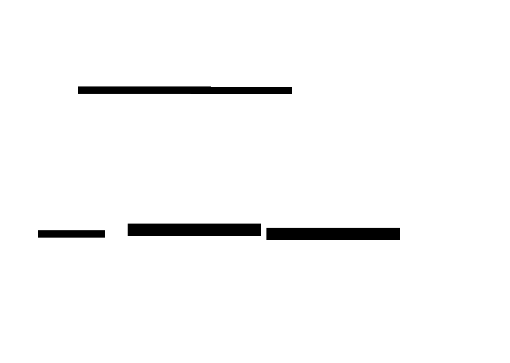
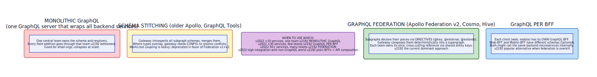

# GraphQL Federation

**Aliases:** Federated GraphQL, Apollo Federation, Federated Schema, Subgraph Federation
**Category:** Communication / API design
**Sources:**
[Apollo GraphQL — Federation 2 documentation](https://www.apollographql.com/docs/federation/) ·
[GraphQL Foundation — Federation specification](https://github.com/graphql/composite-schemas-spec) ·
Discussion in Sam Newman, *Building Microservices* (2nd ed.) ·
[ByteByteGo — GraphQL Federation explainer](https://blog.bytebytego.com/p/api-architecture-styles)

---

## Problem

> [!TIP]
> **ELI5.** A microservices org has 50+ services. Clients want one unified API, not 50 separate ones. The naive answer: one big GraphQL server that knows all services. But that server becomes a bottleneck — every team has to coordinate with the central GraphQL team to ship a feature. **GraphQL Federation** lets each service team own its own piece ("subgraph") of one giant unified schema; a router composes them on the fly. Clients see one graph; teams stay independent.

GraphQL gives clients an enormously powerful query interface: "ask for exactly the data you need, in one round-trip, across what the server presents as a unified data model." For frontend developers, this is transformative — no more over-fetching, no more N round-trips.

The challenge in a microservices architecture: **who builds and owns the unified schema?** Three bad options have plagued large GraphQL adopters:

- **Monolithic GraphQL server**: one team owns the entire schema and writes resolvers that call all backend services. Quickly becomes a bottleneck — every new field requires that team's involvement.
- **Schema stitching**: gateway combines multiple GraphQL servers' schemas at runtime. Works but coupling is heavy; the stitching layer needs awareness of type overlaps; deprecated by Apollo.
- **Multiple separate GraphQL servers**: each team has its own; clients have to know which to call. Defeats the purpose of unified API.

**GraphQL Federation** is the modern answer. Each backend service team owns a **subgraph** — a small GraphQL schema covering their domain. A **federation gateway** composes all subgraphs into one unified **supergraph** that clients see as a single API. Teams can extend each other's types without coordination; the gateway figures out the cross-subgraph query plan.

The pattern was created and popularized by **Apollo** (Federation v1 in 2019, Federation v2 in 2022); other implementations include **Cosmo Router** (WunderGraph), **GraphQL Mesh**, **Hasura Remote Schemas**, and **GraphQL Hive**.

## How it works

> [!TIP]
> **ELI5.** Each service exposes its piece of the schema with directives like `@key` (to declare "this is my Customer type, identified by id") and `@extends` (to say "I'm adding fields to the Customer type that lives elsewhere"). The gateway gathers all subgraph schemas, composes them, and routes queries: when a client asks for a Customer's name + orders + loyalty, the gateway calls each subgraph in parallel and stitches the result.

The basic structure:



**Each subgraph** declares its slice of the schema. The Customers service:

```graphql
type Customer @key(fields: "id") {
  id: ID!
  name: String!
  email: String!
}
```

The Orders service extends `Customer`:

```graphql
extend type Customer @key(fields: "id") {
  id: ID! @external
  orders: [Order!]!
}
type Order {
  id: ID!
  total: Float!
}
```

The Loyalty service also extends `Customer`:

```graphql
extend type Customer @key(fields: "id") {
  id: ID! @external
  loyaltyTier: String!
  points: Int!
}
```

Three teams, three subgraphs, all contributing to one logical `Customer` type. None of them needed to coordinate with the others.

**The federation gateway** (Apollo Router, Cosmo Router, etc.) composes these into the supergraph. When a client sends:

```graphql
query {
  customer(id: 42) {
    name
    orders { total }
    loyaltyTier
  }
}
```

The gateway:
1. Consults the composed supergraph to know which fields come from which subgraph.
2. Builds a **query plan**: "First get name from Customers; then in parallel, get orders from Orders and loyaltyTier from Loyalty, both keyed by customer id."
3. Dispatches sub-queries in parallel.
4. Stitches the responses — resolving the entity references across subgraphs.
5. Returns one unified response to the client.

The client never knew there were three services involved.

### The `@key` directive: identity across subgraphs

The pattern's keystone is **entity identity**. The `@key(fields: "id")` directive declares that a type is uniquely identified by its `id` field. Other subgraphs can extend this type using the same key. The gateway uses these keys to route reference-resolution queries between subgraphs.

This is what makes federation different from naive schema stitching: federation is **type-aware**. The gateway doesn't just merge schemas; it understands that the `Customer` in three subgraphs is the same entity, and orchestrates cross-subgraph queries accordingly.

### Compared to alternatives

The space of "how to expose multiple services as one API" has several occupants:



**Monolithic GraphQL**: one team owns everything. Works for small orgs; collapses at scale due to coordination cost.

**Schema stitching**: predecessor to federation. Less principled about type overlaps; deprecated.

**Federation**: each team owns a subgraph; deterministic composition; current dominant approach for large orgs.

**GraphQL per BFF**: each client has its own GraphQL server; backend services are accessed via plain APIs underneath. Popular alternative when federation is overkill.

**Plain BFFs + API composition**: see [API Composition](api-composition.md) — non-GraphQL alternative.

A rough sizing guide:
- **<10 services, one team**: monolithic GraphQL.
- **<30 services, few teams**: GraphQL per BFF.
- **50+ services, many teams**: federation.
- **Mixed GraphQL/non-GraphQL world**: plain BFFs + API composition.

### Operational considerations

Federation is real distributed-systems infrastructure:

- **Schema composition** must happen safely. Federation v2 has formal composition rules; v1 was looser and more error-prone. Use v2.
- **Versioning subgraphs**: deploying a subgraph version that breaks composition must fail before reaching production. **Schema checks** (Apollo Studio, Hive) verify proposed subgraph changes against current and other subgraphs.
- **Query planning** is expensive at runtime. Gateway should cache plans aggressively.
- **Partial failure**: if one subgraph is down, what happens? Federation gives options — fail the whole query, return null for the affected fields, return partial data with errors. Default behavior depends on the gateway.
- **Tracing and observability**: a single client query may touch 5+ subgraphs. Distributed tracing is essential. Apollo, Cosmo, and others provide per-subgraph latency, error rate, and query analytics.
- **Caching is harder**: cache invalidation across federated boundaries is non-trivial.
- **Cost-aware planning**: large queries can fan out to dozens of subgraphs; gateways can compute and enforce query-cost limits.

### Performance characteristics

Federation gateway adds:
- **Composition latency**: typically 1–5ms for plan + execution coordination.
- **Subgraph call latency**: max of subgraph latencies (parallel).
- **Network hops**: client → gateway → N subgraphs → gateway → client.

For most workloads, this is small. For extremely latency-sensitive paths, BFF-per-service or direct gRPC may be faster.

### When federation is the right choice

Federation shines when:

- You have many backend services (10+) and want to expose them as one API.
- You have multiple teams, each owning their domain.
- You want each team to ship changes to their subgraph without central coordination.
- You're committed to GraphQL as the client interface.
- You have operations capacity to run the federation infrastructure.

It's overkill when:

- You have a small number of services.
- One team can own the whole API.
- Your client APIs are heterogeneous (some GraphQL, some REST, some gRPC).
- Your queries are simple enough that BFFs suffice.

### The maturity curve

Most orgs that adopt federation go through:

1. **One backend, monolithic GraphQL**: start simple.
2. **Multiple GraphQL services, BFF-per-client**: as services grow.
3. **Schema stitching or early federation**: as cross-cutting queries become common.
4. **Mature federation**: when you have dozens of subgraphs and want each team independent.
5. **Federation + governance**: large orgs add organization-wide standards, naming conventions, deprecation policies.

The transition from step 2/3 to step 4 is the most painful — that's when teams have to learn federation's mental model and operational practices.

### The future

GraphQL Federation has been adopted heavily but isn't universal. Modern alternatives and complements:

- **WunderGraph Cosmo Router**: Apollo Router alternative; emphasis on observability.
- **GraphQL Hive**: open-source schema registry + analytics.
- **Stellate (formerly GraphCDN)**: GraphQL-aware CDN.
- **Mesh / Hasura**: hybrid that includes federation but also REST and gRPC.
- **Conductor (Kit)**: gateway/router space is competitive.

The **composite schemas specification** by the GraphQL Foundation is standardizing federation across implementations — a healthy direction for the ecosystem.

---

## Variants & related patterns

| Variant | Difference |
|---|---|
| **Apollo Federation v2** | Current dominant federation spec. |
| **Schema Stitching (deprecated)** | Predecessor; runtime merging. |
| **Apollo Federation v1** | Older; replaced by v2. |
| **Cosmo Router** | Open-source federation router (WunderGraph). |
| **GraphQL Mesh** | Hybrid: federate GraphQL + REST + gRPC + OpenAPI. |
| **Hasura Remote Schemas** | Hasura's federation feature. |
| **Composite Schemas Spec** | Standardization effort. |
| **Monolithic GraphQL** | Pre-federation: one big server. |
| **GraphQL per BFF** | Per-client GraphQL servers; lighter alternative. |
| **API Composition** | Non-GraphQL alternative for similar goal. |

## When NOT to use

- **Small system** — overkill.
- **Heterogeneous APIs** (mix of GraphQL/REST/gRPC) — federation works best in pure GraphQL.
- **Latency-critical** paths where the gateway hop matters.
- **Without operations capacity** for the federation tooling.
- **Without GraphQL adoption** in the org — don't introduce GraphQL just for federation.

---

## Real-world implementations

| Tool | Notes |
|---|---|
| **Apollo Federation v2 + Apollo Router** | The reference implementation; widely adopted. |
| **GraphOS (Apollo)** | Apollo's hosted schema registry + dev experience. |
| **WunderGraph Cosmo** | Open-source Apollo alternative; emphasis on observability. |
| **GraphQL Hive** | Open-source schema registry + analytics. |
| **GraphQL Mesh** | Federation + multi-protocol gateway. |
| **Hasura Remote Schemas** | Federation feature in Hasura. |
| **Stellate (formerly GraphCDN)** | GraphQL-aware CDN. |
| **Bramble** | Older Go-based federation gateway. |
| **Inigo** | GraphQL gateway with security focus. |

## Companies / canonical uses

| Where | Use | Status |
|---|---|---|
| **Apollo customers (Netflix, Expedia, PayPal, Walmart, Wayfair)** | Federation in production at scale. | ✅ Verified — [Apollo customer stories](https://www.apollographql.com/customers) |
| **Netflix Studio Engineering** | Public talks describing Federation use for studio applications. | ✅ Verified — Netflix Tech Blog and InfoQ talks |
| **PayPal** | Public engineering posts on Federation adoption. | ✅ Verified — PayPal Engineering blog |
| **GitHub** | GraphQL API (not federated; monolithic GraphQL). Counter-example worth knowing. | ✅ Verified — GitHub GraphQL API docs |
| **Airbnb** | Niobe — internal GraphQL platform; uses federation principles. | ✅ Verified — Airbnb Engineering blog |
| **Wayfair, IBM, Shopify (some areas)** | Various public-talk references. | ⚠ Specific adoption levels vary |
| **The Trade Desk, Audi, Cars.com** | Public talks describing Federation use. | ✅ Verified — Apollo conference talks |

---

## Further reading

- Apollo Federation documentation — [apollographql.com/docs/federation](https://www.apollographql.com/docs/federation/). The most comprehensive resource.
- *Principled GraphQL* (Apollo) — design principles, including federation's rationale.
- *GraphQL in Action* (Samer Buna) — broader GraphQL with federation chapters.
- Sam Newman, *Building Microservices* (2nd ed.) — discusses federation in the microservices context.
- Composite Schemas Spec (GraphQL Foundation) — standardization effort.
- WunderGraph and GraphQL Hive blogs — alternative perspectives.
- Multiple Apollo conference talks (GraphQL Summit) on federation in production.

---

*Diagram sources: [`../diagrams/src/graphql-federation.d2`](../diagrams/src/graphql-federation.d2), [`../diagrams/src/federation-vs-alternatives.d2`](../diagrams/src/federation-vs-alternatives.d2).*
