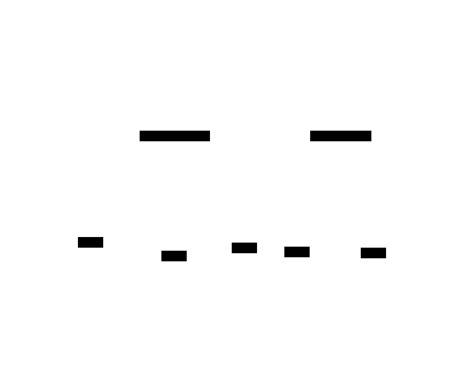
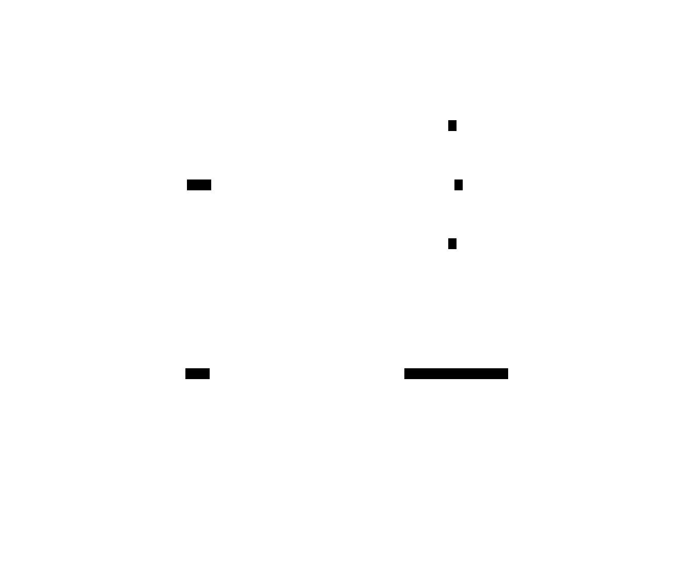

# Publish-Subscribe (Pub-Sub)

**Aliases:** Pub/Sub, Topic-based Messaging, Event Bus, Fan-out
**Category:** Communication
**Sources:**
[Microsoft Azure](https://learn.microsoft.com/en-us/azure/architecture/patterns/publisher-subscriber) ·
[Neo Kim](https://systemdesign.one/system-design-interview-cheatsheet/) ·
[ByteByteGo](https://github.com/ByteByteGoHq/system-design-101)

---

## Problem

> [!TIP]
> **ELI5.** When something happens in your service ("an order was placed"), several other teams want to know — billing, inventory, analytics, the email service. You don't want to call each of them by name (you'd need to know they exist, where they live, and how to talk to each one). Instead, announce it on a bulletin board everyone subscribes to.

If a service that emits notable events ("order placed", "user signed up") calls every interested service directly, several bad things happen. **Coupling**: the producer must know about every consumer, their endpoints, their auth, and their availability. **Brittleness**: adding a new consumer requires changing the producer. **Latency amplification**: the producer waits for N consumers to respond before its own work completes. **Failure entanglement**: one slow or down consumer blocks the producer.

What you want is a way for a service to **announce that something happened**, and let any number of *currently interested* — or *future* — services react, without the producer knowing who they are.

## How it works

> [!TIP]
> **ELI5.** A **broker** in the middle holds **topics** (channels). Publishers drop messages onto a topic. Anyone who subscribed to that topic gets a copy. Publishers never talk to subscribers directly, and don't even know who they are or how many.

A pub-sub system introduces a **broker** between message producers (publishers) and consumers (subscribers). Messages are sent to named **topics** rather than to specific recipients. Subscribers express interest by subscribing to topics, and the broker delivers a copy of each published message to every current subscriber of that topic.

In the topology above, the **Orders Service** publishes `OrderPlaced` events to the `order-events` topic. The **Inventory Service** publishes `StockLow` events to the `stock-events` topic. The broker (Kafka, SNS, NATS, RabbitMQ in fanout mode) holds both topics. Three subscribers (Billing, Shipping, Analytics) listen on `order-events`; each receives **every** message published there. The Analytics service additionally listens on `stock-events`, and the Notifier service listens only on `stock-events`. Publishers and subscribers never see each other — only the broker. Adding a fifth service that needs to react to orders is a config change with no code touching the Orders Service.

The pattern's key power is **temporal decoupling**: the publisher and subscriber don't have to be available at the same moment. The publisher fires the message and moves on; the broker holds it. Whenever a subscriber comes online (or has capacity), the broker delivers. Modern brokers like Kafka go further and **retain** messages on disk for days or weeks, so subscribers can rewind to re-process history — supporting both real-time consumption and replay-based recovery.

Pub-sub is sometimes confused with message queues. The distinction is crucial:

In **pub-sub** (left), every subscriber gets every message — the model is *fan-out*, intended for "tell everyone." Each subscriber maintains its own position in the topic; they don't compete.

In a **work queue** (right), exactly one consumer gets each message — the model is *load balancing*, intended for "tell exactly one available worker to do this." Multiple workers consume from the queue and **compete** for messages; the broker hands each message to the first available worker.

The two patterns serve different needs. "An order was placed" is pub-sub (everyone interested should hear it). "Resize this image" is a queue (only one worker should resize it). The same broker (Kafka, RabbitMQ, AWS SQS+SNS) typically supports both — Kafka's "consumer groups" let a single topic deliver each message once per group (queue semantics within a group) while still fanning out across groups (pub-sub semantics across groups).

Two design rules emerge from production experience. First: **events should describe what happened, not what should happen next** — `OrderPlaced`, not `ChargeCard`. The latter couples the publisher to a particular consumer's behavior; the former lets new consumers attach without changing anything upstream. Second: **schemas must evolve safely**. Events outlive any single deploy of any single service. A schema registry (Confluent Schema Registry for Kafka, AWS Glue, Apicurio) and a discipline of additive-only changes prevent the "we added a required field and broke 12 downstream consumers" incident.

---

## Variants & related patterns

| Variant | Difference |
|---|---|
| **Topic-based** | Standard model — subscribe by topic name (most common). |
| **Content-based / Filter-based** | Subscriber attaches a predicate (`type == 'premium' AND region == 'EU'`); broker delivers only matching messages. AWS SNS filter policies, Google Pub/Sub filters. |
| **Hierarchical topics** | Wildcards over a topic hierarchy (MQTT's `sensors/+/temperature`). Common in IoT. |
| **Durable subscriptions** | Subscriber's position persists across restarts; messages buffered while it's offline. Kafka's default. |
| **Transient subscriptions** | Messages while-you're-connected only. WebSocket pub-sub, Redis Pub/Sub. |
| **Competing Consumers** | The work-queue model in the diagram above — see [pattern](idempotent-consumer.md). |
| **Event-Driven Architecture** | The architectural style built on pub-sub at scale — services react to events, not commands. |
| **Choreography Saga** | A specific use of pub-sub for distributed transactions ([saga.md](../data/saga.md)). |

## When NOT to use

- **When the producer needs the response.** Pub-sub is fire-and-forget; if you need a reply, use request/response (with a queue for async reply-tracking if needed).
- **When ordering across many topics matters.** Most brokers guarantee order *within a partition/topic*, not across. Cross-topic consistency requires careful design.
- **When the subscriber set is one and stable** — a direct call is simpler than introducing a broker.
- **When exactly-once delivery is critical and you can't tolerate retries.** Most brokers offer *at-least-once*; exactly-once requires idempotent consumers and is hard.

---

## Real-world implementations

| Broker | Notes |
|---|---|
| **Apache Kafka** | The dominant durable pub-sub at scale. Partitioned topics, consumer groups, weeks of retention, exactly-once with transactions. |
| **AWS SNS + SQS** | SNS for pub-sub, SQS for queues; very commonly used together (SNS to fan out, SQS per consumer). |
| **Google Cloud Pub/Sub** | Managed global pub-sub; auto-scaling; filter support. |
| **Azure Event Grid / Service Bus / Event Hubs** | Three different pub-sub services for different latencies and scales. |
| **NATS / JetStream** | Lightweight, very low latency; JetStream adds Kafka-like durability. |
| **RabbitMQ** | AMQP broker; supports queues, fanout, topic, and headers exchanges (covers both pub-sub and work-queue). |
| **Apache Pulsar** | Kafka competitor with better multi-tenancy and tiered storage. |
| **Redis Pub/Sub / Streams** | Pub/Sub for transient fan-out; Streams for durable ordered logs (Kafka-lite). |
| **MQTT brokers (Mosquitto, EMQX, HiveMQ)** | The standard for IoT pub-sub. |

## Companies using it (notable examples)

| Company | Use | Status |
|---|---|---|
| **LinkedIn** | Built Kafka in 2010 specifically to solve their pub-sub problem at scale. Open-sourced it; now runs hundreds of Kafka clusters internally. | ✅ Verified — [Kreps et al., *Kafka: a Distributed Messaging System for Log Processing*, NetDB 2011](https://www.microsoft.com/en-us/research/wp-content/uploads/2017/09/Kafka.pdf) |
| **Uber** | Operates one of the largest Kafka deployments globally (trillions of messages/day across thousands of topics). | ✅ Verified — [Uber Engineering, *uReplicator: Uber Engineering's Robust Apache Kafka Replicator*, 2018](https://www.uber.com/blog/ureplicator-apache-kafka-replicator/) |
| **Netflix** | Keystone pipeline processes ~7 trillion events/day on Kafka. | ✅ Verified — [Netflix Tech Blog, *Keystone Real-time Stream Processing Platform*, 2018](https://netflixtechblog.com/keystone-real-time-stream-processing-platform-a3ee651812a) |
| **Slack** | Uses Kafka for its job queue and event bus. | ✅ Verified — [Slack Engineering, *Scaling Slack's Job Queue*, 2020](https://slack.engineering/scaling-slacks-job-queue/) |
| **Shopify** | Uses Kafka extensively + Pub/Sub for analytics ingestion. | ✅ Verified — [Shopify Engineering — multiple posts on Kafka use](https://shopify.engineering/) |
| **Pinterest** | Major Kafka user for activity stream + analytics. | ⚠ Pinterest Engineering blog posts; not re-verified for this document |

---

## Further reading

- Jay Kreps, *The Log: What every software engineer should know about real-time data's unifying abstraction* (2013) — [LinkedIn Engineering](https://engineering.linkedin.com/distributed-systems/log-what-every-software-engineer-should-know-about-real-time-datas-unifying). The intellectual foundation for modern pub-sub thinking.
- Kleppmann, *Designing Data-Intensive Applications*, Ch 11 (Stream Processing).
- *Designing Event-Driven Systems*, Ben Stopford (O'Reilly, 2018) — free PDF — applied event-driven architecture with Kafka.
- Martin Fowler, *What do you mean by "Event-Driven"?* — [martinfowler.com/articles/201701-event-driven.html](https://martinfowler.com/articles/201701-event-driven.html).
- Microsoft Azure Architecture Center, *Publisher-Subscriber pattern*.

---

*Diagram sources: [`../diagrams/src/pubsub-topology.d2`](../diagrams/src/pubsub-topology.d2), [`../diagrams/src/pubsub-vs-queue.d2`](../diagrams/src/pubsub-vs-queue.d2).*
