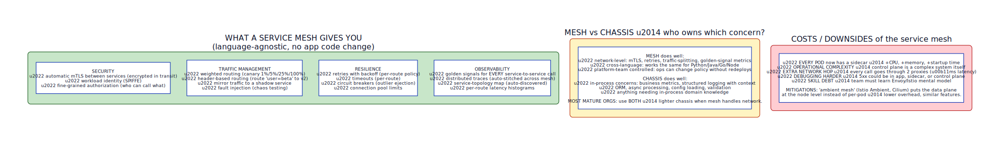

# Service Mesh

**Aliases:** Mesh, Data Plane + Control Plane, Service Connectivity Layer
**Category:** Communication / Infrastructure
**Sources:**
[Microsoft Azure Architecture Center — Service Mesh](https://learn.microsoft.com/en-us/azure/aks/servicemesh-about) ·
[William Morgan, *What's a service mesh? And why do I need one?* (Buoyant, 2017)](https://buoyant.io/blog/whats-a-service-mesh-and-why-do-i-need-one) ·
[Istio documentation](https://istio.io/latest/docs/concepts/what-is-istio/) · [Linkerd documentation](https://linkerd.io/2/overview/)

---

## Problem

> [!TIP]
> **ELI5.** A microservices system has hundreds of services calling each other. Each call needs to be encrypted, retried on failure, traced for debugging, and rate-limited. Writing all that in every service (in every language) is hopeless. The **service mesh** is infrastructure that handles all of it transparently — a [sidecar](sidecar.md) proxy next to each service intercepts every call and applies the policies, with a control plane that pushes configuration. Your app code stays clean.

A microservices architecture has many services calling each other — often hundreds or thousands of services, with millions of inter-service calls per second. Each call ideally has:

- **mTLS encryption** between services (zero trust).
- **Retries on transient failure** with backoff.
- **Timeouts** to prevent unbounded waits.
- **Circuit breakers** to stop calling a sick downstream.
- **Traffic splitting** for canary deployments.
- **Observability** — golden signals (latency, traffic, errors, saturation), distributed traces, topology maps.
- **Authorization** — which services may call which others, on which paths.

Implementing all of this in application code is a nightmare:

- **Multiplied across languages.** Python, Java, Go, Node, Rust, .NET — each needs its own implementation.
- **Multiplied across teams.** Hundreds of teams implementing the same thing differently.
- **Centralized policy is hard.** "Increase retries to Service X" requires changes in every caller.
- **Versions drift.** Service A is using v1 of the retry library; service B is using v2 with different semantics. Inconsistent behavior under failure.
- **Quality bimodal.** A few teams do it well; most do it badly.

The [Microservice Chassis](../arch/microservice-chassis.md) pattern partially addresses this with a per-language framework. But chasses still need to be maintained per language, and many cross-cutting concerns (mTLS, traffic splitting) really want to live *outside* the application process. The **service mesh** moves these concerns into the infrastructure layer entirely, decoupling them from application code and language.

## How it works

> [!TIP]
> **ELI5.** Put a tiny proxy (Envoy, Linkerd-proxy) into every pod, alongside the app — a [sidecar](sidecar.md). Configure the pod so that *all* network traffic in and out of the app goes through this proxy first. The proxies form the **data plane**: they handle mTLS, retries, circuit breakers, metrics. A separate **control plane** (Istiod, Linkerd's controller) tells all the proxies what to do — pushing routing rules, certificates, policies. App code is unchanged; the mesh transparently upgrades every call.

A service mesh has two architectural layers:

**The data plane** is the set of sidecar proxies — one per pod, one per service instance. Every inbound and outbound call from the application goes through its local proxy. The proxies handle:

- mTLS termination and origination.
- Routing — which backend pod to send a request to, based on weight, headers, or other rules.
- Retries, timeouts, circuit breakers, connection pool management.
- Metric emission — every call produces latency, status, and traffic data.
- Distributed trace span generation.
- Access policy enforcement.

The most-used data plane is **Envoy**, a high-performance L7 proxy originally built at Lyft and now used by Istio, Consul Connect, AWS App Mesh, Kuma, and others. Linkerd uses its own purpose-built proxy in Rust (`linkerd2-proxy`), optimized for very low overhead.

**The control plane** is the brain. It watches the cluster (service discovery, pod lifecycle, configuration changes) and pushes computed configuration to every proxy via a standardized protocol (**xDS** — Envoy's dynamic config API). The control plane:

- Compiles user-facing policies (Istio's `VirtualService`, `DestinationRule`) into low-level proxy config.
- Issues mTLS certificates (often via SPIFFE/SPIRE) and rotates them.
- Aggregates telemetry from proxies.
- Provides UIs and APIs for operators.

The control plane is typically **off the request path** — proxies cache their config and continue routing requests even if the control plane is temporarily unavailable. This is essential for resilience: a control-plane outage doesn't take down the mesh.

### What the mesh actually gives you

The capabilities are extensive:

**Security**: automatic mTLS between every pair of services, with certificates issued and rotated by the control plane. Workload identity via SPIFFE — every workload has a verifiable cryptographic identity. Fine-grained authorization: "only the orders service may call the payments service's `/charge` endpoint."

**Traffic management**: weighted routing for canary deployments (send 1% to v2, 99% to v1). Header-based routing for A/B testing. Mirror traffic to a shadow service for production testing. Fault injection (introduce latency or errors) for chaos engineering.

**Resilience**: retries with backoff, timeouts, circuit breakers (outlier detection), connection pool limits — all per-route, all changeable without redeploying the app.

**Observability**: golden signals (latency, traffic, errors, saturation) for every service-to-service call, automatically. Distributed traces stitched together across the mesh. Service-topology maps that auto-discover the dependency graph.

The key value proposition: **all of this is language-agnostic and requires zero application code change**. The same mesh works whether your services are Python, Java, Go, Node, or Rust. The same policies apply everywhere.

### Mesh vs Chassis

The service mesh and the [microservice chassis](../arch/microservice-chassis.md) overlap, but the right split is:

- **Mesh handles network-level concerns** that don't need in-process knowledge: mTLS, retries, traffic-splitting, golden-signal metrics, authorization at the request level.
- **Chassis handles in-process concerns** that need application context: business metrics, structured logging with domain fields, ORM, async processing, validation.

Most mature deployments use both. The chassis becomes lighter when the mesh handles network concerns; the mesh doesn't try to do things requiring in-process domain knowledge.

### Costs and trade-offs

Service mesh is not free:

- **Resource overhead.** Every pod now has a sidecar. Istio sidecars typically add ~50–100 MB RAM and a small percentage of CPU per pod. At thousands of pods, this is significant.
- **Operational complexity.** The control plane is itself a complex distributed system. Operating Istio in production has a learning curve measured in months.
- **Extra network hop.** Every call goes through 2 proxies (caller's outbound + callee's inbound). Adds ~1ms+ of latency.
- **Debugging confusion.** A 5xx error could be in the application, the sidecar, the control plane's config, or the network in between.
- **Skill debt.** Teams must learn Envoy / Istio mental models — VirtualService vs DestinationRule, Gateway vs Service Entry, etc.

These trade-offs are real enough that **simpler meshes** (Linkerd's "boring" minimal design) and **ambient meshes** (Istio Ambient, Cilium) have emerged. Ambient meshes move the data plane from per-pod sidecars to per-node agents, reducing overhead and operational complexity at the cost of some feature coverage.

### When the mesh becomes essential

The mesh's value scales with the number of services and languages:

- **3 services, 1 language**: don't use a mesh. Library or chassis is enough.
- **20 services, 2 languages**: probably overkill, but consider Linkerd for ease.
- **100+ services, 3+ languages**: a mesh starts being clearly worthwhile.
- **500+ services, polyglot, multiple teams**: a mesh is essential. The cost of *not* having one (drifting behavior, inconsistent security, manual coordination of policies) exceeds the operational cost of the mesh.

This is why service mesh adoption tracks closely with microservices maturity. Early-stage microservice orgs avoid it; mature ones consider it foundational.

### Mesh evolution: ambient and eBPF

The state of the art is moving:

- **Istio Ambient** removes per-pod sidecars; runs proxies per-node instead. Splits L4 (zero-trust security, mTLS) from L7 (routing, retries) so you can adopt incrementally.
- **Cilium Service Mesh** uses eBPF in the Linux kernel to handle L4 mesh features without any user-space proxy on the data path. Lower overhead.
- **Sidecarless via service-mesh interface (SMI) abstractions** — generic APIs that abstract over different mesh implementations.

The direction: less overhead per pod, lower operational burden, easier incremental adoption.

---

## Variants & related patterns

| Variant | Difference |
|---|---|
| **Istio (sidecar mode)** | Envoy-based; most-featured open source mesh. |
| **Istio Ambient** | Same control plane; per-node data plane. Reduces overhead. |
| **Linkerd 2** | Rust-based proxy; deliberately minimal feature set. |
| **Consul Connect** | HashiCorp's mesh; integrates with Consul service discovery. |
| **AWS App Mesh** | AWS-managed mesh; Envoy-based. |
| **Kuma** | Kong's open-source mesh, Envoy-based, multi-zone first-class. |
| **Cilium Service Mesh** | eBPF-based, sidecarless. |
| **Gloo Mesh** | Solo.io's commercial mesh distro built on Istio. |
| **Library-based "mesh"** | Pre-mesh approach: Netflix OSS (Hystrix + Ribbon + Eureka) — same goals, language-specific. |
| **No mesh** | Service mesh isn't always justified — start without and add only when complexity demands. |

## When NOT to use

- **Few services / few languages** — overhead exceeds benefit.
- **Latency-critical paths** where the extra hop is unacceptable.
- **Resource-constrained environments** (edge, IoT, very small clusters).
- **Without operations capacity** to learn and run the mesh.
- **As a substitute for fixing application-level issues** — mesh can paper over problems, hiding root causes.

---

## Real-world implementations

| Mesh | Notes |
|---|---|
| **Istio** | The dominant open-source mesh; feature-rich, complex. Sidecar + Ambient modes. |
| **Linkerd** | The CNCF graduated alternative; emphasis on simplicity and Rust proxy. |
| **Consul Connect** | HashiCorp's; tight Consul integration. |
| **AWS App Mesh** | Managed Envoy-based mesh on AWS. |
| **Azure Service Mesh (Istio addon)** | Microsoft's offering on AKS. |
| **Google Cloud Service Mesh** | GKE's managed Istio. |
| **Open Service Mesh (Microsoft)** | Now archived; replaced by Istio. |
| **Kuma** | Multi-zone Envoy-based mesh. |
| **Cilium Service Mesh** | eBPF-based, integrates with Cilium CNI. |
| **NGINX Service Mesh** | NGINX-based; deprecated in favor of Istio. |

## Companies / canonical uses

| Where | Use | Status |
|---|---|---|
| **Lyft** | Envoy was built at Lyft to handle their mesh needs; open-sourced 2017. | ✅ Verified — [Envoy origin blog](https://eng.lyft.com/announcing-envoy-c-l7-proxy-and-communication-bus-92520b6c8191) |
| **Airbnb, eBay, Pinterest** | Production Istio deployments at scale. | ✅ Verified — multiple Istio case studies |
| **Salesforce, IBM, Red Hat** | Istio contributors; production deployments. | ✅ Verified — [Istio adopters](https://istio.io/latest/about/case-studies/) |
| **Twilio, GitHub, eBay** | Production Linkerd deployments. | ✅ Verified — [Linkerd case studies](https://linkerd.io/community/casestudies/) |
| **Stripe** | Custom-built mesh predating Istio; described in engineering talks. | ⚠ Mentioned in conference talks; specific architecture varies |
| **HashiCorp customers** | Consul Connect in production at many enterprises. | ✅ Verified — HashiCorp case studies |
| **Cloudflare** | Custom internal mesh; described in engineering blog. | ✅ Verified — Cloudflare blog |

---

## Further reading

- William Morgan, *What's a service mesh? And why do I need one?* (Buoyant) — the foundational explainer.
- Istio's "Concepts" documentation — best vendor-neutral overview of mesh primitives.
- Linkerd's "Linkerd vs Istio" comparison — the most-honest mesh-to-mesh comparison.
- *Istio Up & Running* (O'Reilly) — operational depth.
- Brendan Burns et al., *Design patterns for container-based distributed systems* (HotCloud 2016) — sidecar foundations.
- The Solo.io blog and Buoyant blog — ongoing high-quality writing on mesh trends.
- *eBPF and Service Mesh* (Isovalent) — the case for sidecarless mesh.
- Microsoft Azure Architecture Center, Service Mesh page — cloud-architectural framing.

---

*Diagram sources: [`../diagrams/src/service-mesh-architecture.d2`](../diagrams/src/service-mesh-architecture.d2), [`../diagrams/src/service-mesh-capabilities.d2`](../diagrams/src/service-mesh-capabilities.d2).*
