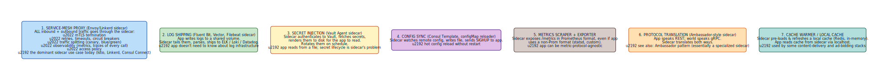

# Sidecar

**Aliases:** Sidecar Container, Helper Container, Co-located Process
**Category:** Deployment / Communication
**Sources:**
[Microsoft Azure Architecture Center — Sidecar pattern](https://learn.microsoft.com/en-us/azure/architecture/patterns/sidecar) ·
[Brendan Burns et al., *Design patterns for container-based distributed systems* (HotCloud 2016)](https://www.usenix.org/system/files/conference/hotcloud16/hotcloud16_burns.pdf) ·
Kubernetes documentation — Pods and multi-container patterns

---

## Problem

> [!TIP]
> **ELI5.** Your microservice (written in Python) needs a feature — say, mutual TLS encryption with retries — that's painful to implement in Python. Wouldn't it be nice to bolt on a helper process, written in any language, that handles that one thing? You deploy the helper *next to* your service (same pod, same lifecycle, same network), and your service just talks to it on `localhost`. That helper is the **sidecar**.

A microservice often needs capabilities that aren't its core competency:

- Encryption in transit (mTLS).
- Log forwarding to a central aggregator.
- Secret rotation from a vault.
- Service-discovery client.
- Configuration sync from a config service.
- Metrics scraping and re-exporting in a different format.
- Local caching of remote data.

Implementing these *inside* the main service application has real costs: bloated code, language-specific libraries that may not exist in your stack, dependencies on infrastructure that the application team doesn't want to own, and updates that require redeploying the entire service.

Implementing them as a *separate service* (called via HTTP) is also painful: extra network hop, more services to operate, harder reasoning about coupled lifecycles, no obvious place to share files like secrets or logs.

The **Sidecar** pattern occupies the middle ground: a separate process, deployed in the same execution unit (Kubernetes pod, ECS task, Nomad allocation, or VM) as the main application. It shares network and (optionally) filesystem with the main app, but runs independently — language-agnostic, separately upgradable, owned by a different team if appropriate.

## How it works

> [!TIP]
> **ELI5.** Package two containers into the same deployment unit. The main one is your app. The "sidecar" is a helper process — log shipper, proxy, secret manager, whatever. Because they share a pod, they share `localhost` (so they talk for free, no network) and can share files via a volume. They start and die together. The sidecar can be written in any language; your app doesn't have to know it exists beyond a `localhost` socket.

The pattern's mechanics:

The deployment unit (in Kubernetes, a **Pod**) contains:

- **The main container** — your business application.
- **One or more sidecar containers** — helper processes.
- **(Optional) shared volumes** — for exchanging files (logs, secrets, sockets).

The containers in a pod share:
- **A network namespace**: they all see the same IP and can talk over `localhost` with zero network overhead.
- **A lifecycle**: the orchestrator starts and stops them together. If one dies, the whole pod is restarted (configurable).
- **(Optional) volumes**: emptyDir for ephemeral exchange, configMap for read-only data, etc.

The containers do *not* share:
- **A process namespace** (by default): each is its own process tree.
- **A filesystem** (other than mounted volumes): each container has its own image.
- **CPU and memory limits**: each container has its own resource budget.

This gives sidecars the right balance: tightly coupled deployment, loosely coupled implementation. The main app can call the sidecar over `127.0.0.1`; the sidecar can read files the app wrote to a shared volume; both upgrade independently of the other's image.

### Canonical use cases

The pattern shines in a handful of recurring scenarios:

**Service mesh proxy** (Envoy in Istio/Linkerd) is the dominant use case today. The sidecar intercepts every inbound and outbound call, terminates mTLS, applies retry/circuit-break/timeout policies, splits traffic for canaries, and emits metrics + traces. The app does nothing — it just calls or accepts plain HTTP, and the sidecar transparently upgrades it to a fully-meshed call.

**Log shipping** (Fluent Bit, Vector, Filebeat) is the simplest case. The app writes logs to a file in a shared volume; the sidecar tails it, parses, batches, and ships to the central log store. The app doesn't need to know about ELK, Loki, or Datadog — only how to write a log file.

**Secret injection** (Vault Agent, External Secrets Operator) lets the sidecar handle authentication to a secret store, fetch secrets, render them to a shared file the app reads, and rotate them on a schedule. The app just reads files; the secret lifecycle is the sidecar's problem.

**Config sync** sidecars (Consul Template, configMap reloader) watch a remote config source, write updated config to disk, and signal the app (typically `SIGHUP`) to reload. The app gets hot reload without knowing the source.

**Metrics scraping and re-exporting** sidecars translate between metric protocols. The app emits StatsD; the sidecar exposes Prometheus format. Or vice versa. Lets the app be metric-protocol-agnostic.

**Protocol translation** (Ambassador-style sidecar) handles outbound calls to external services that speak a different protocol. The app speaks REST; the world speaks gRPC; the sidecar translates. (See [Ambassador](ambassador.md) for the dedicated pattern.)

**Cache warmers** and **local data layers** sit alongside the app, pre-loading and refreshing a small in-memory cache the app reads via `localhost`. Used in ad-bidding, real-time recommendations, and other latency-sensitive paths.

### Sidecar trade-offs

The advantages:

- **Language agnostic.** A Python app can use a Go sidecar (Envoy) for mTLS without anyone porting anything.
- **Reusable across services.** The same sidecar binary handles cross-cutting concerns for dozens of different applications.
- **Independently upgradable.** Update the sidecar's image without touching the main app's release.
- **Separation of concerns.** Application teams write business code; platform teams own the sidecars.
- **Atomic deployment with the app.** No need to coordinate two separate releases — pod is the unit.

The disadvantages:

- **Resource overhead.** Every pod now has at least one extra container — extra CPU, memory, and startup time. At fleet scale this matters (Istio sidecars typically add ~50–100 MB RAM and a few % CPU per pod).
- **Operational complexity.** More moving parts per pod; failure modes multiply (app fine but sidecar crashed; sidecar fine but app misbehaves; volume mount race).
- **Debugging confusion.** A 5xx error could come from the app, the sidecar, or the path between them.
- **Coupled lifecycle (mostly).** If the sidecar crashes repeatedly, the whole pod becomes unhealthy. Modern Kubernetes (1.28+) added "sidecar containers" as a first-class concept with better lifecycle handling.
- **Network hop.** Even on `localhost`, the proxy adds ~1ms of latency per hop. For chains of services, this accumulates.

These trade-offs are why **ambient mesh** designs (Istio Ambient, Cilium) are emerging — moving the data plane from per-pod sidecars to per-node agents, reducing per-pod overhead while keeping the core abstractions.

### Sidecar vs Library

The eternal debate: **why not just use a library inside the main app?**

A library is more efficient (no extra process, no extra network hop). But:

- A library is **language-specific**. You need one per language; they drift. A sidecar is a single binary used everywhere.
- A library is **deployed with the app**. Bumping it requires releasing every app. A sidecar bumps independently.
- A library **runs in the app's process**. A bug crashes the app. A sidecar's crash is somewhat isolated.

For homogeneous orgs (everyone uses Java), libraries win. For polyglot orgs (Python, Go, Java, Node, Rust all in production), sidecars are how you avoid maintaining N libraries with drifting features.

### Sidecar vs Init Container

Kubernetes distinguishes between:

- **Init containers** — run *before* the main app starts; exit; the app then runs. Used for one-time setup: pull config, generate certs, run migrations.
- **Sidecar containers** — run *alongside* the main app for the pod's lifetime.

The roles are complementary. A common setup: an init container fetches the initial config; a sidecar keeps it updated.

---

## Variants & related patterns

| Variant | Difference |
|---|---|
| **Service-mesh sidecar (Envoy/Linkerd)** | Full inbound + outbound traffic interception. The dominant case today. |
| **Log-shipping sidecar** | One-way: tail app logs, forward elsewhere. |
| **Secret/config sidecar** | Periodically fetches and writes to shared volume. |
| **Ambassador** | Outbound-only sidecar for talking to external services. (See [Ambassador](ambassador.md).) |
| **Adapter sidecar** | Inbound-only; translates the app's odd metrics/log format to the standard one. |
| **Init container** | Runs before app starts; exits; one-time setup. |
| **Per-node agent** | "Ambient mesh" alternative — one agent per node, not per pod. Reduces overhead. |
| **DaemonSet** | Per-node helper that isn't part of any specific pod. |

## When NOT to use

- **Resource-constrained environments** (edge, IoT) — sidecar overhead can be prohibitive.
- **Homogeneous-language orgs with mature libraries** — a library may be cheaper than a sidecar process.
- **Latency-critical paths where every microsecond counts** — sidecar adds ~1ms.
- **Very simple deployments** — overhead of multi-container reasoning isn't worth it for a 1-service system.

---

## Real-world implementations

| Sidecar | What it does |
|---|---|
| **Envoy** | The dominant service-mesh data plane (Istio, Linkerd 1, Consul Connect, Kuma, App Mesh). |
| **Linkerd proxy** | Rust-based service-mesh data plane (Linkerd 2). |
| **Fluent Bit / Fluentd / Vector / Filebeat** | Log shipping sidecars. |
| **Vault Agent** | Secret-injection sidecar from HashiCorp. |
| **Consul Template** | Config-rendering sidecar. |
| **Datadog Agent (per-pod)** | Metrics + tracing collection. |
| **Prometheus exporter sidecars** | Translate app metrics to Prom format. |
| **Sidecar Pattern in Dapr** | "Distributed Application Runtime" — sidecar exposing building blocks (state, pub-sub, secrets) over HTTP/gRPC to the app. |
| **AWS App Mesh Envoy** | AWS-managed mesh data plane. |
| **Cilium / Istio Ambient** | Per-node alternatives that move beyond per-pod sidecars. |

## Companies / canonical uses

| Where | Use | Status |
|---|---|---|
| **Google** | Sidecar pattern was formalized at Google; internal Borg/Kubernetes systems use it extensively. | ✅ Verified — [Burns et al. HotCloud 2016](https://www.usenix.org/system/files/conference/hotcloud16/hotcloud16_burns.pdf) |
| **Lyft** | Envoy was originally built at Lyft as a sidecar proxy; now open source. | ✅ Verified — [Envoy origin blog](https://eng.lyft.com/announcing-envoy-c-l7-proxy-and-communication-bus-92520b6c8191) |
| **Airbnb, Stripe, GitHub** | Production Envoy sidecars in service-mesh deployments. | ✅ Verified — multiple engineering blogs |
| **Buoyant customers (Linkerd)** | Linkerd's sidecar proxy in production at thousands of orgs. | ✅ Verified — Linkerd case studies |
| **Datadog customers** | Datadog Agent runs as sidecar or DaemonSet across many K8s clusters. | ✅ Verified — Datadog architecture docs |
| **HashiCorp customers (Consul, Vault)** | Vault Agent + Consul Template are widely-deployed sidecars. | ✅ Verified — HashiCorp case studies |

---

## Further reading

- Brendan Burns et al., *Design patterns for container-based distributed systems* (HotCloud 2016) — the foundational paper that named Sidecar, Ambassador, Adapter as multi-container patterns. [PDF](https://www.usenix.org/system/files/conference/hotcloud16/hotcloud16_burns.pdf).
- Microsoft Azure Architecture Center, *Sidecar pattern* — practical Azure-flavored guidance.
- Brendan Burns, *Designing Distributed Systems* (O'Reilly) — Ch on multi-container patterns.
- Kubernetes documentation — Pod patterns and the new (1.28+) sidecar container API.
- Istio and Linkerd documentation — sidecar in production mesh context.
- Dapr.io documentation — "sidecar architecture" generalized as a building-block runtime.
- *Service Mesh: The Ultimate Guide*, by William Morgan (Buoyant) — historical and architectural context.

---

*Diagram sources: [`../diagrams/src/sidecar-pattern.d2`](../diagrams/src/sidecar-pattern.d2), [`../diagrams/src/sidecar-use-cases.d2`](../diagrams/src/sidecar-use-cases.d2).*
