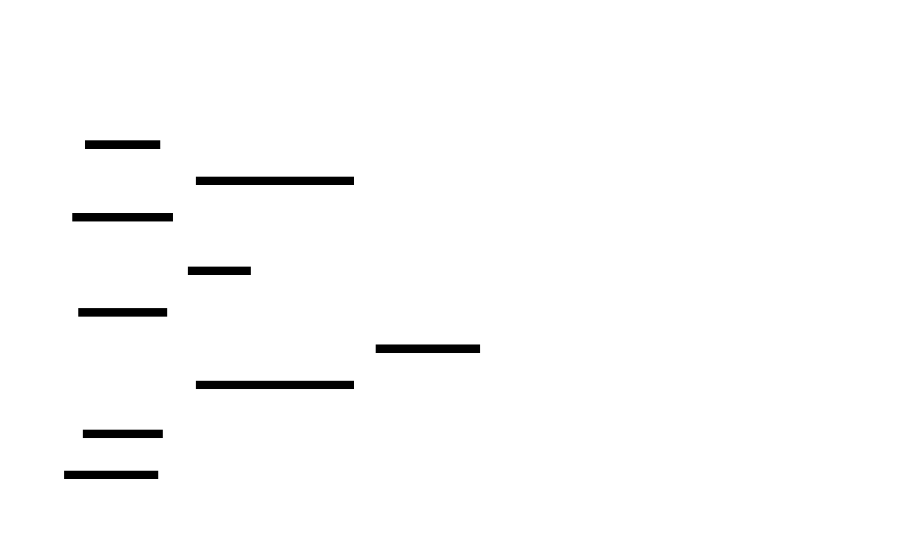

# State Watch

**Aliases:** Watch API, Change Notification, Long-polling Watch, Subscription
**Category:** Coordination / Communication
**Sources:**
[Joshi — Patterns of Distributed Systems](https://martinfowler.com/articles/patterns-of-distributed-systems/) ·
[Hunt et al., *ZooKeeper: Wait-free coordination* (USENIX ATC 2010)](https://www.usenix.org/legacy/event/usenix10/tech/full_papers/Hunt.pdf) — origin of the modern watch primitive ·
[etcd watch documentation](https://etcd.io/docs/latest/learning/api/#watch-api)

---

## Problem

> [!TIP]
> **ELI5.** You want to know when something changes — a new server registers, a config flag flips, a leader changes. The naive approach is **polling**: ask the server "anything new?" every few seconds. This is wasteful (most polls find nothing) and slow (changes appear with up-to-poll-interval delay). Watch is the opposite: tell the server "let me know when X changes" once, then sit and wait.

A client of a coordination service (etcd, ZooKeeper, Consul) — or any service whose state evolves — needs to **react to changes** as they happen. Service discovery clients need to know when an instance joins or leaves. Config consumers need to know when a feature flag flips. Kubernetes controllers need to react to pod state changes. Kafka consumers need to know when partition assignments change.

The naive approach is **polling**: periodically ask the server "what's the current state?" — and diff against the last known state. This has several severe drawbacks:

- **High latency**: changes are visible only at the next poll interval. If you poll every 5 seconds, the average change-detection latency is ~2.5 seconds and the worst case is 5.
- **Wasted load**: most polls return "nothing changed." For a config that updates once a day, polling every 5 seconds means ~17,000 useless requests per change.
- **Pressure on the server**: thousands of clients × frequent polls × constant load = significant baseline traffic the server must handle even when nothing is happening.
- **Tradeoff trap**: polling more often reduces latency but multiplies waste; polling less often reduces waste but worsens latency. There's no good answer.

You need a **push** model: the server notifies the client when something changes, without the client paying for idle traffic.

## How it works

> [!TIP]
> **ELI5.** The client opens a long-lived connection saying "I want updates on key /services/api." The server holds the connection open. When that key changes, the server immediately pushes an event over the connection. The client receives it within milliseconds. Connection stays open for the next change.

A state watch is a **server-pushed change notification stream**:

1. **Subscribe.** The client sends a watch request specifying what to monitor — a key, a prefix, a glob pattern, an entire namespace — and optionally a starting revision. The server remembers the subscription and acknowledges. The connection stays open.

2. **Idle.** The server holds the connection. No traffic flows except occasional keepalives (every ~30s to ensure the connection isn't broken). The client costs the server essentially nothing.

3. **Change.** Something else writes to the watched key. The server's internal change-detection notices.

4. **Push.** The server pushes a change event to *every* subscriber of that key. Within milliseconds, every interested client knows.

The model inverts the typical request/response: the client makes one request and receives many responses (a stream). Modern implementations use HTTP/2, gRPC streams, or WebSockets to keep the connection open efficiently; older ZooKeeper used a custom binary protocol.

### The revision/sequence number guarantee

The deep operational subtlety: **what if the watch connection drops?** Without care, the client misses any events that happened during disconnection — fatal for many use cases (a service might miss a leader change and stay routing to a failed node).

The solution is **revision-based replay**:

Each change is tagged with a **monotonically increasing revision** (etcd revision, ZooKeeper zxid, Kafka offset). The watch streams events with revisions, so the client always knows the last revision it processed. On reconnect, the client says "WATCH starting from revision N+1" — and the server replays everything that's happened since.

For this to work, the server must **retain history** for the recent past. etcd keeps history bounded by configured retention; ZooKeeper keeps the change log for some time; Kafka keeps the log per its retention policy. If the client has been disconnected for too long (older than the retained history), the server returns a "gone" error and the client must do a **full resync** — fetch the current state and start watching from the new revision.

This pattern — **bounded change history + replay on reconnect** — is the production-grade design for watch APIs. The naive "fire-and-forget" version is unsafe.

### Scope of watch

Different services support different scopes:

- **Single-key watch**: notify on changes to one key. Simple, common.
- **Prefix watch**: notify on changes to any key matching `/services/*`. Used heavily by Kubernetes controllers watching all objects of a resource type.
- **Filter watch**: notify only on changes matching a predicate (rare; usually implemented client-side).
- **Recursive subtree watch**: notify on any descendant change. ZooKeeper supports.

### How clients use watches

Typical client patterns:

- **Cached view + watch**: client fetches the full current state, caches it, watches for changes, and updates the cache on each event. Used by Kubernetes informers, etcd clientv3 cache, ZooKeeper Curator's `PathChildrenCache`.
- **Reactive trigger**: client uses the watch event to trigger work (rebuild a config, restart a connection pool, re-route traffic).
- **Cluster choreography**: watch coordination events (membership, leadership) to coordinate distributed behavior without explicit messaging.

### Scalability

A typical watch server supports **thousands to tens of thousands of concurrent watchers** on commodity hardware. The cost per subscriber is small — a pointer to the subscription + the connection state. The dominant cost is the per-event fan-out: a change with N subscribers requires N network writes.

To scale further:
- **Hierarchical watches**: notify on a parent key once; subscribers re-query for descendants if needed.
- **Watch aggregation / coalescing**: combine multiple events to the same subscriber.
- **Sharded watch handling**: distribute subscribers across server processes.
- **Compaction-aware replay**: keep less history, replay via state snapshot + watch tail.

Kubernetes uses an interesting variant: every kubelet on every node watches the same API server for events relevant to it. With 5,000 nodes × many resource types, this is a major load. The standard answer is the **API priority and fairness** mechanism plus aggressive history compaction.

### Watches and consistency

A non-obvious property: **the order of events in the watch stream matches the order of changes at the server**. If write A happens before write B, every watcher sees event_A before event_B. This makes watches usable for ordering decisions, leader observation, and consistent state reconstruction.

The "ordered with respect to the server's commit order" guarantee is what makes watches valuable for coordination. A watch stream isn't just convenient polling — it's a serialized event stream that the client can use to deterministically rebuild state.

---

## Variants & related patterns

| Variant | Difference |
|---|---|
| **Long-polling** | Client request blocks until a change or timeout; on response, immediately reconnects. Simpler protocol than streaming; older. |
| **Server-Sent Events (SSE)** | HTTP-based one-way event stream. Used by many web APIs (GitHub Events, etc.). |
| **WebSocket-based watch** | Bidirectional streaming over WebSocket. Browsers-friendly. |
| **gRPC streaming watch** | The modern default — etcd, Cloud Spanner change streams, Dgraph, many newer systems. |
| **Kafka consumer (as watch-like)** | Consuming a Kafka topic is effectively watching the topic's changes. |
| **CDC (Change Data Capture)** | Database-internal watches on tables; Debezium, AWS DMS, Snowflake streams. |
| **GitHub-style webhooks** | Server initiates an HTTP request to a client-provided URL when a change happens. Push without holding connections. |

## When NOT to use

- **Truly low-frequency state** where polling every minute is fine — watch overhead isn't worth it.
- **Massive subscriber counts that exceed server capacity** — consider a fan-out layer (pub-sub broker) instead of direct watches.
- **State that changes more often than the client can process** — eventual catch-up via polling may be better than streaming every change.
- **When the connection model doesn't fit** — e.g., short-lived serverless functions can't hold a long connection. Use polling or webhooks.

---

## Real-world implementations

| System | Watch mechanism |
|---|---|
| **etcd v3** | gRPC bidirectional streaming watch with revision-based replay; the canonical modern watch API. |
| **Apache ZooKeeper** | Per-call "watch" flag attached to a read; fires once on next change. The historical default; more limited than etcd. |
| **HashiCorp Consul** | "Blocking queries" — long-polling with an X-Consul-Index header for resumption. |
| **Kubernetes API** | gRPC + HTTP watch endpoint per resource type; the foundation of every controller and operator. |
| **Apache Kafka** | Consumer with offsets — effectively watching a partition's changes. |
| **CockroachDB CDC / changefeeds** | gRPC streaming changefeed exposing row-level changes. |
| **MongoDB change streams** | Tail of oplog as a change stream; per-collection or per-database. |
| **PostgreSQL LISTEN/NOTIFY + logical replication** | Native notification mechanism + CDC via logical decoding (used by Debezium). |
| **Firebase Realtime Database / Firestore** | Long-lived subscriptions delivering real-time updates. |
| **AWS DynamoDB Streams** | Watch-like ordered change stream per table. |

## Companies / canonical uses

| Where | Use | Status |
|---|---|---|
| **Every Kubernetes user** | Controllers and operators are built entirely on the watch primitive against etcd. | ✅ Verified — Kubernetes architecture |
| **HashiCorp customers (Consul, Nomad, Vault)** | Service discovery and config use blocking queries — long-polling watches. | ✅ Verified — Consul docs |
| **Confluent / Kafka users** | Consumer groups are effectively watch+offset commitments. | ✅ Verified — Kafka consumer docs |
| **Apple, Netflix, others** | ZooKeeper watches underlie service discovery and config for many internal systems. | ⚠ Discussed in talks; specific sources vary |
| **MongoDB / Firebase customers** | Change streams / real-time database underlies many app-tier features. | ✅ Verified — product docs |

---

## Further reading

- Hunt, Konar, Junqueira, Reed, *ZooKeeper: Wait-free coordination for Internet-scale systems* (USENIX ATC 2010) — the watch primitive in its modern form. [PDF](https://www.usenix.org/legacy/event/usenix10/tech/full_papers/Hunt.pdf).
- etcd documentation on watch — practical guide to using a modern watch API.
- Kubernetes docs on watches and informers — concrete patterns for using watches at scale.
- Joshi, *Patterns of Distributed Systems*, "State Watch" pattern.
- Curator (Apache) recipes for ZooKeeper — high-level abstractions over the watch primitive.
- *Designing Distributed Systems*, Brendan Burns — Ch 4 on coordination patterns in Kubernetes.

---

*Diagram sources: [`../diagrams/src/state-watch-flow.d2`](../diagrams/src/state-watch-flow.d2), [`../diagrams/src/state-watch-revision.d2`](../diagrams/src/state-watch-revision.d2).*
