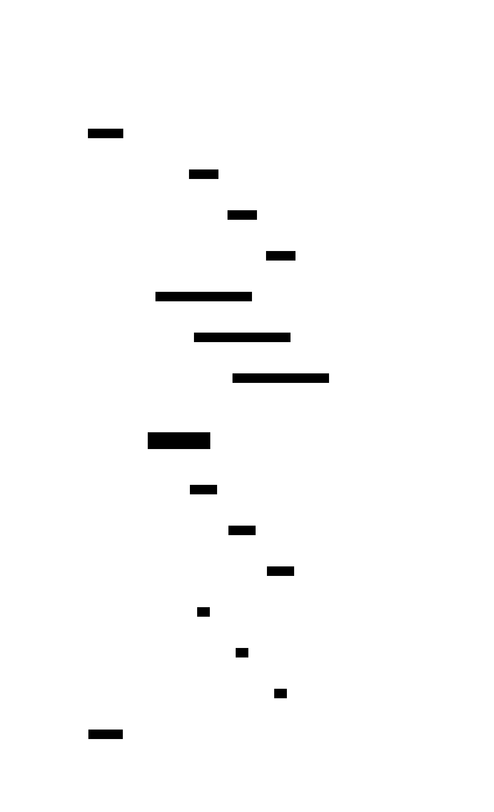

# Two-Phase Commit (2PC)

**Aliases:** 2PC, XA Transactions, Distributed Commit Protocol
**Category:** Coordination
**Sources:**
[Neo Kim](https://systemdesign.one/system-design-interview-cheatsheet/) ·
[Joshi — Patterns of Distributed Systems](https://martinfowler.com/articles/patterns-of-distributed-systems/) ·
Kleppmann *DDIA*, Ch 9 (Consistency and Consensus)

---

## Problem

> [!TIP]
> **ELI5.** Three friends each agreed to chip in for a gift. You need *all three* to actually pay, or *none of them* to pay (so you can refund). How do you commit them atomically when they're sitting in three different cities?

A business operation often needs to update **multiple resources atomically** — two databases, a database plus a message queue, two services' tables — such that either *all* of the changes commit or *none* do. Within a single database, this is what ACID transactions provide. Across multiple resource managers, there is no such thing — unless the resource managers agree to participate in a distributed commit protocol.

The challenge is that any of the participants could fail (or appear to fail) at any moment, and the network could drop or reorder messages. You need a protocol that produces a single global decision (commit or abort) that every participant honors, even across crashes and recoveries.

## How it works

> [!TIP]
> **ELI5.** A trusted **coordinator** runs the show in two phases. Phase 1: ask everyone "are you ready and willing to commit?" Everyone who says yes must promise they actually *can* commit later (they hold their part open). Phase 2: if everyone said yes, tell them all "commit"; if anyone said no, tell them all "abort". They all do the same thing.

Two-Phase Commit is a blocking atomic commit protocol coordinated by a **Transaction Coordinator** (TC) over a fixed set of **participants** (each a "resource manager" — typically a database, but also message brokers, file systems, etc.). The protocol takes its name from its two distinct round-trip phases:

**Phase 1 — PREPARE (the voting phase).** The coordinator sends `PREPARE` to every participant. Each participant must do real work here: it must perform whatever validation, lock acquisition, and write-ahead logging is required to **guarantee** it can commit if asked later, *even after a crash*. If it can guarantee that, it durably writes a "prepared" record to its own log and replies `VOTE-YES`. If anything blocks it (lock conflict, integrity violation, disk full), it replies `VOTE-NO`. Critically: once a participant has voted yes, it has **promised away its autonomy**. It cannot commit on its own, and it cannot abort on its own. It must wait for the coordinator's verdict.

**Phase 2 — COMMIT/ABORT (the decision phase).** The coordinator collects all the votes. If every participant voted yes, the coordinator durably records `decision = COMMIT` in its own log (this single durable write is the moment the global transaction is considered committed — even before any participant knows) and broadcasts `COMMIT` to all participants. Each participant applies the change and replies `ack`. If any participant voted no, the coordinator records `decision = ABORT` and broadcasts `ABORT` — every participant releases its locks and discards the prepared work.

This *works*, and produces real atomic commits across multiple databases. It's the basis of XA transactions, the JTA spec, classic distributed-DB clustering, and was central to enterprise computing for decades.

The fatal flaw is in what happens when the **coordinator crashes** between phases:

After phase 1 succeeds, both participants are in the "prepared" state — locks held, work durably staged, **awaiting the coordinator's verdict**. If the coordinator now crashes before it can send the `COMMIT` or `ABORT`, the participants are **stuck**. They cannot commit on their own (maybe the coordinator was about to send `ABORT`). They cannot abort on their own (maybe the coordinator was about to send `COMMIT`). They cannot even ask each other (a participant doesn't know if the *coordinator* heard everyone's `VOTE-YES`). Their only option is to wait — holding locks the entire time, blocking unrelated work — until the coordinator recovers from its log and tells them what was decided.

In practice this means: a single coordinator failure can freeze every participant indefinitely, dragging unrelated transactions down with held locks. Even with HA coordinators (multiple coordinator replicas via consensus), 2PC is famously slow, fragile across WAN links, and incompatible with many modern resource managers (NoSQL stores and most message brokers do not support XA at all). This is why most modern systems use **[Sagas](../data/saga.md)** — accepting eventual consistency in exchange for not needing distributed commit.

---

## Variants & related patterns

| Variant | Difference |
|---|---|
| **Three-Phase Commit (3PC)** | Adds an extra "pre-commit" phase to remove blocking. Theoretically appealing but assumes synchronous networks that don't exist in practice; rarely deployed. |
| **Paxos / Raft Commit** | Use consensus to make the *decision* itself fault-tolerant (no single coordinator). Used internally by Google Spanner and CockroachDB to make 2PC non-blocking. |
| **Percolator** | Google's 2PC variant on top of Bigtable; uses timestamps and lock metadata in the data store itself rather than a separate coordinator. |
| **Saga** | Trades atomicity for liveness. No locks held, no blocking, but partial states visible. The standard microservices replacement. |
| **XA / JTA / TIP / WS-AtomicTransaction** | Standardized protocols implementing 2PC across heterogeneous resource managers. |

## When NOT to use

- **Across services in microservices** — too tight a coupling, too long lock-holding, too few participants support XA. Use sagas.
- **Across the public internet / WAN** — latency dominates; one slow participant blocks everyone.
- **When any participant is a system that doesn't support distributed transactions** (most NoSQL DBs, most modern message brokers, REST APIs). The protocol requires *all* participants to cooperate.
- **When availability matters more than atomicity.** 2PC's blocking nature gives it terrible availability properties.

## When to use

- **Within a single trust boundary**, across **2–3 well-known, well-behaved resource managers**, **on a fast LAN**.
- **Legacy enterprise integration** — JTA-based middleware between an Oracle DB and an IBM MQ remains common in banking and large enterprise systems.
- **Inside a single database engine** that internally needs atomic commits across multiple shards (e.g., Spanner, CockroachDB) — but using consensus to make the coordinator itself HA.

---

## Real-world implementations

| System | Role |
|---|---|
| **JTA / XA** (Java EE) | The canonical API. Implemented by Atomikos, Bitronix, Narayana (JBoss), and inside every Java EE app server. |
| **Microsoft Distributed Transaction Coordinator (MSDTC)** | The Windows transaction coordinator; underpins distributed transactions in .NET / SQL Server / MSMQ. |
| **Oracle Distributed Transactions** | Native XA in Oracle DB. |
| **PostgreSQL `PREPARE TRANSACTION`** | Postgres exposes the prepared phase as a SQL primitive; rarely used directly, but enables XA via extensions. |
| **Google Spanner** | Uses Paxos-replicated 2PC across shards, making the coordinator non-blocking via consensus. |
| **CockroachDB** | Similar — Raft-replicated 2PC for cross-range transactions. |
| **YugabyteDB / TiDB** | Same family — distributed SQL with consensus-backed 2PC. |

## Companies using it (notable examples)

| Company | Use | Status |
|---|---|---|
| **Google (Spanner)** | Spanner is the canonical modern use of 2PC — but only with TrueTime-bounded clocks and Paxos-replicated coordinators, removing the blocking failure mode. | ✅ Verified — [Corbett et al., *Spanner: Google's Globally-Distributed Database*, OSDI 2012](https://research.google/pubs/pub39966/) |
| **CockroachDB customers** | All cross-range transactions in CockroachDB use distributed commit with Raft. | ✅ Verified — [Cockroach Labs, *How CockroachDB Distributes Atomic Transactions*](https://www.cockroachlabs.com/blog/how-cockroachdb-distributes-atomic-transactions/) |
| **Banking / financial systems** | Many traditional banking core systems (JTA + WebSphere MQ + DB2) still rely on 2PC for funds-transfer atomicity. | ⚠ Industry-wide; not re-verified |
| **Enterprise ERP (SAP, Oracle E-Business)** | Use distributed transactions across DB + message-broker. | ⚠ Industry-wide; not re-verified |

**⚠ marks claims widely known industry-wide but not re-verified by primary-source fetch.**

Note: outside of distributed databases that have made 2PC safe with consensus, contemporary internet-scale companies generally *avoid* 2PC. The "company using 2PC" question is more honestly answered as "the database vendor implemented it; the company picked the database."

---

## Further reading

- Kleppmann, *Designing Data-Intensive Applications*, Ch 9 — particularly the "Distributed Transactions and Consensus" section; the clearest explanation of why 2PC blocks and what consensus-backed alternatives look like.
- Joshi, *Patterns of Distributed Systems*, "Two-Phase Commit" — implementation-level pattern view.
- Pat Helland, *Life Beyond Distributed Transactions: An Apostate's Opinion* (2007) — the seminal argument for avoiding 2PC across services.
- Corbett et al., *Spanner: Google's Globally-Distributed Database* (OSDI 2012) — how to make 2PC non-blocking.

---

*Diagram sources: [`../diagrams/src/2pc-protocol.d2`](../diagrams/src/2pc-protocol.d2), [`../diagrams/src/2pc-blocking.d2`](../diagrams/src/2pc-blocking.d2).*
