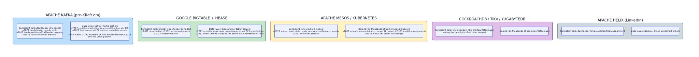

# Consistent Core

**Aliases:** Coordination Kernel, Control Plane / Data Plane Split, Metastore
**Category:** Architecture / Coordination
**Sources:**
[Joshi — Patterns of Distributed Systems](https://martinfowler.com/articles/patterns-of-distributed-systems/) ·
Kleppmann *DDIA*, Ch 9 ·
[Hunt et al., *ZooKeeper: Wait-free coordination for Internet-scale systems* (USENIX ATC 2010)](https://www.usenix.org/legacy/event/usenix10/tech/full_papers/Hunt.pdf) ·
[Burrows, *The Chubby lock service* (OSDI 2006)](https://research.google/pubs/pub27897/)

---

## Problem

> [!TIP]
> **ELI5.** You want a giant cluster of 1000 cheap "do work" servers. Most of what they do doesn't need strong agreement — they can use [gossip](gossip.md) and [tunable quorums](../block/quorum.md). But for a *few* critical things — "who's the leader of shard 7?", "who owns this lock?", "what's the current cluster membership?" — you can't afford gossip's eventual consistency or split-brain. You need linearizability for *those* facts. So: run a small (3–5 node) consensus cluster for the critical facts, and let the big data cluster consult it occasionally.

A large distributed system has heterogeneous coordination needs. Some kinds of state require **strong consistency** (linearizability):
- "Who is the current leader of shard 7?" — split-brain here means two writers, conflicting commits, lost data.
- "Who owns the lock on resource R?" — split-brain means two clients mutating the same resource.
- "What's the current cluster membership?" — split-brain means inconsistent views of who's serving what.
- "What's the current schema version / config / topology?" — inconsistent views cause routing chaos.

Other kinds of state are vastly more voluminous but tolerate eventual consistency:
- The actual user data being served.
- Per-row content of cache entries.
- Per-event analytics records.
- Per-request logs and metrics.

If you tried to run **all** state through a consensus algorithm ([Raft](raft.md) or [Paxos](paxos.md)), the system wouldn't scale: every read and write would pay the round-trip cost of replicating to a majority. You'd be limited to a few thousand writes per second across the whole cluster, regardless of how many machines you threw at it.

If you tried to run **all** state via gossip and [quorum](../block/quorum.md), you couldn't safely answer "who's the leader?" — a question whose wrong answer corrupts everything else.

You need to **split the state** by consistency need, and accept that the architecture has two distinct layers.

## How it works

> [!TIP]
> **ELI5.** Build a tiny (3 or 5 node) cluster that runs Raft or Paxos — call it the **consistent core**. Store only the critical metadata there. Build the rest of the system as a big cluster that holds the actual data and consults the core only when it needs a definitive answer about leadership, membership, or configuration. The core stays small (so consensus is fast); the data layer stays big (so it scales).

The **Consistent Core** pattern splits a distributed system into two cooperating layers:

The **consistent core** is a small cluster (typically 3 or 5 nodes) running a consensus algorithm — Raft, Paxos, or ZAB. It holds:
- **Cluster membership** — which data nodes exist, which are alive, what they're configured as.
- **Shard/partition assignment** — which data node owns which key range or partition.
- **Leadership** — for replicated groups within the data layer, who's the current leader.
- **Configuration** — replication factor, retention policies, schemas, feature flags.
- **Locks and leases** — for atomic operations across the cluster.

Because the core is small, consensus rounds are fast (a few milliseconds intra-DC). Because the data stored is small (kilobytes to megabytes), the entire state fits in memory and replicates cheaply.

The **data cluster** is the much larger layer (tens, hundreds, or thousands of nodes). It holds the actual user data and serves the actual user traffic. Within this layer, replication uses simpler mechanisms — leader-follower replication, leaderless quorums ([quorum.md](../block/quorum.md)), or gossip-based anti-entropy. The data cluster nodes consult the consistent core only at coordination events: a node joining or leaving; a shard moving; a leader changing; a lock being acquired. **Per-request**, the data nodes operate independently — that's why the system can scale to millions of QPS.

### Why this split works

The arithmetic is favorable. Consensus is expensive (RTT to majority), but coordination events are *rare*: a 100-node cluster might see a few membership changes per hour, a few leader elections per day, a few config changes per week. Even if each costs 50ms of consensus latency, the aggregate is negligible.

User traffic, by contrast, might be millions of requests per second — and goes through the (gossip-replicated or per-shard-leader-replicated) data layer with no consensus overhead. The economics of consensus is amortized over millions of requests-per-coordination-event.

### Canonical examples

The pattern is everywhere once you see it:

- **Apache Kafka** (pre-KRaft era): ZooKeeper was the consistent core, holding broker membership, partition→leader mapping, and controller election. The hundreds of Kafka brokers consulted ZK at startup, on partition reassignment, and on controller elections — but per-message production and consumption never touched ZK. KRaft (Kafka 3.3+) replaces ZK with an embedded Raft cluster, but the architectural split is identical.
- **Google Bigtable / Apache HBase**: Chubby / ZooKeeper as the core, storing tablet→tabletserver assignments and master election. Thousands of tablet servers serve data; the core is consulted only on tablet moves.
- **Apache Mesos / Kubernetes**: etcd is the consistent core for Kubernetes, storing cluster state (pods, services, configmaps, secrets) and supporting controller election. Worker nodes (kubelets) consult the API server (backed by etcd); the actual workload execution happens on the workers.
- **CockroachDB / TiKV / YugabyteDB**: a "meta range" (the first few Raft groups) stores descriptors for all other ranges. Data lives in thousands of per-range Raft groups consulted via the meta range.
- **Apache Helix (LinkedIn)**: ZooKeeper for resource/partition assignment across Espresso, Pinot, Voldemort.

### The core *is* a coordination primitive vendor

ZooKeeper, etcd, and Consul are explicitly designed to *be* the consistent core for other systems. They expose a small, useful set of primitives — a hierarchical KV store with watches (ZK), a flat KV store with leases and watches (etcd), KV + service registry + sessions (Consul) — and let other systems build coordination on top of them. The "you should not run your own consensus" advice in production is shorthand for "use a [Chubby-style](https://research.google/pubs/pub27897/) ready-made consistent core."

### Operational properties

- **Small** (3 or 5 nodes — 7 is the practical max; beyond, write latency degrades because consensus needs majority acks from more nodes).
- **Critical** — the data cluster cannot make coordination decisions without it. Outages of the core may not stop *running* operations but block new ones.
- **Bounded data** — keep total state under ~1 GB. Anything bigger needs sharding the core itself (which gets complicated).
- **Watch / notification** — the core lets data nodes subscribe to changes (ZK watches, etcd watch API) rather than polling. This is how Kafka brokers get notified of partition reassignments without spinning.
- **Backup-able** — the entire core state can be snapshotted; recovery is straightforward.

### When the core fails

The consistent core's failure mode matters. If the core is unreachable:
- **Existing operations continue** (data nodes have cached coordination state).
- **New coordination events stall** — no leader elections, no membership changes, no rebalancing.
- **The system has a fixed grace period** before things start breaking — typically the lease TTL window. After that, ongoing leases expire and operations that depended on them fail.

This is why core availability is critical, and why production deployments treat the consistent core as the highest-priority infrastructure: typically deployed across availability zones, with monitored leader elections, and with strict change-management discipline.

---

## Variants & related patterns

| Variant | Difference |
|---|---|
| **Embedded consensus** | The core's Raft is embedded in the data cluster's nodes (Kafka KRaft, CockroachDB meta range). Avoids deploying a separate cluster. |
| **External coordination service** | The core is a separate ZooKeeper / etcd / Consul cluster (Kafka pre-KRaft, HBase, Kubernetes). |
| **Sharded core** | When the core's state gets too big, shard it — but each shard still needs its own consensus. Spanner's directory hierarchy. |
| **Control plane / data plane split** | Often used interchangeably with "Consistent Core" — same idea expressed in networking / cloud lingo. |
| **Service discovery (Eureka, Consul, etcd)** | A specific use of consistent core for "where do I find service X?" |

## When NOT to use

- **Tiny clusters (≤ 3 nodes)** — direct consensus on every operation is fine.
- **Read-only / single-writer workloads** where coordination is trivial — no need for a separate core.
- **When the entire data set is small enough to live in the consensus layer** — just put everything in etcd. Many small SaaS apps do this.
- **When eventual consistency suffices everywhere** — pure gossip clusters (early Dynamo before metadata grew) don't need a core.

---

## Real-world implementations

| Data layer | Consistent core |
|---|---|
| **Apache Kafka (pre-3.3)** | Apache ZooKeeper |
| **Apache Kafka (3.3+, KRaft)** | Embedded Raft |
| **Apache HBase** | Apache ZooKeeper |
| **Google Bigtable** | Chubby (Paxos) |
| **Kubernetes** | etcd |
| **OpenStack** | etcd / ZooKeeper variants |
| **CockroachDB** | Embedded meta-range Raft groups |
| **TiDB / TiKV** | PD (Placement Driver), a Raft cluster |
| **YugabyteDB** | YB-Master (Raft cluster) |
| **Spanner** | Per-zone Paxos for directory layer |
| **Apache Helix (LinkedIn)** | ZooKeeper |
| **HDFS HA NameNode** | ZooKeeper + QJM (Quorum Journal Manager) |
| **Service meshes (Istio, Linkerd)** | Often Kubernetes etcd; sometimes separate Consul |

## Companies / canonical uses

| Where | Use | Status |
|---|---|---|
| **Google** | Chubby is the consistent core for GFS, Bigtable, MapReduce, Spanner. Foundational paper. | ✅ Verified — [Chubby OSDI 2006](https://research.google/pubs/pub27897/) |
| **Every Kubernetes user** | etcd is the consistent core for every Kubernetes cluster — the entire cloud-native ecosystem. | ✅ Verified — Kubernetes architecture |
| **Confluent / Apache Kafka users** | ZooKeeper (pre-3.3) or KRaft as the core; thousands of brokers as the data layer. | ✅ Verified — Kafka docs |
| **LinkedIn** | Helix + ZooKeeper for Espresso, Voldemort, Pinot. | ✅ Verified — [Apache Helix](https://helix.apache.org/) |
| **Apple, Netflix, Uber** | ZooKeeper used as coordination core in many internal services. | ⚠ Discussed in talks; specific links vary |

---

## Further reading

- Hunt, Konar, Junqueira, Reed, *ZooKeeper: Wait-free coordination for Internet-scale systems* (USENIX ATC 2010) — defines the role of the consistent core for the cloud-native era. [PDF](https://www.usenix.org/legacy/event/usenix10/tech/full_papers/Hunt.pdf).
- Burrows, *The Chubby lock service for loosely-coupled distributed systems* (OSDI 2006) — the foundational paper. [PDF](https://research.google/pubs/pub27897/).
- Kleppmann, *Designing Data-Intensive Applications*, Ch 9 — discusses the architecture of consensus-backed coordination services.
- Joshi, *Patterns of Distributed Systems*, "Consistent Core" pattern.
- *Site Reliability Engineering* (Google SRE Book), Ch 23 (Managing Critical State) — Google's own framing.
- etcd, Consul, ZooKeeper documentation — practical guides on using each as a consistent core.
- *Designing Distributed Systems*, Brendan Burns — Ch 4 + 5 cover coordination patterns in Kubernetes idioms.

---

*Diagram sources: [`../diagrams/src/consistent-core-structure.d2`](../diagrams/src/consistent-core-structure.d2), [`../diagrams/src/consistent-core-examples.d2`](../diagrams/src/consistent-core-examples.d2).*
