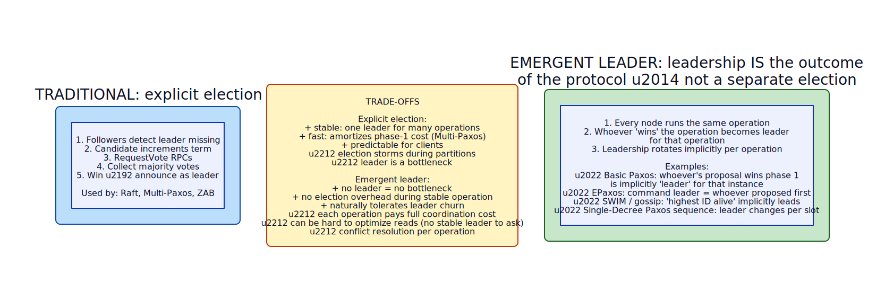

# Emergent Leader

**Aliases:** Implicit Leader, Leader-by-Computation, Deterministic Leader Selection
**Category:** Coordination
**Sources:**
[Joshi — Patterns of Distributed Systems](https://martinfowler.com/articles/patterns-of-distributed-systems/) ·
Discussed in the context of SWIM gossip ([Das et al. 2002](https://www.cs.cornell.edu/projects/Quicksilver/public_pdfs/SWIM.pdf)) and EPaxos ([Moraru et al. 2013](https://www.cs.cmu.edu/~dga/papers/epaxos-sosp2013.pdf))

---

## Problem

> [!TIP]
> **ELI5.** [Raft](../coord/raft.md) and [Paxos](../coord/paxos.md) handle leader election as a separate, expensive ceremony — request votes, count, announce. That's good when you want one stable leader for many operations. But what if you don't want a stable leader at all? What if leadership should rotate per-operation, or simply emerge from the same protocol that's running? Then you don't need elections — you need a way to determine "who leads *this* operation" from information everyone already has.

Traditional consensus algorithms separate **leader election** from **operation execution**: first elect a stable leader (an explicit, RPC-driven process), then have that leader propose operations until it fails. This is excellent for read-heavy workloads where leadership amortizes across many operations.

But several scenarios prefer a different approach:

- **Decentralized coordination** with no stable leader — e.g., gossip-based service discovery, where the question "which node owns this name?" should have a deterministic answer that every node can compute locally without an RPC.
- **High-throughput consensus** where the leader becomes a bottleneck — EPaxos and similar protocols let any node be the leader of any individual operation, parallelizing the workload.
- **Coordination-free operation selection** — assigning each task to a worker by hashing, with the deterministic "owner" implicitly being the leader for that task.
- **Cheap leader changes during churn** — when membership changes frequently, the overhead of explicit elections becomes burdensome.

You want leadership to **emerge from the protocol's own state**, computed locally by every node from shared knowledge, rather than negotiated by a separate election RPC.

## How it works

> [!TIP]
> **ELI5.** Don't run an election. Instead, every node uses some shared knowledge — usually the gossiped membership list — to deterministically compute the same answer: "the leader is the alive node with the highest ID" (or hash, or whatever rule). When membership changes, every node re-computes; leadership transparently moves. No RPCs needed.

The pattern has several flavors, but the common shape:

In **explicit election** (top), an election is a distinct event with its own RPCs, vote-counting, and announcement. The elected leader holds the role until it fails or the term advances. This is the Raft/Paxos model.

In **emergent leader**, leadership is computed from the same information the protocol already uses — typically the current membership view. Every node, looking at the same view, computes the same leader. No election; no RPCs. When the view changes (a node joins or fails), every node re-computes and the leader transparently moves.

### Pattern 1: Leader-by-deterministic-function

The simplest variant: pick a function `leader(membership) -> node` that every node computes locally:

Every node maintains an up-to-date membership view via [gossip](../coord/gossip.md). The leader function might be:
- `node with max(id)` — used in many SWIM-based service discovery layers.
- `node with min(id)` — same idea, different convention.
- `node with hash(key) mod N` — for per-key leadership (consistent hashing).
- `node whose ID is closest to hash(timestamp)` — for time-bucketed work assignment.

Every node computes the leader independently. When membership changes, every node re-computes; leadership smoothly transitions. The cost: there's no consensus on "exactly when leadership changed" — different nodes may see the change at slightly different times due to gossip lag, creating short windows of disagreement.

### Pattern 2: Per-operation leader in consensus

A different flavor: in consensus protocols like **EPaxos** (Egalitarian Paxos), the "command leader" for each operation is the node that initially proposed that operation. Different operations have different leaders, running concurrently. The protocol coordinates the operations themselves rather than electing a global leader.

This approach scales better than single-leader consensus because:
- No leader bottleneck — all nodes can propose simultaneously.
- No election storms — leader changes are amortized across operations.
- Better tail latency — closest replica to client can lead, avoiding cross-region hops.

The cost is **protocol complexity** — EPaxos's safety reasoning is significantly harder than Raft's. Few systems use it in production despite its theoretical appeal.

### Pattern 3: Highest-priority-alive

In some control planes, leadership simply tracks "the alive node with highest priority" — where priority comes from configuration. This is common in **HA hot-standby** scenarios:
- The "primary" is the alive node with highest priority.
- On primary failure, the next-highest-priority alive node becomes primary automatically.
- No election RPCs; everyone just observes the same priority order and the same liveness gossip.

Used by **Redis Sentinel** (with explicit acks), **MySQL Group Replication** in some modes, and many active/passive HA setups.

### Safety concerns

The emergent-leader pattern is **fragile to membership-view inconsistency**. If nodes have different views of who's alive — which is normal during gossip propagation — they'll compute different leaders. During this window, two nodes might believe they're leader simultaneously: **split-brain**.

Defenses:

1. **Pair with [fencing tokens](../block/generation-clock.md)**: every operation issued by a "leader" carries a monotonic token; the resource layer rejects stale-token operations. Same mechanism that protects [lease](../block/lease.md)-based locks. The "split-brain" can't cause corruption because the loser's writes are rejected.
2. **Require a stable view**: only commit to "this node is leader" after the view has been stable for N rounds (typically a few seconds). Reduces the window of disagreement.
3. **Combine with a small consensus core**: use a [consistent core](../coord/consistent-core.md) for the small "who's authoritative" decision, with emergent leadership for everything else. Gives best of both worlds at cost of architectural complexity.
4. **Accept eventual consistency for the operations involved**: if the operations are idempotent or commutative, split-brain doesn't cause real problems. Suitable for cache-warming, metric collection, monitoring agents.

### When it shines

Emergent leadership shines in **decentralized**, **high-membership-churn**, **non-critical-state** scenarios:

- **Service discovery clusters** — Consul, Eureka, Serf — where the cost of explicit election would dominate operation cost.
- **Per-key ownership** in distributed caches (Memcached's consistent hashing implicitly elects "owner" of each key).
- **Per-shard leadership** in databases where shards are numerous and election overhead is amortized over many operations within a shard.
- **Control-plane components** like load-balancer controllers, autoscalers, where one-of-N "do the work" semantics is enough.

It shines *less* in **transactional, low-churn, critical-state** systems where the overhead of explicit election is worth paying for the simpler safety reasoning. Raft / Multi-Paxos remain the right choice for those.

### Reading the pattern in real systems

A quick survey:
- **Apache Cassandra**: uses gossip + token-ring membership for "leader of this partition range" — emergent leader per-partition.
- **HashiCorp Consul / Serf**: SWIM + gossip; cluster leader for control-plane operations is emergent ("the node that has been alive longest among configured priority").
- **Redis Cluster**: Slot ownership via gossip is emergent; replica election for failover is explicit.
- **Kubernetes lease-based leader election**: explicitly election-based on top of etcd's lease primitive — *not* emergent. Some controllers use simpler "I claim it" patterns that are closer to emergent.
- **EPaxos and similar leaderless consensus** (rarely in production): per-operation emergent leadership.

---

## Variants & related patterns

| Variant | Difference |
|---|---|
| **Leader-by-max(ID)** | Simple, deterministic. Used by SWIM-based clusters. |
| **Leader-by-hash(key)** | Per-key emergent leader; consistent hashing's implicit leadership. |
| **Per-operation leader (EPaxos)** | The proposer of an operation leads it. Concurrent, no global leader. |
| **Highest-priority-alive** | Configuration-driven; for HA active/passive setups. |
| **Hybrid: emergent + explicit confirmation** | Emergent suggests a leader; a single round of acks confirms. Reduces split-brain window. |
| **Lease-based emergent leader** | Compute the leader, then have it acquire a lease for fencing. |
| **Explicit election (Raft/Paxos)** | The opposite pattern; election is its own ceremony. |

## When NOT to use

- **Critical state requiring linearizability** — use explicit consensus.
- **When fencing isn't available at the resource layer** — emergent leadership without fencing tokens is unsafe under split-brain.
- **When the operations have side effects you can't undo or deduplicate** — split-brain causes real damage.
- **When the cluster is small and stable** — Raft's election overhead is negligible at 3–5 nodes; explicit is simpler to reason about.

---

## Real-world implementations

| System | Emergent leader use |
|---|---|
| **Apache Cassandra** | Gossip + token ring → per-range leader emerges from membership. |
| **HashiCorp Consul / Serf** | SWIM gossip + priority-based selection for non-critical roles. |
| **Redis Cluster** | Slot ownership; replica failover is explicit but slot serving is emergent. |
| **Apache Zookeeper observers / non-voters** | Emergent priority ordering for follower roles. |
| **EPaxos-based systems (research, some production)** | Per-operation emergent leadership. |
| **Per-key ownership in DHT systems** (Chord, Kademlia, etc.) | The node closest to a key's hash is implicitly its leader. |
| **Memcached + consistent hashing clients** | Client-side computes which Memcached node owns each key — implicit leadership. |
| **Apache Mesos frameworks with implicit-priority registration** | First-registered framework gets the role until it fails. |
| **Many service discovery cluster control planes** | Including Netflix Eureka, where the "older alive instance" emerges as canonical. |

## Companies / canonical uses

| Where | Use | Status |
|---|---|---|
| **HashiCorp customers (Consul)** | SWIM-based emergent membership and lightweight control-plane leadership. | ✅ Verified — [Consul gossip docs](https://www.consul.io/docs/architecture/gossip) |
| **Apple, Netflix, Instagram, Discord** | Cassandra-based stores use emergent per-range leadership. | ✅ Verified — engineering blogs |
| **Uber** | Ringpop (SWIM-based) used emergent leadership for dispatch and matching. | ✅ Verified — Uber Engineering on Ringpop |
| **CMU PDL group (research)** | EPaxos's emergent per-operation leadership is the academic exemplar. | ✅ Verified — Moraru et al. SOSP 2013 |
| **Cloudflare** | Some control-plane components use SWIM-style emergent membership. | ⚠ Engineering posts; specific use not re-verified |

---

## Further reading

- Joshi, *Patterns of Distributed Systems*, "Emergent Leader" pattern.
- Iulian Moraru, David G. Andersen, Michael Kaminsky, *There Is More Consensus in Egalitarian Parliaments* (SOSP 2013) — the EPaxos paper introducing per-operation emergent leadership. [PDF](https://www.cs.cmu.edu/~dga/papers/epaxos-sosp2013.pdf).
- Das, Gupta, Motivala, *SWIM* (DSN 2002) — the gossip protocol underlying many emergent-leader implementations. [PDF](https://www.cs.cornell.edu/projects/Quicksilver/public_pdfs/SWIM.pdf).
- Kleppmann, *Designing Data-Intensive Applications*, Ch 9 — discusses the spectrum from explicit consensus to emergent ordering.
- *Distributed Systems: Principles and Paradigms*, Tanenbaum & Van Steen — Ch 6 covers election algorithms including ring-based and bully variants, which are emergent-style.
- HashiCorp engineering blog on Lifeguard extensions to SWIM — practical lessons on emergent membership at scale.

---

*Diagram sources: [`../diagrams/src/emergent-leader-vs-explicit.d2`](../diagrams/src/emergent-leader-vs-explicit.d2), [`../diagrams/src/emergent-leader-swim.d2`](../diagrams/src/emergent-leader-swim.d2).*
