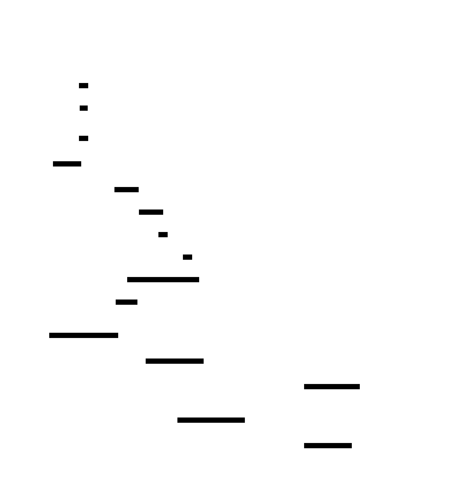

# Gossip Protocol

**Aliases:** Epidemic Protocol, Anti-Entropy Protocol, Rumor Mongering
**Category:** Coordination (cluster membership and dissemination)
**Sources:**
[Joshi — Patterns of Distributed Systems](https://martinfowler.com/articles/patterns-of-distributed-systems/) ·
Kleppmann *DDIA*, Ch 5 (anti-entropy) ·
[Demers et al., *Epidemic Algorithms for Replicated Database Maintenance* (PODC 1987)](https://www.cs.cornell.edu/projects/ladis2009/papers/demers-paper.pdf) ·
[Das, Gupta, Motivala, *SWIM: Scalable Weakly-consistent Infection-style Process Group Membership Protocol* (DSN 2002)](https://www.cs.cornell.edu/projects/Quicksilver/public_pdfs/SWIM.pdf)

---

## Problem

> [!TIP]
> **ELI5.** A cluster of 1000 nodes needs to know which other nodes exist, which are alive, and what their state is. You can't have everyone heartbeat to everyone (1000 × 999 = ~1M connections, exponentially worse with size). You can't have a single coordinator (single point of failure, doesn't scale). Instead: like rumors at a party — each person tells a few random others, who tell a few more, and within minutes the gossip has reached everyone.

How does a node in a large distributed cluster (Cassandra, Riak, Consul, Akka Cluster — anywhere with hundreds to thousands of nodes) know:

- Which other nodes exist? (membership)
- Which are alive? (failure detection)
- What their current state is? (data versions, partitions owned, schema)

Three obvious approaches all fail at scale:

- **All-to-all heartbeat**: every node pings every other node. Bandwidth and CPU scale as O(N²); at 1000 nodes you'd consume the entire network just keeping track of liveness.
- **Centralized coordinator**: every node reports to a single coordinator. Single point of failure; the coordinator's bandwidth and storage scale linearly. Even with replication, the leader is a bottleneck.
- **Tree-structured propagation**: information flows up and down a tree. Fragile — failure of any internal node disrupts entire subtrees.

You need a **decentralized, scalable, fault-tolerant** dissemination mechanism that doesn't depend on any single node and adapts gracefully to failures.

The answer, inspired by epidemiology, is the gossip protocol — also called epidemic protocol. The 1987 paper by Demers et al. at Xerox PARC formalized the idea (originally for replicating Clearinghouse database updates) and showed it scales beautifully.

## How it works

> [!TIP]
> **ELI5.** Every round (e.g., every second), each node picks K random peers (typically K=3) and shares its current state with them. They merge whatever's new and, next round, will spread it further. With K=3 in a 1000-node cluster, the rumor reaches all nodes within about **10 rounds**. Like a virus.

A gossip protocol is **periodic, peer-to-peer, randomized state exchange**. Each node maintains a local view of cluster state and runs a continuous protocol:

```
every gossip_interval (e.g., 1 second):
    select K random peers from the known membership
    for each peer:
        exchange state (push, pull, or push-pull)
        merge received state into local view
```

The properties this gives you:


In the diagram, node A learns something new at t=0 (say, "B is down"). At t=1, A gossips to 3 random peers — now 4 nodes know. At t=2, each of those 4 gossips to 3 more random peers — many of them are new, so ~13 nodes now know. At t=3, all 16 nodes know.

The math: with **fanout K** and **N** total nodes, every node hears the news within **O(log_K N)** rounds. For N=10,000 and K=3, that's ~9 rounds — and at 1-second intervals, ~9 seconds for any new fact to reach the whole cluster. Far faster than feels possible, and the per-node traffic is **constant** (3 messages per round, regardless of N). No O(N²) blow-up.

### Push, pull, and push-pull

There are three modes for the state exchange:

- **Push**: "Here's everything I know; merge it." Good when news is new and few know it.
- **Pull**: "Tell me what you know; I'll merge it." Good when the rumor is settled and you're just catching up.
- **Push-pull**: both directions. The default in production systems; doubles bandwidth but accelerates convergence.

Convergence speed differs: pure push converges in O(log N) rounds; pure pull is slightly slower at the start but more efficient when most nodes already know; push-pull is fastest overall.

### SWIM-style failure detection

A naive gossip layer disseminates state. To detect failed nodes specifically, **SWIM** (Das, Gupta, Motivala 2002) adds a clever twist: periodic per-peer pings with **indirect probes** to reduce false positives:



Periodically each node A picks a random peer B and pings it. If B doesn't respond, A asks K other random nodes (C, D) to ping B on its behalf — *indirect* probes. This catches the common case where the *path* between A and B is broken but B is actually alive. Only if all indirect probes fail does A mark B "suspect" and gossip that.

A node marked suspect by anyone gets a window to **refute** the suspicion by gossiping with a higher "incarnation number." Only after the suspect-timeout, with no refutation, is the node marked **failed** and removed from membership. This two-stage process dramatically reduces false positives compared to simple timeouts.

SWIM is the foundation of **HashiCorp Serf/Consul**, **Uber Ringpop**, **ScyllaDB**, and many service-discovery layers. The original Cassandra used a different scheme based on phi-accrual failure detection but with the same gossip-spreading core.

### Anti-entropy for data

Gossip isn't limited to membership. **Anti-entropy gossip** is used to detect and repair divergence in *data* across replicas:

- **Merkle trees**: each replica computes a tree of hashes over its data; comparing roots quickly identifies which subranges differ; only those subranges are exchanged. Dynamo, Cassandra, Riak.
- **Read repair**: when a quorum read sees different values, the latest is gossiped back to the lagging replicas.
- **Background hinted handoff**: writes destined for offline nodes are buffered and gossip-delivered when they recover.

### Trade-offs

Gossip has clear strengths and equally clear weaknesses:

**Strengths**: linear scaling per-node, no single point of failure, naturally tolerates churn, simple to implement and reason about (probabilistically), well-suited to internet-scale and federated systems.

**Weaknesses**:
- **Eventually consistent**: you can't ask "is the entire cluster's view consistent right now?" You can only ask "within probability ε after time T, is it consistent?"
- **No strong ordering**: facts arrive in non-deterministic order at different nodes. Apps need conflict resolution.
- **Bandwidth waste**: nodes that already know the gossip still receive it (redundancy is the point, but also the cost).
- **Network partitions** can divide the cluster into pockets that each gossip internally; reconciliation only happens when partition heals.

Gossip is the right tool for **liveness, membership, low-rate metadata, and bulk anti-entropy** — *not* for transactional state where you need linearizability. Most modern systems pair gossip (for membership + data anti-entropy) with consensus (Raft/Paxos for the small set of facts that need strong consistency) — the [Consistent Core](../coord/consistent-core.md) pattern.

---

## Variants & related patterns

| Variant | Difference |
|---|---|
| **Push-pull gossip** | Both directions exchanged in one round. Standard in production. |
| **SWIM** | Adds indirect probes + suspicion + refutation for low-false-positive failure detection. |
| **Phi-accrual failure detector** | Continuous suspicion score, not binary. Used by Cassandra, Akka. |
| **Anti-entropy with Merkle trees** | Efficient data reconciliation via tree-of-hashes comparison. Dynamo, Cassandra, Riak. |
| **Hierarchical gossip** | Gossip within racks, then across racks — reduces cross-rack bandwidth. |
| **Plumtree / HyParView** | Hybrid that uses gossip for membership but a tree-structured broadcast for messages. Riak Core. |
| **Epidemic broadcast trees (Plumtree)** | Self-organizing trees on top of gossip for efficient broadcast. |
| **Lifeguard SWIM extensions** | HashiCorp's improvements (2018) to SWIM for fewer false positives at scale. |

## When NOT to use

- **Small static clusters (3–5 nodes)** — direct connections are simpler.
- **State that needs linearizability** — use Raft/Paxos, not gossip.
- **High-frequency data updates** — gossip overhead is significant when the gossip *is* most of your work.
- **Strict latency bounds for fact propagation** — gossip is probabilistic; the tail is long.

---

## Real-world implementations

| System | Gossip use |
|---|---|
| **Apache Cassandra** | Membership, schema, token-ring metadata; phi-accrual failure detector. |
| **HashiCorp Consul / Serf / Nomad** | Memberlist library (SWIM + Lifeguard extensions) — the de-facto gossip library in the Go ecosystem. |
| **Uber Ringpop** | SWIM for ringpop's hash-ring membership. |
| **Akka Cluster** | Gossip protocol for cluster state; phi-accrual for failure detection. |
| **Riak Core** | Plumtree + HyParView for cluster gossip. |
| **ScyllaDB** | Cassandra-compatible gossip. |
| **Redis Cluster** | Gossip for cluster membership and slot assignments. |
| **Apache Cassandra anti-entropy + Riak / Dynamo** | Merkle-tree-based gossip for data reconciliation. |
| **DynamoDB** | Internal use of gossip-style anti-entropy (per the Dynamo paper). |
| **CockroachDB** | Gossip protocol for cluster metadata (node IDs, store IDs, range descriptors prefix). |

## Companies / canonical uses

| Where | Use | Status |
|---|---|---|
| **Amazon** | Dynamo paper canonical gossip + Merkle-tree anti-entropy. | ✅ Verified — [Dynamo SOSP 2007](https://www.allthingsdistributed.com/files/amazon-dynamo-sosp2007.pdf) |
| **Apple, Netflix, Instagram, Discord** | Run Cassandra clusters using its gossip layer for membership. | ✅ Verified — engineering blogs |
| **Uber** | Ringpop (SWIM-based) underpinned much of its dispatch and matching infrastructure. | ✅ Verified — [Uber Engineering on Ringpop](https://www.uber.com/blog/ringpop-open-source-nodejs-library/) |
| **HashiCorp ecosystem (Consul/Nomad/Vault)** | Memberlist + SWIM in essentially every HashiCorp product. | ✅ Verified — [HashiCorp Serf](https://www.serf.io/docs/internals/gossip.html) |
| **Cockroach Labs customers** | CockroachDB gossip for cluster metadata. | ✅ Verified — [CockroachDB architecture](https://www.cockroachlabs.com/docs/stable/architecture/overview) |
| **Xerox PARC (1987 original)** | Clearinghouse name service — the first production gossip. | ✅ Verified — Demers et al. PODC 1987 |

---

## Further reading

- Demers et al., *Epidemic Algorithms for Replicated Database Maintenance* (PODC 1987) — the foundational paper. [PDF](https://www.cs.cornell.edu/projects/ladis2009/papers/demers-paper.pdf).
- Das, Gupta, Motivala, *SWIM: Scalable Weakly-consistent Infection-style Process Group Membership Protocol* (DSN 2002) — the modern foundation for failure detection via gossip. [PDF](https://www.cs.cornell.edu/projects/Quicksilver/public_pdfs/SWIM.pdf).
- HashiCorp Lifeguard paper, *Lifeguard: Local Health Awareness for More Accurate Failure Detection* (DSN 2018) — production SWIM improvements.
- Kleppmann, *Designing Data-Intensive Applications*, Ch 5 (anti-entropy) — the data-side application.
- Hayashibara et al., *The φ Accrual Failure Detector* (SRDS 2004) — the alternative used by Cassandra and Akka.
- Joshi, *Patterns of Distributed Systems*, "Gossip Dissemination" pattern.
- *Dynamo: Amazon's Highly Available Key-value Store* (SOSP 2007) — gossip in a real production database.

---

*Diagram sources: [`../diagrams/src/gossip-spread.d2`](../diagrams/src/gossip-spread.d2), [`../diagrams/src/gossip-swim.d2`](../diagrams/src/gossip-swim.d2).*
