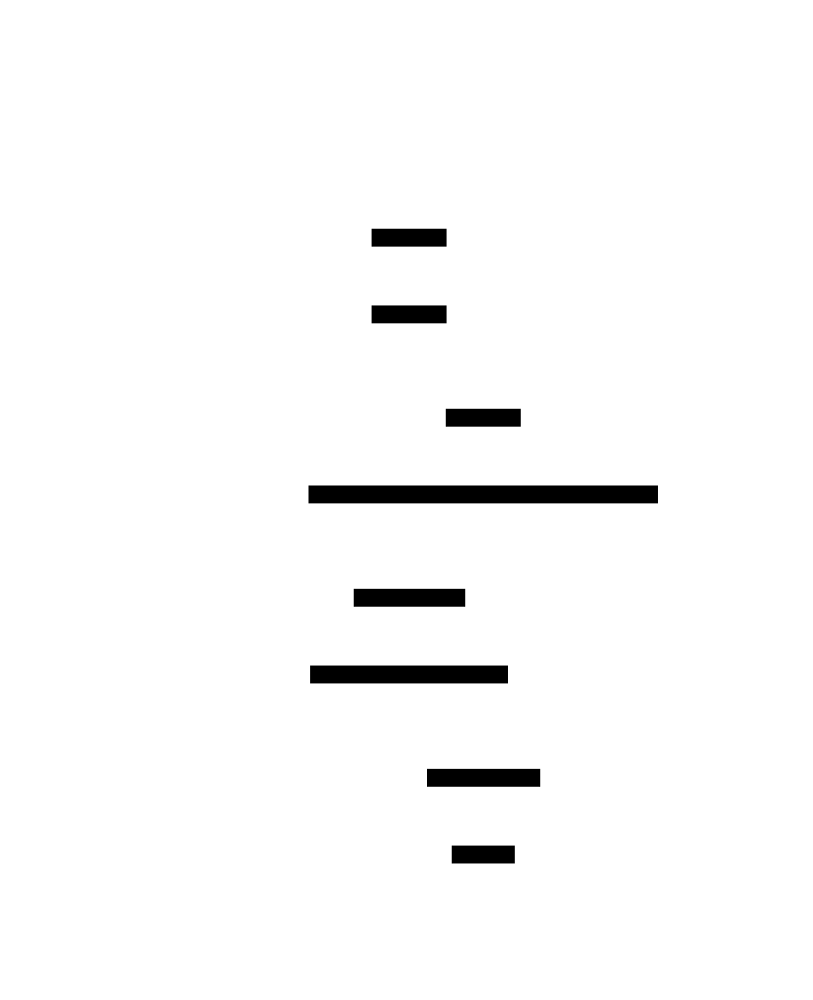

# Paxos

**Aliases:** Multi-Paxos, Basic Paxos, Synod Protocol
**Category:** Coordination (consensus)
**Sources:**
[Neo Kim](https://systemdesign.one/system-design-interview-cheatsheet/) ·
[Joshi — Patterns of Distributed Systems](https://martinfowler.com/articles/patterns-of-distributed-systems/) ·
Kleppmann *DDIA*, Ch 9 ·
Lamport, [*Paxos Made Simple* (2001)](https://lamport.azurewebsites.net/pubs/paxos-simple.pdf)

---

## Problem

> [!TIP]
> **ELI5.** Five judges have to agree on a single verdict. They can't all meet in one room. They can only exchange written notes, the notes can get lost or arrive late, and any judge might fall asleep at any time. You still need them to reach the same verdict — and once decided, it's final, even if everyone forgets why.

A group of nodes in a distributed system needs to **agree on a single value** — say, who is the current leader, what the next operation in the log is, or what value a key should have. The hard parts are not the agreement itself; they're the failure modes:

- **Nodes may crash** at any moment (and recover later, possibly remembering, possibly not).
- **Messages may be lost, delayed, duplicated, or reordered** by the network.
- **There is no synchronized clock** to coordinate "let's all decide now."

Yet you need a guarantee: once a value is decided, it must be **decided forever**, and every non-crashed node must eventually learn the same decision. Naive voting protocols fail at this — a slow vote can collide with a faster new vote, two factions can each think they reached majority, a coordinator crash can leave participants in limbo. Paxos is the algorithm that proves it's possible to do this safely, and gives a concrete protocol that does.

## How it works

> [!TIP]
> **ELI5.** A proposer asks a majority of acceptors: "Promise me you'll listen to my proposal #42, and ignore anything older." Once a majority promise, they pick a value and ask the same majority to actually accept it. If a majority accept, that value is *chosen* — and the algorithm guarantees no other value can ever be chosen instead, even if proposers compete or crash.

Paxos has three roles, often co-located on the same physical nodes:

- **Proposers** drive proposals; they want to get a value decided.
- **Acceptors** vote on proposals; they form the quorum that grants agreement. A *majority* of acceptors must accept a value for it to be chosen.
- **Learners** are told what was decided so they can act on it.

Each proposal carries a **unique, monotonically increasing proposal number** (often a pair of `(counter, node_id)` to break ties globally). The protocol runs in two phases:

**Phase 1 — PREPARE.** A proposer picks a fresh proposal number `n` (here `n=42`) and sends `PREPARE(n)` to a majority of acceptors. Each acceptor that hasn't already promised to ignore proposals with number ≥ `n` replies `PROMISE(n)` — and crucially, **if it has previously accepted some value v at some number n' < n**, it includes `(n', v)` in the promise. This phase does two things at once: it acquires a quorum of acceptors' attention for this proposal number, and it discovers any value that may have been accepted earlier.

In the diagram, Acceptor 2 has previously accepted `(n=40, v=X)`, so its promise includes that information. Acceptors 1 and 3 have nothing prior.

**Phase 2 — ACCEPT.** The proposer collects the promises. If any of them included a prior accepted value, the proposer **must propose the value associated with the highest prior accepted number** — not its own preferred value. (This is the safety property that prevents two proposers from getting different values chosen.) Here, the proposer must propose `v=X`. It sends `ACCEPT(n=42, v=X)` to a majority of acceptors. Each acceptor that hasn't promised a higher number replies `ACCEPTED`.

**Learn.** Acceptors notify learners of accepted values. Once any learner sees a majority of acceptors having accepted the same `(n, v)`, it knows `v` is *chosen* — the algorithm guarantees that **no value other than v can ever become chosen**, even by future proposals from any proposer.

The deep elegance is in what happens when two proposers compete:

Proposer A starts with `n=10` and gets a promise from Acceptor (step 1). Before A can move to phase 2, Proposer B comes along with `n=11` — a higher number — and the acceptor promises B (step 2), implicitly revoking its commitment to A's lower-numbered proposal. When A finally tries to send `ACCEPT(10, valueA)` (step 3), the acceptor *rejects* — it has already promised to ignore anything below 11. B is now free to safely accept its proposal (step 4). No value is ever "lost"; safety is preserved.

This pattern can cause **livelock** — two proposers can keep escalating proposal numbers and never let each other finish. In practice this is solved by **electing a stable leader** and letting only the leader propose for a while. That variant — running phase 2 repeatedly with the same proposer once it has won phase 1 — is **Multi-Paxos**, and it's what production systems actually deploy. The first phase becomes an amortized cost paid only on leader change; subsequent proposals are a single round trip.

Paxos is famously hard to implement correctly. Lamport's papers describe the algorithm abstractly, but real deployments require dozens of additional patterns — Joshi's catalog covers many: [Replicated Log](../data/replicated-log.md), [Generation Clock](../block/generation-clock.md), [Majority Quorum](../block/quorum.md), [Single-Socket Channel](../comm/server-side-discovery.md), [High-Water Mark](../block/hwm-lwm.md). This complexity is why **Raft** was designed: it provides the same correctness guarantees but in a presentation specifically optimized for human understanding and implementation. Most new consensus systems built since 2014 use Raft instead of Paxos.

---

## Variants & related patterns

| Variant | Difference |
|---|---|
| **Basic Paxos** | Single-instance — agree on one value. The version above. |
| **Multi-Paxos** | Run phase 1 once to elect a stable leader; then run phase 2 repeatedly for each successive log entry. The version everyone actually uses. |
| **Fast Paxos** | Allows direct accept under quiescence; sacrifices liveness in conflict. |
| **EPaxos (Egalitarian Paxos)** | Leaderless — proposers commit non-conflicting commands in parallel. |
| **Cheap Paxos** | Reduces quorum size by using auxiliary acceptors. |
| **Raft** | Different protocol, same guarantees, explicitly designed for understandability. The standard choice for new systems. |
| **ZAB** (ZooKeeper Atomic Broadcast) | Paxos-like protocol used in Apache ZooKeeper; predates and inspired Raft. |
| **Viewstamped Replication** | Contemporaneous algorithm (1988); equivalent guarantees; rediscovered as the basis of Raft. |

## When NOT to use

- **For data replication that doesn't need linearizability.** Async leader-follower replication is simpler, faster, and good enough for most data stores. Consensus is for *strong consistency* — leadership, configuration, locks.
- **When latency is critical and you only need eventual consistency.** Each consensus round is a full RTT to a majority; Dynamo-style leaderless replication is much faster.
- **For new implementations** — almost always use Raft or pick a battle-tested implementation (etcd, Consul, ZooKeeper) rather than writing your own Paxos.
- **For coordination that can be eliminated.** The cheapest consensus is no consensus — most systems consume consensus only at the rate of leader/config changes, not per-operation.

---

## Real-world implementations

| System | Algorithm | Notes |
|---|---|---|
| **Google Chubby** | Multi-Paxos | The original large-scale Paxos deployment; lock service for Bigtable, GFS, MapReduce. |
| **Google Spanner** | Multi-Paxos (per shard) | Each Paxos group manages one tablet; cross-tablet via 2PC over Paxos. |
| **Google Megastore** | Paxos | Strong consistency for App Engine datastore. |
| **Apache ZooKeeper** | ZAB (Paxos-family) | The de-facto coordination service for the Hadoop ecosystem. |
| **etcd** | Raft | Backing store for Kubernetes. |
| **Consul** | Raft | HashiCorp's service-discovery and KV store. |
| **CockroachDB / TiKV / YugabyteDB** | Raft (one per range) | Distributed SQL stores. |
| **Apache Kafka (KRaft mode)** | Raft | Kafka's replacement for ZK-based coordination. |
| **Apache Cassandra Lightweight Transactions** | Paxos | Per-row consensus for `IF NOT EXISTS` semantics; on top of the otherwise leaderless data path. |
| **MongoDB replica set** | Raft-like | Election + log replication for primary failover. |

## Companies using it (notable examples)

| Company | Use | Status |
|---|---|---|
| **Google** | Chubby, Spanner, Megastore, Bigtable, GFS metadata, F1 — virtually every Google storage system relies on Paxos somewhere. | ✅ Verified — [Burrows, *The Chubby lock service for loosely-coupled distributed systems*, OSDI 2006](https://research.google/pubs/pub27897/); [Corbett et al., Spanner OSDI 2012](https://research.google/pubs/pub39966/) |
| **Microsoft** | Uses Paxos in Azure Storage; published papers on its use. | ✅ Verified — multiple Microsoft Research papers |
| **Apple** | Operates very large ZooKeeper deployments. | ⚠ Discussed in talks; specific link not re-verified |
| **Kubernetes ecosystem** | Every Kubernetes cluster runs etcd → Raft for storage; effectively every cloud-native company. | ✅ Verified — [etcd is the canonical Kubernetes datastore](https://etcd.io/) |
| **Cloudflare, Datadog, Stripe, Airbnb** | All run Consul / ZooKeeper / etcd in production for service discovery and coordination. | ✅ Verified by consul / etcd / ZK case-study pages |

**⚠ marks claims widely known industry-wide but not re-verified by primary-source fetch.**

---

## Further reading

- Leslie Lamport, *The Part-Time Parliament* (1998) — the original (notoriously hard) paper.
- Leslie Lamport, *Paxos Made Simple* (2001) — the readable version, written after the original was rejected as "too obscure." [PDF](https://lamport.azurewebsites.net/pubs/paxos-simple.pdf).
- Tushar D. Chandra et al., *Paxos Made Live* (2007) — Google's experience report on implementing real Paxos. [PDF](https://research.google/pubs/pub33002/).
- Diego Ongaro & John Ousterhout, *In Search of an Understandable Consensus Algorithm (Extended)* — the Raft paper. [PDF](https://raft.github.io/raft.pdf). Read this *first* if you're new to consensus.
- *Designing Data-Intensive Applications*, Ch 9 — the most accessible textbook treatment.
- *Patterns of Distributed Systems*, Unmesh Joshi — implementation-pattern-by-pattern breakdown of what Paxos/Raft actually require.

---

*Diagram sources: [`../diagrams/src/paxos-protocol.d2`](../diagrams/src/paxos-protocol.d2), [`../diagrams/src/paxos-dueling-proposers.d2`](../diagrams/src/paxos-dueling-proposers.d2).*
