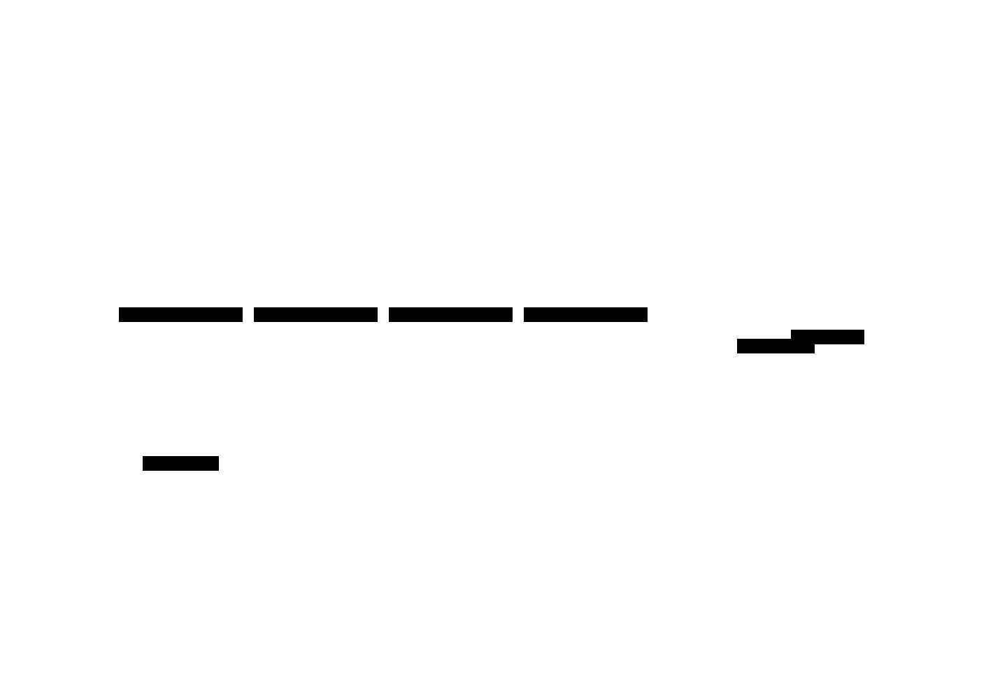
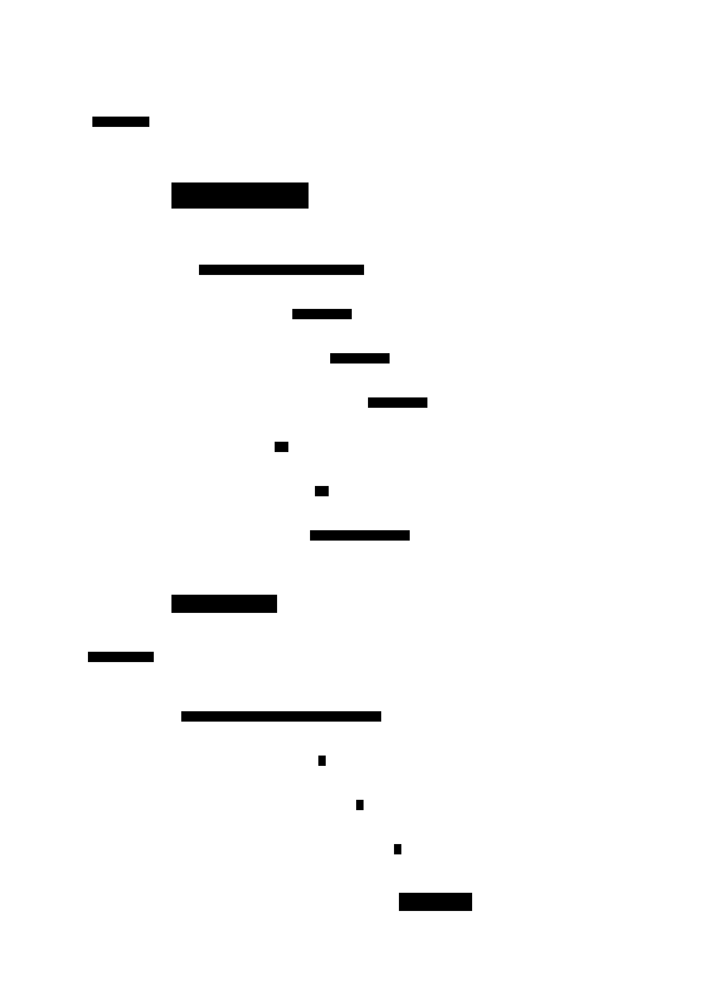

# Raft

**Aliases:** Raft Consensus, Replicated State Machine via Raft
**Category:** Coordination (consensus)
**Sources:**
[Joshi — Patterns of Distributed Systems](https://martinfowler.com/articles/patterns-of-distributed-systems/) ·
Kleppmann *DDIA*, Ch 9 ·
[Ongaro & Ousterhout, *In Search of an Understandable Consensus Algorithm* (USENIX 2014)](https://raft.github.io/raft.pdf)

---

## Problem

> [!TIP]
> **ELI5.** Five computers need to agree on a single ordered list of operations — "Alice paid Bob $5, then Carol got a refund, then…" — even though some computers may crash, the network may drop messages, and you can't trust any single computer to be in charge forever. [Paxos](paxos.md) proves it's possible but is famously hard to understand and implement. Raft is the same idea, but designed to be **understandable**.

Raft solves the same problem as [Paxos](paxos.md) — multiple nodes agreeing on an ordered sequence of operations despite failures — but addresses Paxos's notorious "everyone agrees on what it does but no one is sure how to implement it" problem. From the Raft paper's abstract:

> *"Raft is more understandable than Paxos and also provides a better foundation for building practical systems."*

The motivation isn't theoretical; it's practical. Almost every modern distributed system needs consensus somewhere — for leader election, for replicated configuration, for transaction coordination. If the underlying algorithm is too hard to implement correctly, every system grows its own subtly-broken variant. Raft tries to be teachable enough that a fresh engineer can read the paper and implement a correct version.

## How it works

> [!TIP]
> **ELI5.** One node is **Leader**, the rest are **Followers**. The leader sends a steady "I'm alive" heartbeat. The leader is the only one that accepts writes — it appends each write to its log and copies it to followers. Once a majority of followers have stored it, the write is **committed**. If the leader stops heartbeating, followers time out and hold an election: highest term wins, majority votes win.

Raft decomposes consensus into three sub-problems and solves each clearly: **leader election**, **log replication**, and **safety**. Every node is in one of three states — **Leader**, **Follower**, or **Candidate** — and time is divided into **terms** (monotonically increasing integers; see [Generation Clock](../block/generation-clock.md)).

In normal operation, exactly one node is **Leader** for the current term, accepting all client writes, and the rest are **Followers** receiving heartbeats. The diagram shows a 5-node cluster, which can tolerate 2 simultaneous failures while still having a 3-node majority. Clients send writes only to the leader; the leader replicates each write to followers and acknowledges the client once a majority has it.

A **follower becomes Candidate** when it hasn't heard from the leader within an **election timeout** (typically 150–300ms, randomized to avoid split votes). The candidate increments the current term, votes for itself, and requests votes from peers. A node grants its vote at most once per term, and only if the candidate's log is at least as up-to-date as its own. If the candidate wins a majority, it becomes Leader for that term; if it loses or ties, it eventually times out and tries again with a higher term.

The core protocol — log replication — is a sequence dance executed for every client write:

When a write arrives, the leader **appends to its local log** (uncommitted), then sends **AppendEntries** RPCs to each follower with the new entry. Each follower writes the entry to its own log and acks. Once the leader has acks from a **majority** of nodes (itself included), it **advances its commit index**, applies the operation to its state machine, and replies to the client. The next round of heartbeats (which are just empty `AppendEntries` calls) carries the updated commit index to followers, telling them they may now safely apply the entry to their own state machines.

Two safety invariants are non-negotiable. **Election Safety**: at most one leader per term. **Log Matching**: if two logs contain the same entry (same index, same term), all entries before it are also identical. These together mean once an entry is committed at some index, no future leader can ever have a different committed entry at that index — the foundation of correctness.

What makes Raft *understandable* compared to Paxos isn't fewer messages or simpler math — it's that the algorithm is decomposed into three sub-problems that can be reasoned about independently, and that the protocol is **strongly-leader**: at any time there is at most one leader, the leader has the most up-to-date log, and all logs converge to the leader's. Paxos by contrast allows any acceptor to propose, requires careful reasoning about overlapping proposals, and famously has multiple plausible but subtly-wrong implementations.

Practical extensions matter for production. **Log compaction** (snapshots): rather than keeping the entire log forever, periodically snapshot the state machine and discard log entries before the snapshot. **Membership changes** (joint consensus): adding or removing nodes safely without losing quorum, by passing through a two-phase configuration that requires majorities in both old and new membership. **Read-only optimization**: leases or read-index let the leader serve reads without going through the full log path. Every production Raft (etcd, Consul, TiKV, CockroachDB) implements these.

Raft sits at the heart of the cloud-native stack. **etcd**, the Raft-based key-value store, holds the state of every Kubernetes cluster on Earth. **Consul** uses Raft for service discovery and configuration. **CockroachDB** and **TiKV** use Raft per data range — each shard has its own Raft group of replicas, with thousands of groups per cluster. **Apache Kafka's KRaft mode** uses Raft to replace the legacy ZooKeeper-based coordination.

---

## Variants & related patterns

| Variant | Difference |
|---|---|
| **Multi-Raft** | Many independent Raft groups in one cluster, one per shard/range. CockroachDB, TiKV. |
| **Pre-vote** | Optimization that requires a node to win a "shadow election" before incrementing its term — prevents disruptions from a node briefly partitioned and returning. |
| **Leader leases** | Leader holds a time-bounded lease so it can serve reads locally without round-trip; used in CockroachDB. |
| **Raft with witnesses** | Some replicas just vote, don't hold data — reduces storage cost (used in Spanner-derivatives). |
| **Joint consensus / Single-server membership change** | Two approaches to safe membership change. Single-server (one at a time) is simpler and now preferred. |
| **Paxos / Multi-Paxos** | The intellectual predecessor; same guarantees, harder to understand. |
| **ZAB** (ZooKeeper) | Older Paxos-family protocol; predates Raft. |
| **Viewstamped Replication** | Contemporary of Paxos; equivalent; rediscovered as basis of Raft. |
| **EPaxos** | Leaderless Paxos variant; better throughput in conflict-free workloads. |

## When NOT to use

- **For data replication that doesn't need linearizability.** Use leader-follower replication (asynchronous) or Dynamo-style leaderless — much cheaper.
- **For very high single-shard throughput.** A single Raft group's throughput is bounded by leader writes. Sharding into many Raft groups (Multi-Raft) is the answer.
- **When you can use a library/system.** Don't write your own Raft. Use etcd, Consul, or a battle-tested library (Hashicorp's `raft`, Eclipse `raft-jepsen-tested`, `tikv/raft-rs`). Raft is *easier* than Paxos but still has many edge cases.

---

## Real-world implementations

| System | Notes |
|---|---|
| **etcd** (CNCF) | The canonical Raft key-value store; backs every Kubernetes cluster. Excellent reference implementation in Go. |
| **HashiCorp Consul** | Raft for service discovery + KV. |
| **HashiCorp `raft` library** | Standalone Go Raft library; used by Consul, Vault, Nomad. |
| **TiKV / TiDB** (PingCAP) | Per-region Raft groups; thousands per cluster. |
| **CockroachDB** | Per-range Raft groups; multi-tenant SQL on Raft. |
| **YugabyteDB** | Same idea — Raft per tablet. |
| **Apache Kafka (KRaft mode)** | Replaces ZooKeeper coordination with Raft. |
| **RethinkDB, MongoDB replica set** | Raft-style election + log replication. |
| **Tigerbeetle, FoundationDB** | Custom Raft-family variants for transaction processing. |

## Companies using it (notable examples)

| Company | Use | Status |
|---|---|---|
| **Every Kubernetes user** | Kubernetes stores cluster state in etcd → Raft. So Google, Microsoft, every cloud provider, every CNCF-using company. | ✅ Verified — etcd is hard-required by Kubernetes |
| **Cockroach Labs / customers** | CockroachDB uses per-range Raft. | ✅ Verified — [CockroachDB architecture docs](https://www.cockroachlabs.com/docs/stable/architecture/replication-layer) |
| **PingCAP / TiDB customers** | TiKV uses per-region Raft. | ✅ Verified — [TiKV docs](https://tikv.org/docs/dev/deep-dive/scalability/multi-raft/) |
| **HashiCorp customers (Consul, Vault, Nomad)** | All HashiCorp products with high-availability use the HashiCorp `raft` library. | ✅ Verified — open-source codebases |
| **Confluent / Kafka users with KRaft** | Modern Kafka deployments use KRaft mode. | ✅ Verified — [Apache Kafka KRaft docs](https://kafka.apache.org/documentation/#kraft) |
| **Datadog, Stripe, Shopify, Airbnb, Cloudflare** | All run Consul / etcd / Vault in production. | ✅ Verified — [Consul, etcd case studies](https://www.consul.io/use-cases) |

---

## Further reading

- Diego Ongaro, John Ousterhout, *In Search of an Understandable Consensus Algorithm (Extended)* (2014) — the Raft paper. [PDF](https://raft.github.io/raft.pdf).
- Diego Ongaro's PhD thesis, *Consensus: Bridging Theory and Practice* — the long version; includes log compaction, membership changes, client interaction.
- [raft.github.io](https://raft.github.io/) — visualizations, lecture videos, list of implementations.
- *Designing Data-Intensive Applications*, Ch 9 — Raft in context of consensus algorithms.
- Heidi Howard's blog and papers — modern theoretical work clarifying the Paxos/Raft relationship.
- Jepsen test reports — invaluable for understanding how real Raft systems fail under adversity.

---

*Diagram sources: [`../diagrams/src/raft-roles.d2`](../diagrams/src/raft-roles.d2), [`../diagrams/src/raft-log-replication.d2`](../diagrams/src/raft-log-replication.d2).*
