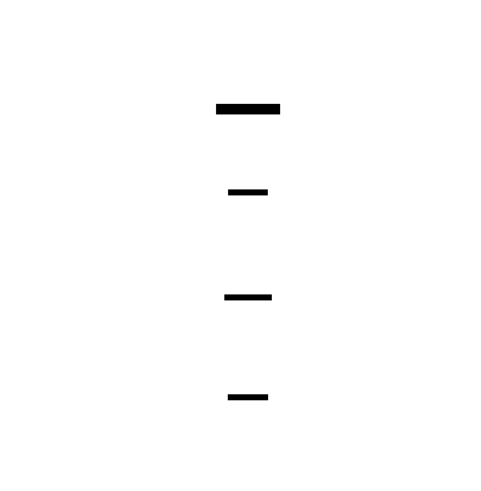
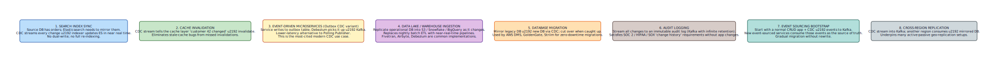

# Change Data Capture (CDC)

**Aliases:** CDC, Log-Based Replication, Streaming ETL
**Category:** Data / Integration
**Sources:**
[Debezium documentation](https://debezium.io/documentation/) ·
[Chris Richardson — microservices.io: Transaction Log Tailing](https://microservices.io/patterns/data/transaction-log-tailing.html) ·
Kleppmann, *Designing Data-Intensive Applications*, Ch 11 ·
[Microsoft Azure Architecture Center — Event Sourcing](https://learn.microsoft.com/en-us/azure/architecture/patterns/event-sourcing) (related)

---

## Problem

> [!TIP]
> **ELI5.** Your operational database (Postgres, MySQL, MongoDB) is the source of truth. Many other systems need to know about changes — a search index needs to mirror data, a cache needs to invalidate, a data warehouse needs to ingest, microservices need to react. The bad way: poll the DB constantly, or have the app dual-write to everything. The good way: **CDC** — a tool reads the database's *replication log* (the log it already maintains for its own internal replication) and streams every committed change to Kafka or another broker. Every downstream system subscribes and gets the changes in commit order, with near-zero latency.

In any non-trivial system, a relational or document database is the source of truth for some critical data — orders, users, transactions, inventory. Many other components need to know when that data changes:

- **Search indexes** (Elasticsearch, Solr) mirror operational data for query.
- **Caches** (Redis, Memcached) need to invalidate entries when source data changes.
- **Data warehouses** (Snowflake, BigQuery, Redshift) ingest operational data for analytics.
- **Other microservices** want to react to domain events ("a new order was placed" → "ship it").
- **Audit systems** need a tamper-evident log of every change.
- **Cross-region replicas** need to mirror the data elsewhere.

The naive solutions all break:

- **Polling**: every consumer polls the DB constantly. Wasteful, latency = poll interval, hard at scale.
- **Application dual-write**: app updates DB and pushes to consumers. The [dual-write problem](outbox.md) strikes — atomicity impossible across systems.
- **Database triggers**: triggers fire on insert/update and notify external systems. Tightly coupled; performance hits writes; failures in trigger can break writes.

**Change Data Capture (CDC)** elegantly sidesteps all of these by reading the database's **replication log** — the write-ahead log (Postgres WAL), binary log (MySQL binlog), or oplog (MongoDB) that the DB already maintains internally for its own replication. A CDC tool tails this log and publishes change events to a message broker. Downstream consumers subscribe and process them.

## How it works

> [!TIP]
> **ELI5.** Every committed change in the DB — every INSERT, UPDATE, DELETE — is written to the replication log. CDC tools (Debezium, AWS DMS, Maxwell) connect as a "replication client" and read this log. Each change becomes a structured event published to Kafka. Apps don't change at all — they just write to the DB as normal. Consumers subscribe to Kafka and react. Near-zero latency. Naturally ordered. Survives downstream outages because the log is the source.

The flow:



**Source database**: applications write normally. INSERTs, UPDATEs, DELETEs go to tables. Every committed change is also appended to the **replication log** — the DB's own internal write-ahead structure (Postgres WAL, MySQL binlog, MongoDB oplog, SQL Server CDC tables).

**CDC connector** (Debezium, AWS DMS, Maxwell, GoldenGate, Striim, Fivetran): connects to the DB as a "replication client" — the same protocol used by read replicas. Reads the log entries in real time, parses each change into a structured event:

```json
{
  "op": "INSERT",
  "table": "orders",
  "before": null,
  "after": { "id": 42, "customer_id": 7, "total": 99.95, ... },
  "ts_ms": 1709000000000,
  "source": { "lsn": "0/3FE83B0", ... }
}
```

Publishes to a message broker (Kafka, Pulsar, Kinesis). Tracks its position in the replication log (LSN, binlog position, oplog timestamp) so it can resume after restart without missing or duplicating events.

**Message broker**: typically one topic per source table. Events partitioned by primary key, so changes for the same row land in order on the same partition. Retained for days or weeks; consumers can replay.

**Consumers**: any number of services subscribe to the topics. Search indexers, cache invalidators, microservices, data lakes — each consumes independently.

The pattern is elegant because:

- **Applications are unchanged.** They don't know CDC exists.
- **Atomicity is preserved.** Whatever the DB commits, CDC sees. No dual-write problem.
- **Order is preserved.** Replication log is in commit order; consumers see changes in the same order.
- **Replay is free.** Kafka retains events; new consumers can backfill from any point.
- **Downstream outages are absorbed.** If Elasticsearch is down, events queue in Kafka; resync on recovery.

### Use cases

CDC is one of the highest-leverage patterns in modern data architectures:



**Search index sync** — the canonical example. Orders live in Postgres; Elasticsearch needs to mirror them for query. CDC streams every change; indexer updates Elasticsearch. No full re-indexing, no dual-writes.

**Cache invalidation** — CDC stream tells the cache layer "customer 42 changed → invalidate the customer:42 key." Eliminates the entire class of stale-cache bugs from missed invalidations.

**Event-driven microservices** — the Outbox pattern (above) often uses CDC to drain the outbox table. Lower-latency than polling. Pure-CDC variants emit domain events directly from changes to business tables (with care around schema coupling).

**Data lake / warehouse ingestion** — Fivetran, Airbyte, Debezium replicate operational DBs into Snowflake, BigQuery, S3 as changes happen. Replaces nightly batch ETL with near-real-time pipelines.

**Database migration** — mirror legacy DB to new DB via CDC; when caught up, cut over. AWS DMS, GoldenGate, Striim do exactly this for zero-downtime migrations.

**Audit logging** — stream all changes to an immutable log (Kafka with infinite retention or compaction). Satisfies SOC 2, HIPAA, SOX "change history" requirements without changing app code.

**Event sourcing bootstrap** — start with a normal CRUD app + CDC → events to Kafka. New event-sourced services consume those events as the source of truth. Gradual evolution without rewriting.

**Cross-region replication** — CDC into Kafka; another region's consumer mirrors. Underpins many active-passive geo setups.

### CDC tooling landscape

The major players:

- **Debezium**: the dominant open-source CDC. Built on Kafka Connect. Supports Postgres, MySQL, MongoDB, SQL Server, Oracle, DB2, Cassandra. Production-grade and battle-tested.
- **AWS DMS (Database Migration Service)**: AWS-managed; can do migration *and* ongoing CDC. Targets Kinesis, Kafka (MSK), S3, other databases.
- **Maxwell / mysql-binlog-connector-java**: MySQL-specific, lightweight.
- **GoldenGate (Oracle)**: enterprise CDC, predates the open-source ecosystem.
- **Striim**: commercial CDC + stream processing.
- **Fivetran / Airbyte**: SaaS data-integration platforms with CDC connectors as a primary capability.
- **Snowflake Streams**: Snowflake's built-in CDC on tables.
- **MongoDB Change Streams**: MongoDB's native CDC API.
- **Postgres Logical Replication + pgoutput**: Postgres-native CDC primitive; foundation for Debezium and many tools.

### Operational considerations

CDC is excellent when working but has its own ops burden:

- **Replication slot management** (Postgres): slots prevent the DB from purging WAL entries until consumed. A stuck consumer can fill the disk. Monitor slot lag.
- **Initial snapshot**: when a CDC connector starts, it usually does a full table snapshot before tailing the log. This can lock or stress the source DB. Recent Debezium versions have *incremental snapshots* that ease this.
- **Schema changes**: ALTER TABLE on the source can break or restart the CDC pipeline. Schema-aware CDC (with schema registry) handles this; bare CDC may break.
- **Backpressure**: if Kafka or the connector are slow, the source DB's replication log grows. Monitor lag and disk usage.
- **Position recovery**: connectors persist their position (LSN, binlog position). Loss of this state means re-snapshotting or skipping events.
- **Exactly-once semantics**: most CDC is at-least-once; consumers must be idempotent.

### CDC vs Outbox-via-CDC vs Pure CDC

A subtle distinction worth understanding:

- **Pure CDC** of business tables: every change to `orders` becomes a "change event." Downstream consumers see raw row changes. Simple but tightly coupled — any column change is exposed; refactoring breaks consumers.
- **Outbox-via-CDC**: applications write domain events to an `outbox` table (in the same transaction as the business write); CDC drains that table. Consumers see well-defined domain events ("OrderPlaced," "OrderCancelled"), not raw row changes. Decoupled from internal schema.

The **outbox-via-CDC** approach is generally preferred for inter-service communication; **pure CDC** is fine for low-coupling use cases (cache invalidation, search index, analytics).

### Trade-offs

Advantages:
- **Zero app changes.** Source applications don't know CDC exists.
- **No dual-write problem.** Atomicity is preserved.
- **Low latency.** Milliseconds, not minutes.
- **Naturally ordered.** Commit order preserved.
- **Replayable.** Kafka retention enables backfill.
- **Survives outages.** Consumers can be down without losing data.

Disadvantages:
- **New infrastructure.** Debezium, Kafka Connect, Kafka itself, schema registry — operational complexity.
- **Coupling to DB internals.** Replication log format, schema, primary keys — all become part of your contract.
- **Initial snapshot pain.** Bootstrapping large tables can be disruptive.
- **Schema evolution care needed.** Especially for pure CDC of business tables.
- **Not exactly-once.** At-least-once; consumers must be idempotent.

For modern data architectures, CDC has become foundational — alongside Kafka, search engines, and data lakes. The cost is real but the leverage is enormous.

---

## Variants & related patterns

| Variant | Difference |
|---|---|
| **Log-based CDC (Debezium et al.)** | Reads DB replication log; dominant approach. |
| **Trigger-based CDC** | DB triggers write change rows to an audit table; older, more invasive. |
| **Polling-based "CDC"** | Periodic SELECT WHERE updated_at > X. Simplest, lowest fidelity. |
| **Outbox-via-CDC** | CDC of an outbox table; preferred for event publishing. |
| **Pure CDC of business tables** | Direct change events; tightly coupled to schema. |
| **Streaming ETL (Snowflake Streams, etc.)** | DB-native variants. |
| **Event Sourcing** | The event log *is* the source of truth; no CDC needed. |
| **Bidirectional CDC** | Mirroring with conflict resolution; for active-active setups. |

## When NOT to use

- **No downstream needs to know about changes.**
- **Synchronous consistency required** — CDC is async by nature; use 2PC or rethink.
- **Tiny system** — overhead exceeds benefit.
- **Read-only source DB** — nothing to capture.
- **Without engineering capacity** to operate Debezium / Kafka Connect.

---

## Real-world implementations

| System | Use |
|---|---|
| **Debezium + Kafka Connect** | The dominant open-source stack. |
| **AWS DMS** | Managed; common in AWS-native shops. |
| **MongoDB Change Streams** | Built into MongoDB; very common in Mongo apps. |
| **Postgres logical replication / pgoutput** | Underlies Debezium Postgres connector; can be used directly. |
| **Snowflake Streams** | DB-native CDC on Snowflake tables. |
| **Maxwell, mysql-binlog-connector-java** | MySQL-specific, lightweight. |
| **Striim** | Commercial CDC + stream processing. |
| **Fivetran, Airbyte** | SaaS data-integration with CDC. |
| **GoldenGate** | Oracle enterprise CDC. |
| **AWS DynamoDB Streams** | DynamoDB-native change events. |

## Companies / canonical uses

| Where | Use | Status |
|---|---|---|
| **Netflix** | CDC widely used for stream processing pipelines. | ✅ Verified — Netflix Tech Blog |
| **LinkedIn** | Created Databus (early CDC system); precursor to Kafka Connect. | ✅ Verified — LinkedIn Engineering blog |
| **Confluent customers (Walmart, Cerner, Goldman Sachs)** | CDC + Kafka in production at scale. | ✅ Verified — Confluent case studies |
| **Shopify** | CDC for data lake ingestion and event-driven services. | ✅ Verified — Shopify Engineering blog |
| **WeWork (defunct as case study but published)** | Debezium for outbox-style event publishing. | ✅ Verified — engineering blog from peak years |
| **Uber** | Internal CDC system (Schemaless, Cadence) for event-driven services. | ✅ Verified — Uber Engineering blog |
| **DoorDash** | Public posts on Debezium + Kafka for transactional outbox. | ✅ Verified — DoorDash Engineering |

---

## Further reading

- Debezium documentation — the most-detailed open CDC docs.
- Kleppmann, *Designing Data-Intensive Applications*, Ch 11 (Stream Processing) — definitive theoretical treatment.
- Chris Richardson, *microservices.io* — Transaction Log Tailing pattern.
- Gunnar Morling's blog — many deep CDC posts from Debezium's creator.
- Confluent blog — CDC + Kafka best practices.
- *Making Sense of Stream Processing*, Martin Kleppmann (free book) — pre-DDIA but excellent on CDC.
- Microsoft Azure Architecture Center — Event Sourcing pattern (related).
- "The Log: What every software engineer should know..." — Jay Kreps's foundational essay on log-based systems.

---

*Diagram sources: [`../diagrams/src/cdc-flow.d2`](../diagrams/src/cdc-flow.d2), [`../diagrams/src/cdc-use-cases.d2`](../diagrams/src/cdc-use-cases.d2).*
