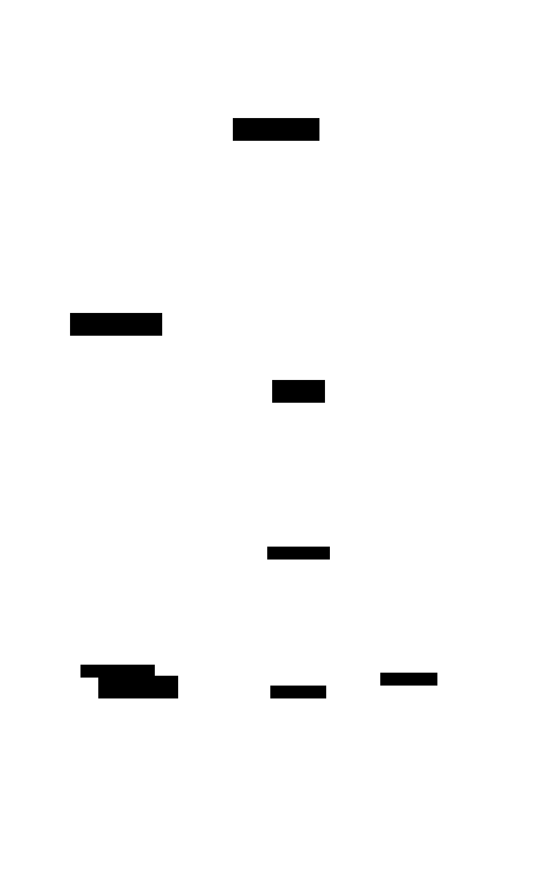
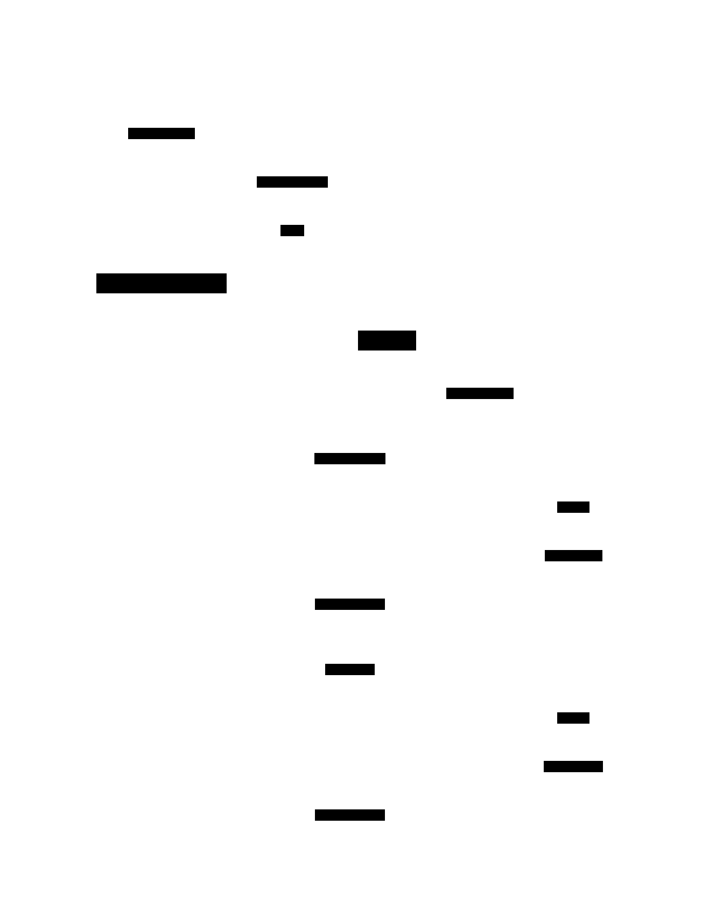

# CQRS — Command Query Responsibility Segregation

**Aliases:** Command-Query Separation (at the architecture scale)
**Category:** Data
**Sources:**
[Microsoft Azure](https://learn.microsoft.com/en-us/azure/architecture/patterns/cqrs) ·
[microservices.io](https://microservices.io/patterns/data/cqrs.html) ·
[Neo Kim](https://systemdesign.one/system-design-interview-cheatsheet/#cqrs) ·
[Greg Young — CQRS Documents (2010)](https://cqrs.files.wordpress.com/2010/11/cqrs_documents.pdf) — original formulation ·
Martin Fowler — [bliki/CQRS](https://martinfowler.com/bliki/CQRS.html)

---

## Problem

> [!TIP]
> **ELI5.** Your kitchen has to be both a *cash-register-fast* takeout window and a *spreadsheet-fancy* analytics dashboard. Whichever one you optimize the kitchen for, the other becomes painful.

Most systems use the same data model — the same tables, the same objects — for both *writing* new state and *reading* it back. That model is forced to be good at two very different jobs:

- **Writes** want a normalized, integrity-enforcing model: foreign keys, constraints, small focused transactions. Bad data must be rejected at the door.
- **Reads** want a denormalized, pre-joined, query-shaped model: one table per screen, indexes per question, aggregates pre-computed. Joins across a normalized schema are expensive at scale.

A single model that tries to serve both ends up compromising both: complex ORMs to flatten reads, defensive code to prevent invalid writes, locks that block reporting queries, schema migrations that ripple through unrelated features. As the system grows, every change has to be safe for both worlds at once — and the read and write paths almost always need to scale independently anyway (reads usually outnumber writes 10–100×).

## How it works

> [!TIP]
> **ELI5.** Keep two copies of the data. One copy is *just for writing* — simple and strict. The other copy (or copies) is *just for reading* — pre-shaped for the exact questions people ask. When you change the write copy, the read copies get updated soon after, but not instantly.

CQRS splits the system in half along the read/write axis. The write half accepts **commands** (intentions: *place order*, *change address*); the read half answers **queries** (questions: *show my orders*). Each half has its own model, its own data store, and often its own scaling profile — connected by a one-way **projection** mechanism that propagates changes from the write side to the read side.

A request from the **Client** flows down one of two paths depending on whether it's a command or a query.

On the **command path** (blue), the client posts to the **Command API**, which delegates to a **Domain / Command Handler**. The handler enforces invariants ("can this account afford the order?"), decides what to do, and persists the resulting state change to the **Write Store** — typically a normalized OLTP database optimized for correctness and write throughput. Often the handler also emits a domain event ("OrderPlaced") in the same transaction.

The **Projection** component (orange hexagon) is the bridge. It can be implemented as event consumers reading an event log, change-data-capture tailing the write DB's transaction log, or a message bus the command side publishes to explicitly. Whatever the mechanism, its job is the same: react to write-side changes and update one or more **Read Stores**.

Each read store is **shaped for a specific query pattern**, not for normalization. One might be a key-value store holding "user → list of recent orders" rows for the order list screen. Another might be Elasticsearch for full-text search over orders. A third might be a columnar warehouse for reporting. They can use entirely different database technologies, can be sharded differently, and can be rebuilt from scratch by replaying events when the query needs change.

On the **query path** (green), the client hits the **Query API**, which simply reads from whichever read store best fits the question. Query handlers are thin — no joins, no business rules, often just a primary-key lookup against a pre-computed projection.

The cost of this freedom is **eventual consistency**:

Steps 1–4 are the synchronous write: the client sends a command, the write store persists it, and the API returns success — typically `202 Accepted` to signal that the write has been recorded but downstream effects are not yet visible. The projection (steps 5–6) runs asynchronously: a change event flows to the projector, which updates the read store.

In between, there is a **staleness window** — usually milliseconds, occasionally seconds, sometimes longer under load. A query that arrives during that window (red path, steps 7a–10a) sees the *old* value from the read store, even though the write has already succeeded. Once the projection catches up (green path, 7b–10b), queries see the new value.

This window is the central tradeoff of CQRS. Handling it well usually means one or more of:

- **UI accommodation** — update the screen optimistically from the command response, not by re-querying.
- **Read-your-own-writes routing** — after a write, route that user's next few reads to the write store (or a synchronously-updated cache) for a few seconds.
- **Versioned reads** — the command response includes a version token; the client passes it to subsequent queries, which wait until the read store has reached that version before responding.
- **Embracing it** — accept that "eventual" is fine for most screens, and only special-case the few that aren't.

---

## Variants & related patterns

| Variant / pairing | What it adds |
|---|---|
| **CQRS + Event Sourcing** | Write store *is* an append-only log of events. Projections derive read stores by replay. The most powerful combination, and the one Greg Young originally described — but it adds significant complexity and is **not required**. |
| **CQRS without ES** | Write store is a normal RDBMS; projection is via CDC (Debezium) or dual-writes through a message bus. Much more common in practice; lighter to adopt. |
| **Materialized View** | A degenerate CQRS — one read model, often inside the same DB. Same idea, smaller scope. |
| **Read-Write Split** | *Not* CQRS. Same model on both sides; just routing reads to replicas. CQRS uses *different* models. |
| **Database per Service** | Often pairs with CQRS in microservices: each service owns its write store; cross-service read models are projected via events. |

## When NOT to use

- **Simple CRUD apps.** If the read and write models are nearly the same, CQRS doubles your moving parts for no benefit. Most apps are like this; resist the temptation.
- **Strong read-after-write requirements everywhere.** Financial ledgers, inventory at checkout, anything where the user must immediately see what they just wrote — those queries should hit the write store directly. CQRS is fine for the rest of the system.
- **Teams new to distributed systems.** The eventual-consistency window is surprisingly hard to reason about in production. Get good at it on a small surface before going wide.
- **When you'd be tempted to share a single read model with the write side.** That's not CQRS — that's just complexity theater.

---

## Real-world implementations (open source / standard)

| Tool / framework | Role |
|---|---|
| **Axon Framework** (JVM) | CQRS + Event Sourcing framework; command bus, event store, projection handlers. |
| **EventStoreDB** | Purpose-built event-sourced store; commonly paired with CQRS. |
| **Debezium** | Change-data-capture from Postgres/MySQL/MongoDB transaction logs — the standard way to project from a write DB into read stores without Event Sourcing. |
| **Apache Kafka + Kafka Streams / ksqlDB** | The dominant message bus + stream-processor combo for building projections at scale. |
| **MartenDB** (.NET / Postgres) | Document store on top of Postgres with built-in event sourcing and projections. |
| **AWS DynamoDB Streams + Lambda** | Common serverless way to project DynamoDB writes into read-optimized stores (OpenSearch, another DynamoDB table, etc.). |
| **Materialize / RisingWave** | Streaming SQL databases that maintain read-side materialized views incrementally from event streams. |

## Companies using it (verification status marked)

| Company | Use | Status |
|---|---|---|
| **Microsoft Azure** | Documents CQRS as a first-class cloud design pattern; recommends it in conjunction with Event Sourcing for high-scale read/write asymmetric systems. | ✅ Verified — [pattern doc](https://learn.microsoft.com/en-us/azure/architecture/patterns/cqrs) |
| **Walmart** | Has publicly described event-driven CQRS-style projections in their order management. | ⚠ Industry talks; not re-verified by fetch |
| **Netflix** | Uses event-sourced + CQRS-style projections in studio/content metadata systems (Meson, Keystone). | ⚠ Engineering blog posts exist; not re-verified by fetch in this document |
| **Uber** | Trip state machine and dispatch use CQRS + event-sourced projections internally. | ⚠ Conference talks; not re-verified |
| **LinkedIn** | Espresso + Databus and Kafka-based projections are the canonical CDC-driven CQRS implementation at scale. | ✅ Verified concept — [LinkedIn Engineering: *The Log*, Jay Kreps, 2013](https://engineering.linkedin.com/distributed-systems/log-what-every-software-engineer-should-know-about-real-time-datas-unifying) |
| **Stripe** | Ledger / events architecture maintains projections downstream of an append-only journal. | ⚠ Talks at QCon and elsewhere; not re-verified |
| **GitHub** | Search and notifications are read-side projections of the primary write DB via Elasticsearch. | ⚠ Well-known via GitHub Engineering blog over the years; specific link not re-fetched here |

**⚠ marks claims that are widely-known industry attribution but were not re-verified by primary-source fetch for this document. Treat as plausible but not citation-grade.**

---

## Further reading

- Greg Young, *CQRS Documents* (2010) — the original PDF that defined the pattern: [cqrs.files.wordpress.com/2010/11/cqrs_documents.pdf](https://cqrs.files.wordpress.com/2010/11/cqrs_documents.pdf)
- Martin Fowler, *CQRS* — [martinfowler.com/bliki/CQRS.html](https://martinfowler.com/bliki/CQRS.html) — the standard short overview, including warnings about over-application.
- Kleppmann, *Designing Data-Intensive Applications*, Ch 11 (Stream Processing) and Ch 12 — covers projections, derived data, and the unbundling-the-database argument that CQRS embodies.
- Microsoft Azure Architecture Center, *CQRS pattern* and *Event Sourcing pattern* — paired docs with implementation guidance.
- Vaughn Vernon, *Implementing Domain-Driven Design* — chapters on command/query separation in DDD contexts.

---

*Diagram sources: [`../diagrams/src/cqrs-architecture.d2`](../diagrams/src/cqrs-architecture.d2), [`../diagrams/src/cqrs-sequence.d2`](../diagrams/src/cqrs-sequence.d2). Render with `d2 input.d2 output.svg`.*
