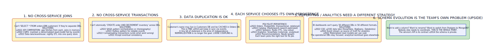

# Database per Service

**Aliases:** Per-Service Database, Service-Owned Data, Database Decomposition
**Category:** Data / Architectural
**Sources:**
[Chris Richardson — microservices.io: Database per Service](https://microservices.io/patterns/data/database-per-service.html) ·
[Microsoft Azure Architecture Center — Data considerations for microservices](https://learn.microsoft.com/en-us/azure/architecture/microservices/design/data-considerations) ·
Sam Newman, *Building Microservices* (2nd ed.), Ch on Data Management

---

## Problem

> [!TIP]
> **ELI5.** Microservices are supposed to be independent. But if two "microservices" share a database — both reading and writing the same tables — they're not actually independent. Changing the schema breaks both. Their releases must be coordinated. A query in one slows the other. **Database per Service** says: each service owns its own database, and other services can only access that data through the service's API (or via events). The database is private — a true implementation detail of the service.

A common shortcut when splitting a monolith into microservices is to **leave the database shared**. The services are separated, but they all read and write the same tables. This feels easier — no data migration, no queries to rewrite — but it's a serious anti-pattern that defeats the entire purpose of microservices.

When services share a database:

- **Schema changes break multiple services.** A column rename in `products` table breaks every service that queries it. Coordinating changes across teams becomes the dominant cost.
- **No clear ownership.** Anyone can write to any table. Bugs are diffuse; "who decremented inventory?" requires forensic analysis across services.
- **No independent deployment.** Even if services are deployed independently, schema changes still need synchronization. Effective deploy unit is "everything that touches the DB."
- **Performance contention.** A reporting query in service A can lock tables that service B's hot path depends on.
- **Locked to one technology.** Services that genuinely benefit from different storage (search engine for catalog, in-memory for sessions, graph for recommendations) can't have them.
- **"Microservices" in name only.** What you have is a distributed monolith — distributed system complexity with monolith coupling.

**Database per Service** says: each service owns its data, and the database is **not** an API. Other services cannot reach into a service's database; they must go through the service's published API.

## How it works

> [!TIP]
> **ELI5.** Each service has its own database — typically its own database server, but at minimum its own logical database (own schema, own user, no shared tables). No other service is allowed to query it directly. If service B needs data from service A, B calls A's API. The database becomes a true implementation detail — service A can change its schema, even switch from Postgres to MongoDB, without affecting any other service.

The pattern is structurally simple:

Each service has its own database. The database stores the service's private state. Other services have no direct access; they must go through the service's API. Communication between services happens via:

- **Synchronous API calls** (REST, gRPC) for query and command.
- **Asynchronous events** (Kafka, pub-sub) for notifying other services of state changes.

The database can be a separate database server, a separate database within a shared server, or simply a separate schema with separate credentials — what matters is that **no other service has access**.

This is enforced by:
- **Network ACLs**: only the owning service can connect to its DB.
- **Credentials**: only the owning service knows the DB password / has the role.
- **Code review and culture**: teams agree that "reaching into someone else's DB" is forbidden.

The strongest enforcement (separate servers) gives total isolation; the weakest (just separate schemas) relies on discipline but is operationally simpler.

### Polyglot persistence

A major benefit of database-per-service is that **each service chooses its own storage technology**:

- **Orders service** → PostgreSQL (transactional, relational)
- **Catalog service** → Elasticsearch (search-optimized)
- **Sessions service** → Redis (TTL-based key-value)
- **Analytics service** → Snowflake (columnar, analytical)
- **Recommendations service** → Neo4j (graph)
- **Time-series metrics** → InfluxDB or TimescaleDB
- **Document-heavy services** → MongoDB

Each team picks the right tool. The monolith's "one DB to rule them all" forces a compromise; database-per-service lets each domain use the right model. This is **polyglot persistence** — and it's only viable when each service genuinely owns its storage.

### Consequences you must accept

Database-per-service has profound implications that touch every part of the architecture:

**1. No cross-service joins.** You can't `SELECT * FROM orders JOIN customers` when they're separate databases. Solutions:
- **API Composition**: the application or BFF fetches from each service and joins in memory.
- **[CQRS](../data/cqrs.md)**: maintain a denormalized read-model fed by events; query the read-model.
- **Data lake / warehouse**: nightly ETL or [CDC](cdc.md) into a single analytical store for cross-cutting queries.

**2. No cross-service transactions.** You can't atomically "create order AND decrement inventory" across two DBs. Solutions:
- **[Saga](../data/saga.md)**: orchestrated or choreographed sequence with compensating actions on failure.
- **[Outbox](outbox.md)**: reliable event publishing for choreographed sagas.
- **Compensating transactions**: undo what went wrong.
- **Accept eventual consistency**: in many domains, this is fine.

**3. Data duplication is OK.** A customer's name may exist in both Customers DB and Orders DB (cached for display). This is normal and good — keep them in sync via events. Normalization is no longer the goal; loose coupling is. A few minutes of staleness for a customer's display name is a tiny price for service independence.

**4. Polyglot persistence is natural.** Each service picks the best storage. (See above.)

**5. Reporting / analytics needs a different strategy.** BI dashboards can't reasonably query 50 different DBs in 50 different formats. The standard answer: stream data via [CDC](cdc.md) to a data lake or warehouse where analytics tools query a unified view. Operational DBs stay focused; analytical workload goes elsewhere.

**6. Schema evolution is the team's own problem (upside).** Want to add a column? Switch from Postgres to DynamoDB? Restructure tables? Nobody else needs to coordinate. This is the whole point. The service's API is its contract; the schema is private.

### Implementation reality

In practice, "database per service" comes in degrees:

- **Separate database server per service**: maximum isolation. Operationally expensive at scale (hundreds of DB servers).
- **Separate database within a shared server**: practical compromise; logical isolation, shared operational machinery. Common in mid-sized orgs.
- **Separate schema within a shared database**: weakest physical isolation; cheapest. OK for services that have similar workload profiles.
- **Separate tables with role-based access**: weakest of all; relies entirely on discipline.

Most production deployments use the second or third level. A bank's core ledger might warrant a dedicated cluster; a small support service might share a Postgres instance with five other services in separate schemas.

### Migration from shared database

Most database-per-service migrations are extracted from monoliths with shared databases. The path is rarely instant; it's incremental:

1. **Identify the bounded contexts** ([service decomposition](../arch/service-decomposition.md)). Which tables belong to which future service?
2. **Define service APIs first.** Existing code that read directly from "someone else's tables" starts using the (new) service API instead.
3. **Move tables to the owning service's DB.** Schema migration, often with [CDC](cdc.md) keeping both in sync during transition.
4. **Cut over.** Old shared DB stops being read; can be archived.
5. **Repeat for the next context.**

This is essentially [Strangler Fig](../arch/strangler-fig.md) applied to data. It typically takes years for a large monolith. Many organizations get stuck halfway, with some services properly isolated and others still sharing — and that's OK as long as the direction is clear.

### When to accept shared databases (with eyes open)

Sometimes pragmatism wins:

- **Legacy migration in progress**: full isolation is the goal but not yet achieved.
- **Reporting databases**: a shared analytics DB fed by CDC is fine — it's a read-only consumer of events, not a source of truth.
- **Tightly-coupled subdomain**: occasionally domain experts say "this really is one thing" — accept it and design accordingly.
- **Operational simplicity at small scale**: a 5-engineer team building 3 services might justifiably share one DB if they're disciplined about access.

The pattern's value is in what it forces — clear ownership, independent evolution, polyglot freedom. When those benefits don't apply, the pattern doesn't either.

### The cultural commitment

Database-per-service is as much a cultural commitment as a technical pattern. The team must accept:

- "I can't just JOIN the data." (Use API composition or read models.)
- "I can't atomically update across services." (Use saga.)
- "I'm going to have data duplication." (Yes — and that's OK.)
- "Cross-service queries become an analytical concern." (Move them to the data lake.)

Teams that fight these implications end up with the worst of both worlds: distributed system complexity plus shared-DB coupling. Teams that embrace them gain genuine independence — and the speed that justifies microservices in the first place.

---

## Variants & related patterns

| Variant | Difference |
|---|---|
| **Database per Service (full)** | Separate DB server per service. |
| **Schema per Service** | Same DB server, separate schema. |
| **Tables per Service (role-based)** | Same schema, enforced by access control. |
| **Polyglot Persistence** | Each service uses different storage tech. |
| **Shared Database (anti-pattern)** | Multiple services read/write same tables. Avoid. |
| **Database per Bounded Context** | DDD framing — same idea, DDD vocabulary. |
| **Read Model / Materialized View** | Denormalized per-use-case projections. Paired with database-per-service. |
| **API Composition** | App-layer joining; alternative to DB joins. |
| **CQRS** | Separate read model from write model. |

## When NOT to use

- **Single small service** — overhead exceeds benefit.
- **Tightly coupled domain that genuinely can't split** — accept it.
- **During mid-migration from monolith** — pragmatic transition; not done in a day.
- **For pure read-only analytical consumers** — shared analytics DB is fine.

---

## Real-world implementations

| Tech | Notes |
|---|---|
| **PostgreSQL clusters** | Most common transactional store; one cluster per service or per group. |
| **MongoDB Atlas** | Per-service MongoDB clusters; popular for document-heavy services. |
| **Cassandra / ScyllaDB** | Per-service clusters for write-heavy or time-series. |
| **Redis** | Per-service caches or session stores. |
| **DynamoDB / Cosmos DB** | Per-service managed NoSQL. |
| **Elasticsearch** | Per-service search indexes. |
| **Snowflake / BigQuery / Redshift** | Per-service or shared analytical store (often shared). |
| **Schema-per-tenant or per-service in shared Postgres** | Practical mid-scale compromise. |

## Companies / canonical uses

| Where | Use | Status |
|---|---|---|
| **Amazon** | Strict per-service data ownership; Werner Vogels famously cites this. | ✅ Verified — Vogels talks; *All Things Distributed* blog |
| **Netflix** | Per-service data stores (Cassandra, Memcached, EVCache, S3) — extensive polyglot persistence. | ✅ Verified — Netflix Tech Blog |
| **Uber** | Hundreds of services with per-service stores; Schemaless, Cassandra, Postgres mixed. | ✅ Verified — Uber Engineering blog |
| **Shopify** | Moved from monolith to modular monolith with per-domain DB separation. | ✅ Verified — Shopify Engineering blog |
| **Monzo** | ~1,500 services with strict per-service data ownership. | ✅ Verified — QCon talks |
| **DoorDash, Wix, DraftKings** | Public engineering posts describing per-service DBs. | ✅ Verified — respective engineering blogs |

---

## Further reading

- Chris Richardson, *microservices.io* — Database per Service pattern.
- Sam Newman, *Building Microservices* (2nd ed.) — Ch 4 on data management.
- Newman, *Monolith to Microservices* — entire book on database extraction strategies.
- *Designing Data-Intensive Applications*, Kleppmann — Ch 5 on polyglot persistence.
- Microsoft Azure Architecture Center — Data considerations for microservices.
- Pramod Sadalage & Martin Fowler, *NoSQL Distilled* — polyglot persistence as a strategy.
- Vlad Khononov, *Learning Domain-Driven Design* — DDD-aligned view of per-context data.

---

*Diagram sources: [`../diagrams/src/database-per-service.d2`](../diagrams/src/database-per-service.d2), [`../diagrams/src/dbperservice-consequences.d2`](../diagrams/src/dbperservice-consequences.d2).*
