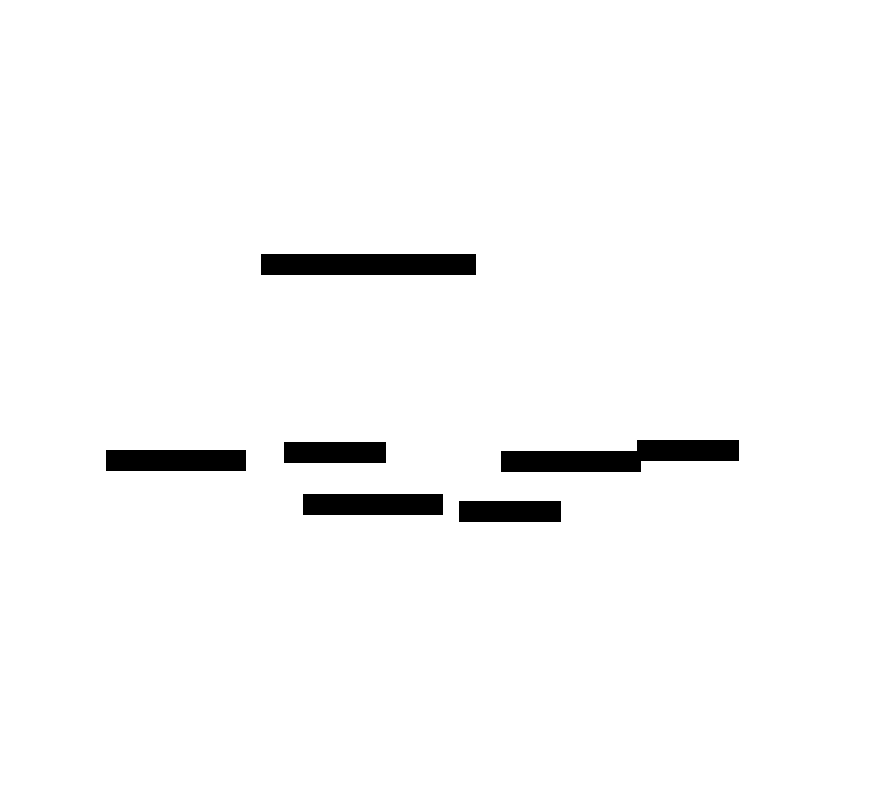
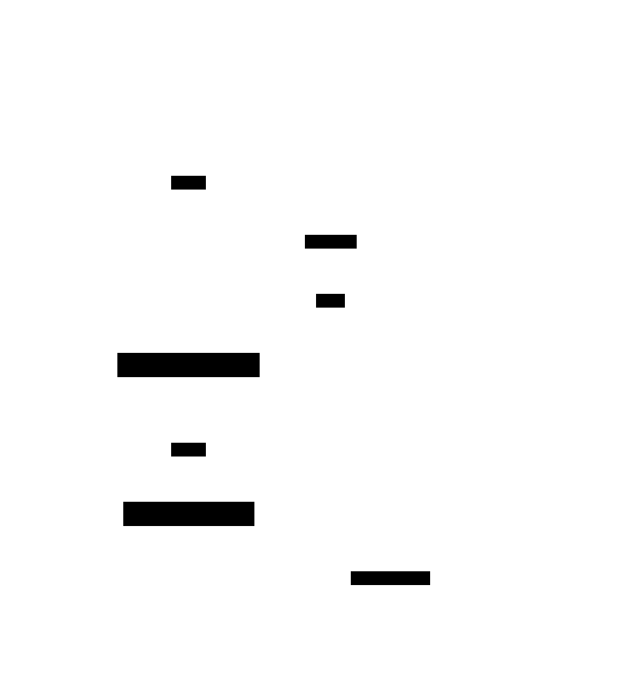

# Leader-Follower Replication

**Aliases:** Primary-Replica, Master-Slave (deprecated terminology), Single-Leader Replication, Leader and Followers (Joshi)
**Category:** Data
**Sources:**
[Neo Kim](https://systemdesign.one/system-design-interview-cheatsheet/) ·
[Joshi — Patterns of Distributed Systems](https://martinfowler.com/articles/patterns-of-distributed-systems/) ·
Kleppmann *DDIA*, Ch 5 (Replication)

---

## Problem

> [!TIP]
> **ELI5.** You only have one notebook. If you lose it, you lose everything. If many people want to read it at once, they have to queue. Make copies — but pick one notebook as the *official* one, and copy from it to the others.

A single database has two fundamental limits: it's a **single point of failure** (the disk dies, the machine reboots, the AZ goes dark — your data is gone or unreachable), and read traffic eventually saturates one machine no matter how much you tune it. Pure backups solve the first problem but leave you with hours of RPO; throwing reads at the same instance just slows down the writes.

Replication addresses both, but introduces a hard question: **when two machines hold the same data, which one is right?** Naive "any node can write" topologies have to solve conflict resolution; leader-follower sidesteps that by making the question moot — one node is *the* writer, everyone else copies from it.

## How it works

> [!TIP]
> **ELI5.** One database is the **leader**. All writes go there. The leader sends a play-by-play of every change to the **followers**, who keep replaying it to stay in sync. Readers can read from any follower, taking load off the leader.

A leader-follower setup designates exactly one node as the **leader** (sometimes called *primary*; older docs say *master*). The leader is the authoritative copy: every write — `INSERT`, `UPDATE`, `DELETE`, `DDL` — must go through it. The leader records each write in its **replication log** (Postgres calls it the WAL stream, MySQL the binlog, MongoDB the oplog), and ships those log records to one or more **followers** (also called *replicas* or *secondaries*).

In the topology above, **writer clients** send all mutations to the **Leader** (thick blue arrow). The leader applies them, persists them, and streams the change log to each **Follower** (orange dashed arrows). Each follower applies the log records in the same order, eventually reaching the same state as the leader. **Reader clients** (green arrows) split their queries across the followers, multiplying read capacity by the number of replicas without touching the leader.

A follower that falls behind is *lagged* but not *wrong*: it's a consistent snapshot of the database at some earlier point in time. This matters for two reasons. First, you can use a lagged follower for low-priority work (analytics, backups) without worrying about correctness. Second, it means readers must sometimes choose: hit a follower and accept possibly-stale data, or hit the leader and pay the latency.

The single most important configuration choice is **synchronous vs asynchronous replication**:

In **synchronous** mode (green, top), the leader waits for at least one follower to acknowledge the write before reporting success to the client. The write is durable on ≥ 2 nodes by the time the client sees `ack`. If the leader then crashes, the synchronous follower can be promoted with zero data loss — you keep your **RPO = 0** guarantee. The price is latency (now bounded by the slower of leader + follower) and availability (if the sync follower is down or slow, writes stall).

In **asynchronous** mode (orange, bottom), the leader acks the client *immediately* after persisting locally, then ships the log records to followers in the background. Writes are fast and the leader can keep accepting them even if every follower is down. The price is that if the leader crashes between acking the client and replicating, **the write is lost** — a few seconds of writes can vanish on failover. Most production systems split the difference with **semi-synchronous** replication (await ack from at least one follower out of N, configurable; what MySQL group replication and Postgres `synchronous_commit = remote_apply` do).

Two failure modes deserve naming. **Replication lag** is the normal-operations gap between leader and follower — milliseconds in a healthy LAN cluster, seconds or more under load. Applications must either tolerate it (most can) or use **read-your-own-writes** routing: after a user writes, send that user's next few reads to the leader for a few seconds. **Failover** is what happens when the leader dies: a controller (or, dangerously, a human) promotes a follower to leader, reconfigures the others to follow the new leader, and reroutes traffic. The failure mode to fear is **split-brain** — two nodes both believing they're leader, accepting conflicting writes. Modern systems use Raft, ZooKeeper, or etcd to make leader election safe.

---

## Variants & related patterns

| Variant | Difference |
|---|---|
| **Multi-Leader Replication** | Multiple writable leaders, usually one per data center. Conflict resolution required. MySQL group replication, CouchDB, Aurora multi-master. |
| **Leaderless Replication** | No designated leader; clients write to N replicas, read from R. Dynamo, Cassandra, Riak. Quorums (R + W > N) replace leaders. |
| **Chain Replication** | Writes go to head, propagate node-to-node, reads from tail. Strong consistency without quorum. Used in Microsoft Azure Storage. |
| **Read-Write Split** | The *operational* pattern of routing reads to followers — orthogonal to the replication topology itself. |
| **Follower Reads** (Joshi) | Explicitly serving reads from followers, accepting bounded staleness. |
| **Quorum / Majority Quorum** | The mechanism that makes leaderless safe; also used inside Raft for leader election. |

## When NOT to use

- **Write-heavy workloads where read replicas don't help.** A single leader is still the write bottleneck; consider sharding instead.
- **Cross-region writes with low latency requirements.** A global leader means cross-region write latency for every transaction; multi-leader or leaderless may be more appropriate.
- **When eventual consistency for reads is unacceptable.** All reads must hit the leader, which defeats the purpose. Use synchronous replication, or rethink the architecture.

---

## Real-world implementations

| System | Mode | Notes |
|---|---|---|
| **PostgreSQL streaming replication** | sync / async / synchronous_commit settings | Industry standard; WAL-based; supports cascading replicas. |
| **MySQL replication** | async by default; semi-sync available; group replication for multi-leader | Binlog-based; the original "MySQL replication" stack. |
| **MongoDB replica sets** | async with majority write concern | Oplog-based; built-in automatic failover via Raft-like protocol. |
| **AWS Aurora** | quorum-based (writes ack on 4/6) | "Storage-disaggregated" — log shipped to a shared storage layer rather than to followers' DBs. |
| **etcd / Consul** | sync via Raft (quorum of followers) | Strong consistency by construction. |
| **Cassandra / DynamoDB** | leaderless | Not leader-follower — included for contrast. |

## Companies using it (notable examples)

| Company | Use | Status |
|---|---|---|
| **GitHub** | MySQL leader-follower for years; described extensively in MySQL HA blog posts and the move to Vitess. | ✅ Verified — [GitHub Engineering, *MySQL High Availability at GitHub*, 2018](https://github.blog/2018-06-20-mysql-high-availability-at-github/) |
| **Facebook** | Operates massive MySQL fleet with leader-follower + custom replication; pioneered MyRocks and HHVM-side proxies. | ✅ Verified — multiple Meta Engineering posts on MySQL at scale |
| **Notion** | Uses Postgres with leader-follower replication; documented their Postgres scaling journey. | ✅ Verified — [Notion Engineering, *Sharding Postgres*, 2021](https://www.notion.so/blog/sharding-postgres-at-notion) |
| **Heroku Postgres** | Offers managed Postgres with leader-follower replication as a standard product. | ✅ Verified — [Heroku Postgres docs](https://devcenter.heroku.com/articles/heroku-postgres-follower-databases) |
| **Basically every relational DB in production** | The default HA setup. | ✅ Verified by ubiquity |

---

## Further reading

- Kleppmann, *Designing Data-Intensive Applications*, Ch 5 — exhaustive treatment of replication topologies, lag, and conflict resolution.
- Joshi, *Patterns of Distributed Systems*, "Leader and Followers" — the pattern formulation with implementation patterns.
- PostgreSQL docs, *High Availability, Load Balancing, and Replication*.
- GitHub Engineering, *MySQL High Availability at GitHub* (2018) — production failover story.
- Aphyr (Kyle Kingsbury), *Jepsen* analyses — empirical replication safety testing for many real systems.

---

*Diagram sources: [`../diagrams/src/leader-follower-topology.d2`](../diagrams/src/leader-follower-topology.d2), [`../diagrams/src/leader-follower-sync-async.d2`](../diagrams/src/leader-follower-sync-async.d2).*
