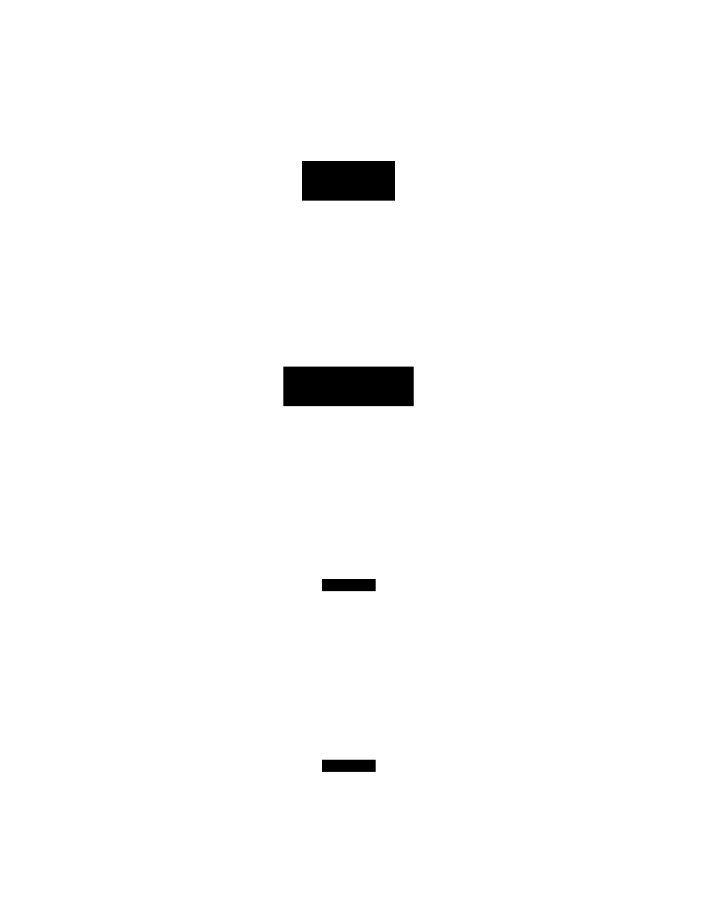
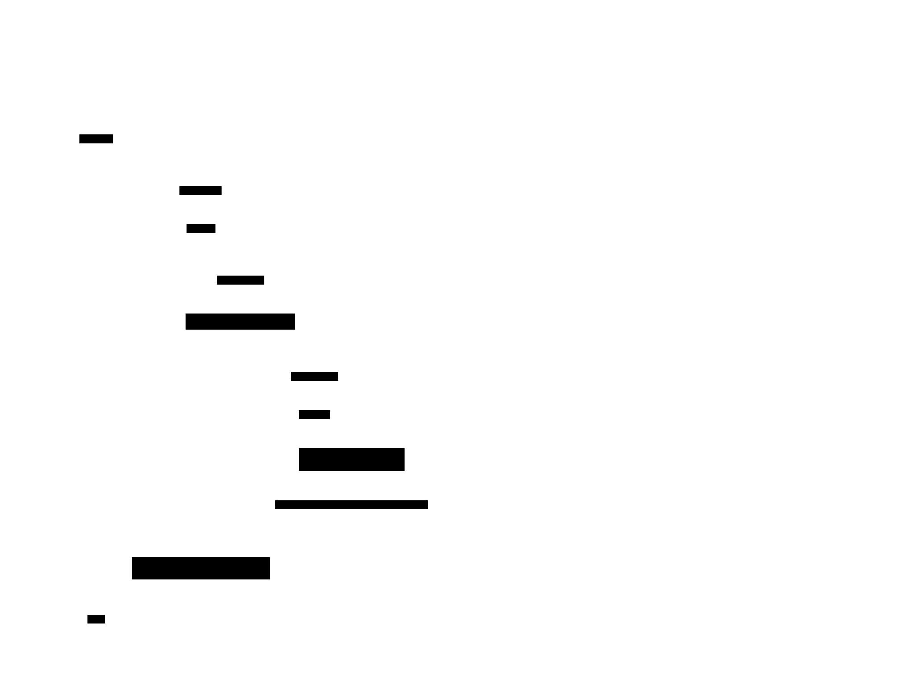

# LSM-Tree (Log-Structured Merge Tree)

**Aliases:** SSTable-based storage, Log-Structured Storage, Leveled Compaction (a specific variant)
**Category:** Data / Storage engine
**Sources:**
[Joshi — Patterns of Distributed Systems](https://martinfowler.com/articles/patterns-of-distributed-systems/) ·
Kleppmann *DDIA*, Ch 3 ·
[O'Neil, Cheng, Gawlick, O'Neil, *The Log-Structured Merge-Tree (LSM-Tree)* (Acta Informatica, 1996)](https://www.cs.umb.edu/~poneil/lsmtree.pdf)

---

## Problem

> [!TIP]
> **ELI5.** A [B-tree](btree.md) updates pages in place — fast for reads but every tiny write triggers an 8 KB random disk write. For write-heavy workloads (logging, time series, IoT, social feeds, blockchain), this is the bottleneck. Instead, what if every write just *appended* to a log in memory, and we periodically merged everything to disk in bulk?

A B+tree is the canonical storage engine for OLTP, but it has an inherent **write amplification** problem: updating a 50-byte row writes an 8 KB page plus a WAL entry. For workloads where writes vastly outnumber reads — message brokers, metrics stores, ad-event pipelines, blockchain ledgers, social-network activity streams — this is catastrophic. Throughput is bounded by disk's random-write IOPS, which on even good SSDs is orders of magnitude less than sequential-write bandwidth.

You want a storage structure that:

- Accepts writes at **sequential-write speeds** (close to peak disk bandwidth).
- Survives crashes (durable).
- Supports reads, range scans, and updates — even if reads are somewhat slower than a B-tree.
- Allows **bulk-deletion** of old data (time series, expired tokens) without expensive in-place erasure.

The LSM-tree is the answer, introduced by Patrick O'Neil and colleagues in 1996 and popularized in the 2000s by Google's Bigtable (and its open-source descendants HBase, Cassandra, LevelDB, RocksDB).

## How it works

> [!TIP]
> **ELI5.** Writes go to an in-memory sorted structure (the **memtable**). When it fills up, it's frozen and dumped to disk as a single sorted file (an **SSTable**) — one big sequential write, very fast. Over time, you have many SSTables on disk; periodically, background **compaction** merges them into fewer, larger SSTables, dropping duplicates as it goes. Reads check the memtable first, then each SSTable in order.

The LSM-tree splits storage into three layers:

**Memtable (in-memory).** A sorted data structure (usually a skip list or red-black tree) that absorbs all writes. It supports O(log n) insert and lookup. A separate **WAL** ([wal.md](wal.md)) is written to disk for each operation, so crashes don't lose acknowledged writes — on restart, the WAL is replayed to rebuild the memtable.

**Level 0 SSTables (immutable, recently flushed).** When the memtable reaches a threshold (e.g., 64 MB), it's frozen and written to disk as a single **SSTable** (Sorted String Table — a file with keys sorted by value, plus an index and a Bloom filter). A new empty memtable takes over. The write to disk is **purely sequential** — at peak disk bandwidth — and that's the LSM-tree's fundamental performance advantage. Level 0 may have several SSTables whose key ranges overlap (each represents a memtable snapshot at a different time).

**Levels 1+ (deeper, non-overlapping, larger).** A background **compaction** process merges multiple SSTables from one level into the next-deeper level. The compactor merge-sorts the inputs, drops superseded values (a newer record for the same key supersedes an older one), drops tombstones for deleted keys, and writes the result as new non-overlapping SSTables in the next level. Each level is typically ~10× larger than the one above. The "leveled" variant (LevelDB, RocksDB default) enforces strict size ratios and non-overlap within each level past L0; the "tiered" variant (Cassandra default) accumulates same-size SSTables and merges them in batches.

### Read path

The cost of LSM's write speed is read amplification: a single lookup might have to check the memtable plus several SSTables.

A point lookup:

1. **Check the memtable** — in-memory, O(log n). If found, return.
2. **For each level, check whether the key might be there** using a **Bloom filter** — a small probabilistic structure (~10 bits per key) that can definitively say "no, this SSTable does not contain key K" without doing a disk read. False positives are possible (the filter might say "maybe" when actually no), but false negatives are impossible.
3. **If Bloom says "maybe"**, find which SSTable in the level contains the key range (binary-search on per-SSTable min/max), then binary-search within the SSTable's block index, then read the relevant block from disk.
4. **Must check shallower levels first** — they contain newer versions. Once found at the shallowest level, that's the answer.

Block cache (for the hot working set), Bloom filters (eliminate most "maybe" checks), and sparse indexes inside SSTables keep typical point lookups to 1–2 disk reads. But the worst case is much worse than a B-tree, and **range scans** require merging across all levels — fundamentally more I/O than the B+tree's leaf-chain walk.

### The compaction trade-off

Compaction is the LSM-tree's defining knob — and its defining headache. Three concerns trade off:

- **Read amplification** — how many SSTables a read has to check (worsens without compaction).
- **Write amplification** — how many times the same data is rewritten as it moves through levels (worsens *with* compaction).
- **Space amplification** — how much extra space is consumed by superseded values awaiting compaction (worsens without compaction).

Different strategies optimize different axes. **Leveled compaction** (RocksDB default) minimizes space and read amplification at the cost of write amplification (each key rewritten ~10 times as it migrates through levels). **Tiered compaction** (Cassandra default) minimizes write amplification at the cost of more space and read overhead. **Universal compaction** balances both. RocksDB's compaction strategy is famously tunable — and famously tricky to tune.

A persistent challenge is **compaction stalls**: when writes outpace background compaction's ability to keep up, the engine has to throttle or even pause writes. Production LSM users monitor compaction backlogs as carefully as they monitor disk space.

### Deletes via tombstones

LSM-trees can't update or delete in place — every operation just writes a new sorted file. **Deletion** is encoded as a special **tombstone** record. When compaction merges files, it sees the tombstone, drops both it and any older versions of the same key. Until then, the deleted key still exists on disk; range scans must skip it. Old, never-compacted tombstones can pile up — every Cassandra operator has at some point fought tombstone-induced query slowdowns.

### Where LSM dominates

LSM-trees became the dominant choice for write-heavy systems through Google's Bigtable (2006) and the wave of open-source descendants. Today essentially every modern distributed KV/document/wide-column store is LSM-based: **Apache Cassandra**, **Apache HBase**, **Google Bigtable**, **Amazon DynamoDB** (custom LSM-family engine), **LevelDB**, **RocksDB**, **MongoDB WiredTiger** (offers LSM mode), **TiKV** (uses RocksDB), **CockroachDB** (uses Pebble — a Go port of RocksDB), **ScyllaDB**, **Apache HBase**, **InfluxDB** (custom TSM tree, LSM-derived).

Even Postgres and MySQL — long the strongholds of B+tree — are gaining LSM-based alternatives (MyRocks for MySQL, ZHEAP and related Postgres experiments).

---

## Variants & related patterns

| Variant | Difference |
|---|---|
| **Leveled compaction** | Strict level sizes, non-overlapping within each level past L0. RocksDB default; minimizes space and read amp. |
| **Tiered (size-tiered) compaction** | Merge same-size SSTables together. Cassandra default; minimizes write amp. |
| **Universal compaction** | Hybrid — designed for write-heavy with bounded space. RocksDB option. |
| **Time-window compaction (TWCS)** | For time-series — compact only within time windows. Cassandra TWCS. |
| **LSM with Bloom filters** | Universal — every production LSM uses Bloom filters per SSTable to skip negative lookups. |
| **Fragmented LSM / WiscKey** | Separate key index from values — better for large values. RocksDB BlobDB. |
| **Bw-tree** | Hybrid B-tree + log-structured updates. Microsoft Hekaton. |
| **COW B-tree (LMDB)** | Copy-on-write B+tree — sequential writes like LSM, B-tree reads. Excellent for read-mostly workloads. |

## When NOT to use

- **Read-heavy, point-lookup-dominated workloads** with strict latency SLAs — B-tree's predictable cost wins.
- **Workloads with mostly small in-place updates** of existing keys — B-tree avoids the compaction overhead.
- **Workloads requiring tight space bounds without compaction headroom** — LSM's compaction needs free disk.
- **Embedded / footprint-constrained settings** where compaction's CPU cost matters — though RocksDB is widely used here, configurable down.

---

## Real-world implementations

| System | LSM engine |
|---|---|
| **Google Bigtable** | The first major LSM-based distributed system. |
| **Apache HBase** | Open-source Bigtable clone, HFile = SSTable. |
| **Apache Cassandra** | LSM with tiered or leveled compaction; per-table strategy. |
| **Amazon DynamoDB** | Internal LSM-family engine (not exposed publicly). |
| **LevelDB** | Google's open-source single-machine LSM (Sanjay Ghemawat, Jeff Dean). |
| **RocksDB** | Facebook fork of LevelDB; the de-facto LSM library; embedded in CockroachDB, TiKV, MyRocks, Kafka Streams, Flink. |
| **Pebble** | Cockroach Labs's Go-native LSM, RocksDB-compatible. |
| **ScyllaDB** | C++ Cassandra-compatible; LSM with per-core shared-nothing. |
| **MongoDB WiredTiger (LSM mode)** | Optional LSM backend. |
| **InfluxDB / TSM tree** | Time-series-optimized LSM derivative. |
| **MyRocks (Facebook)** | MySQL with RocksDB storage engine. |
| **Apache Druid, Apache Kudu, Pinot** | LSM-style storage for analytics. |

## Companies / canonical uses

| Company | Use | Status |
|---|---|---|
| **Google** | Bigtable, the original — backs Search, Maps, Earth, Gmail. | ✅ Verified — [*Bigtable: A Distributed Storage System for Structured Data*, OSDI 2006](https://research.google/pubs/pub27898/) |
| **Meta / Facebook** | RocksDB underpins many Facebook services; MyRocks for MySQL/Messenger storage. | ✅ Verified — [RocksDB on facebook.com/engineering](https://engineering.fb.com/2017/02/22/data-infrastructure/how-we-built-the-most-popular-fb-app-ever/); [MyRocks paper](http://www.vldb.org/pvldb/vol9/p1097-matsunobu.pdf) |
| **Apple, Netflix, Instagram, Discord** | Massive Cassandra deployments. | ✅ Verified — published engineering blogs |
| **LinkedIn** | Espresso storage engine on LSM-style structures. | ✅ Verified — LinkedIn engineering blog |
| **Cloudflare, Stripe, Shopify** | Use Kafka (Streams uses RocksDB), CockroachDB, or similar — LSM under the hood. | ✅ Verified by product/code reviews |
| **Bitcoin Core, Ethereum clients (Geth, Parity)** | LevelDB / RocksDB for chain storage. | ✅ Verified — open-source codebases |
| **Apache HBase users (Yahoo!, eBay, originally Twitter)** | LSM at petabyte scale. | ✅ Verified — published HBaseCon talks |

---

## Further reading

- O'Neil, Cheng, Gawlick, O'Neil, *The Log-Structured Merge-Tree (LSM-Tree)* (Acta Informatica, 1996) — the original. [PDF](https://www.cs.umb.edu/~poneil/lsmtree.pdf).
- Chang, Dean et al., *Bigtable: A Distributed Storage System for Structured Data* (OSDI 2006) — the paper that put LSM into mainstream distributed systems. [PDF](https://research.google/pubs/pub27898/).
- Kleppmann, *Designing Data-Intensive Applications*, Ch 3 — the most accessible side-by-side LSM vs B-tree treatment.
- *Database Internals*, Alex Petrov — Ch 7 (log-structured storage) is excellent.
- Niv Dayan, Manos Athanassoulis, Stratos Idreos, *Monkey: Optimal Navigable Key-Value Store* (SIGMOD 2017) — modern theoretical work on LSM tuning.
- Mark Callaghan's blog (`smalldatum.blogspot.com`) — decades of benchmarks and analysis of LSM engines.
- RocksDB documentation, especially the tuning guide — gives a sense of how complex LSM tuning is in practice.

---

*Diagram sources: [`../diagrams/src/lsm-structure.d2`](../diagrams/src/lsm-structure.d2), [`../diagrams/src/lsm-read-path.d2`](../diagrams/src/lsm-read-path.d2).*
