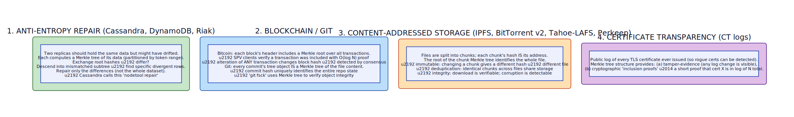

# Merkle Tree

**Aliases:** Hash Tree, Merkle Hash Tree, Tiger Tree
**Category:** Data integrity / Sync
**Sources:**
[Ralph Merkle — *A Certified Digital Signature* (CRYPTO 1989)](https://www.merkle.com/papers/Certified1979.pdf) ·
[DeCandia et al. — *Dynamo* (SOSP 2007) — anti-entropy use](https://www.allthingsdistributed.com/files/amazon-dynamo-sosp2007.pdf) ·
[Bitcoin whitepaper (Nakamoto, 2008) — block Merkle root](https://bitcoin.org/bitcoin.pdf) ·
[Git internals — tree objects](https://git-scm.com/book/en/v2/Git-Internals-Git-Objects) ·
[IPFS / Filecoin documentation](https://docs.ipfs.tech/concepts/merkle-dag/) ·
[Certificate Transparency RFC 6962](https://datatracker.ietf.org/doc/html/rfc6962)

---

## Problem

> [!TIP]
> **ELI5.** Two systems hold "the same" data — two replicas of a database, two peers in a blockchain network, two clones of a Git repo. How do they verify they actually match without sending the whole dataset over the network? Hashing the entire dataset gives one bit of information ("same/different") but tells you nothing about *where* they differ. A **Merkle tree** is a tree of hashes that lets you answer "do these match?" in one hash comparison, *and* drill down to the differing parts in O(log N) — even for terabytes of data.

Distributed and verification systems repeatedly face this problem:

- **Database anti-entropy**: Cassandra and DynamoDB replicate data 3× across nodes. Over time, replicas drift due to dropped messages, partial failures, or temporary partitions. They need to detect and repair drift without comparing every row.
- **Blockchain verification**: a Bitcoin SPV (Simple Payment Verification) client wants to confirm a specific transaction is in the chain without downloading every block. They need a short proof.
- **Content-addressed storage** (IPFS, Git, BitTorrent v2): files are split into chunks; the system needs to verify the whole file is intact and correctly assembled — and dedupe chunks that appear in multiple files.
- **Certificate Transparency**: public logs of every TLS certificate must be tamper-evident, with cryptographic proofs that any cert is in the log.

The naive approaches don't work:

- **Send everything**: O(N) bandwidth. For terabytes of data, this is hours or days.
- **Single hash of entire dataset**: O(1) bandwidth to verify equality, but if they differ, you have no idea where — you're back to sending everything.
- **Per-item checksums**: O(N) state to maintain and exchange.

**Merkle trees** are the answer: a tree where each internal node is the hash of its children's hashes. The root hash uniquely identifies the entire dataset. If two roots match, the data matches with cryptographic certainty. If they don't, you recurse into the children to find the differing subtree, taking O(log N) hash comparisons to locate any single difference.

The pattern was published by **Ralph Merkle in 1979** in the context of digital signatures. It's now foundational to blockchain, distributed databases, version control, content-addressed storage, certificate transparency, peer-to-peer file sharing, and more — anywhere two parties need to compare or verify large data efficiently.

## How it works

> [!TIP]
> **ELI5.** Take your data. Chop it into N pieces. Hash each piece. Pair the hashes; hash each pair. Pair those; hash again. Keep going until you have one hash at the top — the **root hash**. That root depends on every byte of the original data. Change any byte → the root changes. Compare two systems? Compare their roots. Different? Walk down the tree to find where they differ. Done.

The basic structure:


**Building a Merkle tree** of items `d1, d2, d3, d4`:

```
Level 0 (leaves):     h(d1)        h(d2)        h(d3)        h(d4)
                         \          /              \          /
Level 1 (interior):    h(h(d1)+h(d2))           h(h(d3)+h(d4))
                                  \                 /
Level 2 (root):              h(h(h(d1)+h(d2)) + h(h(d3)+h(d4)))
```

For `N` leaves, the tree has `log₂(N)` levels. Common variants:

- **Binary** (above) — the standard.
- **k-ary** (Tiger tree, etc.) — wider fanout, shallower tree.
- **Unbalanced** — when N is not a power of 2; padding strategies vary.
- **Sparse** — many missing leaves; common in Certificate Transparency.

### The key properties

**1. Tamper-evidence.** Change any single leaf (any byte of any item), and the hash on its path to the root changes. So does the root. There is no way to alter data without changing the root hash. (Assuming the hash function is collision-resistant — SHA-256, BLAKE2, etc.)

**2. Efficient comparison.** Compare two trees:
- Compare roots. If equal → all data identical, done.
- If different → recurse into children, comparing each pair.
- The differing subtree(s) localize where the data differs.
- For 1 million leaves with 1 differing leaf: ~20 hash comparisons.

**3. Inclusion proofs.** To prove leaf `d3` is in a tree with root `R`:
- Provide `d3` itself.
- Provide the sibling hash at each level on the path from `d3` to the root.
- Verifier hashes `d3` and combines with siblings up to the root, checking it equals `R`.
- Proof size: `log(N) × hash_size`. For 1M leaves, 32-byte hashes: ~640 bytes. Trivial bandwidth.

This is why Bitcoin SPV clients work: with the block header (containing the Merkle root) and a small inclusion proof, they verify their transaction is in the block without downloading the entire block.

### Four canonical use cases

The structure has been re-invented or applied across many domains. Four major lineages:



**1. Anti-entropy in distributed databases.** Cassandra's `nodetool repair`, DynamoDB's background repair, Riak's anti-entropy all use Merkle trees:

- Each replica partitions its data by token range.
- For each range, it builds a Merkle tree of the contained rows.
- Replicas exchange root hashes per range.
- Where roots differ, descend to find the divergent rows.
- Repair only the differences.

Without Merkle trees, repair would require streaming the entire dataset between replicas. With them, repair traffic scales with the actual divergence, which is usually tiny.

**2. Blockchain integrity.** Bitcoin (and most other blockchains) include a Merkle root in each block's header. The root commits to all transactions in the block:

- Changing any transaction changes the block's hash.
- Block headers are tiny (~80 bytes for Bitcoin) — easy to download and verify.
- SPV clients (mobile wallets) can verify "is my transaction in this block?" without downloading the block.
- The Merkle root is part of the input to the proof-of-work hash, so altering history requires re-mining all subsequent blocks.

Git uses Merkle trees similarly: each commit's tree object is a Merkle hash over the directory structure and file contents. Commit hashes form a Merkle DAG. `git log` is essentially a walk over a Merkle structure. `git fsck` verifies integrity by recomputing hashes.

**3. Content-addressed storage.** IPFS, BitTorrent v2, Tahoe-LAFS, Perkeep, OSTree:

- Files are split into chunks.
- Each chunk's hash is its address.
- A "manifest" Merkle tree commits to all chunks of a file.
- The file's identifier is the manifest root hash.
- Properties: immutable (changing a chunk gives a new hash), dedupable (same chunk → same hash → one storage), verifiable (any chunk's integrity is provable).

This is the model behind IPFS's CIDs (Content Identifiers) and Filecoin's storage proofs.

**4. Tamper-evident logs.** Certificate Transparency (CT) maintains public logs of TLS certificates so rogue issuance can be detected. Each log is a Merkle tree:

- Anyone can request an **inclusion proof** that a specific cert is in the log.
- Anyone can request a **consistency proof** that a new version of the log is an append-only extension of an old version.
- The properties together guarantee the log can't lie about its contents or rewrite history.

Sigstore (software supply-chain signing) uses similar Merkle-based "transparency logs."

### Why it works: cryptographic hash properties

The whole pattern relies on the hash function having:

- **Collision resistance**: it's computationally infeasible to find two different inputs with the same hash. Without this, an attacker could substitute one chunk for another with the same hash, and the tree wouldn't notice.
- **Pre-image resistance**: given a hash, you can't reverse it to find the input. (Not strictly needed for Merkle structure but assumed for related security properties.)

SHA-256, SHA-3, BLAKE2/BLAKE3, KangarooTwelve all qualify. MD5 and SHA-1 do not (collision attacks exist) — Git is in a long-running migration from SHA-1 to SHA-256 because of this.

### Variants worth knowing

- **Sparse Merkle Tree (SMT)**: for very sparse key spaces (e.g., key = full 256-bit address). Used in Ethereum-style account trees, transparency logs. Default-zero leaves let you prove non-inclusion as well as inclusion.
- **Verkle tree**: uses vector commitments (polynomial commitments) instead of hashes; shorter proofs. Coming to Ethereum.
- **Merkle Patricia trie**: Ethereum's hybrid of Merkle tree and Patricia trie; efficient for sparse, modifiable state.
- **MerkleDAG** (IPFS): generalizes Merkle trees to directed acyclic graphs for content-addressed structures.
- **Tiger tree**: variant with 1024-byte leaves; used in older P2P systems (Direct Connect, Gnutella2).
- **Authenticated data structures**: Merkle trees are the simplest form; broader research area includes accumulators, verifiable dictionaries.

### Trade-offs

The advantages:
- **Efficient comparison** of large datasets.
- **Compact inclusion proofs** (`log(N)` size).
- **Tamper-evidence** with cryptographic certainty.
- **Composable** — sub-trees are themselves Merkle trees.
- **Mergeable** — can compute a tree incrementally or in parallel.

The disadvantages:
- **Build cost**: O(N) hash computations to build.
- **Update cost**: O(log N) to update one leaf and propagate up.
- **Hash collisions** would break everything — requires strong hash function.
- **Doesn't help with bulk identical data** — if you really do need to transfer all of it, Merkle trees are just overhead.
- **Tree balance and serialization** are surprisingly subtle in practice (ordering, padding, multi-block items).

### Implementation tips

- **Use a strong hash**: SHA-256 minimum.
- **Domain separation**: prefix leaves and internal nodes differently before hashing, so a leaf hash can't be confused with an internal node (a known attack on naive Merkle constructions). The standard is `H(0x00 || leaf)` for leaves and `H(0x01 || left || right)` for internal nodes — used in RFC 6962.
- **Padding for non-power-of-2** sizes: be explicit and standard. CT uses unbalanced trees (no padding); some implementations duplicate the last leaf.
- **Incremental computation** is possible: keep partial tree state and update as new leaves arrive (very common in append-only logs).
- **Storage**: persist intermediate hashes if you'll be answering inclusion-proof queries frequently.

---

## Variants & related patterns

| Variant | Difference |
|---|---|
| **Binary Merkle tree** | The standard. |
| **k-ary Merkle tree** | Wider fanout (Tiger tree). |
| **Sparse Merkle tree** | For sparse keyspaces; supports non-inclusion proofs. |
| **Merkle Patricia trie** | Ethereum's hybrid for sparse modifiable state. |
| **MerkleDAG** | IPFS generalization. |
| **Verkle tree** | Vector commitments; smaller proofs. |
| **Authenticated dictionary** | Generalization with richer query support. |
| **Hash chain** | Linear list of hashes; degenerate Merkle tree. |
| **Skip list with hashes** | Alternative for ordered authenticated structures. |

## When NOT to use

- **Tiny datasets** — overhead exceeds benefit; just hash everything.
- **Frequently mutating data** with no need for proofs — Merkle update cost adds up.
- **No need for tamper-evidence or comparison** — simpler structures suffice.
- **When you actually need to send everything** — Merkle trees don't help with bulk transfer.

---

## Real-world implementations

| System | Use |
|---|---|
| **Cassandra** | Anti-entropy repair (`nodetool repair`). |
| **DynamoDB** | Background anti-entropy. |
| **Riak** | Active anti-entropy. |
| **Bitcoin** | Block transaction commitments + SPV proofs. |
| **Ethereum** | Merkle Patricia trie for state, accounts, transactions. |
| **Git** | Tree objects, commits. |
| **Mercurial** | Similar Merkle-based revision tree. |
| **IPFS / Filecoin** | MerkleDAG for content-addressed storage. |
| **BitTorrent v2** | Per-file Merkle hashes (BEP-52). |
| **Tahoe-LAFS** | Merkle tree for capability-based content addressing. |
| **OSTree** | Git-like Merkle storage for OS images. |
| **Apache Cassandra, ScyllaDB** | Anti-entropy. |
| **Certificate Transparency** | RFC 6962 Merkle log structure. |
| **Sigstore Rekor** | Software supply-chain transparency log. |
| **AWS QLDB** | Merkle-tree-based digest for immutable ledger. |
| **Ethereum 2.0 (Verkle)** | Vector commitments replacing Merkle. |

## Companies / canonical uses

| Where | Use | Status |
|---|---|---|
| **Amazon** | Dynamo (anti-entropy), DynamoDB, QLDB. | ✅ Verified — [Dynamo paper](https://www.allthingsdistributed.com/files/amazon-dynamo-sosp2007.pdf) + QLDB docs |
| **Bitcoin (Satoshi Nakamoto 2008)** | Block Merkle root in every block since genesis. | ✅ Verified — [Bitcoin whitepaper](https://bitcoin.org/bitcoin.pdf) |
| **Ethereum Foundation** | Merkle Patricia tries throughout state. | ✅ Verified — Ethereum yellow paper |
| **Google** | Certificate Transparency project; original implementation by Google. | ✅ Verified — [certificate.transparency.dev](https://certificate.transparency.dev/) |
| **Cloudflare** | Operates CT log servers; uses Merkle proofs internally. | ✅ Verified — Cloudflare blog |
| **GitHub (Microsoft)** | Git's Merkle structure at planet scale. | ✅ Verified — Git docs |
| **Protocol Labs** | IPFS and Filecoin entirely built on MerkleDAG. | ✅ Verified — IPFS docs |
| **Sigstore / Linux Foundation** | Rekor transparency log. | ✅ Verified — sigstore.dev |
| **Apple / Microsoft / Meta** | Certificate Transparency log operators. | ✅ Verified — Apple/Microsoft CT log lists |
| **Cassandra users (Apple, Netflix, ...)** | Anti-entropy in production at scale. | ✅ Verified — Cassandra Summit talks |

---

## Further reading

- Ralph Merkle, *A Certified Digital Signature* (CRYPTO 1989) — the original paper.
- Bitcoin whitepaper (Nakamoto 2008) — Merkle root in block headers.
- Dynamo paper (DeCandia et al., SOSP 2007) — anti-entropy use.
- RFC 6962 — Certificate Transparency, including detailed Merkle tree spec.
- *Mastering Bitcoin* (Andreas Antonopoulos), Ch on transactions and Merkle trees.
- IPFS documentation on MerkleDAG.
- Git internals chapter of *Pro Git*.
- *Designing Data-Intensive Applications* (Kleppmann), Ch 5 on replication (anti-entropy).
- Verkle trees research (Vitalik Buterin posts).

---

*Diagram sources: [`../diagrams/src/merkle-tree.d2`](../diagrams/src/merkle-tree.d2), [`../diagrams/src/merkle-tree-uses.d2`](../diagrams/src/merkle-tree-uses.d2).*
