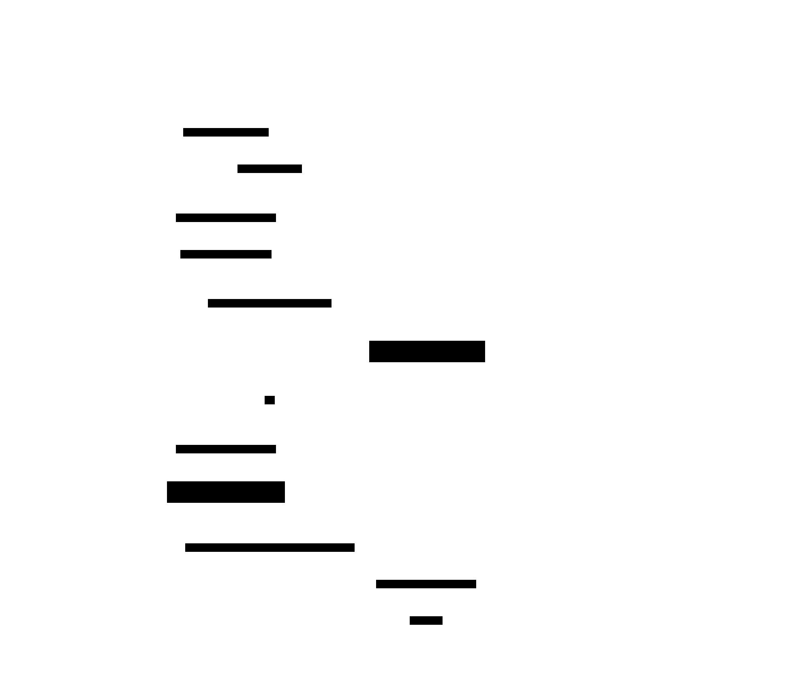

# MVCC — Multi-Version Concurrency Control

**Aliases:** Multiversioning, Snapshot Isolation (closely related; MVCC enables it)
**Category:** Data / Concurrency
**Sources:**
[Joshi — Patterns of Distributed Systems](https://martinfowler.com/articles/patterns-of-distributed-systems/) ·
Kleppmann *DDIA*, Ch 7 (Transactions) ·
[Bernstein & Goodman, *Multiversion Concurrency Control — Theory and Algorithms* (ACM TODS, 1983)](https://dl.acm.org/doi/10.1145/319996.319998) ·
[Berenson et al., *A Critique of ANSI SQL Isolation Levels* (SIGMOD 1995)](https://www.microsoft.com/en-us/research/wp-content/uploads/2016/02/tr-95-51.pdf)

---

## Problem

> [!TIP]
> **ELI5.** Pre-MVCC databases used **locks**: reading a row blocked anyone else from writing to it; writing blocked anyone from reading. A long analytical query ("SELECT SUM(...) over millions of rows") could freeze the entire system for minutes. MVCC's idea: never overwrite — instead, every update creates a **new version** of the row. Readers see a consistent snapshot; writers create new versions. They never wait for each other.

Traditional **two-phase locking** (2PL) provides correct serializable transactions by requiring every read to acquire a shared lock and every write to acquire an exclusive lock on the affected data, holding all locks until commit. This is correct, but its production behavior is awful:

- **Readers block writers**: a long-running report blocks any updates to the rows it's reading.
- **Writers block readers**: an in-flight update prevents anyone else from reading until it commits or aborts.
- **Long transactions amplify contention**: every transaction becomes a global bottleneck.
- **Deadlocks** are common as transactions grab locks in different orders.

In real OLTP systems, where transactions are mixed (short writes, long reads), the lock-based approach creates throughput cliffs: the system performs well until a long query enters, then everything stalls.

You need a concurrency control scheme where **readers and writers don't block each other**, every transaction sees a **consistent snapshot** of the data, and the implementation supports the isolation level the application actually needs (typically Snapshot Isolation or Serializable Snapshot Isolation).

## How it works

> [!TIP]
> **ELI5.** Instead of "the row," the database keeps **all old versions** of each row, each tagged with the transaction ID that created it and (later) the transaction ID that superseded it. Each transaction takes a snapshot when it starts — a record of which transactions had committed by then. Reads use the snapshot to find the *right version* for each row. Writes create new versions without touching old ones.

MVCC stores **multiple versions of each row** simultaneously. Each version carries metadata identifying the transaction that created it (`txn_min` / `xmin` in Postgres) and the transaction that superseded it, if any (`txn_max` / `xmax`).

In the diagram, row id=42 has three versions:
- **V1**: created by txn 100, superseded by txn 150 (`txn_max=150`).
- **V2**: created by txn 150, superseded by txn 200.
- **V3**: created by txn 200, still current (`txn_max=null`).

Each transaction takes a **snapshot** at start — a logical timestamp (or list of "transactions in progress") that defines what it sees. The **visibility rule**: a row version is visible to a reader if `txn_min ≤ snapshot < txn_max` (and the creating transaction is committed by the snapshot point, not aborted, not still in-progress).

A reader at snapshot=170 looking up row 42:
- V1: snapshot 170 ≥ txn_max 150 → **superseded, not visible**.
- V2: 150 ≤ 170 < 200 → **visible** — this is what the reader sees (`age=31`).
- V3: snapshot 170 < txn_min 200 → **doesn't exist yet, not visible**.

A reader at snapshot=220 sees V3. Two readers, started at different times, see different states of the same row — both perfectly consistent within themselves. This is **snapshot isolation**.

### Readers and writers never block each other

The killer feature is what happens when a reader and writer touch the same row concurrently:

A reader transaction takes its snapshot at t0. A concurrent writer modifies the same row — but **creates a new version** instead of overwriting. The old version still exists, still has its original metadata, still satisfies the reader's snapshot. The reader continues to see the unchanged state. The writer commits when it's ready. A *new* reader, starting after the commit, sees the new version. The two transactions never wait for each other.

This is qualitatively different from lock-based concurrency. In 2PL, the writer would block on the reader's shared lock (or vice versa); in MVCC, both proceed concurrently. The benefits compound: long analytical queries don't stall OLTP writes; checkpoint operations don't block transactions; backups can use a consistent snapshot without freezing the database.

### Garbage collection

The price of MVCC is that **old versions accumulate**. The database can only discard version V when no in-flight transaction has a snapshot that could still see V — that is, when every active transaction's snapshot is ≥ V.txn_max.

This is the job of **garbage collection** (Postgres calls it VACUUM; CockroachDB has MVCC GC; Spanner uses TrueTime-bounded GC). It scans for stale versions and removes them. **Long-running transactions** are the bane of MVCC: a transaction that runs for hours holds an old snapshot, preventing GC of any version superseded during those hours. Postgres's classic operational problem of "table bloat" comes from exactly this: a long-running query or unclosed transaction causes the database to accumulate dead row versions, making tables grow without bound until VACUUM can catch up.

Cleaning up properly requires:
- **Tracking the oldest active snapshot** across the cluster.
- **Scanning for versions where txn_max is older than the oldest snapshot**, removing them.
- **Reclaiming space** (Postgres marks pages reusable; some engines compact in place).

### Implementation styles

There are two main MVCC implementation styles:

**Append-new-version, mark-old (Postgres)**: A new version is inserted as a new row in the heap; the old version's `txn_max` is updated. Both versions exist on disk side-by-side until VACUUM. Index entries point to both. Causes "bloat" but never blocks writers. Postgres's specific implementation is sometimes called "MVCC with HOT (Heap-Only Tuple) updates" for an optimization that keeps new versions on the same page when possible.

**Update-in-place, old version in rollback segment (Oracle, MySQL/InnoDB, SQL Server)**: The data page is updated in place; the old version is moved to a separate **rollback segment** (Oracle) or **undo log** (InnoDB). Readers needing the old version reconstruct it by applying undo entries. No table bloat, but the rollback segment can grow with long transactions ("snapshot too old" errors).

Both schemes implement the same visibility model from the application's point of view; the operational profile differs.

### MVCC + Distributed Systems

In distributed databases, MVCC requires a **globally meaningful timestamp** for snapshots so different nodes agree on what's visible. The options range from a single-leader timestamp service (CockroachDB's hybrid logical clock) to Google Spanner's **TrueTime** (bounded-uncertainty physical clocks with atomic-clock and GPS hardware in every datacenter). Spanner's design specifically enables externally consistent (linearizable) snapshots across the planet — a remarkable achievement of MVCC at scale.

For weaker guarantees, **Snapshot Isolation** is provided by most MVCC engines. The classic gotcha is that snapshot isolation does **not** prevent the **write skew** anomaly — two transactions can both read a constraint, each independently decide they can violate it, and both commit. **Serializable Snapshot Isolation (SSI)**, pioneered in PostgreSQL 9.1, uses runtime conflict detection to abort transactions whose interleaving would violate serializability — providing serializable correctness without the lock overhead of 2PL. CockroachDB's serializable mode uses related techniques.

---

## Variants & related patterns

| Variant | Difference |
|---|---|
| **Append-new-version (heap)** | New rows inserted; old marked superseded. Postgres model. |
| **Update-in-place + undo log** | Page updated; old version preserved in rollback segment. Oracle, MySQL/InnoDB. |
| **Optimistic concurrency** | No locks at all; conflicts detected at commit and resolved by abort. Often paired with MVCC (FoundationDB, Spanner). |
| **Snapshot Isolation (SI)** | Most common isolation level supported by MVCC. Cheap but allows write skew. |
| **Serializable Snapshot Isolation (SSI)** | MVCC + runtime conflict detection → serializable. Postgres 9.1+, CockroachDB. |
| **Hybrid Logical Clock (HLC)** | Lamport-style + physical time, used as MVCC snapshot timestamp in CockroachDB, MongoDB. |
| **TrueTime** | Atomic-clock/GPS-bounded physical time used for MVCC in Spanner. |
| **MVOCC** | MVCC + Optimistic CC — most NewSQL systems. |

## When NOT to use

- **Read-only / immutable systems** — no concurrent updates, no value from versioning.
- **Heavy update-in-place workloads with no read concurrency need** — MVCC's bookkeeping is overhead.
- **In-memory caches with no transactional semantics** — MVCC is for transactional databases, not key-value caches.
- **When all transactions are short and serializable via single-row 2PL is fine** — MVCC's complexity isn't worth it (rare in practice).

---

## Real-world implementations

| System | MVCC variant |
|---|---|
| **PostgreSQL** | Append-new-version heap; VACUUM for GC; SSI for serializable. |
| **Oracle** | Update-in-place + UNDO segments. The MVCC pioneer. |
| **MySQL / InnoDB** | Update-in-place + undo log; supports SI and (with row locks) serializable. |
| **SQL Server** | Update-in-place + version store; SNAPSHOT and READ COMMITTED SNAPSHOT modes. |
| **MongoDB / WiredTiger** | MVCC with append-new-version; snapshot isolation. |
| **CockroachDB / Spanner / YugabyteDB** | Distributed MVCC with HLC or TrueTime timestamps; serializable by default. |
| **TiKV / TiDB** | Per-key MVCC with global TSO (timestamp oracle). |
| **FoundationDB** | Optimistic MVCC + serializable. |
| **DynamoDB Transactions** | Optimistic with version stamps. |
| **Firestore, Datastore** | Snapshot isolation via versioned entities. |

## Companies / canonical uses

| Where | Use | Status |
|---|---|---|
| **Every Postgres / MySQL / Oracle / SQL Server-using company** | All major SQL DBs use MVCC for OLTP concurrency. | ✅ Universal — see product docs |
| **Google** | Spanner uses TrueTime-bounded MVCC for global SQL with external consistency. | ✅ Verified — [Spanner OSDI 2012](https://research.google/pubs/pub39966/); *Spanner: Becoming a SQL System* SIGMOD 2017 |
| **Cockroach Labs / customers (Shopify, Bose, others)** | CockroachDB's serializable MVCC. | ✅ Verified — [CockroachDB transaction docs](https://www.cockroachlabs.com/docs/stable/transactions) |
| **MongoDB customers** | WiredTiger MVCC backs modern MongoDB deployments. | ✅ Verified — MongoDB docs |
| **Snowflake** | Time-travel queries (`AT (TIMESTAMP => ...)`) are MVCC-exposed-to-the-user. | ✅ Verified — Snowflake docs |
| **Databricks Delta Lake** | Snapshot reads at table version are MVCC at the lakehouse layer. | ✅ Verified — Delta Lake docs |

---

## Further reading

- Philip A. Bernstein & Nathan Goodman, *Multiversion Concurrency Control — Theory and Algorithms* (ACM TODS 1983) — the foundational theory paper. [DOI](https://dl.acm.org/doi/10.1145/319996.319998).
- Berenson, Bernstein, Gray, Melton, O'Neil, O'Neil, *A Critique of ANSI SQL Isolation Levels* (SIGMOD 1995) — the paper that named "snapshot isolation" and clarified what anomalies it does and doesn't prevent. [PDF](https://www.microsoft.com/en-us/research/wp-content/uploads/2016/02/tr-95-51.pdf).
- Kleppmann, *Designing Data-Intensive Applications*, Ch 7 — the most readable modern treatment of MVCC and isolation levels.
- Michael J. Cahill, Uwe Röhm, Alan Fekete, *Serializable Isolation for Snapshot Databases* (SIGMOD 2008) — the SSI paper used in Postgres 9.1.
- Corbett et al., *Spanner: Google's Globally-Distributed Database* (OSDI 2012) — MVCC at planet scale via TrueTime.
- The PostgreSQL *Concurrency Control* chapter — concrete and well-written reference.

---

*Diagram sources: [`../diagrams/src/mvcc-versions.d2`](../diagrams/src/mvcc-versions.d2), [`../diagrams/src/mvcc-nonblocking.d2`](../diagrams/src/mvcc-nonblocking.d2).*
