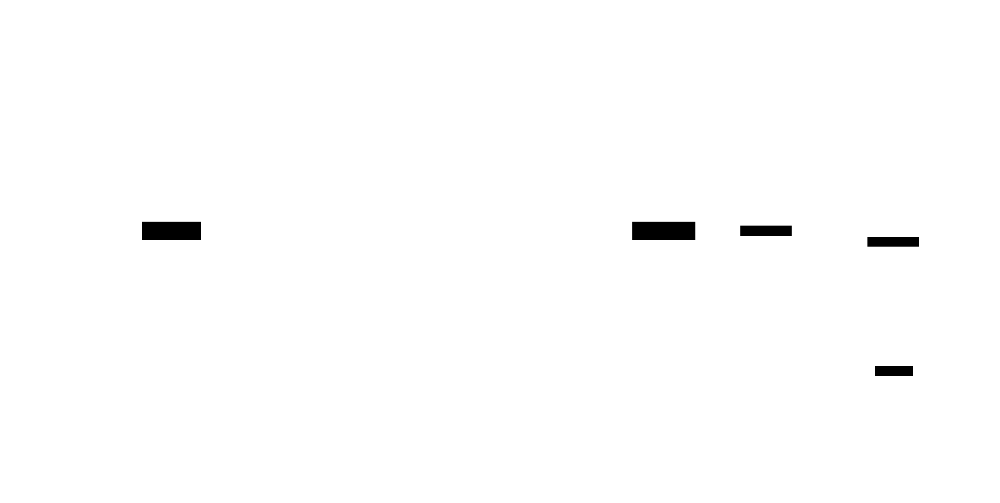
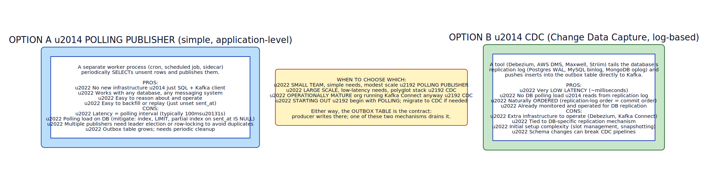

# Transactional Outbox

**Aliases:** Outbox Pattern, Application Outbox, Transactional Publishing
**Category:** Async messaging / Data
**Sources:**
[Chris Richardson — microservices.io: Transactional Outbox](https://microservices.io/patterns/data/transactional-outbox.html) ·
[Chris Richardson — microservices.io: Polling Publisher](https://microservices.io/patterns/data/polling-publisher.html) ·
[Microsoft Azure Architecture Center — Outbox pattern](https://learn.microsoft.com/en-us/azure/architecture/best-practices/transactional-outbox-cosmos) ·
Discussion in Debezium documentation

---

## Problem

> [!TIP]
> **ELI5.** You want to update your database AND publish a message to Kafka — both must happen or neither. But the database and Kafka are separate systems; there's no transaction across them. If you write to the DB first and Kafka fails, the world doesn't hear about your update. If you write to Kafka first and the DB fails, you've announced something that didn't happen. The **outbox** trick: write the message to a special table *inside the same DB transaction* as your business data. A separate process drains that table to Kafka. Now the only thing that has to be atomic is the DB write — which it already is.

A common need in microservices: a service updates its own database AND publishes a domain event so other services can react. For example, the Orders service:

1. Inserts a new order row into `orders`.
2. Publishes an `OrderPlaced` event to Kafka so the Shipping, Billing, Inventory, and Analytics services can react.

The naive implementation tries to do both:

```python
with db.transaction():
    db.execute("INSERT INTO orders ...")
kafka.publish("OrderPlaced", {...})
```

This is the **dual-write problem** — and it's a generator of subtle, hard-to-debug production bugs:


- **DB succeeds, Kafka fails.** Order exists; nobody knows about it. Shipping never happens; customer waits.
- **DB succeeds, Kafka succeeds, process crashes before ack.** Client retries. If retry is idempotent on the DB but blindly re-publishes, you get duplicate messages. If retry skips on DB-already-done but also skips publish, the message is lost.
- **Kafka succeeds, DB fails.** Downstream services act on an order that doesn't exist. Refunds get processed for charges that aren't real.

The root cause: there's no distributed transaction spanning the database and Kafka. You're writing to two separate systems with no atomicity between them. **Two-phase commit (2PC)** could give you atomicity, but Kafka doesn't support XA, and 2PC has its own well-known problems ([2PC](../coord/2pc.md)).

The **Transactional Outbox** pattern solves this by writing to only *one* system atomically — the database — and reliably deriving the message from the database's state.

## How it works

> [!TIP]
> **ELI5.** Add a special `outbox` table to your database. When your service handles a request, in *one* DB transaction it inserts both the business row AND a row in the outbox describing the event to send. A separate process polls the outbox table for unsent rows, publishes them to Kafka, and marks them sent. The atomicity is purely within the database — guaranteed. The publish-to-Kafka is async but reliable: if it fails, just retry.

The pattern has two parts: writing to the outbox, and draining it.

### Writing to the outbox

The service's request-handling code does both writes in one DB transaction:



```sql
BEGIN;
  INSERT INTO orders (id, customer_id, total, ...)
         VALUES (...);
  INSERT INTO outbox
    (id, aggregate_id, event_type, payload, created_at)
    VALUES (UUID(), :order_id, 'OrderPlaced', :json, NOW());
COMMIT;
```

This is a normal local transaction in the service's own database. The DB guarantees atomicity: either both rows commit or neither does. There's no second system involved at write time — the message is just another row in a table.

The outbox row contains everything needed to publish later: a unique event ID (for downstream dedup), the aggregate it relates to, the event type, the JSON payload, and a timestamp. Some implementations add a `sent_at` column (null until published) or a `status` column.

### Draining the outbox

A separate process — the **publisher** — periodically reads the outbox and pushes rows to the message broker. Two common implementations:



**Option A: Polling Publisher.** A worker process (cron job, background thread, scheduled job, sidecar) runs a loop:

```python
while True:
    rows = db.execute("""
        SELECT * FROM outbox
        WHERE sent_at IS NULL
        ORDER BY id
        LIMIT 100
    """)
    for row in rows:
        kafka.publish(row.event_type, row.payload)
        db.execute("UPDATE outbox SET sent_at = NOW() WHERE id = %s", row.id)
    time.sleep(0.5)
```

This is dead simple and works with any database and any messaging system. The downside is **latency** equal to the polling interval (typically 100ms–1s) and the polling load on the database. For most workloads, both are acceptable; a partial index on `sent_at IS NULL` keeps polling cheap.

**Option B: CDC (Change Data Capture).** A tool like Debezium tails the database's replication log (Postgres WAL, MySQL binlog) and publishes outbox inserts directly to Kafka — typically in milliseconds. Lower latency, no DB polling load, but more infrastructure to operate. See [CDC](cdc.md).

For most teams starting out, **start with polling**. It's simple, works, and is easy to reason about. Migrate to CDC if latency or scale demand it.

### Delivery guarantees

The outbox pattern provides **at-least-once delivery**:

- The message will be published at least once.
- If the publisher crashes after publishing but before updating `sent_at`, the same message publishes again on next poll.
- Therefore, **consumers must be idempotent** — see [Idempotent Consumer](../comm/idempotent-consumer.md). The outbox row's UUID is the natural deduplication key.

The pattern does NOT provide exactly-once delivery — that's an unsolvable distributed-systems problem in general. What it provides is "no lost messages and no missed business state changes," combined with "at-least-once delivery the consumer can dedupe."

### Schema and operational considerations

**Outbox schema**: minimal required columns are `id` (UUID), `event_type`, `payload` (JSON or bytes), `created_at`. Useful additions: `aggregate_id` (for partitioning), `sent_at` (for cleanup), `topic` (if you publish to multiple topics).

**Cleanup**: the outbox table grows forever unless cleaned. Typical strategy: a periodic job deletes rows where `sent_at < NOW() - INTERVAL '7 days'`. Keep enough history for debugging and replay.

**Concurrency**: multiple publisher processes can race. Solutions: (a) single publisher (simplest, scale vertically); (b) row-level locking with `SELECT ... FOR UPDATE SKIP LOCKED` (Postgres-specific, allows parallel publishers); (c) leader-elected single publisher.

**Backpressure**: if Kafka is down, the outbox grows. Alert on outbox depth; consider a circuit breaker that stops the application from accepting writes when outbox depth crosses a threshold (last-resort protection).

**Schema evolution**: payloads in the outbox use whatever serialization you commit to (JSON, Avro, Protobuf). Schema changes need to consider in-flight outbox rows.

**Partitioning**: if using Kafka, the outbox row's `aggregate_id` becomes the Kafka partition key — ensuring all events for the same order/customer/etc. land in order on the same partition.

### Trade-offs

Advantages:
- **No dual-write problem.** Business data and event are atomic.
- **No 2PC.** Stays in one DB transaction.
- **Works with any DB and any broker.** Polling implementation is fully generic.
- **Easy to reason about.** The DB transaction is the source of truth.
- **Easy to debug.** Look at the outbox table; you can see exactly what's pending.

Disadvantages:
- **Latency tax.** Polling adds delay (mitigated by CDC).
- **DB load.** Polling adds queries (mitigated by partial indexes).
- **Outbox table maintenance.** Cleanup, growth monitoring.
- **One DB transaction must commit.** If the DB is down, the entire write fails — but that's a feature, not a bug; the alternative is silent inconsistency.

### Where it fits

The outbox pattern is the **canonical solution** to "I need to update my data and publish an event reliably" in microservices. Every microservice that publishes domain events should use it (or a CDC variant). It's part of the standard toolkit alongside [Saga](../data/saga.md), [Idempotent Consumer](../comm/idempotent-consumer.md), and [CDC](cdc.md).

In service-oriented architectures without strong domain events, simpler queueing may suffice. But anywhere domain events need to drive downstream services reliably — orders → fulfillment, payments → ledger, signups → onboarding — the outbox is essential.

---

## Variants & related patterns

| Variant | Difference |
|---|---|
| **Outbox + Polling Publisher** | Simplest combo; worker polls outbox, publishes, marks sent. |
| **Outbox + CDC** | Debezium picks up outbox inserts from DB replication log; lower latency. |
| **Event Sourcing** | The store *is* the event log; no separate outbox needed. |
| **Listen-Notify (Postgres)** | Postgres-specific; DB notifies app of inserts, app publishes. |
| **Triggers-to-Queue** | DB trigger pushes to a queue. Coupled, harder to operate. |
| **Direct dual-write with idempotent retries** | Risky; not recommended for production critical paths. |
| **2PC / XA** | Theoretically possible with some brokers; rarely worth it. |

## When NOT to use

- **No need to publish events** — service updates DB only.
- **Event Sourcing** is the natural model — the event log replaces the outbox.
- **Pure-read service** — no writes, no outbox.
- **One-shot batch jobs** where eventual consistency via re-runs is fine.
- **Synchronous consistency required** between two services — outbox is async; use 2PC, saga, or rethink the design.

---

## Real-world implementations

| Tooling | Notes |
|---|---|
| **Debezium Outbox Event Router** | Built-in Debezium SMT for the outbox pattern; production-grade. |
| **Spring Modulith Events** | Outbox-style event publication built into Spring Modulith. |
| **Eventuate Tram** | Library for Java implementing outbox. |
| **Kafka Connect + Debezium** | Standard CDC drain for outbox tables. |
| **Custom worker processes** | Many teams build their own polling publisher in 100 lines. |
| **AWS DMS** | Can drain a DB table to Kinesis or MSK. |
| **DBOS, Trigger.dev, Inngest, Convex** | Newer "durable workflow" frameworks that subsume outbox. |

## Companies / canonical uses

| Where | Use | Status |
|---|---|---|
| **Shopify** | Internal use of outbox-style mechanisms documented in engineering posts. | ✅ Verified — Shopify Engineering blog |
| **DoorDash** | Public blog post describing transactional outbox use with Kafka. | ✅ Verified — [DoorDash Engineering](https://doordash.engineering/) |
| **Wix** | Wix Engineering blog on outbox usage. | ✅ Verified — Wix Engineering blog |
| **Confluent / Debezium customers** | Outbox-Debezium combo is the recommended setup; thousands of users. | ✅ Verified — Confluent and Debezium docs |
| **Netflix** | Internal event-driven systems use outbox-style patterns. | ⚠ Discussed in talks; specific architecture varies |
| **Many banks and fintechs** | Outbox is standard for reliable cross-system event publication. | ✅ Verified — widely-documented pattern |

---

## Further reading

- Chris Richardson, *microservices.io* — Transactional Outbox and Polling Publisher patterns.
- Debezium documentation — Outbox Event Router SMT, the production-grade CDC-based drain.
- Sam Newman, *Building Microservices* (2nd ed.) — Ch on event-driven communication.
- Gunnar Morling's blog (Debezium creator) — multiple deep posts on outbox + CDC.
- *Patterns of Distributed Systems* (Joshi) — discusses related WAL-based replication ideas.
- *Designing Data-Intensive Applications*, Kleppmann — Ch 11 (Stream Processing) covers related territory.
- Confluent blog — outbox + Kafka examples and best practices.

---

*Diagram sources: [`../diagrams/src/dual-write-problem.d2`](../diagrams/src/dual-write-problem.d2), [`../diagrams/src/outbox-pattern.d2`](../diagrams/src/outbox-pattern.d2), [`../diagrams/src/outbox-drain-options.d2`](../diagrams/src/outbox-drain-options.d2).*
