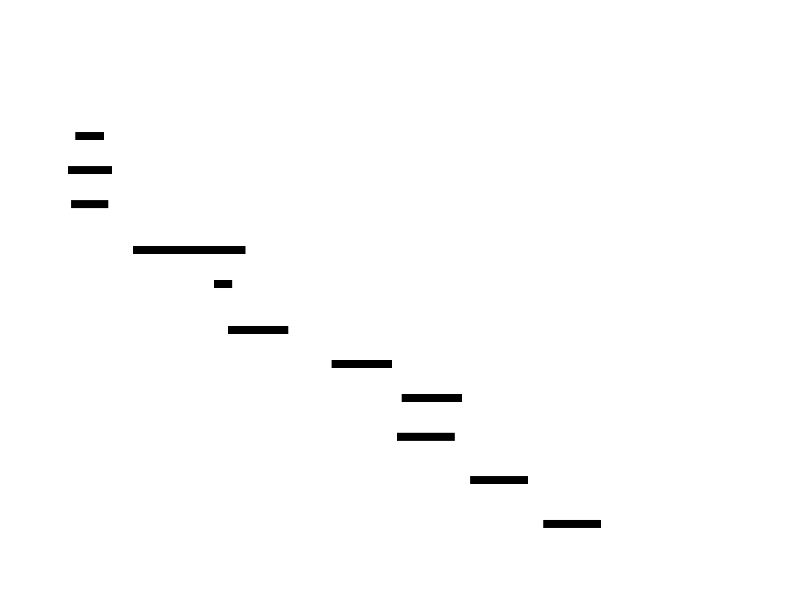

# Replicated Log

**Aliases:** Write-Ahead Log Replication, Log-based State Machine Replication, Commit Log
**Category:** Data / Building block
**Sources:**
[Joshi — Patterns of Distributed Systems](https://martinfowler.com/articles/patterns-of-distributed-systems/) ·
Kleppmann *DDIA*, Ch 5 + Ch 9 ·
[Schneider, *Implementing Fault-Tolerant Services Using the State Machine Approach* (ACM Computing Surveys, 1990)](https://dl.acm.org/doi/10.1145/98163.98167)

---

## Problem

> [!TIP]
> **ELI5.** Three computers each store the same data and have to stay in sync. The bad way: copy "the current value of x is 5" to all of them. Problem: messages arrive in different orders, some get lost — they drift apart. The good way: instead of copying *state*, copy the **list of operations** ("SET x=5; INCREMENT x; DELETE y…") in the same order, and let each computer replay the operations on its own. If they all start the same and apply the same ops in the same order, they end up the same.

Imagine you want N machines to maintain identical copies of some state. The obvious approach — replicating the state itself — has serious problems. State can be large (gigabytes), redundant to ship in full, and hard to merge if two replicas drift. Worse, if you're trying to apply small updates ("SET x = 5"), you have to either lock everything globally before updating, or accept that different replicas can see different orderings and produce different results.

The deeper insight, formalized by Fred Schneider in his 1990 ACM survey, is the **State Machine Replication theorem**:

> *If every replica starts in the same initial state, and every replica applies the same operations in the same order, and every operation is deterministic — then every replica ends in the same state.*

So the replication problem reduces to **agreeing on an ordered sequence of operations** — a *log*. Solve that and the rest follows mechanically. This is the foundation of essentially every modern replicated data system.

## How it works

> [!TIP]
> **ELI5.** Every change to the system is first written as an **entry in a shared, ordered log** before anything is allowed to act on it. The log is the source of truth. To replicate state to another machine, copy the log entries. To recover after a crash, replay the log. To audit what happened, read the log.

A replicated log is an **append-only, ordered sequence of entries**, where each entry typically holds `(index, term, command)`:
- **index** — its monotonically increasing position in the log
- **term** — the [generation clock](../block/generation-clock.md) value at which it was appended (used to detect stale leaders)
- **command** — the operation to apply ("SET x=5", or a more complex transaction)

Every replica holds a copy of the log. A **leader** (chosen by [Raft](../coord/raft.md), [Paxos](../coord/paxos.md), or another consensus algorithm) is the only node that appends entries; followers receive entries via replication RPCs and write them to their own logs in the same order.

In the diagram, the leader has 5 entries in its log. **Entries 1–4 are committed** — a majority of replicas have stored them, and the leader has advanced its commit index to 4. **Entry 5 is uncommitted** — the leader has written it locally and is replicating, but a majority haven't yet acknowledged. If the leader crashes now, a new leader is free to overwrite entry 5 (no client has been told it's safe). If it crashes after entry 5 is committed, the entry must survive — that's the algorithm's safety guarantee.

**Follower 1** is up to date — same commit index as the leader. **Follower 2** is lagging — only has the first two entries, perhaps because it briefly disconnected. The leader's job is to ship the missing entries; the follower will catch up via additional `AppendEntries` RPCs. The replicated-log invariant (shown at the bottom of the diagram) is the foundation: **once an entry is committed, every non-failed replica will eventually contain that exact entry at that exact index.** Different replicas may have different *commit indexes* at any given moment, but the committed prefix is identical everywhere.

The other half of the pattern is **applying** entries to a state machine:

Each replica maintains its own **state machine** — the actual data structures (KV store, table, queue) that clients query. Once the log entry at some index is committed, every replica applies it **in order** to its state machine. Because the entries are byte-identical and the state machine is deterministic, every replica's state machine ends in the same state. Clients can be routed to any replica for reads and (if the replica is up-to-date) get a consistent answer.

The "deterministic" part is critical and easy to miss. Operations like "increment the counter" or "delete the row with key K" are deterministic. Operations like "set timestamp to NOW()" or "pick a random number" are not — they'll produce different results on each replica. The standard fix is to **resolve non-determinism at the leader** and write the resolved value into the log: instead of logging `SET ts = NOW()`, the leader logs `SET ts = 1718291400123`. Followers then apply the same concrete value.

This pattern shows up everywhere in distributed systems, sometimes by different names. **MySQL's binlog**, **PostgreSQL's WAL streaming replication**, **Kafka topics** (which *are* replicated logs as a primitive — `log.cleanup.policy=compact` makes them KV stores), **Cassandra's commitlog** (per-node WAL), **etcd's WAL**, **Bookkeeper ledgers** — all variations on the same idea. The intellectual link from "database WAL" to "consensus log" to "Kafka topic" to "event-sourced application" is a single thread: **log first, derive state second**.

Jay Kreps's 2013 essay *The Log: What every software engineer should know* made this synthesis explicit and influenced an entire generation of system design.

---

## Variants & related patterns

| Variant | Difference |
|---|---|
| **Write-Ahead Log (WAL)** | Single-node version — log entries written before in-memory updates, replayed on recovery. The intra-process precursor. |
| **Segmented Log** (Joshi) | Splits the log into fixed-size segments for compaction/cleanup. Kafka, etcd, RocksDB. |
| **Compacted Log / Log Compaction** | Periodically retain only the latest value per key; bounded storage. Kafka compacted topics, RocksDB. |
| **Snapshot + Log** | Periodically snapshot state + truncate log; on recovery, load snapshot then replay tail. Standard production setup. |
| **Multi-Log / Sharded Log** | One log per shard, parallelized. Kafka partitions, multi-Raft. |
| **Event Sourcing** | Application-level use of replicated log — every domain event recorded; current state is a fold over events. |
| **Change Data Capture (CDC)** | Reading a database's internal log to publish changes as events. Debezium, Maxwell, AWS DMS. |

## When NOT to use

- **For trivial state on a single node** — a plain in-memory store with periodic snapshots is simpler.
- **For very large updates where the state is smaller than the log** — sometimes shipping state directly is cheaper.
- **When operations are inherently non-deterministic and can't be normalized** — the SMR theorem stops applying.

---

## Real-world implementations

The replicated log is foundational; it appears as a primitive in many systems:

| System | What's the replicated log |
|---|---|
| **Apache Kafka** | The system's core abstraction: each topic-partition is a replicated, ordered log. |
| **Apache BookKeeper / Pulsar** | Ledger = append-only log replicated across "bookies". |
| **etcd** | Internal WAL replicated via Raft across cluster members. |
| **CockroachDB / TiKV** | Per-range Raft log = replicated log for that range. |
| **ZooKeeper** | ZAB transaction log replicated across ensemble. |
| **PostgreSQL streaming replication** | Primary's WAL streamed to standbys; standbys replay. |
| **MySQL binary log replication** | Similar — binlog streamed and replayed. |
| **MongoDB oplog** | Replicated operations log across replica set. |
| **Cassandra commitlog** | Per-node WAL (replication is separate, gossip-based). |

## Companies / canonical uses

| Company / system | Use | Status |
|---|---|---|
| **LinkedIn** | Built Kafka explicitly to make the replicated log a first-class infrastructure primitive. | ✅ Verified — [Kreps, *The Log* (2013)](https://engineering.linkedin.com/distributed-systems/log-what-every-software-engineer-should-know-about-real-time-datas-unifying); Kreps et al., *Kafka* (NetDB 2011) |
| **Google** | Internal systems like Megastore, Spanner, F1 all use replicated-log abstractions over Paxos. | ✅ Verified — Spanner OSDI 2012 paper |
| **Amazon** | DynamoDB Streams expose a replicated log of table changes; Aurora has a redo-log-based replicated storage layer. | ✅ Verified — [Aurora SIGMOD 2017 paper](https://www.allthingsdistributed.com/files/p1041-verbitski.pdf) |
| **Confluent / Kafka users** | Uber, Netflix, Pinterest, Slack, Shopify run massive Kafka deployments — replicated logs at the application layer. | ✅ Verified — published engineering blogs |
| **Databricks Delta Lake / Apache Iceberg / Apache Hudi** | Use replicated logs (Delta log, manifest log) to coordinate writes to data lake tables. | ✅ Verified — open-source project docs |

---

## Further reading

- Jay Kreps, *The Log: What every software engineer should know about real-time data's unifying abstraction* (2013) — [LinkedIn Engineering](https://engineering.linkedin.com/distributed-systems/log-what-every-software-engineer-should-know-about-real-time-datas-unifying). **The** essay on this topic.
- Fred B. Schneider, *Implementing Fault-Tolerant Services Using the State Machine Approach: A Tutorial* (1990) — the foundational paper. [PDF](https://dl.acm.org/doi/10.1145/98163.98167).
- Kleppmann, *Designing Data-Intensive Applications*, Ch 5 (Replication) + Ch 9 (Consistency and Consensus).
- *Designing Event-Driven Systems*, Ben Stopford (O'Reilly, free PDF) — applied event-driven architecture treating Kafka as a replicated log.
- Joshi, *Patterns of Distributed Systems*, "Replicated Log" pattern.

---

*Diagram sources: [`../diagrams/src/replicated-log-structure.d2`](../diagrams/src/replicated-log-structure.d2), [`../diagrams/src/replicated-log-apply.d2`](../diagrams/src/replicated-log-apply.d2).*
