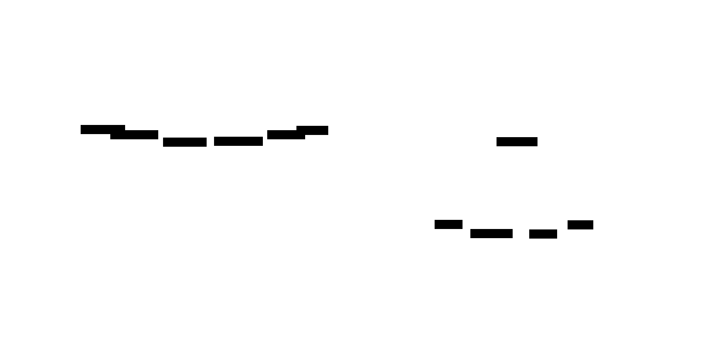
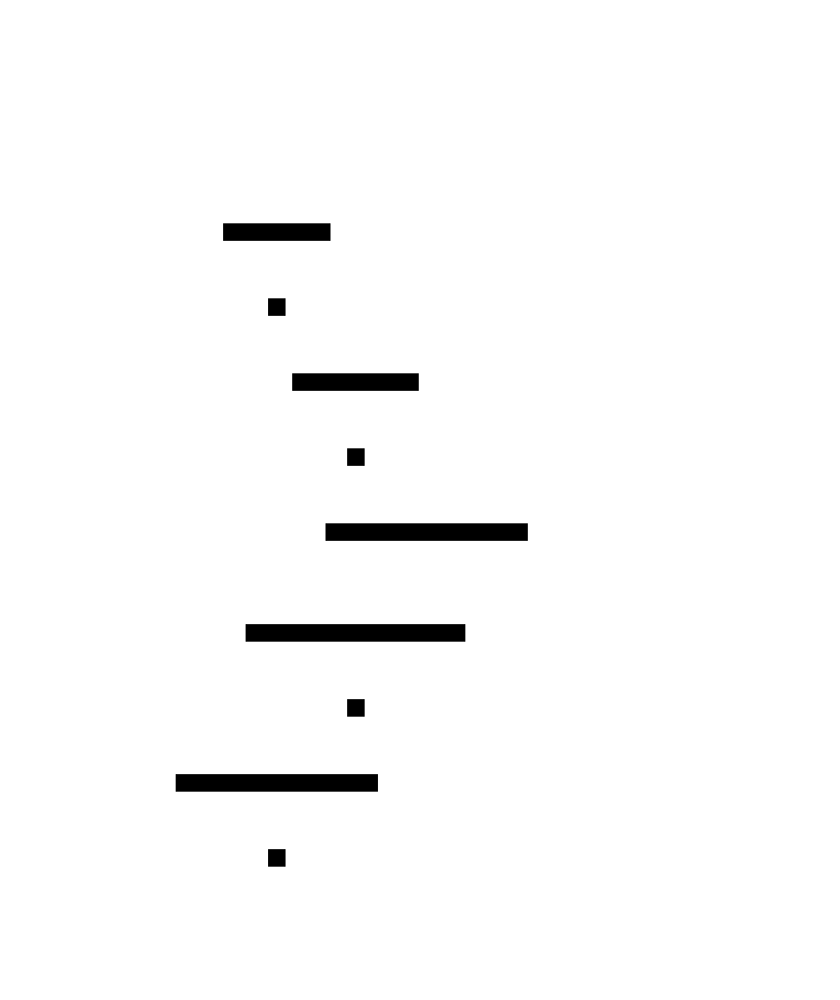

# Saga

**Aliases:** Distributed Saga, Long-Running Transaction
**Category:** Data
**Sources:**
[Microsoft Azure](https://learn.microsoft.com/en-us/azure/architecture/reference-architectures/saga/saga) ·
[microservices.io](https://microservices.io/patterns/data/saga.html) ·
[Neo Kim](https://systemdesign.one/system-design-interview-cheatsheet/) ·
Garcia-Molina & Salem, [*Sagas* (1987)](https://www.cs.cornell.edu/andru/cs711/2002fa/reading/sagas.pdf) — original paper

---

## Problem

> [!TIP]
> **ELI5.** To book a vacation you need to (1) reserve a flight, (2) charge your card, (3) reserve a hotel. If step 3 fails, you don't want a charged card and a paid flight with nowhere to sleep. But you also can't lock all three companies' databases together for ten minutes while you figure it out.

A single business operation often spans **multiple services or databases**: place an order, charge a card, decrement inventory, kick off shipping. Each step lives in a different service's database (the [Database per Service](../arch/microservices.md) principle), so they can't share an ACID transaction. The traditional answer — [Two-Phase Commit](../coord/2pc.md) — needs every participant to hold locks for the entire duration of the transaction, blocks on coordinator failure, and degrades to "the slowest participant's latency" for every write. It's almost never acceptable across organizational boundaries (charging Stripe + reserving in your DB) or in microservices at scale.

The pattern's challenge is: how do you get *something like* atomicity ("all of it happened, or none of it happened") across services that can't participate in a distributed transaction?

## How it works

> [!TIP]
> **ELI5.** Do the steps one at a time. If something fails halfway, run the reverse steps for everything that already succeeded — *cancel the hotel*, *refund the card*, *release the flight seat*. Each service exposes both a *do-it* operation and an *undo-it* (compensating) operation.

A saga splits a long-running cross-service operation into a **sequence of local transactions**, one per service. Each step commits to its own database immediately. If a later step fails, the saga runs **compensating transactions** in reverse order to semantically undo the prior steps.

Crucially, compensation is *not* a rollback in the database sense. The earlier transactions have already committed; their effects are visible. A refund is a *new* transaction that produces the *opposite business effect* of the original charge. This matters: outside observers can see partial states (an order that briefly existed, a charge that was refunded), and the compensating action must be a meaningful inverse in the *business* domain — not a database undo.

Two flavors of saga differ in *who* drives the sequence:

In **orchestration** (top), a dedicated **Saga Orchestrator** service holds the workflow. It calls the Order Service, awaits the result, then calls Payment, awaits, then calls Shipping. The orchestrator is the single source of truth for the saga's state, and the failure handling logic lives in one place. The downside: the orchestrator must know about every participating service, which couples it to all of them; if the orchestrator becomes complex, you've recreated a centralized monolith with extra latency.

In **choreography** (bottom), no central coordinator exists. Services react to each other's events via the **Event Bus**. The Order Service publishes `OrderCreated`; the Payment Service consumes it, charges the card, and publishes `PaymentDone`; the Shipping Service consumes that and publishes `Shipped`. The flow emerges from the chain of events. The advantage is no central dependency; the disadvantage is that the workflow is implicit (you have to trace event handlers across many services to understand it) and failure handling is distributed (each service must know which compensations to publish on errors). Choreography is great for short sagas; orchestration is generally better for anything with more than 3–4 steps.

The compensation logic is the hard part:

In the forward path (green), the coordinator successfully creates the order and charges the card. Then **shipping fails** because the item is out of stock. The coordinator now walks **backwards** in the compensation phase (red): first refund the payment (compensates step 2), then cancel the order (compensates step 1). The key invariant is that each step's compensation must always succeed eventually — typically by being idempotent and retried indefinitely — because the business is now committed to undoing what was done.

This invariant is harder than it sounds. Some operations are *not* truly reversible: an email has been sent, an SMS has been delivered, a partner API has irrevocably executed something. The pattern's design heuristic is: structure your saga so the **irreversible step is the last step**, after every fallible operation has already succeeded. Order operations as `[everything reversible] → [irreversible action] → [done]`.

Three further design rules: (1) each step must be **idempotent** — every transaction and compensation can be safely retried after partial failure or network blip; (2) the saga's state (which step you're on, which steps have completed, which need compensation) must be **persisted durably** so a crashed orchestrator can resume; (3) you must **publish "saga complete" or "saga compensated"** events so downstream consumers know how it ended.

---

## Variants & related patterns

| Variant | Difference |
|---|---|
| **Orchestration Saga** | Central coordinator drives the steps. Easier to reason about; central dependency. |
| **Choreography Saga** | Services react to each other's events. No coordinator; emergent workflow. |
| **Routing Slip** | Each step appends its identity to a "slip" carried with the message; the slip itself routes the workflow. Pre-orchestration variant. |
| **Process Manager** | Stateful orchestrator that can wait for multiple events and time-outs. Powers most production saga frameworks. |
| **Transactional Outbox** | The standard mechanism for atomically committing local state + publishing the saga event. Almost always paired with sagas. |
| **Two-Phase Commit** | The blocking, lock-holding alternative ([2pc.md](../coord/2pc.md)). Sagas accept eventual consistency to avoid 2PC's drawbacks. |

## When NOT to use

- **Single-service operations.** Use a local DB transaction; sagas are pure overhead.
- **When compensating actions don't exist or can't be made to.** If you've already irrevocably done something with downstream effects (sent legal documents, fired a missile), saga compensation is a lie. Restructure the workflow.
- **When strong serializable isolation across services is a hard requirement.** Sagas give *eventual* consistency between steps; an outsider can observe partial states. If that's not acceptable, the architecture is wrong.
- **For short, low-stakes workflows** where the operational cost (orchestrator, event bus, compensation testing) exceeds the risk of inconsistency.

---

## Real-world implementations

| Tool | Style | Notes |
|---|---|---|
| **Temporal** | Orchestration (durable workflows) | The current standard for durable orchestration; saga is one of several built-in patterns. |
| **Camunda / Zeebe** | Orchestration (BPMN workflows) | Long-standing workflow engines with saga support. |
| **AWS Step Functions** | Orchestration (state machine) | Serverless saga orchestrator on AWS. |
| **Azure Durable Functions** | Orchestration | Saga via durable function chaining on Azure. |
| **Eventuate Tram Sagas** | Either | Chris Richardson's framework; explicit saga support. |
| **Apache Camel Saga EIP** | Either | Saga implementation in Camel's integration framework. |
| **Axon Framework Sagas** | Orchestration | Saga component within Axon's CQRS/ES framework. |
| **NestJS + RabbitMQ / Kafka** | Choreography (DIY) | Common DIY stack — explicit event handlers per service. |

## Companies using it (notable examples)

| Company | Use | Status |
|---|---|---|
| **Uber** | Uses Cadence (predecessor of Temporal, open-sourced by Uber) for many saga-style workflows in trip dispatch, payments, and money transfers. | ✅ Verified — [Cadence open-source project](https://github.com/uber/cadence) + multiple Uber Engineering posts |
| **Netflix** | Conductor (open-sourced by Netflix) is a workflow orchestration engine commonly used for saga-style multi-service operations. | ✅ Verified — [Netflix Conductor](https://conductor-oss.org/) |
| **Snap** | Has publicly described using Temporal for orchestrated workflows including saga-style ones. | ⚠ Discussed in talks; not re-verified by fetch |
| **Stripe** | Internal workflow engine handles payment-related sagas (charge → settle → payout, with compensation paths). | ⚠ Discussed in talks; specific architecture not public |
| **DoorDash** | Uses orchestrated workflows (Cadence/Temporal-based) for order lifecycle. | ⚠ Discussed in engineering blog posts; not re-verified for this document |
| **Coinbase** | Uses Temporal for several payment and transfer workflows. | ⚠ Discussed in case studies; not re-verified |

**⚠ marks claims widely known industry-wide but not re-verified by primary-source fetch.**

---

## Further reading

- Hector Garcia-Molina & Kenneth Salem, *Sagas* (1987) — the original paper.
- Chris Richardson, *Microservices Patterns* (2018), Ch 4 — most accessible modern treatment with orchestration and choreography variants.
- Caitie McCaffrey, *Distributed Sagas: A Protocol for Coordinating Microservices* (QCon 2017) — influential talk reviving the pattern for the microservices era.
- Microsoft Azure Architecture Center, *Saga distributed transactions*.
- Temporal docs, *Sagas* — concrete code for orchestration patterns.

---

*Diagram sources: [`../diagrams/src/saga-orchestration-choreography.d2`](../diagrams/src/saga-orchestration-choreography.d2), [`../diagrams/src/saga-compensation.d2`](../diagrams/src/saga-compensation.d2).*
