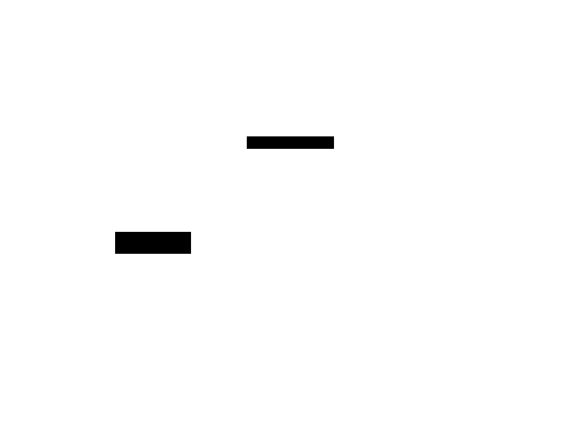
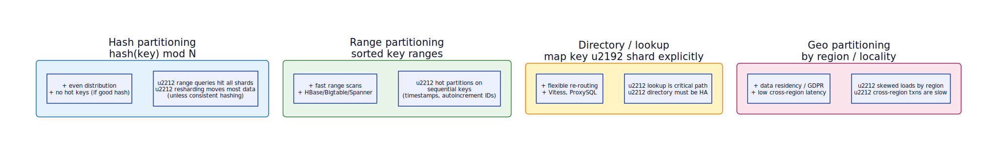

# Sharding (Horizontal Partitioning)

**Aliases:** Horizontal Partitioning, Data Partitioning
**Category:** Data
**Sources:**
[Microsoft Azure](https://learn.microsoft.com/en-us/azure/architecture/patterns/sharding) ·
[Neo Kim](https://systemdesign.one/system-design-interview-cheatsheet/) ·
[ByteByteGo](https://github.com/ByteByteGoHq/system-design-101) ·
Kleppmann *DDIA*, Ch 6 (Partitioning)

---

## Problem

> [!TIP]
> **ELI5.** You have one giant filing cabinet. It's full. It's slow to open. Hiring someone to also use it doesn't help — there's still one drawer. The fix isn't a bigger cabinet; it's *many* cabinets, with a clear rule for which drawer holds which file.

A single database server has hard ceilings: disk size, RAM, CPU, IOPS, network bandwidth, connection count. Beyond those, **vertical scaling** (bigger box) becomes exponentially expensive and eventually stops working entirely — the biggest box money can buy is not infinite. Read load can be mitigated with **replicas**, but writes still all funnel through the leader, and the *data itself* still has to fit on one disk.

Sharding is the answer when the dataset is too big or too hot for a single node to serve, regardless of how many replicas you add. The hard part is not the splitting — it's choosing **what to split on**, because that choice ripples through every query, every transaction, and every future re-shard.

## How it works

> [!TIP]
> **ELI5.** Split the data across N databases. Pick a rule (a *partition key*) that decides which database holds each row. Every query first asks the rule "which shard?" then goes only to that shard.

Sharding divides the dataset across **multiple independent database instances**, called **shards**. Each row lives on exactly one shard, determined by a **partition key** chosen from the row's columns (e.g., `user_id`, `tenant_id`, `geohash`). A **router** (in the client driver, in middleware like Vitess or ProxySQL, or built into the database like MongoDB's `mongos`) computes the shard from the key and forwards the request.

In the architecture above, the **Client** issues a query for `user_id=K42`. The **Shard Router** applies the partitioning function — here `hash(user_id) % N`, mapping `K` to **Shard 1** because `K ∈ G–M`. The query goes only to that one shard (solid green arrow). The other three shards (dashed gray) are not touched. Each shard is itself a complete database — typically with its own replicas, its own backups, and its own connection pool. Together they hold the whole dataset; individually they hold only their slice.

The router's job sounds simple but is critical: it must be **fast** (every query goes through it), **consistent** (same key always lands on the same shard, even across language clients and over time), and **robust under node failure** (one dead shard shouldn't take down the whole system). Most modern implementations push routing into the client driver to avoid an extra network hop, with a control plane that keeps every client's routing table in sync.

The deep question — and the one teams underestimate most — is **how to split**:

**Hash partitioning** (`hash(key) mod N`) distributes data evenly and resists hot keys, but range queries (`WHERE user_id BETWEEN ...`) have to fan out to every shard, and naive `mod N` requires moving almost all the data when N changes — which is why production systems use **consistent hashing** to keep most keys in place during resharding. Used by DynamoDB, Cassandra, Redis Cluster.

**Range partitioning** keeps data sorted by key, so range scans are very fast (HBase, Bigtable, Spanner, MongoDB sharded clusters). The danger is **hot partitions** on sequential keys: if you partition by `created_at`, the *current* shard takes all the writes while the others sit idle. Mitigations include hashing a prefix into the key (so neighboring timestamps land on different shards) or using random shard IDs.

**Directory-based partitioning** stores an explicit `key → shard` map in a lookup service (Vitess's topology server is the canonical example). It's the most flexible — you can move individual keys, split hot shards, route traffic gradually — but the lookup service becomes a critical-path dependency that must itself be highly available.

**Geo / locality partitioning** puts users in the shard closest to them, or in a shard mandated by data-residency law (GDPR, China data sovereignty). It gives low latency and legal compliance but creates skew (the US shard is much bigger than the Iceland shard) and makes cross-region transactions slow.

In practice, choose the partition key by following the **dominant query pattern**: pick a key that nearly every query already filters on, so almost everything stays within one shard. The queries that *don't* fit (cross-shard joins, global aggregations, secondary lookups) become much harder — they need scatter-gather, a separate aggregated read store (often projected via [CQRS](../data/cqrs.md)), or a global secondary index.

---

## Variants & related patterns

| Variant | Notes |
|---|---|
| **Consistent Hashing** | The hashing algorithm that minimizes data movement on rebalance — see [consistent-hashing.md](consistent-hashing.md). Essential for hash-based sharded systems. |
| **Federation (Functional Partitioning)** | Split by *function* (users-DB, products-DB) rather than by row. Often a stepping stone toward microservices' "database per service." |
| **Replication** | Orthogonal axis — replicate *within* each shard for HA. Real systems do both. |
| **Materialized Views / CQRS** | The standard way to answer cross-shard queries — project into a read store organized differently. |
| **Fixed Partitions (Joshi)** | Fix N at creation; rebalance by reassigning whole partitions to nodes. Kafka, Elasticsearch, Citus. |
| **Key-Range Partitions (Joshi)** | Same as Range Partitioning above. |

## When NOT to use

- **The data fits on one node, even at projected growth.** Sharding is a heavy commitment; don't pay it before you need to. Get to a *very* big single instance first (modern Postgres handles tens of TB; Aurora goes further).
- **Workload is read-heavy and writes fit one node.** Read replicas may be enough; cheaper and simpler than sharding.
- **You can't pick a clean partition key.** If queries don't naturally cluster on any single column, sharding will scatter-gather most of them and you'll get worse latency than a single big box.
- **Multi-tenant SaaS where one tenant dominates load.** Per-tenant shards (with hot tenants on dedicated shards) is the answer, not generic sharding.

---

## Real-world implementations

| System | Notes |
|---|---|
| **Vitess** | Sharding middleware for MySQL; powers YouTube, Slack, GitHub. Directory-based with range partitioning. |
| **Citus (now part of Azure Postgres)** | Distributed Postgres extension; hash or append partitioning. |
| **MongoDB Sharded Clusters** | Built-in sharding with `mongos` routers and a config server. Hash or range. |
| **Cassandra / ScyllaDB** | Consistent-hash partitioning; every node knows the topology. |
| **DynamoDB** | Hash partitioning under the hood; AWS manages the splits transparently. |
| **CockroachDB / TiDB / YugabyteDB** | Range partitioning with automatic split/merge; consensus per range. |
| **Elasticsearch / OpenSearch** | Fixed-partition (shards per index); allocator places shards on nodes. |
| **Redis Cluster** | Fixed 16384 hash slots; clients route by slot. |

## Companies using it (notable examples)

| Company | Use | Status |
|---|---|---|
| **YouTube → Vitess** | Created Vitess to shard MySQL; later open-sourced. The canonical large-scale Vitess deployment. | ✅ Verified — [vitess.io history](https://vitess.io/docs/overview/history/) |
| **Slack** | Migrated MySQL fleet to Vitess in 2017–2020. | ✅ Verified — [Slack Engineering, *Scaling Datastores at Slack with Vitess*, 2020](https://slack.engineering/scaling-datastores-at-slack-with-vitess/) |
| **GitHub** | Has publicly described moving large MySQL clusters to Vitess. | ✅ Verified — [GitHub Engineering blog on MySQL sharding](https://github.blog/2021-09-27-partitioning-githubs-relational-databases-scale/) |
| **Facebook / Meta** | TAO, the social graph store, is heavily sharded by user. | ✅ Verified — [Bronson et al., *TAO: Facebook's Distributed Data Store for the Social Graph*, USENIX ATC 2013](https://www.usenix.org/conference/atc13/technical-sessions/presentation/bronson) |
| **Discord** | Migrated trillions of messages from Cassandra to ScyllaDB, both sharded. | ✅ Verified — [Discord Engineering, *How Discord Stores Trillions of Messages*, 2023](https://discord.com/blog/how-discord-stores-trillions-of-messages) |
| **Shopify** | "Pods" architecture — each pod is a shard with a slice of merchants, isolated end-to-end. | ✅ Verified — [Shopify Engineering, *A Pods Architecture To Allow Shopify To Scale*, 2019](https://shopify.engineering/a-pods-architecture-to-allow-shopify-to-scale) |
| **Uber** | Sharded MySQL → Schemaless → DocStore evolution; partitioning at the dispatch and trip layers. | ⚠ Engineering blog posts exist; not re-verified for this document |

---

## Further reading

- Kleppmann, *Designing Data-Intensive Applications*, Ch 6 — the definitive treatment of partitioning, rebalancing, and secondary indexes.
- Vitess docs — [vitess.io](https://vitess.io/docs/) — production sharding patterns for MySQL.
- Discord, *How Discord Stores Trillions of Messages* (2023) — recent, detailed sharded-store case study.
- Shopify, *A Pods Architecture* (2019) — full-stack pod isolation as a sharding strategy.
- Microsoft Azure Architecture Center, *Sharding pattern*.

---

*Diagram sources: [`../diagrams/src/sharding-architecture.d2`](../diagrams/src/sharding-architecture.d2), [`../diagrams/src/sharding-strategies.d2`](../diagrams/src/sharding-strategies.d2).*
