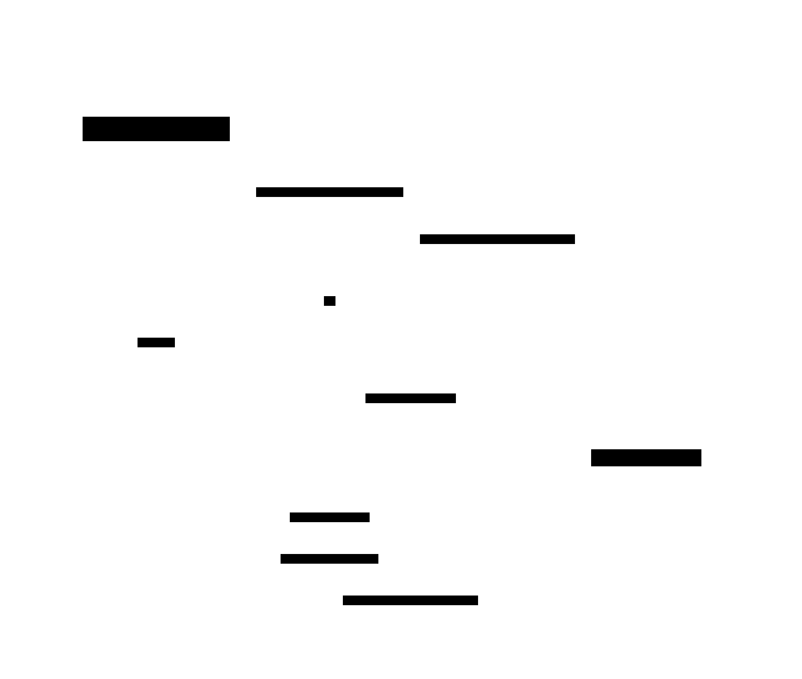

# Write-Ahead Log (WAL)

**Aliases:** Redo Log, Commit Log (intra-process), Transaction Log, Journal, Redo Journal
**Category:** Data / Building block
**Sources:**
[Joshi — Patterns of Distributed Systems](https://martinfowler.com/articles/patterns-of-distributed-systems/) ·
Kleppmann *DDIA*, Ch 3 (Storage Engines) ·
[Mohan et al., *ARIES: A Transaction Recovery Method Supporting Fine-Granularity Locking and Partial Rollbacks Using Write-Ahead Logging* (ACM TODS, 1992)](https://web.stanford.edu/class/cs345d-01/rl/aries.pdf)

---

## Problem

> [!TIP]
> **ELI5.** You're writing in a notebook and the power could cut at any second. If you erase and rewrite a number in the middle of a page, and power dies mid-erase, you've lost the old value AND don't have the new one. Better: keep a chronological "what I'm about to do" diary at the back of the book. Write the entry *first*, then make the change. If power dies, you can read the diary and finish — or undo — the change.

A storage system that updates data **in place** has a fundamental durability problem: any write that has been told "OK, committed" must survive crashes, power loss, process kills, OS panics, and machine reboots. Two pressures pull in opposite directions:

- **Performance**: you want commits to be fast. The data files are scattered across the disk (B-tree pages in random locations); fsyncing them on every commit is brutally slow — random I/O is 100–1000× slower than sequential.
- **Durability**: but you must guarantee that committed data survives a crash before acknowledging the commit. If you cheat and ack before durably writing, a crash loses acked data — silent corruption that breaks every contract above.

You also need **atomicity**: a multi-statement transaction either fully happens or fully doesn't. If the system crashes halfway through, recovery must either complete the transaction (if it was committed) or undo all partial work (if it wasn't).

You need a way to **persist a commit** that's both *fast* (sequential I/O) and *recoverable* (rich enough to reconstruct the state).

## How it works

> [!TIP]
> **ELI5.** Before changing anything in the actual data, append a description of the change to a special file (the WAL). Force that file to disk. Only *then* apply the change in memory and tell the client "done." If the program crashes, restart by reading the WAL from the beginning and replaying each entry — you reach exactly the state you would have had.

A Write-Ahead Log is a strictly **append-only**, **sequentially-written**, **durably-flushed** file (or set of files) that records every modification to the system's state **before** that modification is applied to the actual data structures. The "ahead" in "write-ahead" means: log first, mutate second.

The sequence is exact:

**Step 1 — append to WAL and fsync.** When a transaction commits, the database serializes the commit record (and any preceding modifications in this transaction) into the WAL buffer and forces it to disk via `fsync()`. The fsync is the crucial guarantee — it returns only when the kernel and disk confirm the bytes are physically stored, surviving power loss.

**Step 2 — acknowledge the commit.** Only after the fsync returns does the database tell the client "COMMIT OK." From this moment, the durability promise has been made. If anything later goes wrong, recovery will preserve this commit.

**Step 3 — apply to in-memory state.** Now the actual B-tree pages (or whatever in-memory structures) are updated. This can happen lazily — even after the client has been told "done" — because the WAL holds the authoritative version. Other readers may now see the new value.

**Step 4 — checkpoint to disk (later).** Periodically, dirty in-memory pages are flushed to the actual data files. This isn't on the commit path; it happens in the background, possibly seconds or minutes after the commit, in batches that turn random I/O into sequential I/O.

**Recovery** is the payoff: if the process crashes anywhere above step 4, restart reads the WAL from the last checkpoint, replays each entry, and reconstructs the in-memory state. Committed transactions survive because their WAL entries do; uncommitted transactions either replay as no-ops or are rolled back via undo records (in systems like ARIES).

The three guarantees this provides:

**Durability (the D in ACID).** Once committed, the transaction survives crashes — guaranteed by fsync of the commit record.

**Atomicity (the A in ACID).** A multi-step transaction is all-or-nothing — guaranteed by writing every modification to the log before applying it, then either replaying or discarding partial work on recovery.

**Performance.** Counterintuitively, WAL **makes commits faster**, not slower. Without WAL, every commit must fsync the actual scattered data pages (random I/O). With WAL, commits fsync only the sequentially-written WAL file (sequential I/O — 100–1000× faster on HDD and SSD). The actual data files are updated in coalesced batches later. Every serious database — Postgres, MySQL/InnoDB, Oracle, SQL Server, SQLite, RocksDB, LMDB — uses WAL specifically for the performance.

### ARIES: the canonical algorithm

The seminal 1992 paper by C. Mohan et al. at IBM, *ARIES: A Transaction Recovery Method...* (ACM TODS), formalized WAL-based recovery into a now-universal algorithm. ARIES uses three phases:

1. **Analysis** — scan from the last checkpoint, rebuilding the dirty-page table and active-transaction table.
2. **Redo** — replay all log entries from the earliest dirty page's log position, idempotently. This brings the database back to the state it was in at crash.
3. **Undo** — walk back through the log undoing the effects of any transaction that was active at crash time but never committed.

Every major DBMS in the world is essentially ARIES with minor variations.

### WAL versus its cousins

The intra-process WAL has a deep family resemblance to several other patterns:

- **[Replicated Log](../data/replicated-log.md)** — when a WAL is shipped to other machines and replayed there, you have replicated state-machine replication. Postgres streaming replication is exactly this. Kafka generalizes it into a primitive.
- **[Segmented Log](segmented-log.md)** — virtually every WAL in production is split into fixed-size segments for rotation, deletion, and parallel reads.
- **[High-Water Mark](../block/hwm-lwm.md)** — within the WAL, the "last committed LSN" marks the boundary between safe and unsafe entries.
- **Event Sourcing** — an application-level WAL: domain events recorded as the source of truth, with derived state regenerable from the log.

The conceptual continuity from a single-machine database's WAL to a distributed-systems replicated log to an application's event store is one of the most fertile threads in modern data engineering.

A few production subtleties worth knowing:

- **Group commit**: batch many transactions' fsyncs together to amortize disk-flush latency. Postgres `commit_delay`, MySQL `binlog_group_commit_sync_delay`. Trades a few ms of per-commit latency for much higher throughput.
- **fsync is hard**: PostgreSQL's "fsync gate" bug (2018) discovered that on Linux, an fsync failure could be silently lost on retry, possibly losing acked data. Every storage engineer should read the ensuing pgsql-hackers thread.
- **Page tearing**: many filesystems don't guarantee atomic 16KB page writes. Postgres mitigates with `full_page_writes`; MySQL/InnoDB with the *doublewrite buffer*; LMDB with copy-on-write.
- **Direct I/O vs page cache**: high-end engines (InnoDB, Oracle) bypass the OS page cache (`O_DIRECT`) to maintain precise control over what's on disk versus in memory.

---

## Variants & related patterns

| Variant | Difference |
|---|---|
| **Redo-only logging** | Log only the new value; can replay but not undo. Used in systems that don't expose long transactions. |
| **Undo-only logging** | Log only the old value; restrictive. Rare. |
| **Redo/Undo logging (ARIES)** | Both — supports rollback and rich crash recovery. Industry standard. |
| **Physiological logging** | Log records describe page-level changes ("delete row at slot 7 of page 42") rather than logical operations. Allows recovery to be index-aware. |
| **Logical logging** | Records the operation in domain terms ("UPDATE users SET name='X' WHERE id=42"). MySQL binlog statement-based replication. |
| **Group commit** | Batch fsyncs across concurrent transactions. |
| **Replicated WAL** | Ship the WAL to other replicas in real time — Postgres streaming replication, MySQL binlog replication. |
| **Replicated Log (Raft, Kafka)** | Distributed-systems generalization — see [replicated-log.md](../data/replicated-log.md). |
| **Event Sourcing** | Application-layer WAL — domain events are the source of truth. |

## When NOT to use

- **Pure in-memory caches with no durability requirement** — fsync overhead for nothing.
- **Append-only immutable storage** (write-once datasets) — the data file is its own log.
- **Systems where the cost of recovery time matters more than commit latency** — though virtually all of these end up adopting WAL anyway, just with shorter checkpoint intervals.

---

## Real-world implementations

| System | WAL |
|---|---|
| **PostgreSQL** | `pg_wal/` — segmented WAL files, streaming replication |
| **MySQL / InnoDB** | redo log (`ib_logfile*`) for crash recovery, binlog for replication and PITR |
| **Oracle** | redo log + archived redo logs |
| **SQL Server** | transaction log (`.ldf` files) |
| **SQLite** | WAL mode (`PRAGMA journal_mode=WAL`); also classic rollback-journal mode |
| **RocksDB / LevelDB** | WAL + memtable + SSTables (LSM-tree variant) |
| **LMDB** | doesn't use a separate WAL — uses copy-on-write with atomic page swap |
| **Apache Cassandra** | per-node commitlog |
| **MongoDB / WiredTiger** | journal file |
| **etcd** | WAL persisted to disk before Raft replication |
| **Kafka** | per-partition log file is itself the "WAL" — the consumer model treats the log as the durable source |

## Companies / canonical uses

| Where | Use | Status |
|---|---|---|
| **Every major RDBMS vendor** | All ACID databases use WAL for durability + crash recovery. | ✅ Verified — see DB-specific documentation above |
| **Postgres community** | The Postgres WAL design is one of the most-studied and most-copied. | ✅ Verified — [Postgres docs](https://www.postgresql.org/docs/current/wal.html) |
| **LinkedIn / Confluent / Kafka users** | Kafka took the WAL idea and made it a public-facing primitive. | ✅ Verified — [Kreps, *The Log*](https://engineering.linkedin.com/distributed-systems/log-what-every-software-engineer-should-know-about-real-time-datas-unifying) |
| **Amazon Aurora** | The storage layer is essentially a distributed redo log; database instances *only* ship redo log records, not data pages. | ✅ Verified — [Aurora SIGMOD 2017](https://www.allthingsdistributed.com/files/p1041-verbitski.pdf) |
| **Google Spanner, Bigtable** | Both use WAL (Bigtable's commitlog, Spanner's per-Paxos-group WAL). | ✅ Verified — Bigtable OSDI 2006, Spanner OSDI 2012 |

---

## Further reading

- Mohan, Haderle, Lindsay, Pirahesh, Schwarz, *ARIES: A Transaction Recovery Method Supporting Fine-Granularity Locking and Partial Rollbacks Using Write-Ahead Logging* (ACM TODS 1992) — the canonical paper. [PDF](https://web.stanford.edu/class/cs345d-01/rl/aries.pdf).
- Kleppmann, *Designing Data-Intensive Applications*, Ch 3 — storage engines and the role of the WAL.
- Joshi, *Patterns of Distributed Systems*, "Write-Ahead Log" pattern.
- *Database Internals*, Alex Petrov — Ch 3 + 5 cover WAL and recovery in modern engines.
- *The Internals of PostgreSQL*, Hironobu Suzuki (free online) — excellent visual walkthrough of Postgres's WAL.
- The 2018 Postgres "fsync gate" pgsql-hackers thread — sobering reading on the gap between "what you think fsync guarantees" and "what it actually does."

---

*Diagram sources: [`../diagrams/src/wal-order.d2`](../diagrams/src/wal-order.d2), [`../diagrams/src/wal-guarantees.d2`](../diagrams/src/wal-guarantees.d2).*
