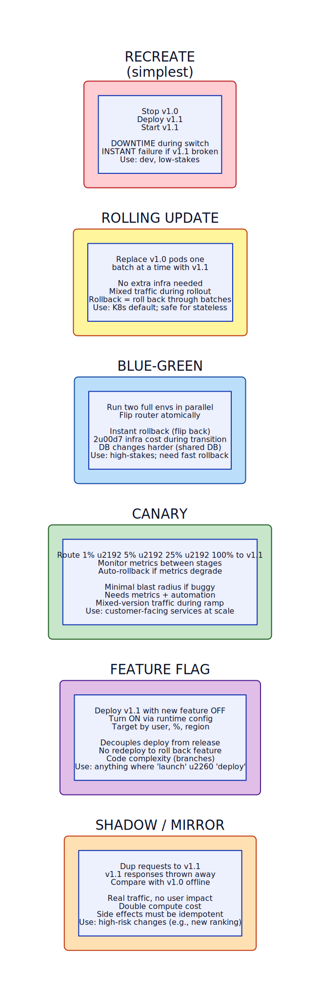

# Blue-Green & Canary Deployment (Progressive Delivery)

**Aliases:** Blue-Green Deployment, Canary Release, Canary Deployment, Progressive Rollout, Rolling Update, Dark Launch, Shadow Deployment
**Category:** Operations / Deployment
**Sources:**
[Microsoft Azure — Deployment Stamps & deployment guidance](https://learn.microsoft.com/en-us/azure/architecture/patterns/deployment-stamp) ·
[Martin Fowler — BlueGreenDeployment (2010)](https://martinfowler.com/bliki/BlueGreenDeployment.html) ·
[Martin Fowler — CanaryRelease (2014)](https://martinfowler.com/bliki/CanaryRelease.html) ·
*Continuous Delivery* (Humble & Farley, 2010) ·
[Google SRE Book — Release Engineering](https://sre.google/sre-book/release-engineering/) ·
[Netflix Tech Blog — Spinnaker / Kayenta](https://netflixtechblog.com/automated-canary-analysis-at-netflix-with-kayenta-3260bc7acc69) ·
[Argo Rollouts](https://argoproj.github.io/argo-rollouts/) · [Flagger](https://flagger.app/)

---

## Problem

> [!TIP]
> **ELI5.** Deploying a new version of a live service is dangerous. The naive approach — stop v1.0, deploy v1.1, start it — has downtime *and* puts 100% of users onto untested code instantly. If v1.1 is buggy, every user is affected, and rolling back means redeploying v1.0. **Progressive delivery** patterns let you ship code in a safer way: either run two complete environments and flip atomically (**blue-green**), or send a tiny fraction of traffic to the new version first and watch (**canary**). The goal is the same: deploy with low risk, recover fast when something breaks.

The old world — coordinated deploys with maintenance windows, downtime banners, and rollback-by-redeploy — doesn't work at modern scale. A few facts make this stark:

- Amazon famously deploys [thousands of times per day](https://aws.amazon.com/blogs/devops/devops-amazon-deployment-philosophy/). You cannot do that with downtime.
- Netflix, Google, Facebook all deploy continuously — often hundreds of changes per day per service.
- An outage during a rollback (because rollback = redeploy of the old version) compounds the original incident.
- Bugs that escape testing are inevitable; the question is how big the blast radius is when they hit production.

The progressive-delivery family of patterns answers this by making deployment **decoupled from risk exposure**. You deploy the code, but you control how much real traffic it sees, who sees it, and how quickly that ramps up. If anything looks wrong, you cut traffic immediately — no redeploy needed.

The two foundational patterns are **blue-green** (atomic switch between two complete environments) and **canary** (gradual traffic ramp with continuous monitoring). They're often combined with **feature flags** (see [feature-flag.md](feature-flag.md)) to separate "deploy the code" from "release the feature."

## How it works

> [!TIP]
> **ELI5.** Blue-green keeps two identical production environments side by side: BLUE is live, GREEN gets the new version, you flip a switch (load-balancer rule, DNS, router config) to send all traffic to GREEN. Rollback is flipping the switch back. Canary works differently: you put the new version next to the old version and route a *small fraction* of traffic to it — 1%, then 5%, then 25%, then 100% — watching error rates and latency at each stage. If anything looks wrong, you stop the ramp and route everything back to the old version.

### Blue-Green Deployment

The mechanics:

You maintain two production environments — "blue" and "green" — each capable of serving full traffic. At any moment, exactly one is live. Deployment proceeds as:

1. **BLUE is live**, serving 100% of traffic.
2. Deploy v1.1 to **GREEN**. Run smoke tests, integration tests, warm caches.
3. **Flip the router** (load balancer rule, DNS record, ALB target group, Envoy config) to send 100% of traffic to GREEN.
4. GREEN is now live; BLUE is held in reserve.
5. If anything goes wrong, **flip back to BLUE** — instant rollback, no redeploy.
6. After confidence, you can decommission the old BLUE or use it as the next staging environment.

Key properties:
- **Zero-downtime deploys** — the switch is atomic.
- **Instant rollback** — flipping back is seconds.
- **Full pre-prod validation** — GREEN is a real production environment before any user hits it.
- **2× infrastructure** during the transition.

Where it's hard:
- **Shared state**: blue and green typically share a database (you usually can't blue-green the DB). Schema changes must be backward-compatible so blue and green can both run against the same DB during transition. This is the "expand and contract" technique: add new columns, deploy code that uses both old and new, flip, then later remove old columns.
- **Long-running requests**: cutover doesn't immediately kill in-flight blue connections; you need graceful drain.
- **Stateful services**: WebSocket connections, server-sent events, in-flight transactions don't migrate. Plan for client reconnect.
- **Cost**: doubling infrastructure during transition is expensive at scale; for small services it's fine, for huge fleets it's notable.

Used by: Etsy, many Heroku-style platforms, anyone using Spinnaker, Azure App Service "deployment slots" (which are exactly blue-green at the PaaS level), AWS CodeDeploy blue-green, GCP Cloud Run revisions.

### Canary Deployment

A different shape — instead of two complete environments switched atomically, you have **one production environment that runs mixed versions, with traffic split**:

1. Deploy v1.1 alongside v1.0 (1 v1.1 pod alongside 99 v1.0 pods, say).
2. Send 1% of traffic to v1.1.
3. **Watch metrics**: error rate, latency p99, application-specific success metrics (conversion, sign-ups). Often these are checked automatically against a known-good baseline (Netflix's Kayenta does this — "automated canary analysis").
4. If metrics look good, ramp to 5%, then 25%, then 100%. If they look bad, immediately route 0% to v1.1 (effectively rolled back).
5. Once at 100%, the old version can be retired.

The name comes from "canary in a coal mine" — the canary detects danger before the miners are harmed. The 1% of users on v1.1 are the canary; if they see errors, the other 99% are saved.

Key properties:
- **Minimal blast radius** if v1.1 is broken — at worst 1% of users hit the bug.
- **Real production traffic** validating v1.1 with real users, real data.
- **Continuous monitoring** drives the ramp; can be automated.
- **No environment doubling** (just a few extra v1.1 instances during ramp).

Where it's hard:
- **Needs strong observability**: you can't watch metrics you don't have. Requires reliable error rate, latency, and business-metric telemetry per version.
- **Mixed-version traffic** during ramp: both v1.0 and v1.1 are receiving real traffic; their data writes coexist. Schema must be backward/forward compatible.
- **Statistical significance**: 1% of a small service might be 5 users — too few to detect a regression. Need enough traffic for the canary to be informative.
- **Sticky sessions**: if a user's first request goes to v1.0 but later to v1.1, they may see weird behavior. Often canary traffic is routed by user ID hash (not random) so each user consistently sees one version.
- **Automation tooling**: doing this manually is tedious; Spinnaker/Kayenta, Argo Rollouts, Flagger, AWS App Mesh, Istio's traffic-splitting are the practical tools.

Used by: Netflix (Spinnaker pioneered this in industry), Google (every major service), Facebook, Lyft (Envoy was originally built for this), Slack, Stripe, Airbnb. Most service-mesh deployments use canary as the default release strategy.

### The full progressive-delivery spectrum

There are more strategies than just blue-green and canary — each trades off speed vs safety vs cost:

In order of increasing safety and complexity:

**Recreate**: stop the old, start the new. Downtime, instant exposure, instant rollback (redeploy). Fine for dev, low-stakes services, batch jobs.

**Rolling update**: replace old pods with new pods one batch at a time. Kubernetes default. No downtime, no extra infrastructure, but mixed-version traffic during rollout and rollback means rolling back through the batches (slower than blue-green).

**Blue-Green**: two complete environments, atomic flip. Best for fast rollback, costs 2× during transition.

**Canary**: gradual traffic ramp with monitoring. Best for limiting blast radius; requires observability and automation.

**Feature Flag**: deploy the code with the feature off; turn it on via runtime config. Decouples deploy from release entirely. See [feature-flag.md](feature-flag.md).

**Shadow / Mirror**: duplicate real traffic to the new version, but throw away its responses (or compare them offline). Real-traffic testing with zero user impact, but doubles compute cost and requires idempotent side effects (don't shadow a "charge credit card" request). Used for changes where being subtly wrong is catastrophic — recommendation rerank, search ranking, financial risk models.

In practice, large orgs combine multiple: rolling update for small/safe changes, canary for customer-facing services, blue-green for stateful services, feature flags for "launch when product-ready," shadow for risky algorithm changes.

### Tooling landscape

Modern toolchains make progressive delivery push-button:

- **Spinnaker** (Netflix) — pioneered multi-cloud canary deployments.
- **Kayenta** (Netflix) — automated canary analysis, statistical comparison.
- **Argo Rollouts** (CNCF) — Kubernetes canary/blue-green controller.
- **Flagger** (CNCF) — automated canary on K8s with Istio/Linkerd/AWS App Mesh.
- **Istio / Linkerd / Consul Connect** — service-mesh-based traffic splitting.
- **AWS CodeDeploy** — blue-green and canary for EC2 and Lambda.
- **Google Cloud Deploy / Cloud Run revisions** — built-in traffic splitting.
- **Azure App Service slots** — built-in blue-green at PaaS layer.
- **LaunchDarkly / Split / Unleash / GrowthBook** — feature flags as a service.
- **Harness / CircleCI / GitHub Actions** — CD platforms with built-in progressive delivery.

### Database schema changes — the hard part

The single hardest part of progressive delivery is schema migration. You cannot blue-green a database (you have one DB, two app versions both reading/writing). You must make schema changes backward-compatible:

1. **Expand**: add new columns/tables. Old code ignores them.
2. **Migrate code**: deploy v1.1 that writes to *both* old and new schema.
3. **Backfill**: populate new columns from old data.
4. **Switch reads**: deploy code that reads from new schema.
5. **Contract**: after full rollout and verification, drop old columns.

Each phase is a separate deploy; the whole sequence may take days or weeks. Skipping the expand-contract dance is how you turn a "small migration" into a multi-hour outage.

### When deploy ≠ release

The most powerful insight from this family: **deploying code and releasing a feature can be separated**. Code can be deployed (running in production, behind a flag, with 0% canary traffic, on a blue-green standby) without any user ever experiencing the feature. Then *release* is an independent step — flip the flag, ramp the canary, switch the router.

This separation is what enables continuous deployment without continuous risk. Engineers deploy on every PR merge; product teams launch features when *they're* ready; ops teams can disable a feature without involving engineering. Each role gets independent control over a different lever.

### Anti-patterns

- **Canary without observability**: ramping based on hunches, not metrics.
- **Blue-green without DB compatibility**: cutover succeeds, then both versions fight over an incompatible schema.
- **Canary with too-small canary**: 1% of 1000 QPS = 10 QPS — too noisy to detect regressions.
- **Manual cutover with no automation**: humans forget steps; automation enforces.
- **Permanent canary stages** — leaving v1.1 at 5% indefinitely "because nothing's broken" — defeats the point.
- **Skipping shadow for risky changes** — algorithmic changes (ranking, fraud, pricing) really do benefit from shadow testing.

---

## Variants & related patterns

| Variant | Difference |
|---|---|
| **Recreate** | Stop, deploy, start. Has downtime. |
| **Rolling update** | Pod-by-pod replacement (K8s default). |
| **Blue-Green** | Two complete envs, atomic flip. |
| **Canary** | Gradual % ramp with monitoring. |
| **A/B testing** | Variant of canary; chosen for product experimentation, not safety. |
| **Shadow / Mirror / Dark Launch** | Duplicate traffic, discard responses. |
| **Feature Flag** ([page](feature-flag.md)) | Runtime-controlled release. |
| **Ring-based deployment** | Microsoft pattern: roll through "rings" (Insiders → Beta → GA). |
| **Deployment Stamps** ([page](deployment-stamps.md)) | Per-tenant cell deploys; orthogonal. |
| **Continuous Delivery** | The overall practice; these patterns are the mechanisms. |

## When NOT to use

- **No observability** — canary requires reliable metrics; without them, blue-green's atomic flip is safer.
- **Cost-constrained tiny services** — recreate or rolling-update is fine for low-stakes systems.
- **Stateful long-lived connections** without graceful drain — cutover will drop them.
- **Database-coupled deploys** that can't be made schema-compatible — you'll have outages anyway.
- **Low-traffic services** — 1% of low traffic isn't statistically meaningful.

---

## Real-world implementations

| Tool | Capability |
|---|---|
| **Spinnaker** | Multi-cloud CD; canary, blue-green, rolling. |
| **Argo Rollouts** | K8s-native canary, blue-green, experiments. |
| **Flagger** | Automated canary on K8s + service mesh. |
| **Istio, Linkerd, Consul** | Traffic splitting at mesh layer. |
| **Kayenta** | Automated canary analysis. |
| **AWS CodeDeploy** | Blue-green for EC2 and Lambda. |
| **Azure App Service Slots** | PaaS-level blue-green. |
| **Google Cloud Run** | Revision-based traffic splitting. |
| **Vercel** | Built-in canary previews and gradual rollout. |
| **Heroku** | Pipeline-based release promotion. |

## Companies / canonical uses

| Where | Use | Status |
|---|---|---|
| **Netflix** | Built Spinnaker + Kayenta; every prod release is a canary. | ✅ Verified — [Netflix Tech Blog](https://netflixtechblog.com/automated-canary-analysis-at-netflix-with-kayenta-3260bc7acc69) |
| **Google** | Canary for every service; described extensively in SRE book. | ✅ Verified — [SRE Book](https://sre.google/sre-book/release-engineering/) |
| **Amazon / AWS** | Deploys thousands of times per day with progressive rollouts. | ✅ Verified — AWS DevOps blog |
| **Facebook / Meta** | Massive use of canary + feature flags; described in talks. | ✅ Verified — Engineering blog |
| **Lyft** | Envoy originally built to support traffic splitting. | ✅ Verified — Lyft Engineering blog |
| **Slack** | Cell-based progressive rollout per tenant. | ✅ Verified — Slack Engineering |
| **Stripe** | Canary deploys + automated metric checks. | ✅ Verified — Stripe Engineering blog |
| **Airbnb** | Canary on Kubernetes for every service. | ✅ Verified — Airbnb Engineering blog |
| **Microsoft (Office, Bing, Azure)** | Ring-based deployment (Insiders → Beta → GA). | ✅ Verified — Microsoft engineering posts |
| **Etsy** | Famous for blue-green and continuous deployment culture. | ✅ Verified — Etsy Code as Craft |

---

## Further reading

- *Continuous Delivery* (Humble & Farley, 2010) — the foundational book.
- *Site Reliability Engineering* (Google SRE book), chapter on Release Engineering.
- Martin Fowler — BlueGreenDeployment and CanaryRelease bliki entries.
- Netflix Tech Blog: Kayenta, Spinnaker, Chaos Engineering.
- *Accelerate* (Forsgren, Humble, Kim) — research on the practices that correlate with high-performing teams.
- Argo Rollouts and Flagger documentation.
- Google's "Release Engineering" chapter — practical SRE perspective.

---

*Diagram sources: [`../diagrams/src/blue-green-deployment.d2`](../diagrams/src/blue-green-deployment.d2), [`../diagrams/src/canary-deployment.d2`](../diagrams/src/canary-deployment.d2), [`../diagrams/src/progressive-rollout.d2`](../diagrams/src/progressive-rollout.d2).*
