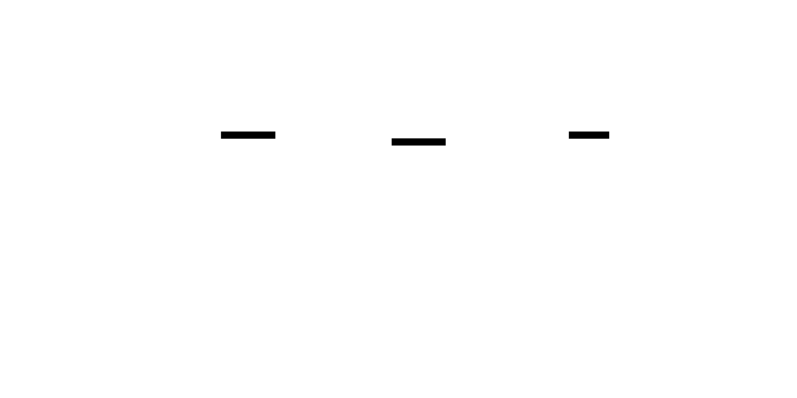

# Deployment Stamps & Geode (Cellular and Geographic Distribution)

**Aliases:** Deployment Stamp, Cell-Based Architecture, Cellular Architecture, Geode, Multi-Region Active-Active, Pods (Salesforce), Cells (AWS), Shards (Slack)
**Category:** Architecture / Scale / Operations
**Sources:**
[Microsoft Azure — Deployment Stamps pattern](https://learn.microsoft.com/en-us/azure/architecture/patterns/deployment-stamp) ·
[Microsoft Azure — Geode pattern](https://learn.microsoft.com/en-us/azure/architecture/patterns/geodes) ·
[AWS Well-Architected — Reliability Pillar, Cell-Based Architecture](https://docs.aws.amazon.com/wellarchitected/latest/reliability-pillar/use-bulkhead-architectures-for-isolation.html) ·
[AWS Builders' Library — Static stability using Availability Zones](https://aws.amazon.com/builders-library/static-stability-using-availability-zones/) ·
[Slack Engineering — *Slack's Service Mesh* and "cells" posts](https://slack.engineering/) ·
[Salesforce — Multi-tenant pods architecture](https://architect.salesforce.com/) ·
[Marc Brooker (AWS) — *Cells are the future of scaling*](https://brooker.co.za/blog/)

---

## Problem

> [!TIP]
> **ELI5.** A single deployment of your application can only get so big before something breaks: the DB is full, an outage takes everything down, you can't deploy without affecting all customers, you can't put EU customers' data in the EU. The fix is to stop growing the deployment and instead **replicate it**. Run the entire stack — web tier, DB, cache, queue, workers — as one **cell** (Microsoft calls it a "deployment stamp"; AWS calls it a "cell"; Salesforce calls it a "pod"). Assign customers to cells. To scale, add more cells. To survive an outage, lose only one cell. To serve users globally, deploy cells in different regions (this last variant is Microsoft's **Geode** pattern). The unit of scale becomes the cell, not the individual service.

The classic single-deployment architecture has well-known limits:

- **Database can't grow forever**: even with sharding, a single logical database hits operational limits.
- **Blast radius is global**: a deploy that breaks the prod cluster affects every customer.
- **No data residency**: EU customers' data must legally stay in EU (GDPR); a single US deployment can't satisfy this.
- **Latency is bounded by physics**: a Tokyo user hitting a US-East server has 150ms RTT minimum.
- **Tail risk grows with tenant count**: noisy neighbors, runaway tenants, accidental overload of shared resources affect everyone.
- **Compliance requires isolation**: financial / healthcare / government tenants may need physically separated infrastructure.

The **deployment stamp** (also: cell, pod, shard) pattern says: stop scaling the deployment, start replicating it. Each stamp is an independent instance of the full application — its own web tier, its own database, its own cache, its own queue. Tenants are assigned to specific stamps. The system grows horizontally by adding stamps, not by scaling within a stamp.

The **Geode** pattern is the geographic specialization: the same full stack deployed in multiple regions, with active-active data replication, so every user hits a nearby instance.

Both are answers to "how do you scale beyond what a single deployment can handle?" — the question every successful SaaS eventually asks.

## How it works

> [!TIP]
> **ELI5.** Replicate the entire app stack into independent "cells." Each cell holds some tenants (or some region's traffic). Add more cells to scale. Isolate failures so an outage in one cell doesn't take out others. Geode is the same idea, but each cell is in a different geographic region — with active-active replication for shared data.

### Deployment Stamps (Cells)

The structure:

Each stamp contains the *complete* application stack: web servers, app servers, databases, caches, queues, workers, monitoring. Stamps share essentially nothing — typically just a small router/directory service that maps tenants to their assigned stamp, plus organizational concerns (global identity, billing aggregation).

The flow for a request:
1. Request arrives at the **stamp router** (a small, highly available service).
2. Router looks up: "which stamp owns this tenant?"
3. Request is forwarded to that stamp.
4. Stamp processes entirely within its own infrastructure — its own DB, cache, etc.

The router is the most-critical piece (every request goes through it) and the most-replicated. It's usually a key-value lookup with aggressive caching at every layer — it's not in the data path of business logic, just routing.

**Key properties**:

- **Bounded blast radius**: a stamp outage affects only that stamp's tenants. Stamp-2 going down doesn't affect stamps 1, 3, 4.
- **Independent scaling**: add stamps when capacity demands; size each stamp for its tenant count.
- **Compliance domains**: dedicate stamps to specific compliance requirements (gov cloud stamp, healthcare stamp, EU stamp).
- **Deployment safety**: roll out new versions stamp-by-stamp; one stamp's bug doesn't crash the whole platform.
- **Performance isolation**: a noisy tenant in stamp 2 doesn't affect stamp 1's performance.
- **Right-sizing**: stamp 1 can have 3-node DB cluster; stamp 5 (with bigger tenants) can have a 9-node cluster.

**Why it works**: every shared resource is a coupling that limits scale. By eliminating shared resources (or reducing them to truly minimal routing/identity), each stamp becomes a near-independent business unit. The unit of operational concern is now the stamp, not the global system.

**Examples**:
- **Slack** has publicly described its [cellular architecture](https://slack.engineering/), where customers are grouped into cells.
- **AWS** uses cells throughout — [Route 53](https://aws.amazon.com/builders-library/), DynamoDB partitions, S3 partitions, IAM cells. Cellular design is now a published AWS pillar.
- **Salesforce** has run "pods" for over a decade — each pod a complete CRM stack hosting hundreds-to-thousands of customer orgs.
- **Microsoft Office 365** uses deployment stamps extensively (multiple "forests" per geography).
- **Shopify** organizes by "pods" of merchants on dedicated infrastructure.

### Geode (geographic distribution)

The Geode pattern is similar in shape but oriented around **physical geography**:

Each geode is a full deployment in a specific region (us-east, eu-west, ap-northeast). Users are routed by **Geo-DNS** or **Anycast** to the nearest geode. The key challenge — and what makes Geode interesting — is that geodes typically need to share data: a user's account exists globally; an inventory must be consistent globally; a chat message sent from Tokyo must reach the recipient in NYC.

This requires **active-active multi-region data replication**, which is one of the hardest problems in distributed systems:

- **CRDTs** ([page](../data/crdt.md)) for data that admits commutative merges — counters, sets, collaborative documents.
- **Conflict-free designs** where writes are partitioned by region (each user "lives in" one home region).
- **Vector clocks / version vectors** for last-writer-wins with detection.
- **Globally-distributed databases** (Spanner, CockroachDB, YugabyteDB) that provide strong consistency at the cost of cross-region latency for writes.
- **Eventual consistency** with explicit conflict resolution policies.

**Key benefits**:
- **Low latency for global users**: a Paris user hitting an EU geode has 20ms RTT instead of 150ms to US.
- **Disaster recovery**: a region outage routes users to a neighboring geode.
- **Data residency**: EU users' data stays in the EU geode.
- **Regulatory compliance**: per-region isolation supports diverse legal requirements.

**Challenges**:
- **Active-active replication is hard**. Conflict resolution, consistency vs latency trade-offs, write amplification.
- **Cross-region cost**: data transfer between regions is expensive (cloud egress fees).
- **Operational complexity**: N regions to deploy to, monitor, debug.
- **Asymmetric capacity**: traffic isn't uniform across regions; some geodes are bigger.

**Examples**:
- **DNS providers**: every major DNS provider (Cloudflare, Route 53, etc.) runs anycast geodes worldwide.
- **CDNs** ([page](../scale/cdn.md)): essentially read-only geodes for content.
- **Cosmos DB**: Azure's globally-distributed database explicitly designed around the geode model.
- **DynamoDB Global Tables**: multi-region active-active.
- **Riak, Cassandra**: built around multi-DC replication from the start.
- **Cloudflare Workers, AWS Lambda@Edge, Vercel Edge Functions**: compute geodes.

### Stamps vs Geodes — clarifying the terminology

These two patterns are related but distinct:

- **Stamp** = unit of scale; multiple stamps in the same region typically.
- **Geode** = unit of geography; one or many stamps per geography.

In practice, large systems compose both: 3 geographic regions, each with 5 stamps. Plus AZ-level isolation within each stamp. Plus database sharding within each stamp. The result is a hierarchy of isolation domains:

The composition is what gives modern hyperscale systems their resilience:

- A database **shard** isolates data-level failures.
- An AZ isolates power/network failures within a region.
- A **stamp** (cell) isolates tenant-level operational failures.
- A **geode** (region) isolates geographic-level failures and adds locality.

A tenant request flows: geode (where am I?) → stamp (which cell am I in?) → AZ (replica strategy) → shard (which partition?). Each level is a different unit of isolation, scale, and recovery.

### Sizing and tenant assignment

The hard practical questions:

- **How big should a stamp be?** Big enough to be cost-efficient (per-stamp overhead matters); small enough that one stamp's failure is tolerable. Common heuristic: a stamp should hold "thousands to tens of thousands" of small tenants, or "tens to hundreds" of large ones.
- **How are tenants assigned?** Options:
  - **Random / hash-based**: simple, fair, but a noisy tenant can affect other random tenants in its stamp.
  - **Manual / dedicated**: large customers get their own stamp (sometimes called "single-tenant" or "VIP" stamps).
  - **Geographic**: assigned by region (GDPR, latency).
  - **Tier-based**: free tier on cheap stamps, paid tiers on dedicated.
- **Can tenants be moved between stamps?** Yes — and this is the hard operational reality. Tenant migration is a real-time exercise involving DB replication, cutover, etc. Slack, Salesforce, and others have invested heavily in tenant migration tooling.

### Shuffle sharding within stamps

A clever refinement (popularized by AWS): instead of fully-dedicated stamps per tenant (expensive) or fully-shared stamps (no isolation), give each tenant a **random subset** of stamps to use. With N=100 stamps and K=2 stamps per tenant:

- Two random tenants share all K stamps only with very low probability (~1/C(100,2) ≈ 0.02%).
- A noisy tenant degrades only the K stamps it's on.
- Probability another tenant is fully co-located with it is tiny.

See [bulkhead.md — shuffle sharding](../res/bulkhead.md) for the math. This is foundational to Route 53's "horizontal" isolation.

### Deploying changes

A stamp-based architecture changes deployment strategy:

1. **Per-stamp deploys**: roll out new code stamp-by-stamp, allowing per-stamp canary observation.
2. **Bake time per stamp**: deploy to stamp 1, wait 24h, observe; then stamp 2, etc.
3. **Stamp rings**: stamps assigned to "rings" (internal/beta/GA); new code reaches them in order.
4. **Cross-stamp orchestration**: a CI/CD system that knows about stamps and can pause/abort across them (Spinnaker, Argo Rollouts with cell labels).

This is canary deployment at the stamp level — far safer than canary at the pod level, because a stamp is a real isolation domain.

### What stays global (shared services)

Not everything fits in a stamp. Some things must be cross-stamp:

- **Identity / auth**: typically a global identity service (or replicated across stamps).
- **Billing aggregation**: per-tenant usage across stamps must aggregate somewhere.
- **Customer support tooling**: must access all stamps.
- **Cross-tenant features**: collaboration across orgs requires cross-stamp coordination.
- **The stamp router itself**.

These global services become risk concentrations and must be themselves highly available — often built with their own internal cellular structure (Salesforce's auth runs in cells too).

### Trade-offs

Advantages:
- **Linear horizontal scaling** of the entire application, not just the DB.
- **Bounded blast radius** at every level.
- **Per-stamp / per-geode tuning** of cost, infrastructure, compliance.
- **Independent deployment cadence** per stamp.
- **Strong fit for regulated industries**.
- **Geographic latency improvements** (geodes).

Disadvantages:
- **Massive operational complexity**: N stamps × M geodes to provision, monitor, deploy, debug.
- **Tenant migration is hard**: moving a tenant between stamps is a real engineering project.
- **Cross-stamp queries are hard or impossible**.
- **Per-stamp overhead**: fixed cost per stamp; can dominate at small scale.
- **Active-active replication complexity** (for geodes).
- **Talent**: requires team to understand cellular thinking.

This is a pattern that **scales up** in payoff — small systems should not bother; very large multi-tenant SaaS *must*.

### Anti-patterns

- **"One giant stamp"**: defeats the pattern entirely.
- **Stamps that share databases**: now they're not really isolated.
- **No tenant migration tooling**: stamps become inflexible; tenants stuck where placed.
- **No per-stamp observability**: can't tell which stamp is unhealthy.
- **Skipping geode replication strategy**: ad-hoc cross-region data sync turns into inconsistent disasters.
- **Premature cellular design**: not every SaaS needs cells. Start without; add when you outgrow a single deployment.

---

## Variants & related patterns

| Variant | Difference |
|---|---|
| **Deployment Stamp / Cell** | Replicated full-stack unit; tenants assigned. |
| **Geode** | Geographic full-stack replication. |
| **Salesforce pods** | Specific implementation. |
| **AWS Cells** | AWS's published flavor. |
| **Slack cells** | Slack's flavor for tenant isolation. |
| **Multi-region active-active** | Geode variant. |
| **Multi-region active-passive** | Like geode but one region writes; others standby. |
| **Federated / hub-spoke** | One central + per-region; not quite geode. |
| **Single-tenant deploy** | Extreme: one stamp per customer. |
| **Shuffle sharding** | Random subset of stamps per tenant. |
| **[Sharding](../data/sharding.md)** | Data-level only; stamps include compute too. |
| **[Bulkhead](../res/bulkhead.md)** | Resource isolation; cells are the deployment-level version. |
| **[CDN](../scale/cdn.md)** | Read-only geode for static content. |

## When NOT to use

- **Small application** with one DB cluster and no scaling pressure — overhead exceeds benefit.
- **Single-tenant SaaS** — already isolated by tenant.
- **No clear isolation domain** — cells need natural sharding criteria (tenant, region).
- **Without operational maturity** — cells multiply ops complexity; team must be ready.
- **For latency where CDN suffices** — CDN is cheaper than geode for read-heavy.

---

## Real-world implementations

| Tool / Platform | Capability |
|---|---|
| **AWS** | Cell-based reference architecture; Route 53, S3, DynamoDB use cells internally. |
| **Azure** | Deployment Stamps doc; App Service slots per stamp; Cosmos DB global. |
| **GCP** | Regional deployments; Spanner multi-region. |
| **DynamoDB Global Tables** | Multi-region active-active. |
| **Cosmos DB** | Globally-distributed multi-model DB. |
| **CockroachDB / YugabyteDB** | Multi-region SQL. |
| **Cassandra / ScyllaDB** | Multi-DC replication built-in. |
| **Cloudflare Workers / Vercel Edge / AWS Lambda@Edge** | Compute geodes. |
| **Riak** | Originally designed for multi-DC. |
| **Spinnaker / Argo Rollouts** | CD that understands cells. |

## Companies / canonical uses

| Where | Use | Status |
|---|---|---|
| **Salesforce** | "Pods" architecture (each pod = full CRM stack). | ✅ Verified — Salesforce Architect docs |
| **AWS** | Cells used throughout AWS internal services (Route 53, S3, etc.). | ✅ Verified — [AWS Builders' Library](https://aws.amazon.com/builders-library/) |
| **Microsoft Office 365** | Deployment stamps; multiple "forests" per geography. | ✅ Verified — Microsoft architectural posts |
| **Slack** | Cellular architecture for blast-radius control. | ✅ Verified — Slack Engineering blog |
| **Shopify** | "Pods" of merchants on dedicated infrastructure. | ✅ Verified — Shopify Engineering blog |
| **Stripe** | Multi-region for payments compliance. | ⚠ Mentioned in talks; specifics vary |
| **Cloudflare** | Anycast geodes worldwide; every PoP runs the full Worker runtime. | ✅ Verified — Cloudflare blog |
| **Netflix** | Multi-region failover (geode-like). | ✅ Verified — Netflix Tech Blog (Chaos Kong) |
| **Microsoft Azure (Cosmos DB)** | Geode reference implementation. | ✅ Verified — Azure Cosmos DB docs |
| **Most large SaaS** | Some form of cellular architecture is universal at scale. | ✅ Industry standard |

---

## Further reading

- Microsoft Azure — Deployment Stamps pattern, Geode pattern.
- AWS Well-Architected — Cell-based architecture chapter.
- Marc Brooker (AWS Principal Engineer) — *Cells are the future of scaling* and related blog posts.
- *Architecting for Scale* (Atchison) — multi-region patterns.
- Slack Engineering blog on cells.
- Salesforce architect posts on pods.
- *Designing Data-Intensive Applications* — multi-data-center replication chapter.
- AWS re:Invent talks on cell-based architecture (most years).

---

*Diagram sources: [`../diagrams/src/deployment-stamps.d2`](../diagrams/src/deployment-stamps.d2), [`../diagrams/src/geode-pattern.d2`](../diagrams/src/geode-pattern.d2), [`../diagrams/src/cell-region-terminology.d2`](../diagrams/src/cell-region-terminology.d2).*
