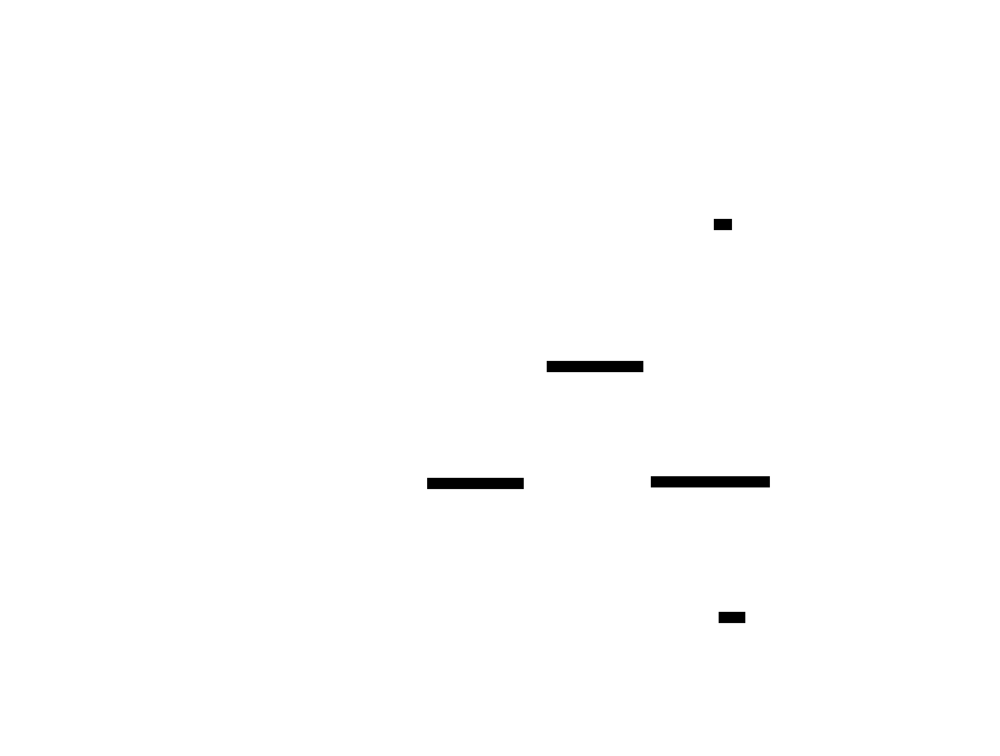

# Distributed Tracing & Correlation ID

**Aliases:** Distributed Tracing, Request Tracing, OpenTelemetry Tracing, Span Tracing, Correlation ID, Request ID, Trace Context
**Category:** Operations / Observability
**Sources:**
[microservices.io — Distributed Tracing](https://microservices.io/patterns/observability/distributed-tracing.html) ·
[microservices.io — Correlation Identifier](https://microservices.io/patterns/observability/audit-logging.html) ·
[Google — *Dapper: A Large-Scale Distributed Systems Tracing Infrastructure* (2010)](https://research.google/pubs/pub36356/) — the foundational paper ·
[W3C Trace Context specification](https://www.w3.org/TR/trace-context/) ·
[W3C Baggage specification](https://www.w3.org/TR/baggage/) ·
[OpenTelemetry documentation](https://opentelemetry.io/docs/) ·
[Jaeger documentation](https://www.jaegertracing.io/docs/) ·
*Distributed Tracing in Practice* (Parker et al., O'Reilly 2020)

---

## Problem

> [!TIP]
> **ELI5.** In a monolith, "what happened to my request?" is one log file. In a microservices system, the same request hits 20 services, 50 method calls, 3 databases, 2 message queues — across 10 hosts. The logs are scattered. Without something tying them together, you cannot answer "where did this request spend its time?" or "which downstream call failed?" or "why was this user's checkout 5 seconds slow yesterday?" **Distributed tracing** gives every request a unique ID that flows with it through every service, builds a tree of "spans" recording where time went, and lets you reconstruct exactly what happened for that one request. **Correlation ID** is the simpler ancestor — just a request-scoped ID that gets logged everywhere so you can grep across all services.

The motivating problem is microservices observability. In a monolith, a request executes within a single process; its logs sit in one file; its stack traces are local. In a microservices system:

- One user click triggers 50+ inter-service calls.
- Logs land in 20 different log streams.
- A latency spike could be in any of 30 components.
- An error in service B was caused by service A's malformed request that you can only see by correlating timestamps.
- The "one slow request out of a million" cannot be reproduced.

Google's 2010 [Dapper paper](https://research.google/pubs/pub36356/) is the foundational work. Their requirements:

- **Ubiquity**: every service participates; no manual instrumentation per request.
- **Low overhead**: tracing must not slow down production (Dapper aimed for <1% overhead).
- **Application-level transparency**: developers don't need to think about it.
- **Scalability**: traces from billions of requests need to be storable and queryable.

The paper formalized the model — **trace** (a complete request), **span** (one unit of work), **trace context** (the IDs that link spans) — that everything since has built on. Twitter's Zipkin (2012) and Uber's Jaeger (2017) were OSS implementations; OpenTracing and OpenCensus standardized APIs; **OpenTelemetry** (2019, the merger of OpenTracing + OpenCensus) is now the de facto standard.

The simpler ancestor is **correlation ID** — just propagating a request-scoped UUID through every log statement. It doesn't give you a flame graph, but it does let you answer "find me all the logs for that one bad request." In practice, the two are layered: every system needs at least correlation IDs; serious microservices need full tracing.

## How it works

> [!TIP]
> **ELI5.** The first service that touches a user request generates a unique **trace ID** (and a **span ID** for itself). It puts these in HTTP headers on every outgoing call. Every downstream service does the same — uses the trace ID it received, creates a new span ID for itself with the caller's span as parent, propagates them onward. All spans for one trace ID, gathered into a tracing backend, can be assembled into a tree showing exactly what happened. The same trace ID is logged in every log line, so logs and traces can be cross-referenced.

### Distributed tracing model

The core data model — trace, span, parent — is universal across tools:


A **trace** represents one complete request flow through the system. It has a single `trace_id` shared by all spans in that trace.

A **span** is one unit of work — an HTTP request, a database query, a function call, a message-publish. A span has:
- `span_id`: unique ID for this span.
- `parent_span_id`: the span that caused this one (null for the root).
- `trace_id`: which trace this belongs to.
- `name`: human-readable (`http.POST /orders`, `db.query users`).
- `service`: which service created it.
- `start_time` and `duration`.
- `attributes`: key-value pairs (user_id=alice, db.table=orders, http.status=200).
- `events`: timestamped logs scoped to this span (`cache miss at +12ms`).
- `status`: OK or ERROR.

The spans for one trace, assembled in a tracing UI, form a tree (or "waterfall" / "flame graph") that visually shows:

- Where time went (the long bars).
- What was called (the structure).
- What failed (red spans).
- What was parallel vs sequential (overlapping bars).

A glance answers "this checkout took 180ms because Stripe took 85ms" without reading any logs.

### Context propagation — the hard part

The mechanism that makes the trace tree possible is **trace context propagation**: every service that receives a request must extract the caller's trace context, and every outgoing call must include it.

The W3C standardized this in [Trace Context](https://www.w3.org/TR/trace-context/) (2020). Two HTTP headers:

```
traceparent: 00-0af7651916cd43dd8448eb211c80319c-b7ad6b7169203331-01
              |       |                                 |              |
              |       trace_id (16 bytes hex)           |              |
              |                                         span_id (8 bytes hex)
              version                                                  flags (e.g. sampled)

tracestate: vendor1=val1,vendor2=val2
            (vendor-specific extras)
```

The propagation pattern:



The rule for every service:
1. If incoming request has `traceparent` → use the trace_id; create a new span_id with that span as parent.
2. Otherwise → generate a new trace_id and root span.
3. On every outgoing call (HTTP, gRPC, Kafka publish, async job enqueue) → inject `traceparent` with the current span_id.

For asynchronous flows (queue producer/consumer), propagation goes via message attributes. Consumer creates a span **linked** to the producer's span (rather than parent-child, since the producer's span has long since ended).

W3C also defines **Baggage** — a parallel header for application-level context (`baggage: user_id=alice,tenant_id=acme,deployment=us-east`) that travels alongside the trace context. Useful for putting user/tenant/region in every downstream span and log.

OpenTelemetry SDKs handle all of this automatically — instrumentation libraries for HTTP clients/servers, gRPC, Kafka, database drivers extract and inject headers without explicit code.

### Correlation ID — the lighter cousin

Before full tracing, the simpler pattern is the **correlation ID**: a unique ID per request, propagated and logged everywhere:


The flow:

1. API gateway generates `X-Request-ID: req-7f3a-bc12` (UUID) — or uses one from the client if present.
2. Every service reads `X-Request-ID` from incoming request.
3. Every service puts it in its **logging context** (MDC in Java, contextvar in Python, async_hooks in Node, ThreadLocal-style):
   ```
   2024-01-15T10:23:45 INFO [req-7f3a-bc12] checkout: user=alice
   2024-01-15T10:23:46 ERROR [req-7f3a-bc12] payment: stripe timeout
   ```
4. Every outgoing call propagates `X-Request-ID`.
5. Logs from every service are aggregated; grepping for `req-7f3a-bc12` shows the full activity for that one user request.

This is dramatically less powerful than distributed tracing (no spans, no waterfall, no flame graph) but also dramatically simpler. **Every system, even monolithic ones, should have a correlation ID.** It's the minimum viable observability primitive.

In OpenTelemetry-based systems, the trace_id often *is* the correlation ID — log libraries can be configured to include the current trace_id automatically. This gives you logs ↔ traces cross-reference for free.

### The three pillars (logs, metrics, traces) — and exemplars

Modern observability splits telemetry into three pillars:

- **Logs**: discrete events with messages and attributes.
- **Metrics**: numeric time-series (latency, error rate, throughput).
- **Traces**: structured request flows.

Each is queried differently and used for different things. The power comes from **cross-references**:

- **Log → trace**: log line includes trace_id; click → see full trace.
- **Trace → log**: span shows its log events; or filter logs by trace_id.
- **Metric → trace** ("exemplars"): a high-latency point in a histogram links to a representative trace that caused it.
- **Trace → metric**: aggregate spans into RED metrics (Request rate, Error rate, Duration).

OpenTelemetry unifies all three under one SDK and one set of standards (W3C Trace Context, OpenTelemetry Protocol "OTLP"). The same `trace_id` flows through logs, metrics exemplars, and traces — so "investigate that user's slow checkout" becomes a click-through journey, not three separate queries.

### Sampling — the cost question

A high-traffic service can't store every span. Dapper's seminal observation: you don't need to. A small percentage of traces is enough to characterize behavior and find rare problems. Common strategies:

- **Head-based sampling**: decide at the start (e.g., the gateway) whether to trace this request, propagate that decision in the `traceparent` flags. Simple; consistent (whole trace is sampled or not).
- **Tail-based sampling**: collect all spans temporarily; decide post-hoc to keep "interesting" ones (errors, slow, anomalous). Needs intermediate storage; more useful for rare-event investigation.
- **Adaptive sampling**: rate adjusts based on traffic (always sample low-traffic endpoints; sample 1% of high-traffic ones).
- **Per-endpoint or per-user**: sample more for VIP customers, less for synthetic monitors.

Typical settings: 1-10% head-based for high-traffic services; 100% for error/slow traces via tail-based; 100% in dev. The right answer depends on traffic and storage budget.

### Tracing in practice — what you actually get

A tracing UI typically lets you:

- **Search for traces**: by service, time range, attribute (user_id, http.status), latency threshold.
- **View one trace**: waterfall / flame graph; see span tree, durations, attributes, logs.
- **Service map**: derived from traces; auto-generated map of which services call which, with traffic and error rates.
- **Aggregate latency**: percentiles per service / per endpoint, derived from spans.
- **Error tracking**: spans tagged with errors aggregated.
- **Comparative analysis**: "show me slow traces vs fast traces for /checkout" — what differs?
- **Anomaly detection**: traces that look unusual (Honeycomb's strength).

Major backends: Jaeger (OSS), Tempo (Grafana, OSS), Honeycomb, Datadog APM, New Relic, Dynatrace, Splunk APM, AWS X-Ray, Azure Monitor, GCP Cloud Trace, Lightstep (now ServiceNow), Elastic APM.

### Async flows — links, not parents

A common confusion: spans across queues. The producer enqueues a message; the consumer processes it 30 seconds later. The producer's span has *ended* by then. So the consumer's span is **linked** (not parent-child) to the producer's span:

- "Parent" implies temporal containment (parent span lives while child runs).
- "Link" is a weaker relation: "I am causally related to this other span."

OpenTelemetry models both. UIs typically render links as dashed lines crossing trace boundaries.

### Costs and trade-offs

Advantages:
- **Debug requests, not just systems**: trace a single user's flow.
- **Visual latency analysis**: instantly see where time went.
- **Cross-service problem detection**: errors caused by upstream behavior.
- **Service map**: automatic architecture documentation.
- **RED metrics for free**: aggregate from spans.
- **Long-tail debugging**: 1% slowest requests are findable.

Disadvantages:
- **Storage cost**: even sampled at 1%, traces are voluminous.
- **Instrumentation work**: OpenTelemetry helps but still needs adoption per service.
- **Context propagation discipline**: any service that drops the header breaks the trace.
- **Vendor lock-in risk**: until OpenTelemetry, every backend had proprietary SDKs.
- **Overhead**: small but non-zero per request.
- **Privacy/security**: spans carry attributes that may include user data — careful redaction needed.

### Anti-patterns

- **Logging without correlation ID**: makes microservices logs nearly useless.
- **Manual `print(trace_id)` everywhere**: use a logging library that injects automatically.
- **Tracing only happy paths**: error paths are exactly what you most need to see.
- **Storing too much data per span**: bloat that costs $$ and slows queries.
- **Not propagating across async boundaries**: queue consumers become invisible.
- **Sampling errors away**: tail-based sampling should retain all errors.
- **Vendor-specific SDKs**: lock you in; use OpenTelemetry.
- **Tracing without alerting on tracing system itself**: if the trace pipeline is broken, you don't know.

---

## Variants & related patterns

| Variant | Difference |
|---|---|
| **Correlation ID** | Simple per-request UUID logged everywhere. |
| **Distributed Tracing (full)** | Trace + spans + tree; flame graphs. |
| **Request Tracing (one-layer)** | Single service's tracing only; pre-microservices. |
| **OpenTelemetry** | Vendor-neutral standard; logs+metrics+traces. |
| **W3C Trace Context + Baggage** | Standard propagation headers. |
| **Head-based sampling** | Decide at start whether to sample. |
| **Tail-based sampling** | Decide post-hoc; keeps interesting traces. |
| **Service map** | Derived view of inter-service traffic. |
| **RED metrics from traces** | Rate, Errors, Duration aggregations. |
| **[Log Aggregation](log-aggregation-metrics.md)** | Companion: logs need correlation IDs to be useful. |
| **[Health Endpoint Monitoring](log-aggregation-metrics.md)** | Companion: alerts then dive into traces. |
| **[Audit Logging](audit-log.md)** | Specialized: who did what when, for compliance. |

## When NOT to use

- **Monolith with no inter-service calls** — single-process logging usually suffices (still use correlation IDs!).
- **Without sampling discipline** — trace storage will dominate cost.
- **Without OpenTelemetry or W3C** — proprietary lock-in risk.
- **For PII-sensitive systems** without strong attribute filtering.
- **As a substitute for metrics** — they're complementary, not interchangeable.

---

## Real-world implementations

| Tool | Notes |
|---|---|
| **OpenTelemetry** | CNCF; the standard SDK + protocol (OTLP). |
| **Jaeger** | CNCF; Uber-originated; OSS backend. |
| **Tempo** | Grafana Labs; OSS backend. |
| **Zipkin** | Twitter-originated; older but still used. |
| **Honeycomb** | Strong on high-cardinality / observability 2.0. |
| **Datadog APM** | Commercial; broad integration. |
| **New Relic** | Commercial; APM market leader. |
| **Dynatrace** | Commercial; auto-instrumentation. |
| **Splunk APM (SignalFx)** | Commercial. |
| **AWS X-Ray** | AWS-native. |
| **Azure Monitor / App Insights** | Azure-native. |
| **GCP Cloud Trace** | GCP-native. |
| **Elastic APM** | Open-source; ELK stack. |
| **Lightstep (ServiceNow)** | Commercial; built by Dapper authors. |

## Companies / canonical uses

| Where | Use | Status |
|---|---|---|
| **Google** | Dapper — the foundational paper (2010). | ✅ Verified — [Dapper paper](https://research.google/pubs/pub36356/) |
| **Twitter / X** | Zipkin (open-sourced 2012). | ✅ Verified — Twitter Engineering blog |
| **Uber** | Jaeger (open-sourced 2017). | ✅ Verified — Uber Engineering blog |
| **Facebook / Meta** | Canopy and earlier internal tracers. | ✅ Verified — Canopy paper (SOSP 2017) |
| **Netflix** | Built tracing into Spinnaker / internal tools. | ✅ Verified — Netflix Tech Blog |
| **Lyft** | Envoy emits trace data natively. | ✅ Verified — Envoy/Lyft engineering |
| **Stripe** | Heavy tracing for payment debugging. | ✅ Verified — Stripe Engineering blog |
| **AWS, GCP, Azure** | Built tracing into all cloud platforms. | ✅ Verified — vendor docs |
| **OpenTelemetry adopters** | Nearly every modern microservices org. | ✅ Industry standard |

---

## Further reading

- *Dapper* paper (Google, 2010) — the foundational work.
- *Canopy* paper (Facebook, SOSP 2017) — facebook-scale tracing design.
- *Distributed Tracing in Practice* (Parker, Spoonhower, Mace, Isaacs, Bogard — O'Reilly 2020).
- OpenTelemetry documentation — start here for hands-on.
- W3C Trace Context and Baggage specifications.
- *Observability Engineering* (Majors, Fong-Jones, Miranda) — observability 2.0 perspective.
- *Cloud Native Observability* (Hidalgo).
- Honeycomb's blog and Charity Majors's writing on observability 2.0.
- Cindy Sridharan's writing on distributed systems observability (medium.com/@copyconstruct).

---

*Diagram sources: [`../diagrams/src/distributed-tracing.d2`](../diagrams/src/distributed-tracing.d2), [`../diagrams/src/context-propagation.d2`](../diagrams/src/context-propagation.d2), [`../diagrams/src/correlation-id.d2`](../diagrams/src/correlation-id.d2).*
