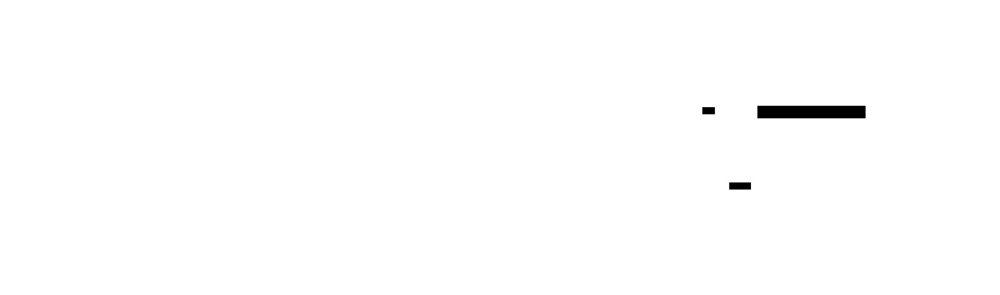

# Backpressure

**Aliases:** Flow Control, Push-back, Producer Throttling
**Category:** Resilience
**Sources:**
[Reactive Streams specification](https://www.reactive-streams.org/) ·
[Microsoft Azure — Queue-Based Load Leveling pattern (closely related)](https://learn.microsoft.com/en-us/azure/architecture/patterns/queue-based-load-leveling) ·
[RxJava Backpressure documentation](https://github.com/ReactiveX/RxJava/wiki/Backpressure) ·
[Project Reactor documentation](https://projectreactor.io/docs/core/release/reference/) ·
[gRPC / HTTP/2 flow control](https://grpc.io/docs/guides/performance/) ·
*Designing Data-Intensive Applications* (Kleppmann), Ch 11 ·
Michael T. Nygard, *Release It!* (2nd ed.), Ch on Stability Patterns

---

## Problem

> [!TIP]
> **ELI5.** A pipe with two ends: a producer pushing data in, a consumer reading data out. If the producer is faster than the consumer, the buffer between them fills up. Without **backpressure** (the consumer telling the producer "slow down"), the buffer grows without bound until memory is exhausted, requests time out, or the system collapses. Backpressure is the universal mechanism for matching producer rate to consumer capacity — implemented at many layers, from TCP flow control to Kafka consumer groups to React-style UI rendering.

The setup is universal in any producer/consumer system:

- **Stream processing**: Kafka producer fast, consumer slow → consumer lag grows.
- **Async messaging**: HTTP gateway feeds a worker queue; queue grows when workers are saturated.
- **Microservices**: service A calls service B at high QPS; B can't handle the rate.
- **Logs and metrics**: app emits 100K events/sec, ingest pipeline handles 50K → drops or queue blowup.
- **UI rendering**: data arrives faster than the UI can render frames.
- **Networking**: server sends data faster than client can receive.
- **ETL / data pipelines**: source produces faster than sink can write.

Without backpressure, the result is one of three bad outcomes:

1. **Unbounded queue → OOM**: in-memory queue grows until the process is killed.
2. **Latency cascade**: backed-up queue means each event waits longer; eventually upstream timeouts fire; retries pile on; total system load *increases* under stress.
3. **Silent drop**: implicit drops without coordination → data loss without anyone knowing.

The naive view ("just make the queue bigger") is always wrong long-term. A bigger queue just means OOM happens later, and latency grows linearly with queue depth. The real fix is to **propagate the slow-consumer signal back to the producer** so the producer slows down (or sheds load, or backs off) to match the consumer's rate.

This is **backpressure**: the act of pushing back against an upstream producer when downstream capacity is saturated. It's universal — TCP has it (the receive window), HTTP/2 has it (stream flow control), Reactive Streams formalized it, and every well-engineered pipeline has it at multiple layers.

## How it works

> [!TIP]
> **ELI5.** Make the buffer bounded. When it's full, the producer must either (a) wait for space, (b) drop messages, or (c) signal back to its own upstream. Multiple specific mechanisms exist (blocking send, pull-based flow, credit-based windows, AIMD adaptive rate, retry-with-backoff) but the principle is the same: never let buffers grow unboundedly.

The general picture:



### The six mechanisms

There are several concrete ways to implement backpressure; most systems use a combination:


#### 1. Blocking send (the simplest)

Producer calls `queue.put(item)`. If the queue is full, the call **blocks** (or async-awaits) until space is available.

```go
ch := make(chan int, 100)   // bounded channel, buffer 100
ch <- value                   // blocks if buffer is full
```

```java
BlockingQueue<Item> q = new ArrayBlockingQueue<>(100);
q.put(item);                 // blocks if full
```

```rust
let (tx, rx) = std::sync::mpsc::sync_channel(100);
tx.send(item)?;              // blocks if buffer full
```

Natural in Go channels, Java `BlockingQueue`, Rust `sync_channel`. Simple, correct, couples producer rate to consumer rate automatically.

Caveat: if the producer is the response path of a synchronous HTTP request, blocking is bad — you're holding up an HTTP thread. Combine with timeouts.

#### 2. Drop / load shed

When queue is full, drop messages (or reject incoming requests with HTTP 503).

```python
try:
    queue.put_nowait(item)
except queue.Full:
    metrics.dropped += 1
    # ... or return 503 to caller
```

You lose some work; you protect the system. Variants:
- **Tail drop**: drop newest arrivals.
- **Head drop**: drop oldest queued items (often better — those are most stale).
- **Random drop**: drop a random item.
- **Prioritized drop**: drop low-priority first; keep critical.

Best for stateless requests that callers can retry. Standard in HTTP gateways under overload (return 503/429).

#### 3. Pull-based flow (consumer drives)

Producer doesn't push at will. Consumer requests N items at a time. Producer can never send more than the consumer asked for.

```java
// Reactive Streams: subscriber controls flow via request(n)
publisher.subscribe(new Subscriber<>() {
    public void onSubscribe(Subscription s) {
        s.request(10);   // I can handle 10 items
    }
    public void onNext(Item item) {
        process(item);
        s.request(1);    // ready for one more
    }
});
```

Used by:
- **Reactive Streams** spec (`request(n)` signal).
- **Kafka consumer** (`poll()` is pull-based; consumer chooses its own pace).
- **ReactiveX** (RxJava with backpressure strategies).
- **Project Reactor** (Mono/Flux).
- **RSocket** (request-N flow control).
- **gRPC streaming** with manual flow control.

Producer literally cannot overrun consumer. The most "correct" form of backpressure.

#### 4. Credit-based / window flow control

Consumer grants "credits" (a sliding window) to producer. Producer can send up to its current credit; consumer replenishes credits as it processes.

This is exactly what **TCP** does: receiver advertises a window size (how much more it can buffer); sender stays within that window. As receiver drains its buffer, it advertises a larger window.

Used by:
- **TCP receive window** — the classic.
- **HTTP/2 stream flow control** — per-stream windows.
- **gRPC** — built on HTTP/2 windows.
- **Reactive Streams** — `request(n)` is essentially a credit grant.
- **Kafka** — fetch size and max bytes are window-like.

Allows pipelining (multiple in-flight messages) while bounding consumer buffer use.

#### 5. AIMD (additive-increase / multiplicative-decrease)

Producer adjusts its rate based on observed signals:
- **Success** → increase rate slowly (e.g., +1 per RTT).
- **Failure / timeout / 503** → cut rate sharply (e.g., halve).

```python
class AIMDRateLimiter:
    def __init__(self):
        self.rate = 100  # requests/sec
    def on_success(self):
        self.rate += 1
    def on_failure(self):
        self.rate /= 2
```

Used by:
- **TCP congestion control** — the original AIMD application.
- **AWS SDK adaptive retry** — adaptive rate per service.
- **Modern client-side rate limiting**.

The behavior naturally converges to a sustainable rate without explicit coordination. The downside: it requires failure signals to learn the limit (which is wasteful unless rare).

#### 6. Retry with exponential backoff + jitter

When producer gets pushed back (503, 429, timeout), it waits before retrying. Each retry waits longer (exponential) with random jitter added (to prevent synchronized retry herds):

```python
delay = min(60, base * 2**attempt) + random.uniform(0, jitter)
```

Not exactly backpressure per se — it's the complementary client-side behavior to backpressure signals. Required for any system where clients see push-back.

The **jitter** is critical: without it, all clients retry at exactly the same time after a failure (because they all back off the same amount), creating a synchronized retry herd that re-overloads the system. AWS Architecture Blog has classic content on this.

### Backpressure at different layers

Real systems have backpressure at multiple layers — each catching what the others can't:

| Layer | Mechanism |
|---|---|
| TCP | Receive window, congestion control |
| HTTP/2 | Per-stream flow control |
| gRPC | HTTP/2 windows + application-level credits |
| Message broker (Kafka) | Bounded topic config; consumer poll() |
| Bounded in-memory queue | Blocking put or drop |
| Application | Throttling middleware, 429/503 responses |
| Client | Retry with backoff, AIMD |
| UI framework | Drop frames, request-animation-frame, virtual scrolling |

The goal is **defense in depth**: if any layer's backpressure fails, the next layer catches it.

### Queue-based load leveling

A related Microsoft pattern: **Queue-Based Load Leveling**. Insert a queue between high-rate producer and low-capacity consumer. The queue absorbs bursts; the consumer drains at its own pace. This is a form of backpressure where the *queue depth itself* signals load — you monitor queue depth and either:
- Auto-scale consumers when depth grows.
- Reject inbound when depth exceeds threshold.
- Apply backpressure to the producer when queue is high.

This is the foundation of every async-job system: web workers feeding background workers via Redis/SQS/RabbitMQ.

### Backpressure vs queueing

A subtle distinction: a **bounded queue with blocking** is backpressure (producer slows). A **bounded queue with drop** is load shedding. An **unbounded queue** is neither — it's just deferred OOM.

Best practice: every queue should be bounded, and you should choose explicitly whether full → block (backpressure) or full → drop (shed).

### How to recognize missing backpressure

Common symptoms:
- **Latency grows under load** even though throughput is steady. Almost always queue depth growing.
- **Memory grows under load.** Same — usually queue buffers.
- **Timeouts firing far downstream** for reasons unrelated to the failing component.
- **Retry storms**: client retries pile on, total load increases under stress instead of decreasing.
- **Cascading timeouts**: A times out on B; B was actually fine, just queued waiting on C.

Add bounded queues + explicit backpressure / load shedding policy → these go away.

### Real-world failure modes

The infamous "death spiral" failure mode:

1. Load increases slightly.
2. Queues fill; latency grows.
3. Upstream timeouts fire on slow requests.
4. Clients retry (often with no backoff).
5. Total load increases (original requests still in queue + retries).
6. Queues fill faster; more timeouts; more retries.
7. System effectively dead under the load it could have handled if it didn't death-spiral.

Backpressure (server returns 503 immediately when overloaded) + jittered exponential backoff (client doesn't retry-storm) is the cure. Almost every production incident postmortem has this story somewhere.

### Trade-offs

Advantages:
- **Bounded memory** under load.
- **Bounded latency** — no unbounded queueing.
- **Graceful degradation** instead of total collapse.
- **Predictable behavior** at limit.
- **Forces designers to think about capacity** instead of hoping it works.

Disadvantages:
- **Visible failures** — backpressure means some requests fail; not seamless.
- **Complexity** — more knobs, more failure modes to understand.
- **Coordination** — fully distributed backpressure (across many services) is hard.
- **Bursty workloads** — backpressure can be too aggressive on legit bursts.

Tuning is a real engineering effort: queue sizes, drop thresholds, AIMD parameters, retry policies — all need to be measured and adjusted.

### Compared to alternatives

- **Just-make-it-bigger**: bigger pools, bigger queues, more compute. Postpones the problem; doesn't fix the principle.
- **Async I/O alone**: removes thread bottleneck but doesn't solve buffer growth.
- **Auto-scaling**: helps with sustained load but is too slow for bursts; backpressure complements it.
- **Rate limiting only at entry** ([Throttling](throttling.md)): bounds inbound but doesn't propagate slow-downstream signals.

The best resilient systems combine: rate limit at entry + bounded queues with backpressure + bulkhead per dependency + circuit breakers on failing dependencies + auto-scaling for sustained load.

---

## Variants & related patterns

| Variant | Difference |
|---|---|
| **Blocking send** | Producer waits when buffer full. |
| **Drop / load shed** | Reject excess load. |
| **Pull-based flow** | Consumer drives the rate. |
| **Credit-based / window** | Sliding window of allowed in-flight items. |
| **AIMD adaptive rate** | Self-tunes based on success/failure. |
| **Exponential backoff + jitter** | Client-side retry behavior. |
| **Bounded queue** | Foundational requirement. |
| **Queue-based load leveling** | Insert queue between asymmetric components. |
| **[Bulkhead](bulkhead.md)** | Per-dependency resource isolation. |
| **[Circuit breaker](circuit-breaker.md)** | Stop sending when downstream fails. |
| **[Throttling / rate limiting](throttling.md)** | Bound inbound rate. |

## When NOT to use

- **Trivial workload** without queue buildup — overhead unnecessary.
- **Hard real-time** where drop semantics are unclear.
- **When all components have identical capacity** and load is stable — rare in practice.
- **When you can't measure** queue depth, latency, error rates — backpressure tuning needs observability.

---

## Real-world implementations

| Layer / Tool | Backpressure type |
|---|---|
| **TCP** | Receive window, congestion control |
| **HTTP/2** | Stream flow control |
| **gRPC** | HTTP/2 + manual flow control |
| **RSocket** | Request-N flow control |
| **Reactive Streams** (Java) | request(n) protocol |
| **Project Reactor, RxJava** | Backpressure operators |
| **Akka Streams** | Built-in flow control |
| **Kafka consumer** | Pull-based poll() |
| **Spark Streaming, Flink** | Built-in flow control |
| **Node.js streams** | Highwater mark + pause/resume |
| **Go channels** | Blocking sends/receives |
| **Rust Tokio mpsc** | Bounded channels |
| **AWS SDK adaptive retry** | AIMD |
| **Envoy** | Connection / request limits per upstream |
| **NGINX / HAProxy** | Backend connection limits, queueing |
| **AWS SQS / Azure Service Bus / Google Pub/Sub** | Visibility timeout + bounded long polling |

## Companies / canonical uses

| Where | Use | Status |
|---|---|---|
| **Netflix** | Hystrix patterns + Reactor extensively for backpressure across microservices. | ✅ Verified — Netflix Tech Blog |
| **LinkedIn** | Kafka + bounded queues + flow control at scale. | ✅ Verified — Kafka origin |
| **Lyft** | Envoy mesh with built-in backpressure. | ✅ Verified — Lyft Engineering blog (Envoy creators) |
| **Uber** | Cherami, internal messaging systems with backpressure. | ✅ Verified — Uber Engineering blog |
| **AWS** | Backpressure at every layer of every service; explicit design tenet. | ✅ Verified — [AWS Builders' Library](https://aws.amazon.com/builders-library/) |
| **Google** | SRE practices include load shedding / backpressure as standard. | ✅ Verified — SRE book |
| **Stripe** | API rate limits + 429/Retry-After + adaptive client retry. | ✅ Verified — Stripe Engineering blog |
| **Reactive Streams adopters (RxJava, Akka, Reactor)** | Specifically designed around backpressure. | ✅ Verified — Reactive Streams specification |
| **Most modern stream processors** | Backpressure built-in (Flink, Spark, Kafka Streams). | ✅ Industry standard |

---

## Further reading

- Reactive Streams specification — short and worth reading in full.
- *Designing Data-Intensive Applications* (Kleppmann), Ch 11 — stream processing context.
- Michael Nygard, *Release It!* (2nd ed.) — overload patterns.
- *Site Reliability Engineering* (Google SRE book) — load shedding chapter.
- AWS Builders' Library — load shedding articles.
- Marc Brooker's blog (AWS Principal Engineer) — many posts on retry, backoff, congestion.
- Project Reactor documentation — practical Java backpressure.
- *Linux TCP/IP Architecture* — for how TCP does flow control.

---

*Diagram sources: [`../diagrams/src/backpressure.d2`](../diagrams/src/backpressure.d2), [`../diagrams/src/backpressure-mechanisms.d2`](../diagrams/src/backpressure-mechanisms.d2).*
