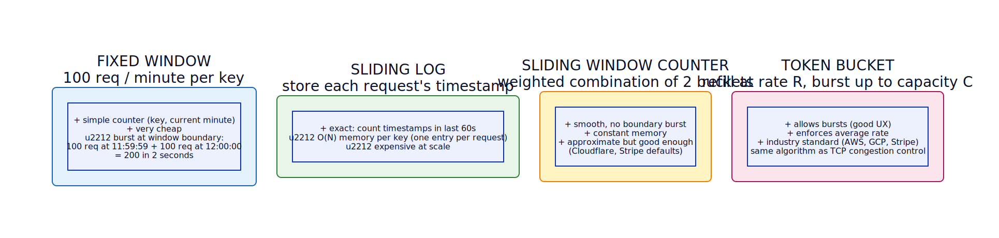

# Throttling / Rate Limiting

**Aliases:** Rate Limiter, API Quota, Throttling, Traffic Shaping
**Category:** Resilience
**Sources:**
[Microsoft Azure](https://learn.microsoft.com/en-us/azure/architecture/patterns/throttling) ·
[Neo Kim](https://systemdesign.one/system-design-interview-cheatsheet/) ·
[ByteByteGo](https://github.com/ByteByteGoHq/system-design-101)

---

## Problem

> [!TIP]
> **ELI5.** The all-you-can-eat buffet works only as long as people behave. If one guest brings a moving truck and tries to load the entire buffet into it, no one else gets to eat. The restaurant has to set limits — "take what you'll eat, come back if you want more."

A service exposes APIs to many clients, but its capacity is finite. When one client (or a swarm of them) sends traffic far above their fair share — by accident (a buggy retry loop), by misuse (scraping), or by malice (DDoS / credential-stuffing) — three bad things happen. **Other clients are starved**: the noisy neighbor's traffic crowds out everyone else. **The service itself can be brought down**: load it can't handle leads to timeouts, errors, cascading failures, or autoscale-cost blowouts. **Backend dependencies are overwhelmed**: every unfiltered request flows downstream to your databases, queues, and third-party APIs you pay per-call for.

You need to enforce **upper bounds** on how much each caller can demand, and you need to do it cheaply — the rate limiter is in front of every request, so it must add near-zero latency and scale linearly with traffic.

## How it works

> [!TIP]
> **ELI5.** Put a doorman in front of the service. The doorman has a rule for each visitor ("Alice can come in 100 times per minute") and a counter that resets periodically. When someone exceeds their allotment, the doorman politely refuses ("Sorry, come back in 30 seconds") instead of letting them in.

A rate limiter sits **in front of the protected API**, intercepting every request. For each request, it identifies the caller (by API key, user ID, IP address, or some combination), looks up the applicable policy, checks whether the caller's recent usage is within budget, and decides: forward to the backend, or reject with `HTTP 429 Too Many Requests` (often with a `Retry-After` header indicating when to try again).

In the architecture above, requests from many clients — free-tier users, paid users, and abusers — converge on the **Rate Limiter** (orange). Inside, the limiter performs a small pipeline: **identify** the caller, **look up** their policy (free tier: 100 req/min; paid tier: 10,000 req/min; abuser flagged: blocked), **check the bucket** in the **Counter Store** (typically Redis or memcached because the check has to be sub-millisecond at scale), and **decide**. Allowed requests forward to the **API Service** (green); rejected requests get a `429` with `Retry-After: 30s` (red dashed). The abuser in the diagram is consistently rejected, while legitimate clients flow through.

In a distributed deployment with many API frontends, the **Counter Store is shared** so that a client's "100 requests this minute" is counted across all frontends — otherwise the limit becomes "100 requests per frontend per minute," which is useless. Redis is the standard choice; its `INCR` + `EXPIRE` pair is atomic and fast. At very high scales (millions of QPS), this central store becomes a bottleneck, and limiters move to **probabilistic / approximate** counting (each frontend allows up to its share, occasionally syncing) or to **token-bucket allocations** (each frontend gets tokens refilled from a central pool).

The interesting design choice is the **counting algorithm**, each with different trade-offs:

**Fixed window** is the simplest: one counter per `(key, current minute)`. Cheap and easy, but it suffers a **boundary burst**: a client can send 100 requests at 11:59:59 and another 100 at 12:00:00, sending 200 in two seconds without exceeding any minute's quota. For per-second limits at the API edge this is usually fine; for slower-tier user APIs it's noticeable.

**Sliding log** is the most accurate: store the timestamp of each request, count how many in the last 60 seconds. No boundary burst. But it stores one entry per request — at millions of requests per second per popular key, the memory cost is catastrophic. Used only for low-traffic, high-precision tiers.

**Sliding window counter** is the production default at most large companies. It tracks two adjacent fixed-window buckets and computes a weighted approximation: `count_in_window ≈ previous_bucket × overlap_fraction + current_bucket`. Memory cost is constant (two counters per key), it has no boundary burst, and the approximation is close enough to exact for almost all uses. Cloudflare's *How we built rate limiting capable of scaling to millions of domains* describes this approach.

**Token bucket** is conceptually different: instead of counting requests, you model a bucket that holds up to **C** tokens, refilled at rate **R** tokens per second. Each request consumes one token; if the bucket is empty, the request is rejected (or queued). The brilliance is that it naturally allows **bursts**: if a client has been quiet for a while, the bucket is full and they can spike up to **C** requests immediately, then settle to the steady rate **R**. This matches real user behavior (humans don't request at a constant rate) and is the standard for almost every major cloud API: AWS, Google Cloud, Stripe, and most others. The closely related **leaky bucket** is the same idea expressed as a queue: requests fill the bucket, leak out at a constant rate; if the bucket overflows, requests are dropped.

Beyond the algorithm, the operational details matter. **Headers**: respond with `X-RateLimit-Limit`, `X-RateLimit-Remaining`, `X-RateLimit-Reset` so clients can self-throttle. **Tiered policies**: different limits for free vs paid users, different limits per endpoint (login is stricter than read). **Burst vs sustained limits**: often two layered limits — "no more than 1000 in any minute *and* no more than 30000 in any hour." **Reject vs queue**: simple APIs reject; some systems queue with backpressure (especially for write-heavy workloads where you'd rather slow the client than lose work).

The relationship to the **[Circuit Breaker](circuit-breaker.md)** is sometimes confused. Rate limiting protects *the service from its clients* (server-side, by quota); circuit breakers protect *clients from a failing service* (client-side, by detection). They're opposite-direction patterns aimed at the same goal — system stability — and both are essential.

---

## Variants & related patterns

| Variant | Difference |
|---|---|
| **Fixed window** | Simple counter per window. Cheap; suffers boundary burst. |
| **Sliding log** | Stores timestamps. Exact but expensive. |
| **Sliding window counter** | Two-bucket weighted approximation. Production default. |
| **Token bucket** | Continuously refilled bucket; allows bursts. Industry standard. |
| **Leaky bucket** | Queue draining at constant rate. Equivalent to token bucket from the client's view but enforces smooth output rate. |
| **Concurrency limit** | Limit by *in-flight* requests, not request rate. Used in libraries like Netflix's concurrency-limits. |
| **Adaptive rate limiting** | Limits adjust based on downstream health (AIMD; same approach as TCP congestion control). |
| **Per-endpoint policies** | Login: 5/min, search: 30/min, read: 1000/min — different limits per route. |
| **Backpressure** | Downstream signals upstream to slow down; complements rate limiting at the system level. |

## When NOT to use

- **Internal services with trusted callers and bounded fan-out.** A timeout + circuit breaker + auto-scale combo is often enough; the rate-limiter ceremony adds latency for no gain.
- **When fairness matters more than per-caller limits.** A weighted-fair-queueing scheduler may serve you better than rejection.
- **For DDoS protection alone.** Rate limiting at the app layer is far too late — by the time a flood reaches your service, your bandwidth is already saturated. Push DDoS mitigation to the CDN/edge layer.

---

## Real-world implementations

| Tool | Notes |
|---|---|
| **NGINX `limit_req_zone`** | Classic shared-memory token-bucket limiter; widely deployed at the proxy layer. |
| **Envoy rate-limit filter** | Calls an external rate-limit service over gRPC; Envoy-native. |
| **Cloudflare Rate Limiting** | Edge-layer limiter applied per zone; sliding window counter at planetary scale. |
| **Kong rate-limiting plugin** | Sliding window / Redis-backed; per-API-key. |
| **AWS API Gateway throttling** | Token-bucket per-API and per-key throttle. |
| **Redis cell / Redis-cell module** | Generic cell-rate algorithm (sliding-window-like) implemented in Redis. |
| **Stripe `redis-cell` + custom limiters** | Stripe's published their token-bucket-based system. |
| **Netflix concurrency-limits** | Library for *concurrency*-based limiting using TCP-inspired AIMD. |
| **resilience4j RateLimiter, Polly RateLimit, gobreaker rate-limit** | Library-level limiters for in-process throttling. |

## Companies using it (notable examples)

| Company | Use | Status |
|---|---|---|
| **Cloudflare** | Operates planet-scale sliding-window rate limiting on their edge. Wrote canonical blog post on it. | ✅ Verified — [*How we built rate limiting capable of scaling to millions of domains*](https://blog.cloudflare.com/counting-things-a-lot-of-different-things/) |
| **Stripe** | Documented their token-bucket limiter design. | ✅ Verified — [*Scaling your API with rate limiters*, Stripe Engineering](https://stripe.com/blog/rate-limiters) |
| **GitHub** | API rate limits (5000/hr authenticated, 60/hr unauthenticated) are documented and visible in every response header. | ✅ Verified — [GitHub REST API rate-limit docs](https://docs.github.com/en/rest/overview/resources-in-the-rest-api#rate-limiting) |
| **Twitter / X** | Tweet-API rate limits per consumer key are public; central to the API economics. | ✅ Verified — [X API limits docs](https://developer.x.com/en/docs/twitter-api/rate-limits) |
| **AWS, Google Cloud, Azure** | All three impose per-account, per-region, per-service quotas on every API; all use token-bucket style limiters internally. | ✅ Verified — service quotas docs from each |
| **Discord, Slack** | Bot APIs documented with strict rate-limit + bucket model; `X-RateLimit-*` headers returned. | ✅ Verified by inspecting their developer docs |

---

## Further reading

- *Scaling your API with rate limiters* — Stripe Engineering (still the most readable production breakdown).
- *How we built rate limiting capable of scaling to millions of domains* — Cloudflare.
- *System Design Interview*, Alex Xu, Vol 1, Ch 4 — Rate Limiter chapter (very accessible).
- *Distributed Systems for Fun and Profit*, Mikito Takada — chapter on rate limiting fundamentals.
- Microsoft Azure Architecture Center, *Throttling pattern*.

---

*Diagram sources: [`../diagrams/src/rate-limiter-architecture.d2`](../diagrams/src/rate-limiter-architecture.d2), [`../diagrams/src/rate-limiter-algorithms.d2`](../diagrams/src/rate-limiter-algorithms.d2).*
